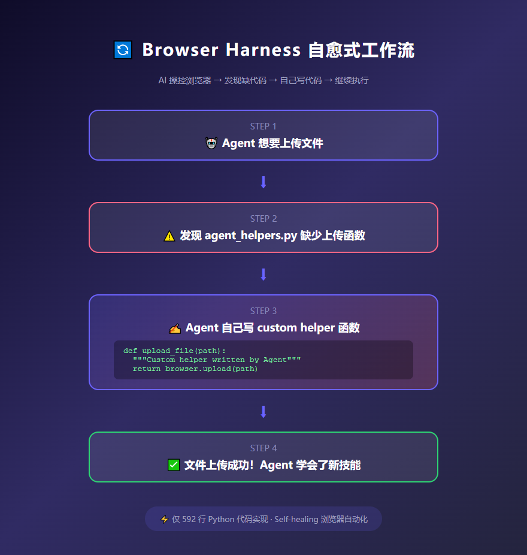

> 📎 来源: [何三笔记](https://mp.weixin.qq.com/s?__biz=MzA4NTI3OTcyMA==&mid=2649632454&idx=1&sn=530b901744f2e572b7306b951d4725ab&chksm=869f0456230306b9d2638212d5e3b10cc34c04f23fb9636fd718d395dee28a30660c39248d7f&mpshare=1&scene=1&srcid=0529Dzls2qu6MU6Bxky9wm3f&sharer_shareinfo=41f25683f3b9ec68e85cf663428882a8&sharer_shareinfo_first=41f25683f3b9ec68e85cf663428882a8) | 时间: 2026-05-29 12:19

---

大家好，我是何三，独立开发者

**7.8k Star** 。一个只有 592 行 Python 代码的项目，让 AI 像人一样操控浏览器。出 bug 了怎么办？它自己写代码给自己打补丁。

这东西叫 **Browser Harness**，browser-use 团队出品。我第一眼看到 README 上那句 "You will never use the browser again" 的时候，说实话我笑了——什么口气这么狂？

然后我仔细看了看，笑不出来了。

搞过浏览器自动化的都懂——Selenium 也好，Playwright 也好，写脚本一时爽，维护火葬场。页面稍微改个 class 名，脚本就废了。你要不停地修 xpath，修选择器，修等待时间。

说白了，就是拿头去跟 DOM 树死磕，网页一改你就得跟着改。

**Browser Harness 的思路完全不一样。**

它只有 592 行 Python，基于 Chrome DevTools Protocol（CDP）直接跟浏览器对话。没有框架，没有 recipes，没有任何花里胡哨的东西。就是一个 WebSocket 直连 Chrome，中间什么都不隔。

最骚的地方在这：LLM 在操作浏览器的时候，如果发现缺东西——比如要上传文件但没有上传函数——它会直接在 

```
agent-workspace/
```

 目录下自己写一个 helper 函数出来。自己写，自己用。

整个过程是这样的：



自愈式工作流

你想想。以前是你写代码让机器跑，现在是机器发现缺代码，自己写出来继续跑。

这已经不是自动化的范畴了，这是 self-healing。

说到 CDP，插一嘴——我突然想起之前折腾 Puppeteer 的时候，也是走 CDP 协议，但 Puppeteer 那玩意儿装起来要下 Chromium，几百兆。Browser Harness 直接连你已经装好的 Chrome，开个 remote debugging 端口就行。差别就像住酒店 vs 自带帐篷露营。

**为什么说这东西颠覆？**

你看它设计哲学就懂了。一般的浏览器自动化框架，是你给 AI 设轨道，让它在轨道上跑。Browser Harness 不给轨道，直接给 AI 一辆车，说"你去吧，路没了自己修"。

原理大概是这样，细节可能有出入——有懂的大佬欢迎指正。反正我看到它的核心代码只有 592 行 Python 的时候，真的服了。

体验一把有多简单？装好之后，把下面这段粘到 Claude Code 或者 Codex 里：

```
Set up https://github.com/browser-use/browser-harness for me.Read `install.md` first to install and connect this repo to my real browser.Then read `SKILL.md` for normal usage.
```

对，就这么一段话。AI 会自己读文档，自己装依赖，自己连你浏览器。你只需要在 Chrome 里开一个 remote debugging（勾个复选框的事），剩下的它全包了。

装不装都行，看你自己。但你要是搞 AI Agent 的，或者天天和浏览器自动化打交道的，这个东西我是真的吹爆。

同类的东西？有。比如 Playwright 的 codegen，比如传统的 Selenium IDE。但那些都是"记录回放"的思路，和 Browser Harness 的"自愈式 AI 操控"完全是两个物种。真要说同类，我觉得它更接近 AutoGPT 那种 Agent 框架，只不过专注在浏览器这个场景上。

如果你对这类工具有兴趣，我此前还整理过《2025 年 GitHub AI 自动化神器排行榜》，关注后回复「工具」获取。

项目地址在这里，自己去看： 👉 https://github.com/browser-use/browser-harness

说实话，Browser Harness 能不能真正取代 Selenium 和 Playwright，现在下结论还太早。但它的方向是对的——让 AI 去适应网页，而不是让人去给 AI 铺轨道。

*本文使用 MGO 编辑并发布*

> 关注"何三笔记"，回复"mgo" 免费下载使用
