> 📎 来源: [一束光与一台机器](https://mp.weixin.qq.com/s?__biz=Mzk0NzcyOTUwNg==&mid=2247483823&idx=1&sn=1e7f344e054d82b42c0e6b0db229ca29&chksm=c258a2d2d26b15f02e8eb1b23605e3df28c37f40f0c27d9a772c5e435c33e817dc6ecdb3d662&mpshare=1&scene=1&srcid=0420tgsAeYcXePWxveSyuipV&sharer_shareinfo=2af6ed37ac8ea8e3c894eb16b23d82cc&sharer_shareinfo_first=2af6ed37ac8ea8e3c894eb16b23d82cc) | 时间: 2026-04-20 21:29

---

最近AI圈里有一个词被反复提起，叫 **MCP**。

不是游戏里的那个，而是一个让AI从"聊天框"变成"数字员工"的关键协议。

我研究了一下，发现这东西比我想象的重要得多——不只是程序员的事，跟每个用AI工具的人都有关。

今天用最通俗的方式讲清楚：**MCP是什么、怎么工作、普通人能用来干什么**。

---

## 01 / 一句话，先把它讲清楚

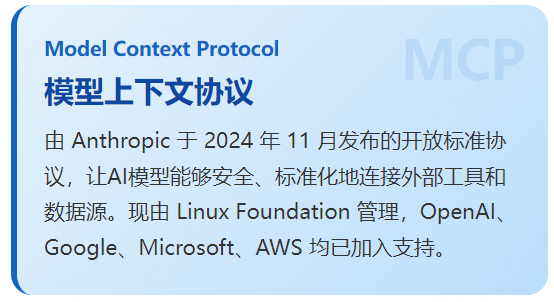

如果这句话还是太抽象，看这个类比——

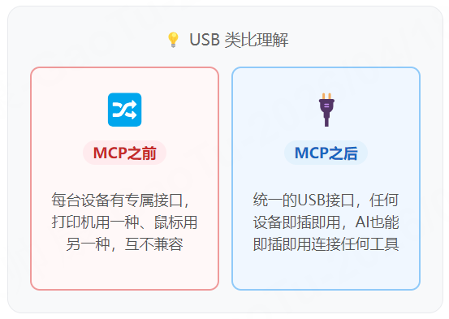

翻译过来就是：MCP之前，每个AI工具想连接一个外部服务（比如数据库、GitHub、Notion），都要专门开发一套对接方式，麻烦、不通用。MCP之后，**一套标准，AI和任何工具都能直接"握手"**。

---

##

## 02 / 它是怎么工作的？

MCP的架构里有三个角色，记住这三个，你就懂了：

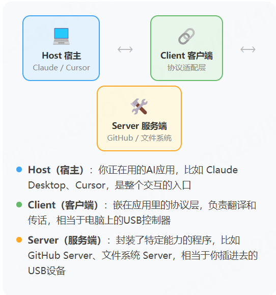

举个具体场景：你对AI说"帮我查一下GitHub上某个Bug的最新进展"——

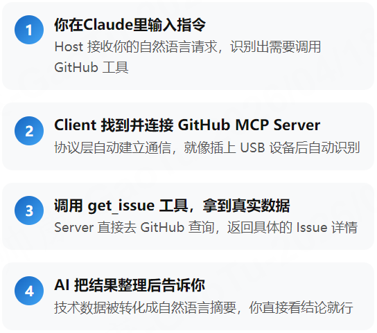

整个过程你什么都不用做，**只是问了一句话**。

---

##

## 03 / 为什么这么火？看数据

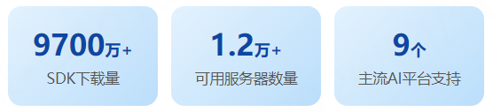

支持 MCP 的平台包括：Claude Desktop、Claude Code、Cursor、Windsurf、VS Code、Zed、Replit、ChatGPT……几乎覆盖了所有主流AI工具。

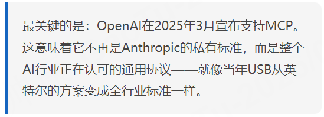

---

##

## 04 / 普通人能用它做什么？

这里要区分两种人：

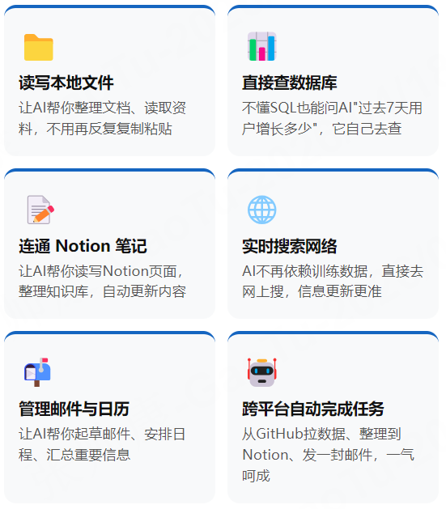

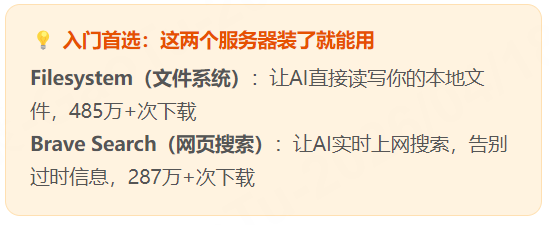

---

##

## 05 / 最受欢迎的MCP服务器

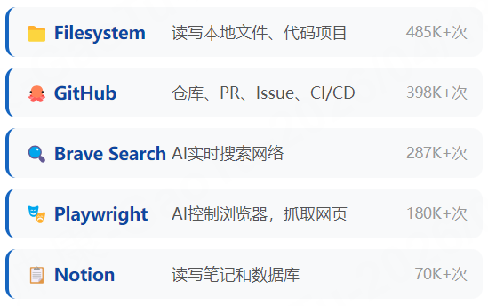

---

##

## 06 / 和Vibe Coding、Harness是什么关系？

如果你看过我前几篇关于Vibe Coding和Harness Engineering的文章，这里可以把它们串起来：

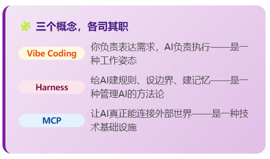

三者的关系可以这样理解：

Vibe Coding 和 Harness 告诉你**如何跟AI配合**，MCP 决定了**AI能触达多大的世界**。

没有 MCP，AI 只能在聊天窗口里打转；有了 MCP，AI 能打开你的文件、读你的数据、操作你的工具——它才真正成为"数字员工"而不是"聊天机器人"。

---

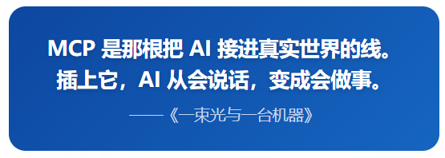

---

##

## 写在最后

从用 WorkBuddy 写推文、生成文档、搜资料，再到讲 Harness Engineering 和 Vibe Coding，现在到 MCP——

我发现一件事：这些概念不是孤立的，它们在共同描述一个趋势——**AI正在从工具变成真正的协作伙伴**。

而 MCP，就是让这件事在技术层面真正可行的那块基石。

下一篇，我会尝试实际配置一个 MCP 服务器，看看普通人能不能不写代码就用上它。欢迎关注，一起探索。
