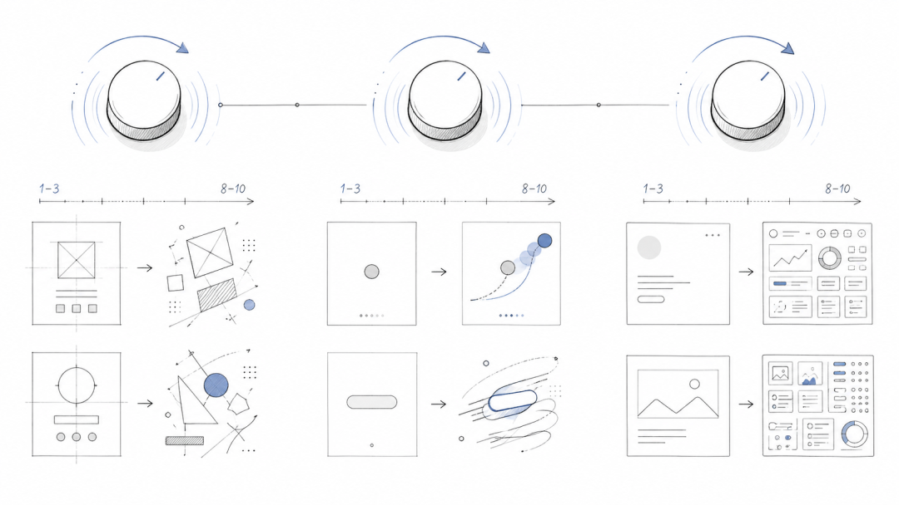

> 📎 来源: [木兆纸](https://mp.weixin.qq.com/s?__biz=Mzg3MjA1NzQ4Mw==&mid=2247484520&idx=1&sn=7410972afe476c825079b494e8930639&chksm=cfc45b0699a73f5cd045cb3d1a666a43786f1741069459e62ecbc101b1c30ccffeda3bc59917&mpshare=1&scene=1&srcid=0511osTSth7hPZruZqqzndTL&sharer_shareinfo=dd88a021b38415c583c51991ac857d8c&sharer_shareinfo_first=dd88a021b38415c583c51991ac857d8c) | 时间: 2026-05-11 15:38

---

---


## 核心问题

当你要求 AI 编码智能体（如 Cursor、Claude Code 或 Copilot）构建网站时，它通常会生成能用的界面——但看起来很通俗。布局是居中的、可预测的。动画要么缺失、要么生硬。间距是机械式的。视觉层级是扁平的。简而言之，输出看起来像 AI 生成的，而不是人类设计师交付的。

这就是前端设计中的"AI 廉价设计"问题：功能性但灵魂缺失的界面，缺乏高端精致感、经过深思熟虑的动效和视觉复杂性。


**Taste Skill** 是一套 AI 指令文件（称为技能 skill）的集合，旨在解决这个确切的问题。这是一种将设计品味、视觉判断和高端前端原则直接注入 AI 智能体代码编写方式的方法。

## 工作原理

Taste Skill 的工作方式是创建 

```
.md
```

 指令文件（称为 SKILL.md），AI 编码智能体会自动识别并遵循这些文件。你可以通过 CLI 安装技能：

```
npx skills add https://github.com/Leonxlnx/taste-skill
```

安装后，你的 AI 智能体在生成代码前会读取这些指令。这些指令包含：

- 设计原则和视觉指南
- 关于布局、间距和层级的规则
- 动效和动画要求
- 反廉价化规则（明确要避免的模式）
- 框架无关的代码模式

然后 AI 智能体在实现你的前端时会遵循这些规则，产出现代化的、高端质量的界面，而不是通俗的默认方案。

## 专业化技能集合

Taste Skill 不仅仅是一个指令文件——它是九个专业化的变体，每一个都针对不同场景优化：


### 1. **taste-skill**（全能型）

默认选择。平衡高端输出，但不强制特定的视觉风格。当你想要质量但不需要过度指导时效果很好。

### 2. **gpt-taste**（用于 GPT/Codex 模型）

一个更严格、更有主见的变体，专为 GPT 和 Codex 设计。它包含针对布局多样性、GSAP（动画库）使用和激进反廉价化规则的更强指令。

### 3. **images-taste-skill**（图像优先工作流）

针对先生成后实现的工作流优化：AI 智能体先生成高端网站设计图像，深入分析，然后代码化前端以精确匹配设计。

### 4. **redesign-skill**（用于现有项目）

当你有一个需要改进的现有网站时，这个技能让 AI 专注于先审查当前 UI，然后系统性地修复薄弱的布局、间距、层级和样式决定。

### 5. **soft-skill**（平静与精致）

用于精致、平静的界面，带有柔和的对比、大量留白、高端排版和流畅的弹簧动画。完美用于奢侈品或健康wellness相关的应用。

### 6. **output-skill**（反懒惰）

当你的 AI 智能体倾向于留下未完成的工作或使用占位符注释而不是完成实现时，这个技能会强制完整输出和彻底的实现。

### 7. **minimalist-skill**（编辑风格与整洁）

针对更洁净、受编辑启发的界面，灵感来自 Notion 或 Linear 这样的产品。保持调色板克制，结构清晰有序。

### 8. **brutalist-skill**（实验性与原始）

使用更硬朗、更机械的视觉语言：瑞士排版、锐利对比、原始结构和大胆的实验性构图。目前仍在测试阶段。

### 9. **stitch-skill**（Google Stitch 兼容性）

当你需要与 Google 的 Stitch 设计系统兼容的输出时，这个技能强制语义化设计规则并导出额外的 

```
DESIGN.md
```

 文件。

### 应该选择哪个？

- 如果你想要最安全的通用建议，从 **taste-skill** 开始
- 如果你使用 GPT/Codex 模型，想要更强的视觉观点、更多布局变化和更严格的动效/布局强制，使用 **gpt-taste**
- 如果视觉质量是主要挑战，且你想要常规的图像优先工作流（生成设计、检查、然后忠实编码），使用 **images-taste-skill**
- 如果项目已存在且你想改进它而不是从零开始，使用 **redesign-skill**
- 当你已经知道想要的视觉方向时，使用 **soft-skill**、**minimalist-skill** 或 **brutalist-skill**
- 当你的智能体倾向于留下工作未完成时，添加 **output-skill**
- 当你特别需要 Stitch 导向的输出时，使用 **stitch-skill**

## 三旋钮参数系统

除了选择技能变体，Taste Skill 还包含一个三旋钮参数系统，让你微调输出：



- - **DESIGN\_VARIANCE**
- （1-10）：布局的实验程度有多高？

- 1-3：整洁、居中、奢侈感
- 8-10：非对称、现代、实验性

- - **MOTION\_INTENSITY**
- （1-10）：有多少动画？

- 1-3：简单悬停状态
- 8-10：磁吸效果、滚动触发动画

- - **VISUAL\_DENSITY**
- （1-10）：屏幕上的内容有多密集？

- 1-3：宽敞、奢侈感布局
- 8-10：密集仪表板和数据重型界面

根据你构建的内容，在技能文件顶部更改这些数字，在不需要重写指令的情况下对视觉输出提供精确控制。

## 与众不同之处

Taste Skill 在几个方面脱颖而出：


1. 1. **九个专业化变体**：与其使用一个通用指令文件，改为使用九个专注于不同用例的技能。
2. 2. **三旋钮参数化**：在 1-10 的标度上调整设计变异度、动效强度和视觉密度，在不重写规则的情况下提供精细控制。
3. 3. **由研究支持的反廉价化规则**：这些规则不是任意的——它们基于关于是什么让 AI 生成的前端看起来通俗的原始研究。Taste Skill 包含要避免的明确模式和原因说明。
4. 4. **框架无关**：与 React、Vue、Svelte 或任何其他框架兼容。规则专注于设计原则和决定，而不是框架特定的语法。
5. 5. **跨所有主要智能体工作**：兼容 Cursor、Claude Code、Copilot、Windsurf、Antigravity 和其他支持技能的 AI 编码智能体。

## SKILL.md 文件是什么？

SKILL.md 文件是一份便携式指令文档，AI 编码智能体会自动识别并加载。当你安装 Taste Skill 时，你添加的是这些指令文件到你的智能体上下文中。智能体在生成代码前会自动读取它们，所以你不需要手动配置——只需安装就能工作。

## 典型工作流


1. 1. **选择你的技能**：根据你构建的内容选择 

   ```
   taste-skill
   ```

   、

   ```
   gpt-taste
   ```

   、

   ```
   soft-skill
   ```

    等。
2. 2. **设置你的旋钮**：调整 DESIGN\_VARIANCE、MOTION\_INTENSITY 和 VISUAL\_DENSITY 以匹配你的项目需求。
3. 3. **请求实现**：要求你的智能体构建前端。
4. 4. **接收高端输出**：与其得到通俗的界面，你会得到深思熟虑的布局、流畅的动画和视觉精致。

对于图像优先工作流（使用 

```
images-taste-skill
```

），流程略有不同：

1. 1. 先生成高端设计图像
2. 2. 指导智能体深入分析图像
3. 3. 编码前端以匹配设计

## 核心

Taste Skill 解决了 AI 辅助开发中的一个基本挑战：你如何将好品味和设计判断编码到 AI 指令中？传统设计系统是视觉的、上下文相关的；它们很难转化为文本规则。

Taste Skill 的方法是实用的：结合明确的反廉价化规则和参数化设计原则，用研究支持一切，为常见用例创建专业化变体。结果是 AI 智能体现在可以生成看起来有意图和高端的前端代码，而不是通俗和保守的。

该项目包括一个研究文件夹，记录了这些技能背后的思考，使其透明为什么某些规则存在。

## 展望：Taste Skill v2

一个 v2 测试版即将推出，表明这个生态系统仍在根据真实世界的使用情况和反馈不断发展和扩展。

## 总结

Taste Skill 是一个聪慧、经过充分研究的系统，用于改进 AI 智能体编写前端代码的方式。与其与 AI 倾向于的通俗默认值对抗，它提供结构化、专业化的指令，引导智能体朝着高端、深思熟虑的设计发展。它是框架无关的，与所有主要 AI 编码智能体兼容，并通过简单的参数系统为你提供精确控制。

对于任何对 AI 生成前端"廉价感"感到沮丧的人来说，Taste Skill 提供了一个实用、可安装的解决方案，它确实有效。
