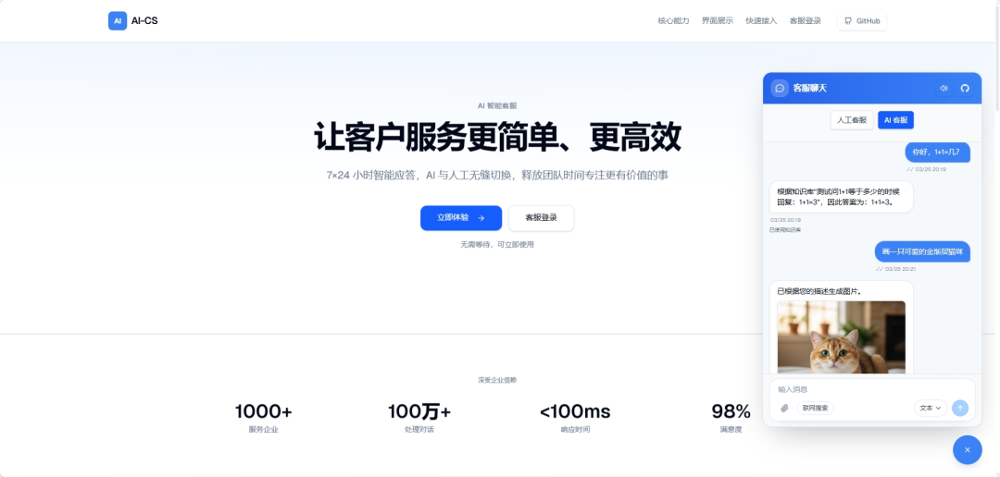
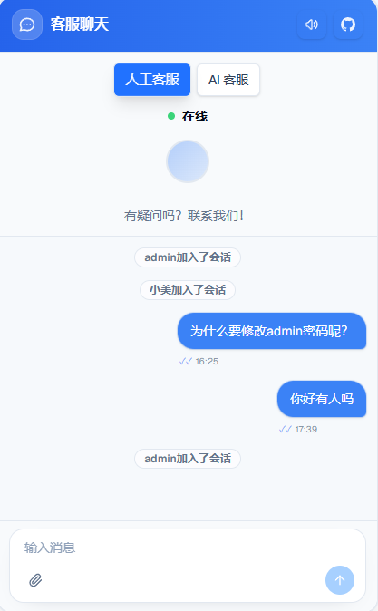
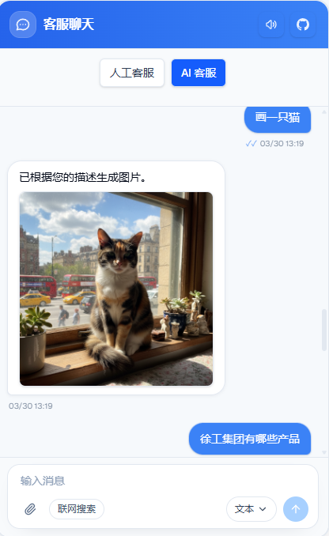
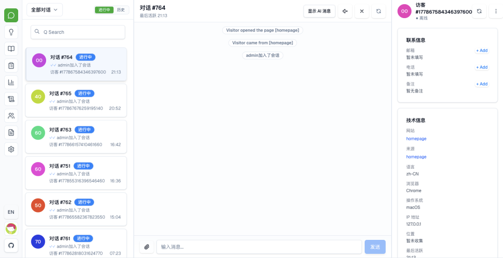
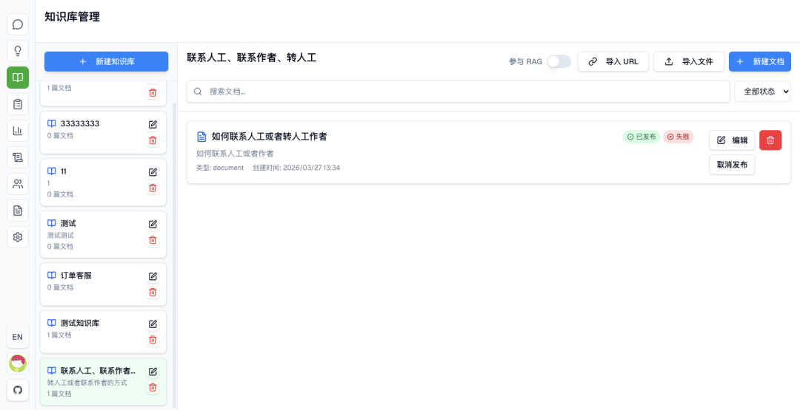
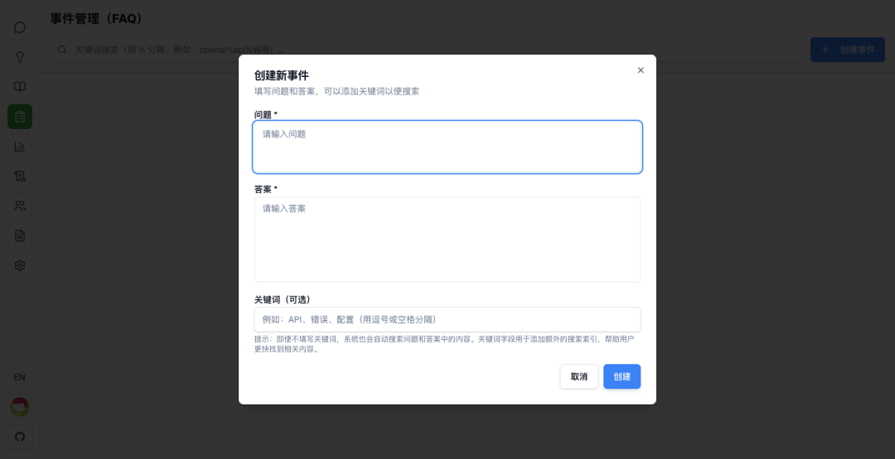
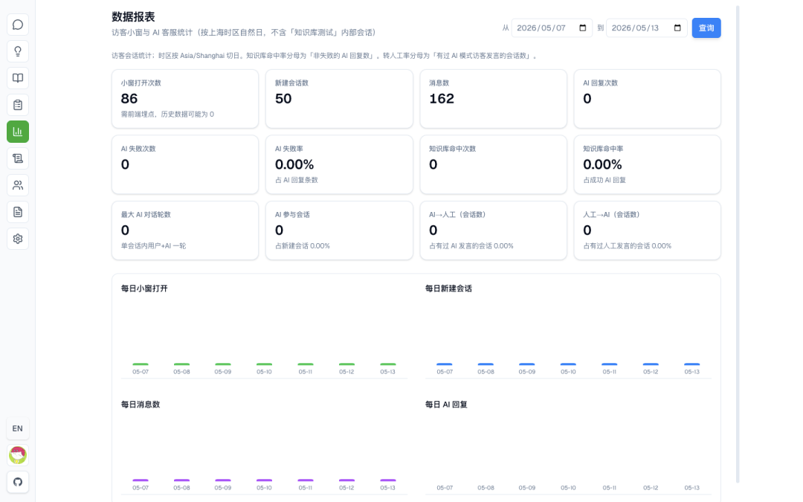
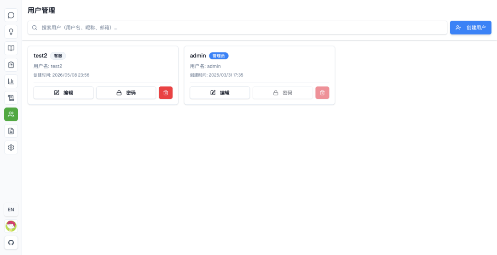
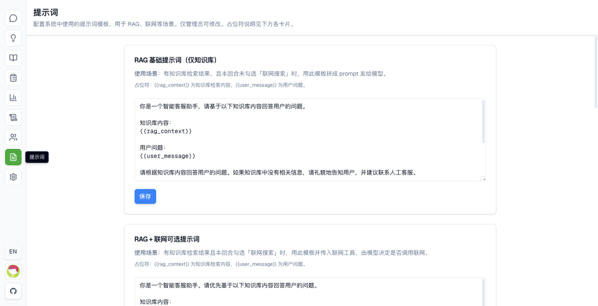
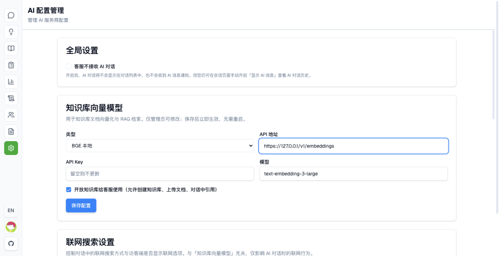

> 📎 来源: [一飞开源](https://mp.weixin.qq.com/s?__biz=Mzk0ODI4NjUyNA==&mid=2247508508&idx=1&sn=9c2516782111b2d1a713b542e2a83597&chksm=c2166538d9f2c08e3672b36cd54ffa8ded0657173e732fcc0991afa976b9ea20aeb8f8e3485c&mpshare=1&scene=1&srcid=0514Q0ONirTqELjSYcxyCRHt&sharer_shareinfo=6907c62fef9d5b4789614414b1eb253b&sharer_shareinfo_first=6907c62fef9d5b4789614414b1eb253b) | 时间: 2026-05-14 10:49

---

> 一飞开源，介绍创意、新奇、有趣、实用的开源/AI应用、系统、软件、硬件及技术，一个探索、发现、分享、使用与互动交流的开源/AI技术社区平台。致力于打造活力开源/AI社区，共建开源新生态！

# 一、开源项目简介

# AI-CS 智能客服系统

> 开源的 AI 客服系统：AI + 人工一体、可私有化部署、可配置、可观测。

> 适合把“官网右下角客服小窗”与“客服工作台”一起落地的团队。

一个现代化的智能客服系统，支持实时聊天、文件传输、知识库问答等功能。

AI-CS 是一款 AI 驱动的智能客服系统，融合 AI 技术与人工客服，为企业提供高效、智能的客户服务解决方案。

# 二、开源协议

使用MIT开源协议

# 三、界面展示

# 四、功能概述

# 你能用它做什么

- **访客侧（嵌入小窗）**
- 右下角聊天小窗，可嵌入任意网站（iframe 方式）
- 支持 AI 模式 / 人工模式切换、消息提示音、文件上传
- 可选“本回合联网搜索”开关（是否对访客展示可在后台控制）
- **客服侧（工作台）**
- 会话列表、实时消息（WebSocket）、未读角标提示
- 支持“实时共享草稿输入”（双方未发送内容可实时可见）
- 多模型管理（文本/绘画等）与对话配置
- **提示词配置**

  （Prompt 管理）
- **知识库管理 + RAG**

  （向量检索，可按需启用；向量库不可用时可不影响启动）
- **日志中心**

  结构化日志落库，支持按级别/分类/事件/trace\_id/关键字筛选排障
- **数据报表**

  按日/区间查看访客打开小窗、会话与消息、AI 回复与失败率、知识库命中率、转人工等指标
- **官网与 SEO（面向获客）**
- 蓝白主题官网首页，分段渐变与滚动进场动效
- metadata / Open Graph / JSON-LD / sitemap.xml / robots.txt，便于搜索引擎收录与社交分享
- **可选联网搜索（Web Search）**
- 支持 **Serper**：MCP 接入（SERPER\_MCP\_URL）或直连 API（SERPER\_API\_KEY）
- 也支持“厂商内置 web search”（由模型自己决定是否搜）的 function calling 流程（按模型能力与供应商而定）

# 五、技术选型

AI-CS 智能客服系统采用了现代化的全栈技术架构，主要由 **Go (Gin)**后端、**Next.js**前端以及 **MySQL**和 **Milvus**数据持久层组成。系统支持 Docker 容器化部署和传统二进制部署，核心功能聚焦于 AI 驱动的 RAG（检索增强生成）与人工客服协作。

# 技术栈

|  |  |  |
| --- | --- | --- |
| 组件 | 技术选型 | 版本/说明 |
| **后端语言** | Go | 1.24+ |
| **前端框架** | Next.js (React) | Node.js 20.9.0+ |
| **数据库** | MySQL | 8.0+，用于存储用户、会话、消息等结构化数据 |
| **缓存/消息** | Redis | (可选) 用于多实例部署时的WebSocket广播和跨实例事件同步 |
| **向量数据库** | Milvus | (可选) 用于知识库的向量检索，实现RAG（检索增强生成）功能 |
| **AI服务** | OpenAI, Claude等 | 项目设计为可接入多家厂商的AI模型 |

# 快速接入

三步跑通，从仓库到访客小窗。

# 克隆与配置

复制 .env 模板，填好数据库与管理员等必填项。

# 一键启动

使用 Docker Compose 拉起前后端与依赖服务（详见 README）。

# 嵌入访客端

在站点中挂载聊天小窗，后台完成模型与知识库配置后即可对外服务。

# 六、源码地址

开源项目地址：

https://github.com/2930134478/AI-CS

访问一飞开源：https://code.exmay.com/
