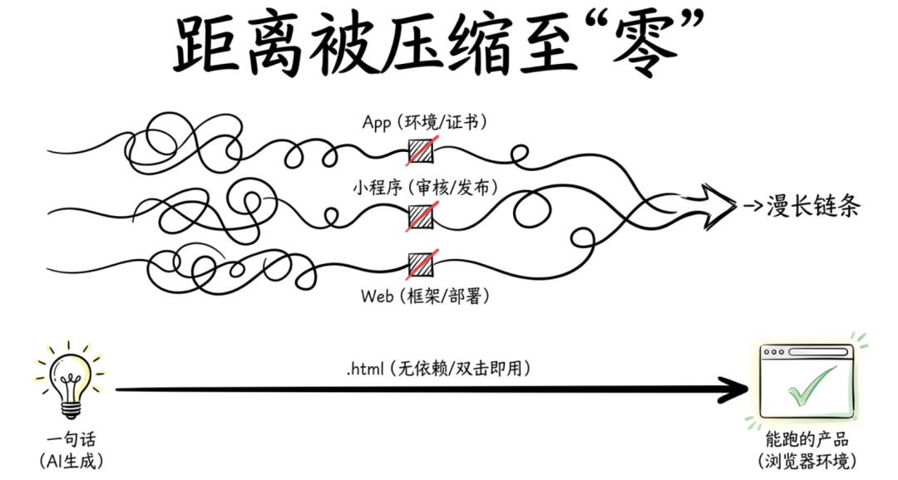
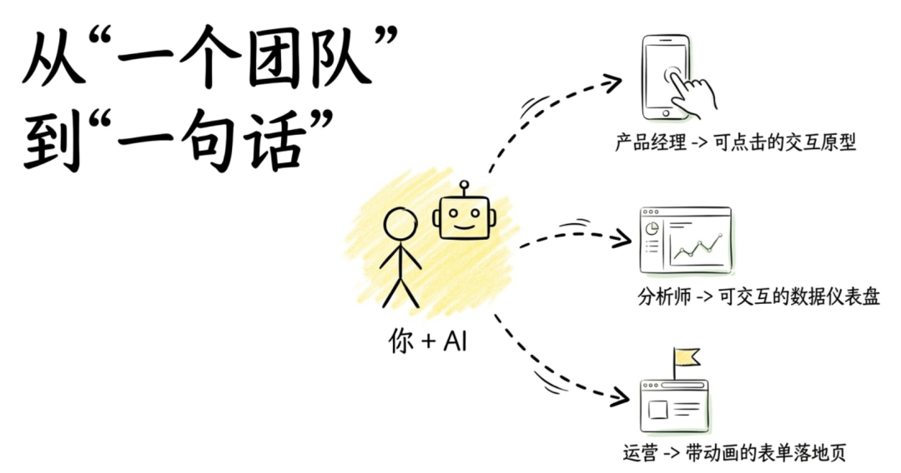
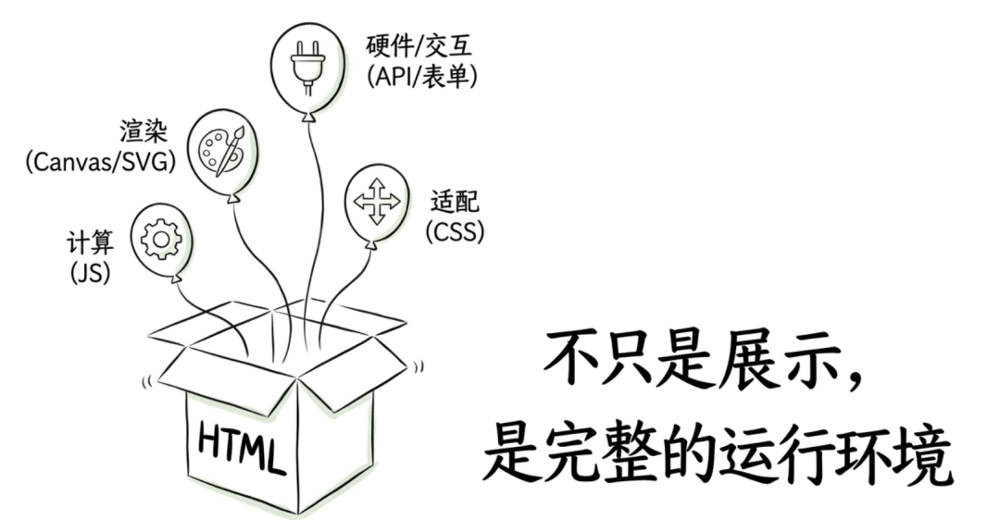
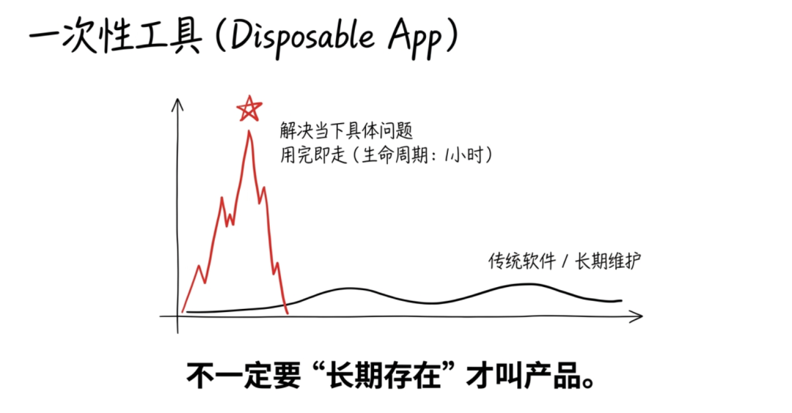
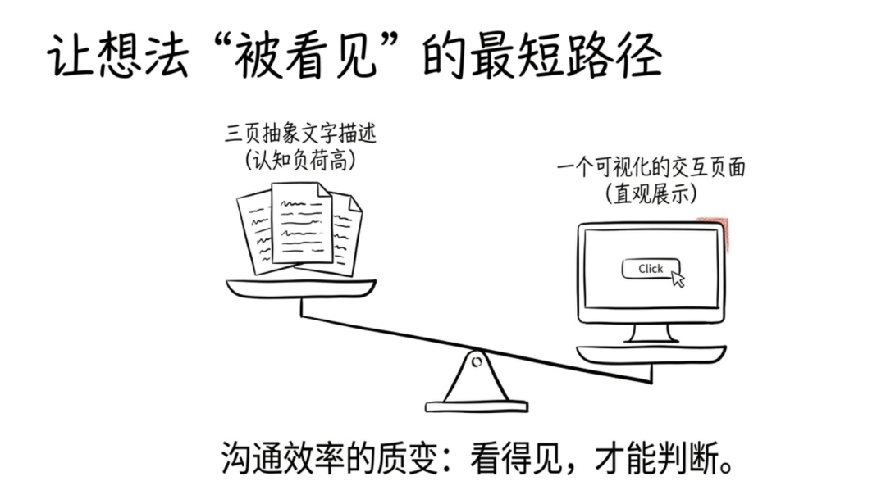
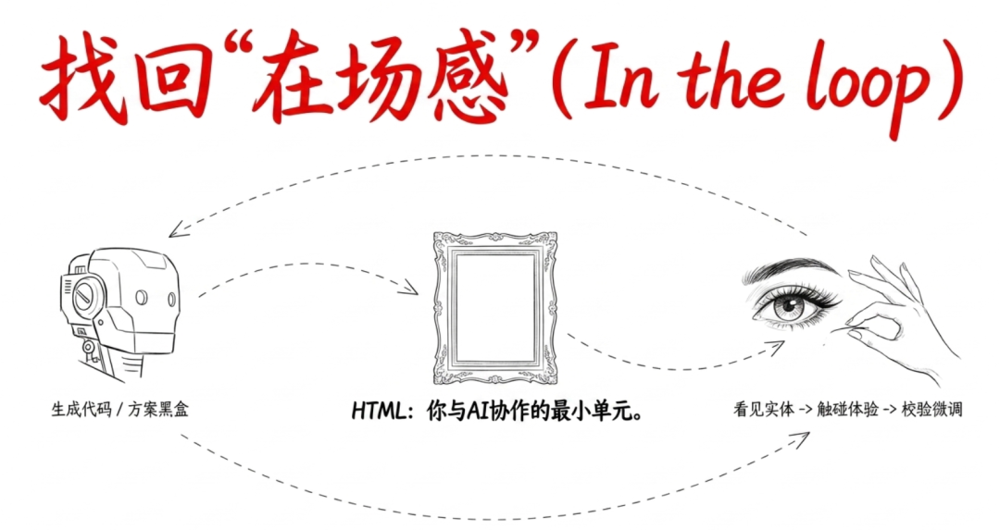
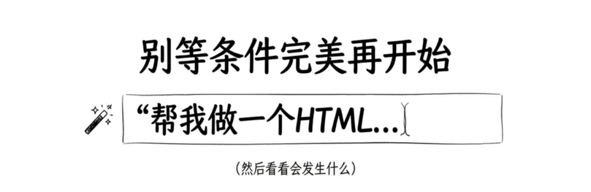

> 📎 来源: [金技局](https://mp.weixin.qq.com/s?__biz=MzE5ODU0NjU0Mg==&mid=2247484866&idx=1&sn=a88a25e4be69272d31ff51a3e1e32abf&chksm=97b95a8b99909b60094c6c8cd1ef15acd4e0d4f6ee6977b5d34fed27b78ec73e7c70606c82c4&mpshare=1&scene=1&srcid=05135gc8l5Hkk5jsDbhCij0V&sharer_shareinfo=dcb7778c34c684f33ab2d3f773fb0bfc&sharer_shareinfo_first=dcb7778c34c684f33ab2d3f773fb0bfc) | 时间: 2026-05-13 15:26

---

最近Claude Code团队的工程师Thariq写了一篇文章，标题很直接：《HTML是新的Markdown》。大意是他现在几乎不再让AI输出Markdown，而是直接生成HTML。文章在X上不到24小时阅读量破500万，引发了一场"md派vs html派"的站队大战。

但我觉得大部分人都在争论一个不重要的问题。

格式之争不重要。重要的是Thariq那句被很多人忽略的话："用了HTML之后，我重新感觉自己在loop里了。"

这句话背后藏着一个比格式选择大得多的判断：AI时代，做产品的门槛正在被压缩到一个前所未有的程度。你不需要会React，不需要部署服务器，不需要懂DevOps。你只需要告诉AI"帮我做一个HTML文件"，浏览器打开，它就是一个能跑的产品。

这篇文章想聊的就是这件事：当一个HTML文件就能承载一个完整的想法，"做产品"这件事的定义变了。

## 为什么是HTML，不是App、不是小程序、不是SaaS

先说清楚一个事实：HTML不是什么新技术。它是互联网最古老的基础设施之一，1993年就有了。三十多年来，它一直在那里，只是没人觉得它性感。

但AI让HTML重新变得性感了。原因很简单：AI极其擅长写HTML。

你让AI写一个iOS App，它需要Xcode环境、需要证书签名、需要模拟器调试，链条长得吓人。你让AI写一个小程序，它需要微信开发者工具、需要AppID、需要审核发布。你让AI写一个Web应用，它需要框架、需要打包工具、需要部署。

但你让AI写一个HTML文件？它直接给你一个.html文件，双击打开就能用。没有编译，没有部署，没有依赖。浏览器就是运行环境，全世界每台电脑都有。

这意味着什么？意味着从"想法"到"能跑的东西"之间的距离，被压缩到了接近零。

一个产品经理想验证一个交互方案？不用画原型图了，让AI直接出一个可以点击、可以滑动、带真实数据的HTML页面。一个分析师想把一份报告做得更有说服力？不用学Tableau了，让AI生成一个带图表、可交互、能钻取的HTML仪表盘。一个运营想快速做一个活动页？不用提需求排期了，让AI五分钟出一个带倒计时、带表单、带动画的落地页。

以前这些事需要一个团队、一个排期、一个上线流程。现在一个人、一句话、一个文件。

## HTML不只是"展示"，它是一个完整的产品容器

很多人对HTML的理解还停留在"静态网页"的阶段。觉得它就是排排版、放放图、写写文字。

这个理解早就过时了。

今天的HTML能做什么？它能跑JavaScript，意味着它有计算能力。它能用CSS做响应式布局，意味着它能适配任何屏幕。它能嵌入SVG和Canvas，意味着它能做数据可视化和图形渲染。它能加表单和按钮，意味着它有输入输出能力。它能调浏览器API，意味着它能访问摄像头、麦克风、本地存储。

换句话说，一个HTML文件就是一个完整的应用运行环境。

Thariq在文章里提到了一个特别有启发的用法，叫"一次性编辑器"。什么意思？就是为一个具体的任务，临时生成一个专用工具，用完就扔。

比如你要给一批客户工单重新排优先级。传统做法：打开Excel，人肉排序，或者写个脚本。AI时代的做法：让AI生成一个HTML页面，左边是工单列表，右边是优先级分类，你用拖拽完成排序，底部有一个"导出"按钮，一键生成JSON或者CSV。

这个HTML页面就是一个产品。它解决了一个真实问题，它有输入有输出，它被人使用了。只不过它的生命周期可能只有一个小时。

这颠覆了一个根深蒂固的观念：产品不一定要"长期存在"才叫产品。 一个解决了当下具体问题的一次性工具，也是产品。而HTML是承载这种产品最轻的容器。

## Builder的第一张画布

之前局长写AI builder那篇文章的时候[聊聊最近特别火的一个词——AI builder](https://mp.weixin.qq.com/s?__biz=MzE5ODU0NjU0Mg==&mid=2247484657&idx=1&sn=3867b52d764f3e75ffa09c58c0e44290&scene=21#wechat_redirect)，很多读者问：道理我都懂，但我到底从哪里开始？

现在我有了一个更具体的回答：从一个HTML文件开始。

为什么？因为HTML把"做产品"这件事的门槛降到了最低，但它保留了做产品最核心的那几个环节：你要定义一个问题，你要设计一个解决方案，你要让它真的能被别人用，你要根据反馈来改进它。

这几个环节一个都少不了。它不会因为载体是HTML就变简单。你让AI生成一个HTML仪表盘，数据指标选错了，图表类型不对，信息层级混乱，那它就是一个没人看的垃圾页面。技术门槛消失了，但判断力的门槛还在。

这恰恰是训练场的价值所在。

你用HTML做一个东西，发给同事，同事说"这个图表我看不懂"。你就学到了一课：数据可视化的关键不是好不好看，是看的人能不能在三秒内抓到重点。你做一个交互原型，用户说"这个按钮我找不到"。你就学到了一课：交互设计的核心是降低认知负荷，不是堆功能。

每一次这样的反馈循环，都在训练你做产品的直觉。而HTML让这个循环变得极快：改一行代码，刷新浏览器，立刻看到效果。不需要编译，不需要部署，不需要等五分钟的构建流水线。

Thariq说他现在每个代码PR都附一个HTML说明文件，用可视化的方式解释这次改动的逻辑。这不是炫技，这是他发现了一件事：当你把想法变成一个"可以看见"的东西，沟通效率会发生质变。文字描述一个方案需要三页，HTML展示同一个方案只需要一个页面。而且对方真的会看。

对builder来说，这是一个极其重要的能力：不是"能做"，而是"能让别人看见你做了什么"。HTML是让你的想法变得可见的最短路径。

## 最后说两句

回到Thariq那句话："我重新感觉自己在loop里了。"

这句话说出了很多人在AI时代的隐性焦虑。当AI能写代码、能出方案、能做分析，你开始怀疑自己还能干什么。你觉得自己在被推出决策循环，变成一个只能点"确认"的人。

HTML之所以让Thariq重新找到"在场感"，是因为它把AI的产出变成了一个你可以看见、可以触碰、可以判断、可以修改的东西。你不再是在读一堆文字然后说"看起来可以"。你是在看一个真实的页面，然后说"这里不对，那里可以更好"。

"看得见"才能"判断得了"。这是人在AI协作中保持主导权的关键。

所以HTML的意义不是取代Markdown，不是格式升级，不是前端技术的复兴。它的意义是：在AI越来越强的时代，给了人一种重新参与的方式。

你不需要会写HTML。AI会写。你需要的是：知道该让AI做什么，然后看着它做出来的东西，判断好不好、对不对、该怎么改。

一个HTML文件，就是你和AI协作的最小单元。也是你能做出的最小产品。

别等条件完美再开始。打开你的AI工具，说一句"帮我做一个HTML"，然后看看会发生什么。

关联阅读：

[AI时代的团队，不是没有分工，是分工在加速流动](https://mp.weixin.qq.com/s?__biz=MzE5ODU0NjU0Mg==&mid=2247484840&idx=1&sn=7885fc99edba4ebf4f5a62e2aef7063b&scene=21#wechat_redirect)

[岗位说明书背后的那套逻辑，正在整体性地过时](https://mp.weixin.qq.com/s?__biz=MzE5ODU0NjU0Mg==&mid=2247484838&idx=1&sn=b05bcad8560f0c901107b5750e66a71a&scene=21#wechat_redirect)

[Eval才是AI产品的真正产品力](https://mp.weixin.qq.com/s?__biz=MzE5ODU0NjU0Mg==&mid=2247484838&idx=2&sn=941069d53c9fde25f6abba239b155981&scene=21#wechat_redirect)

["差不多先上线"，是AI时代新的专业](https://mp.weixin.qq.com/s?__biz=MzE5ODU0NjU0Mg==&mid=2247484812&idx=1&sn=ac3a36ea5d6711b6213a38d9c84346c6&scene=21#wechat_redirect)

["人机协同"不是鸡汤，是2026年唯一能跑通的模式](https://mp.weixin.qq.com/s?__biz=MzE5ODU0NjU0Mg==&mid=2247484782&idx=1&sn=db79abc125da182d3c16f1d972755336&scene=21#wechat_redirect)

[聊聊最近的实操感悟：当AI学会了你的工作标准](https://mp.weixin.qq.com/s?__biz=MzE5ODU0NjU0Mg==&mid=2247484780&idx=1&sn=640f6d40aec72e7d0c0e14940c0a3353&scene=21#wechat_redirect)
