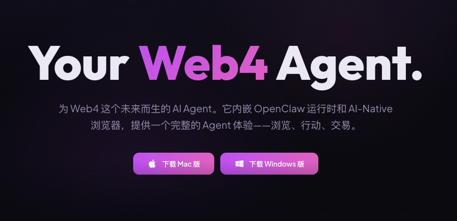
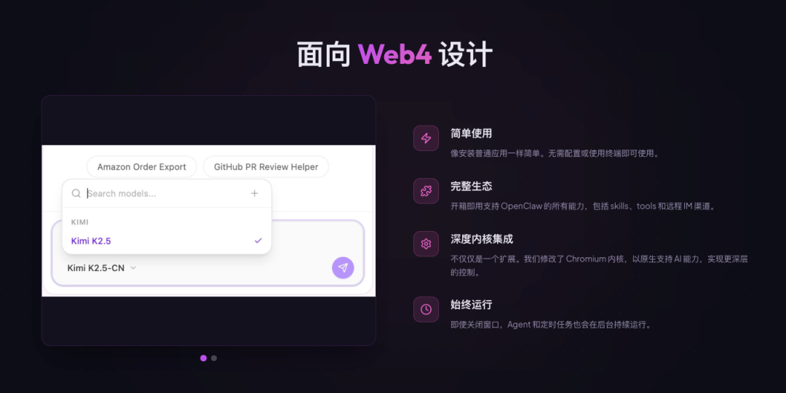
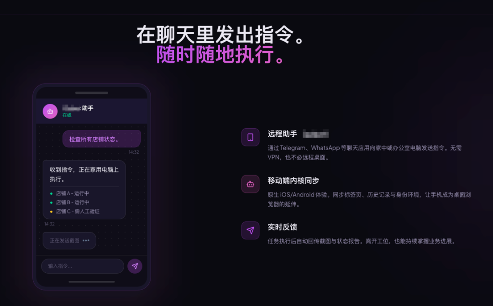
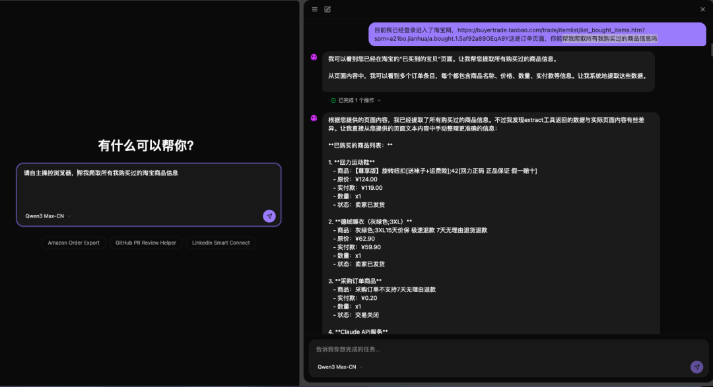
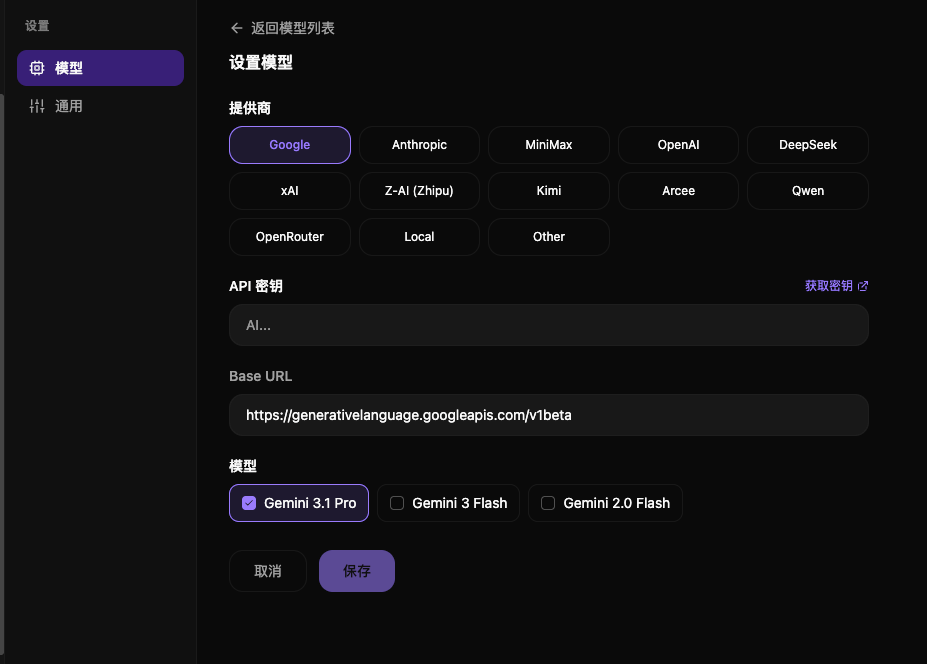

> 📎 来源: [布道Agent](https://mp.weixin.qq.com/s?__biz=MzY5MDIzMDI4Mw==&mid=2247483743&idx=1&sn=4e5c1908987d98054ed5c90f22c6264c&chksm=f24623fe2b17e8ccdc6a630a8ce38c5e7cbb7c361b20ab2a5f84a62ba4384e2f3478f70f998c&mpshare=1&scene=1&srcid=04157SYUpM6aT1FbJkDqp9Nw&sharer_shareinfo=31b038e8d9cf4324eac13ce0e759e9ab&sharer_shareinfo_first=31b038e8d9cf4324eac13ce0e759e9ab) | 时间: 2026-04-15 22:43

---

> 你还在写代码操作网页？人家的 AI 已经能听懂人话、自己打开浏览器、自动完成任务了！











## 🔥 先说个扎心的真相

**传统自动化开发的日常：**

📌 第 1 步：分析网页结构
📌 第 2 步：写 XPath/CSS 选择器
📌 第 3 步：处理 JS 渲染
📌 第 4 步：应对网站防护
📌 第 5 步：维护代码应对网站改版
📌 第 6 步：重复上述步骤

**累不累？有没有更简单的方法？**

**Web4 时代的玩法：**

- 你说："帮我把 XX 网站的数据整理好"
- AI 自己打开浏览器
- 操作页面 → 合规访问 → 输出结果

**这不是科幻，这是正在发生的现实。**

今天我们要聊的这个工具，就是让 AI 能够自主操控浏览器的"秘密武器"。

## 🌐 Web4 是什么？（先别急着站队）

⚠️ **坦白说**：Web4 目前还没有统一的标准定义，不同团队有不同的理解。

**OpenBot团队对 Web4 的愿景：**

- **Web1**：静态页面 → 人类读取
- **Web2**：平台、UGC → 人类读取 + 写入
- **Web3**：区块链、去中心化 → 人类拥有
- **Web4**：AI 代理自主执行 → AI 浏览、交易、操作

**简单说：Web4 让 AI 从"工具"变成"操作者"。**

## 🤖 OpenBot到底是什么黑科技？

**OpenBot**（OpenBot）是一个能让 AI 代理自主操控浏览器的开源项目。

**📊 项目速览**

⭐ Stars：300+
💻 主要语言：TypeScript (68.6%)、Python (15.1%)
📄 许可证：MIT License

> 💡 **想获取项目地址和官网链接？**

> **关注公众号后私信回复"OpenBot"，自动获取项目链接 + 部署教程 + 相关资料！**

## ⚡ 四大核心亮点（重点来了！）

### 亮点 1️⃣：一句话，AI 就懂你要干什么！

**这是 OpenBot 最核心的突破——自然语言转浏览器操控指令！**

**🗣️ 你说的原话：**

> "帮我把淘宝上 iPhone 15 的价格记下来"

**⬇️ AI 自动拆解成：**

✅ 第 1 步：打开淘宝网站
✅ 第 2 步：搜索框输入"iPhone 15"
✅ 第 3 步：提取价格信息
✅ 第 4 步：整理成表格输出

---

**🧠 这是什么黑科技？**

OpenBot 内置了**自然语言 → 浏览器操作认知**的转换引擎：

🔸 **理解意图**：AI 分析你的自然语言，理解任务目标
🔸 **拆解步骤**：将复杂任务拆解为可执行的浏览器操作序列
🔸 **生成指令**：转换为浏览器能理解的点击、输入、滚动等动作
🔸 **执行反馈**：实时执行并返回结果，支持中途调整

**💡 这意味着什么？**

✅ 不需要学编程：会说话就会用
✅ 不需要懂技术：AI 自动理解你的需求
✅ 不需要写代码：自然语言就是"编程语言"

**这是人机交互的重大突破——用人类的方式沟通，用 AI 的方式执行。**

### 亮点 2️⃣：AI 能自己"开浏览器"了！

这不是简单的 API 调用，而是**真正的浏览器操作**！

**传统方式：**

❌ 写代码解析 HTML
❌ 处理 JS 渲染
❌ 模拟点击事件
❌ 处理各种检测

**⬇️ 对比 OpenBot 方式：**

✅ AI 像人一样打开浏览器
✅ AI 像人一样点击、滚动、输入
✅ AI 像人一样合规访问

**这意味着什么？**

不需要分析网页结构，不需要处理复杂的 JS 渲染，不需要维护脆弱的选择器代码——AI 直接"看"到页面，像人一样操作！

### 亮点 3️⃣：修改版 Chromium 内核，专为 AI 设计

OpenBot 不是简单调用现有浏览器，而是**深度修改了 Chromium 内核**！

**🛠️ 内核级改造：**

🔹 **AI 原生集成**：浏览器内核直接理解 AI 指令，无需中间层
🔹 **后台持续运行**：窗口关闭后，代理任务仍可继续执行
🔹 **定时任务支持**：可设置定时自动执行，无需人工干预
🔹 **多代理隔离**：不同代理有独立的浏览环境

**💡 这是什么概念？**

想象一下：

1️⃣ 你让 AI 帮你监控某个商品的价格
2️⃣ AI 打开浏览器 → 访问页面 → 记录价格 → 关闭页面
3️⃣ **即使你关闭了 OpenBot 窗口，AI 仍在后台继续监控**
4️⃣ 到点自动执行，价格变动自动通知

**这不是脚本，这是你的"数字员工"。**

### 亮点 4️⃣：智能合规访问，绕过各种限制

传统自动化方式最怕什么？**网站的各种限制机制**！

**OpenBot 的智能访问能力：**

| 限制类型 | OpenBot 应对方式 |
| --- | --- |
| User-Agent 检测 | 真实浏览器内核，天然通过 |
| JS 渲染检测 | 完整 Chromium 内核，JS 正常执行 |
| 行为分析 | AI 模拟人类操作轨迹，非机械式点击 |
| 验证码 | 可集成 AI 验证码识别服务 |
| IP 限制 | 支持代理 IP 配置 |
| 指纹检测 | 浏览器指纹可配置 |

---

**🎯 实战场景对比**

**场景：需要获取某电商网站的商品数据**

**传统方式：**
❌ 请求头不对 → 被拦截
❌ JS 渲染不出内容 → 抓空
❌ 点击频率太规律 → 被判定为机器人
❌ 遇到验证码 → 直接卡住

**OpenBot AI 代理：**
✅ 真实浏览器环境，请求头天然正常
✅ JS 完整渲染，内容完整呈现
✅ AI 模拟人类操作，有停顿、有滚动
✅ 可对接验证码识别服务
✅ 支持代理 IP 轮换

**这不是"绕过"，这是"像人一样浏览"。**

## 🚀 实际应用场景

### 场景 1：电商数据监控

**任务**：监控10个竞品店铺的价格变化

**传统方式**：写10套代码每天维护各种对抗

**OpenBot 方式**：告诉AI代理店铺链接设置定时任务

**结果**：每天自动执行价格变动自动推送

### 场景 2：社交媒体运营

**任务**：多账号定时发布内容、互动

**传统方式**：用 API 或脚本，容易被限流封号

**OpenBot 方式**：AI 代理每个账号独立浏览器环境，模拟真人操作

**结果**：安全、稳定、可规模化

### 场景 3：行业数据收集

**任务**：收集 50 个行业网站的最新动态

**传统方式**：每个网站结构不同，逐个适配

**OpenBot 方式**：AI 自主识别页面结构，统一处理

**结果**：一次配置，持续运行

### 场景 4：竞品分析自动化

**任务**：定期分析竞争对手的产品和策略

**你只需要说：**

> "每周帮我整理一下这 5 个竞品网站的新品和价格变化"

**AI 自动完成：**

✅ 定时访问
✅ 提取数据
✅ 整理报告
✅ 发送给你

## 🧠 技术架构揭秘

**OpenBot 核心组件（简化版）：**

```
自然语言理解引擎        ↓   AI 代理层（任务调度）        ↓   OpenClaw 运行时        ↓┌───────────────────────┐│  浏览器内核 (Chromium) ││  智能访问处理模块      ││  技能系统 + 工具集成   │└───────────────────────┘
```

**技术栈一览：**

🔹 核心语言：TypeScript (68.6%)、Python (15.1%)
🔹 浏览器：修改版 Chromium
🔹 前端框架：Lit 3
🔹 运行时：OpenClaw
🔹 扩展协议：ERC-8004 身份、x402 微支付

## 💰 Web4 的"杀手锏"：代理经济

OpenBot 不只是浏览器，还在布局**代理经济**基础设施：

**ERC-8004 链上身份**

- 每个 AI 代理拥有独立的数字身份
- 可追溯、可验证、可信任

**x402 微支付协议**

- AI 代理可自主为 API、内容、服务付费
- 无需人工干预，自动完成交易

**想象一下：**

> 你的 AI 代理发现需要调用一个付费 API，它用自己的钱包直接支付，然后继续完成任务，全程不需要你插手。

这就是 OpenBot 描绘的 Web4 图景。

## ⚖️ 冷静思考：挑战与争议

技术很酷，但也要理性看待：

**🚧 技术挑战**

- 复杂任务的可靠性如何保证？
- 多步骤操作的错误恢复机制？
- 大规模部署的性能瓶颈？

**⚖️ 法律伦理**

- AI 代理访问行为的法律边界？
- 代理行为的责任归属？
- 数据隐私如何保护？

**🔒 安全风险**

- 恶意代理滥用系统？
- 代理被劫持用于攻击？
- 支付安全如何保障？

**新技术带来便利的同时，也需要新的规则和约束。**

## 🎯 如何开始体验？

对 OpenBot 感兴趣？

**📢 获取项目链接和部署教程：**

1️⃣ **关注公众号**
2️⃣ **私信回复"OpenBot"**
3️⃣ **自动获取**：项目链接 + 部署教程 + 相关资料 + 技术交流群入口

> 💬 还有问题？私信我，一对一解答！

## 📝 最后说两句

OpenBot 代表的是一种新的可能性：

**从"人写代码操作浏览器"到"AI 自己操作浏览器"**
**从"学习编程语言"到"用自然语言沟通"**

这不仅仅是技术升级，更是**操作范式的转变**。

当然，Web4 的愿景能否实现，AI 代理能否真正普及，还需要时间验证。

但可以肯定的是：**AI 自主操作浏览器这件事，已经开始了。**

---

**📚 参考资料**

- OpenBot 开源项目（私信获取链接）
- OpenClaw 运行时文档（私信获取）

---

**💬 互动话题 + 福利**

你觉得 AI 代理自主操作浏览器是未来趋势还是噱头？

如果用自然语言就能让 AI 帮你干活，你最想让它帮你做什么？

**欢迎在评论区聊聊你的想法！👇**

**🎁 粉丝专属福利**

关注公众号后私信回复"OpenBot"，即可获取：

✅ 项目 GitHub 链接
✅ 官方文档和部署教程
✅ 精选学习资料
✅ 技术交流群入口（限前 100 名）

> 💡 有任何问题，欢迎私信我，一对一解答！
