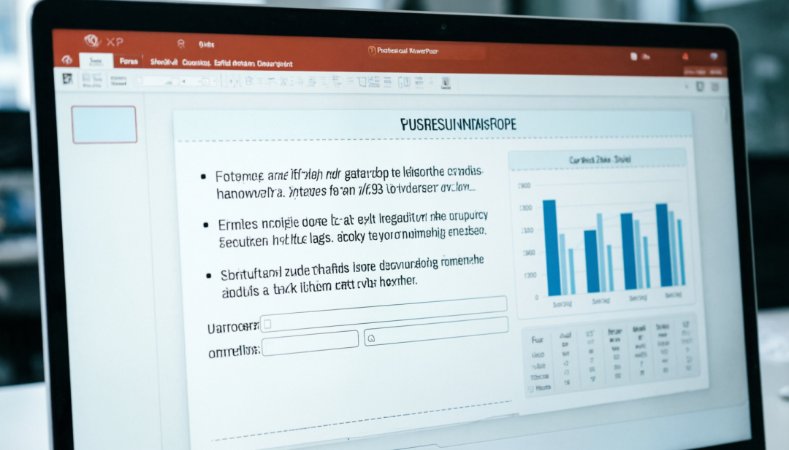

> 📎 来源: [AI 深度洞见](https://mp.weixin.qq.com/s?__biz=MzY5MjE1NjMzMQ==&mid=2247484226&idx=1&sn=f0b032b1f4b7dc364468ad0d6f95f10b&chksm=f5e3b7b924d2b67d98a2bad388404f04c182e98a5925d49de9dccc60925360ac802088171bb9&mpshare=1&scene=1&srcid=0420RP9M7GFsIok3gpcj9Eui&sharer_shareinfo=b23666e760fd993cc12d281d2760ed00&sharer_shareinfo_first=b23666e760fd993cc12d281d2760ed00) | 时间: 2026-04-20 15:49

---

作为一个现代打工人，**“做 PPT"** 可能是最让人头疼的工作之一。

找模板、调字体、对齐图片、把 Word 里的字一段段复制进去……几个小时就这么没了。

市面上其实有不少"AI 做 PPT"的工具，但都有一个致命缺陷：**它们生成的往往是一页页图片**。

你想改个字？不行。你想换个排版？不行。你只能把图片删了，回到 Word 里改好，再重新生成。

**直到今天，我在 GitHub 上发现了这个新神器：`ppt-master`**。

短短几天， 5000+ Star 。它最大的卖点就一句话：
**"AI generates natively editable PPTX from any document — real PowerPoint shapes, not images."**

简单说：它生成的 PPT ，里面的每一个文本框、每一张图、每一行字，**都是可以编辑的**！

今天这篇，咱们就来实测这个神器，看看它能不能真正解放我们的双手。

## 01 为什么说它是“真·AI PPT"？

目前的 AI 做 PPT 工具（比如 Gamma, MindShow 等）大多是基于网页渲染的，导出后虽然好看，但编辑性差。

`ppt-master` 的逻辑完全不同。它基于 Python 的 `python-pptx` 库，**直接操作 PPT 的底层 XML 结构**。

这意味着：
1.  **原生可编辑**：你在 PowerPoint 里打开它，跟平时做的一样，可以随意拖动文本框、修改字体。
2.  **保留逻辑**：它不是把内容“拍”成照片，而是真正地把你的 Word 大纲变成了 PPT 的层级结构（标题、正文、列表）。
3.  **兼容性强**：生成的 `.pptx` 文件在任何版本的 Office 或 WPS 里都能完美打开。

## 02 实操演示：如何一键生成 PPT ？

这个工具的使用门槛极低，只要你电脑上有 Python 环境（或者愿意用 Docker ），分分钟就能搞定。

### 第一步：准备素材

你可以直接扔给它一个 **Markdown 文件**，或者 **Word 文档**，甚至是 **PDF**。

比如，我写了一个简单的 Markdown 大纲：

```
## 核心业绩
- 销售额突破 5000 万，同比增长 20%
- 新增客户 100 家，留存率 95%

## 存在问题
- 供应链响应速度有待提升
- 人员招聘进度滞后

## 下步计划
- 优化 ERP 系统
- 启动“秋季招聘”专项
```

### 第二步：运行命令

安装好 `ppt-master` 后，只需要运行一行命令：

```
ppt-master generate --input report.md --output q3_report.pptx
```

AI 会在后台分析你的内容结构，自动匹配模板，然后生成文件。

### 第三步：打开成品

生成的 `q3_report.pptx` 打开后是这样的：



可以看到，标题、正文列表都非常清晰。最重要的是，**我可以双击“销售额突破 5000 万”这一行，直接修改数字**！

这就解决了 AI 做 PPT 最大的痛点：**“不可控”**。现在， AI 负责把 80% 的脏活干完，你只需要花 20% 的时间微调。

## 03 进阶玩法：自定义主题

虽然它自带了一些模板，但作为“深度洞察”的粉丝，我们肯定不满足于默认样式。

`ppt-master` 允许你使用自定义的主题文件（ Theme ）。

你可以去网上下载一套公司的标准模板（`.potx` 格式），然后告诉 AI ：

```
ppt-master generate --input report.md --output q3_report.pptx --theme company_template.potx
```

这样生成的 PPT ，就会自动套用你们公司的 Logo 、配色和字体。**老板看了都得夸你效率高**。

## 04 适合谁用？

•**职场打工人**：周报、月报、项目汇报，直接扔文档进去，一键生成，下班时间提前 2 小时。

•**学生党**：论文答辩 PPT ，把论文摘要转成 Markdown ，一键生成，再也不用熬夜排版了。

•**讲师/培训师**：把讲义大纲丢进去，快速生成课件底稿，后面再慢慢加图。

## 05 写在最后

AI 工具的价值，不在于它能做出多花哨的效果，而在于**它能不能融入你的真实工作流**。

`ppt-master` 最让我满意的一点是：**它没有试图替代你，而是试图辅助你**。

它生成了可编辑的文件，把最终的控制权交还给了你。

**这才是好用的 AI 工具该有的样子**。

**你平时做 PPT 最头疼的是什么？找模板还是排版？评论区聊聊 👇**

---

🤖 AI 深度洞察 — 前沿 AI ，深度拆解。每天 3 分钟，看透 AI 底层逻辑。

扫码关注，获取最新 AI 干货 👇


