> 📎 来源: [深入浅出AI](https://mp.weixin.qq.com/s?__biz=MzYzNzQ0NDM3OQ==&mid=2247484525&idx=1&sn=8a84c082d6193843e3e563d1efd7cb31&chksm=f131c51856298d2272d9005b6eaa6ceb831523bfa578d862ffd6b2cee6fea6c919c1ed190046&mpshare=1&scene=1&srcid=0421dl7LbYO8LFRXpo0iDb5S&sharer_shareinfo=dec40a91949e410b94227204f324c8ef&sharer_shareinfo_first=dec40a91949e410b94227204f324c8ef) | 时间: 2026-04-21 12:00

---

最近我越来越明显地感觉到，很多团队在讨论 **AI Coding** 时，还停留在 **Vibe Coding 或者 SDD**。

我想问大家一个问题：

**如果你们用的是公司私有组件，AI 不认识，该怎么办？**

模型当然认识 **React、Vue**，也大概率认识 **Ant Design、Tailwind**、主流开源框架。但它未必认识你们公司的：

- **私有组件库**
- **私有设计系统**
- **私有页面模板**
- **私有研发规范**
- **私有接口约束**

这时候，很多团队会突然发现，原来让 AI 写点 **demo** 不难，难的是让它在公司真实工程里写的让人感觉**“对”**。


问题也就来了：

> 如果 AI 不认识你们的私有组件，它凭什么写得对？靠提示词补吗？靠文档堆吗？靠接个 MCP 就够吗？

## Ant Design CLI 出现

我这段时间看 **Antd 上了个 Cli功能**，我试用了快一个月，它让我意识到：**当 AI 不认识企业内部能力时，这些能力应该以什么形式暴露给它**。

官方文档里，**Ant Design CLI** 覆盖的能力并不只是**文档查询**。它已经**包括组件知识、示例、设计 Token、语义结构、变更日志、项目诊断、使用分析、迁移辅助，同时支持 --format json、--version、Skill 集成**，以及通过 antd mcp 启动 MCP Server。这说明它在做的，不是一层薄薄的工具壳，而是一套面向开发者和 Agent 的能力接口。

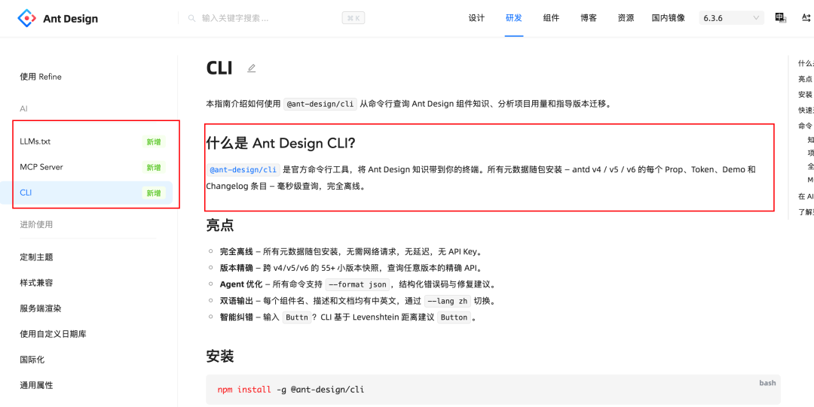

这篇文章，我想把这个 **Cli 的思想**系统的讲透。

# 私有组件，为什么会把很多 AI Coding 方案打回原形

很多 AI Coding 方案，在公共技术栈上看起来都不错。因为模型见过这些东西，训练语料里也有足够多的公开知识。

比如

- **Bolt.new**
- **V0**
- **Lovable**

但只要切进企业内部环境，情况马上就变了。

因为企业真正重要的那部分资产，往往都不是公开的：

- **组件名称是私有的**
- **组件属性是私有的**
- **业务约束是私有的**
- **研发流程也是私有的**

这时候，问题就不再是“模型会不会写代码”，而变成了：**企业有没有把这些私有能力，整理成 AI 能理解的形式**。

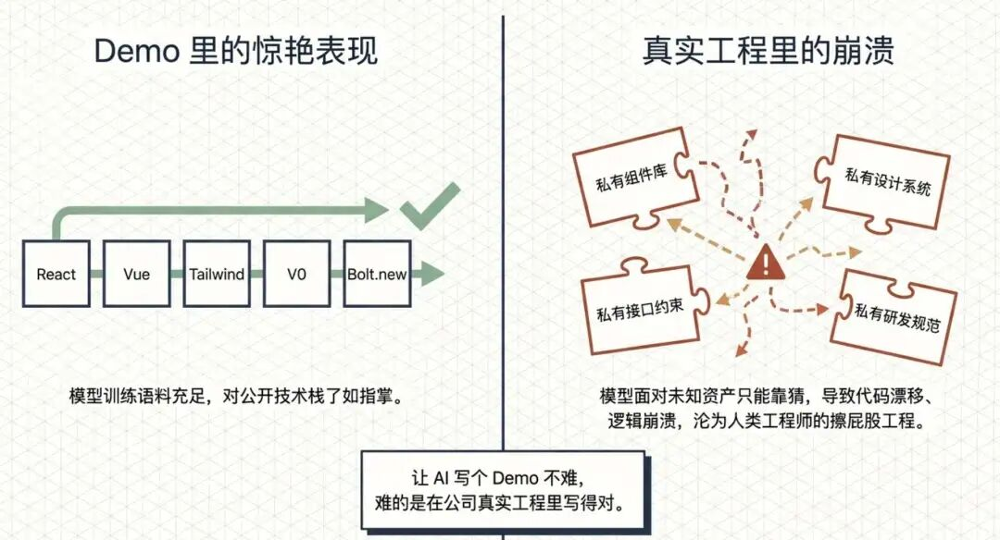

如果没有，模型就只能猜。猜组件、猜属性、猜约束、猜流程。

猜得顺，效果看着还行。猜错了，代码就开始漂，细节一塌糊涂，最后还得人来**擦屁股**。

## 什么是 CLI

这个概念必须先讲清楚。

很多人一看到 CLI，脑子里就自动等于“黑窗口”“**命令行**”“老派工具”。这个理解太窄了。

CLI，全称是 **Command Line Interface**。从表面看，它是通过命令行与系统交互。但从工程角度看，它真正重要的地方，不是黑不黑窗口，而是它把系统能力表达成了一组明确动作。

我通常会把 CLI 理解成四个部分：

- **一个明确的动作名**
- **一组明确的输入参数**
- **一个明确的执行结果**
- **一种可被脚本、系统、Agent 调用的接口形态**

也就是说，CLI 的本质不是界面，而是动作接口。

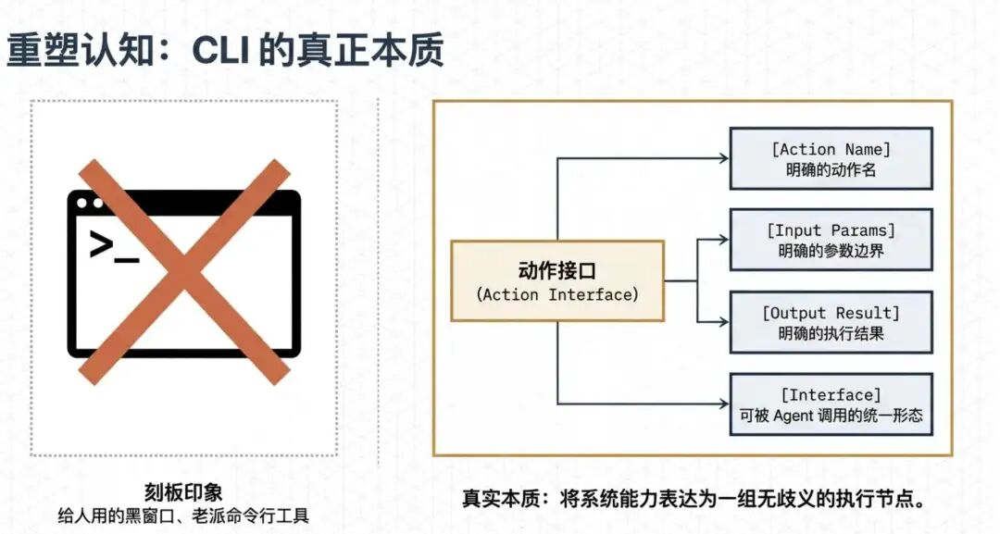

> 当然像 Claude Code、Codex 这种能在命令行运行的软件，我觉得它不属于动作接口，因为可能权限太大了，太灵活了，一个接口能做无限的事情

举个简单的例子。

如果某个平台有“查询文档空间用量”的能力，

在 **GUI** 里，它可能藏在某个后台页面的**菜单和按钮**后面；

在 **CLI** 里，它会变成一个明确动作：

```
platform doc-space usage
```

如果还要查询当前套餐、检查权限、发起升级，它会继续展开：

```
platform doc-space plan currentplatform doc-space permission -checkplatform doc-space upgrade --plan pro
```

这里最关键的

- **动作名清楚**
- **参数边界清楚**
- **返回结果清楚**
- **可以被人、脚本、Agent 统一调用**

这也是为什么我会觉得，**CLI** 在 **AI Coding** 里越来越重要。因为**它不是在给人多一个黑窗口，而是在给 AI 多一层动作接口**。ruo

# 很多团队高估了 MCP，低估了动作层

很多团队对 MCP 的期待太高了，仿佛只要能力挂进 MCP，**整个 AI Coding 体系就搭好了**。

现实没有这么简单。

从工程职责上看，MCP 更像是一条标准化接入总线。它解决的是：

- 工具怎么暴露
- 不同 IDE / Agent Host 怎么连接
- 同一批能力怎么被不同地方复用

这层非常关键。但它不负责这些问题：

- **任务应该先调用哪个动作**
- **多个动作怎么组合**
- **参数错误了怎么补救**
- **迁移、诊断、修复、校验的顺序怎么定**

这些事情，MCP 本身不处理。

所以，把 MCP 当成万能层，是个很常见的误区。**它解决的是接入问题，不是执行问题，更不是工作流问题**。

而企业里最容易出现的问题：**AI Coding 接了 MCP，发现并不能稳定生成代码**。

# ANTD CLI 的分层思路

我看 Ant Design CLI 时，关注点从“**能查哪些组件**”，到“**它为什么要这样组织能力**”。

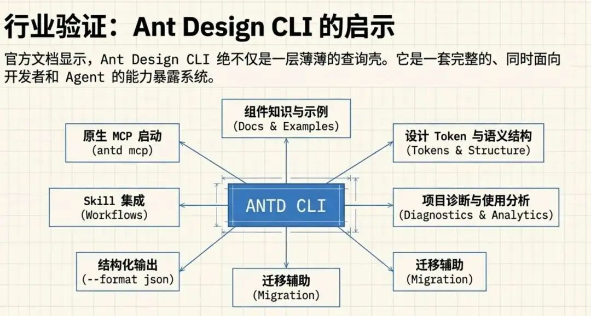

官方文档里，这套工具已经覆盖了几类典型能力：

- 组件知识查询
- 示例和文档查询
- Token、语义结构、变更日志查询
- 项目使用分析
- 兼容性与依赖诊断
- 迁移辅助
- 结构化输出
- Skill 集成
- MCP 接入。

这套设计在我看来，清楚地分成了三层。

## 第一层：把能力整理成 CLI

这是动作层。

原本散落在网页文档里的知识，一旦被整理成命令，它就不再只是“给人查阅的信息”，而变成了：

- 可被执行的动作
- 可被脚本消费的输出
- 可被 Agent 编排的节点

这一层很重要，因为 Agent 天然更擅长处理动作，而不是页面。

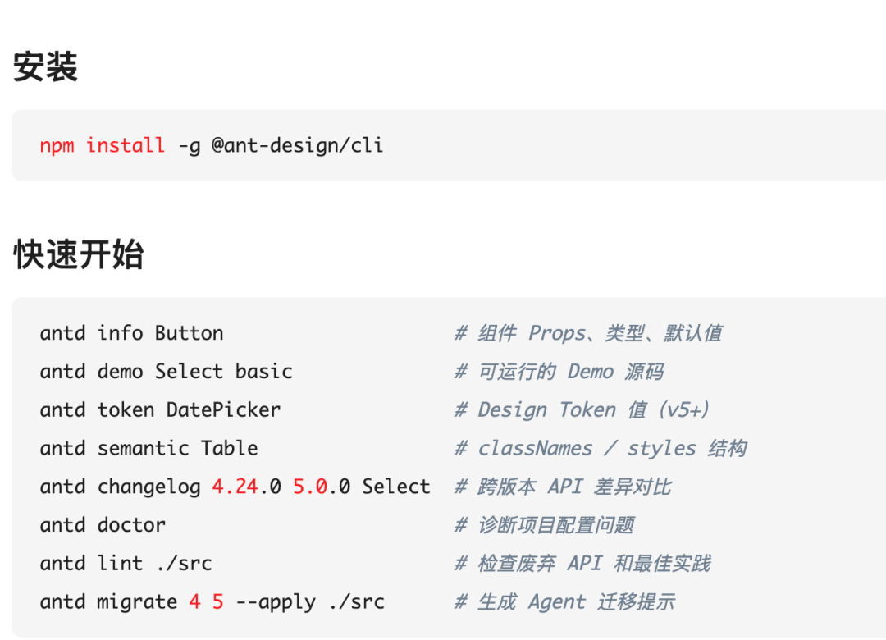

## 第二层：把动作组织成 Skill / Rules

这是工作流层。

官方文档明确提到，**内置 Skill 文件用于指导 Code Agent 在正确时机调用正确命令**。

在进一步解决：

- 什么时候该查文档
- 什么时候该跑诊断
- 什么时候该做迁移
- 哪一步应该优先
- 哪一步必须保留人工确认

这就是 Skill 的价值。它不是多一个提示词，而是在固化可复用的执行路径。

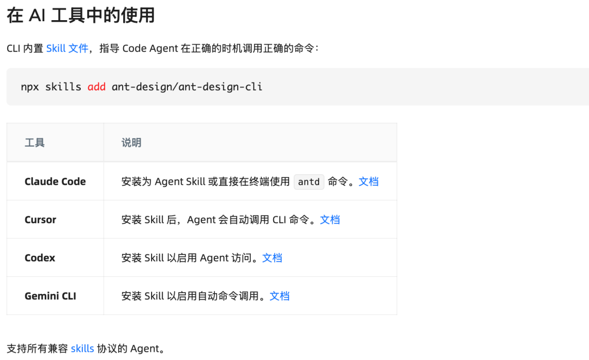

## 第三层：通过 MCP 接入宿主

这是接入层。

antd mcp 的意义，不是取代 CLI，而是把已经整理好的动作层标准化暴露给不同宿主。

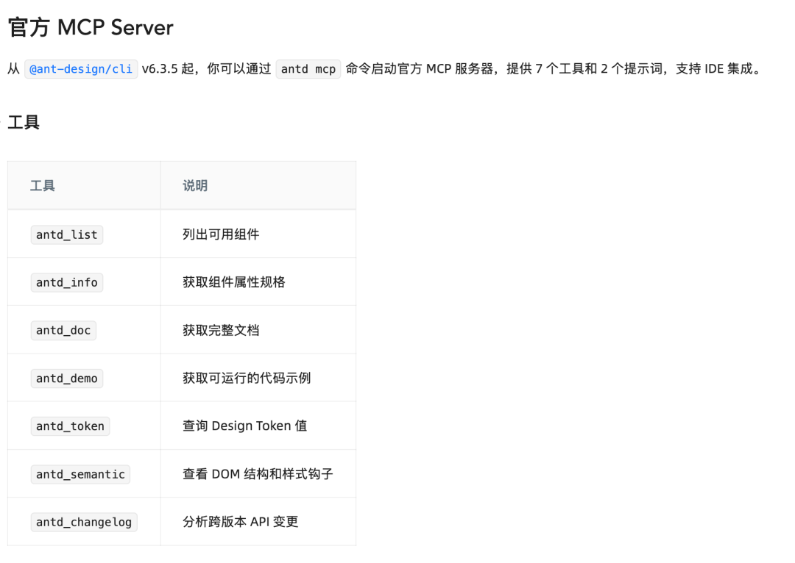

你把这三层摆在一起看，关系就很清楚了：

- CLI：动作层
- Skill / Rules：工作流层
- MCP：接入层

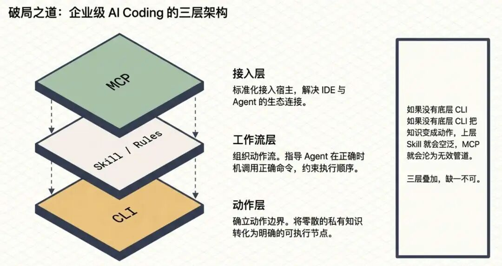

### 用一张表，把三层职责摆清楚

| 层次 | 解决的问题 | 典型形态 | 主要价值 | 单独使用的局限 |
| --- | --- | --- | --- | --- |
| CLI | 能力如何表达成动作 | 命令、子命令、参数、结构化输出 | 动作边界清晰，便于自动化、调试和编排 | 缺少标准接入和流程约束时，容易变成散命令 |
| Skill / Rules | 动作如何组织成稳定流程 | 规则文件、工作流提示、执行约束 | 降低模型自由发挥，提高复杂任务稳定性 | 没有清晰动作层时，规则容易空泛 |
| MCP | 能力如何接入宿主生态 | 标准化工具暴露、Host / Server 连接 | 易接入 IDE / Agent 生态，复用性高 | 不负责动作设计，也不负责任务编排 |

# 如果 AI 不认识私有组件，最常见的几种做法为什么都不够

这个问题，我觉得有必要再拆细一点。

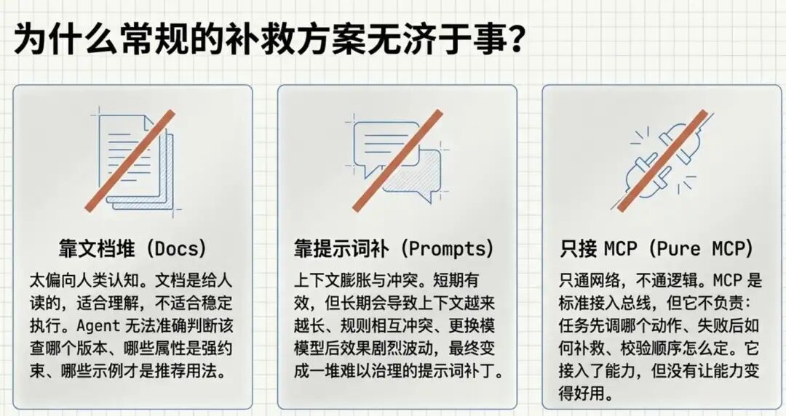

## 方案一：靠文档补

很多团队的第一反应是，把私有组件文档补齐。这当然有用，但只够解决一半问题。

因为文档主要是给人读的。它适合理解，不适合稳定执行。

对 Agent 来说，光有文档不够，它还需要知道：

- 该查哪个文档
- 哪个版本对应当前项目
- 哪些属性是强约束
- 哪些示例才是推荐用法

如果这些都要靠模型自己读完再总结，稳定性不会太好。

## 方案二：靠 Prompt 补

第二种常见做法，是把私有组件规则写进 Prompt。

这条路短期能跑，长期问题很多：

- 上下文会越来越长
- 规则容易冲突
- 一换模型效果也波动

更麻烦的是，Prompt 里的规则很难演进成一个可治理资产。很多团队最后会发现，自己维护了一堆散乱的“提示词补丁”(**当然会有类似 cursor rules 的方式**)。

## 方案三：只靠 MCP

第三种做法，就是把私有组件能力做成 MCP 工具。

这一步已经比前两种进了一大步。但如果只有 MCP，问题依然存在：

- Agent 先调什么
- 组件信息和示例怎么组合
- 生成前要不要先做约束校验
- 生成后要不要跑验证
- 失败之后是重试、换组件，还是停下来等确认

也就是说，MCP 让能力能接进来，但没有自动让能力变得“好用”。

# 公司私有组件体系，怎么做 AI Coding

为了避免只讲概念，我举一个完整场景。

### 场景角色

- 平台团队：维护一套公司内部私有组件库
- 业务研发团队：希望让 AI 直接基于这套组件写页面
- Code Agent：**负责查询组件、生成代码、校验结果**

### 核心目标

让 AI 在不认识私有组件的前提下，依然能正确生成一个内部业务页面。

### 输入

- 一个页面需求描述：例如，生成一个“订单查询页”，包含筛选区、表格区、状态标签、批量操作
- 当前项目使用的私有组件版本
- 团队编码规范与页面模板约束

### 处理流程（可调用工具）

我会把整条路径拆成工作流一步一步的。

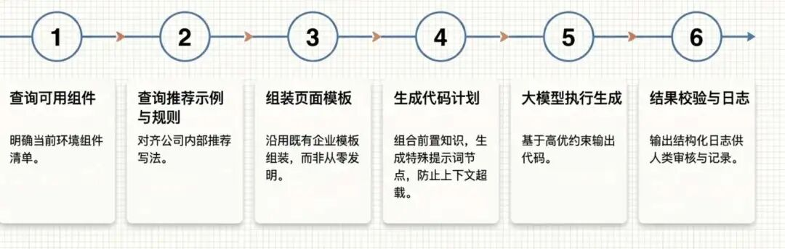

#### 步骤一：查询可用组件

```
component list --domain ordercomponent info --name BizTablecomponent info --name FilterPanelcomponent info --name StatusTag
```

目标是在用模型生成之前，当前环境里有哪些可用组件。

#### 步骤二：查询推荐示例和规则

```
component demo --name BizTable --scene order-listcomponent rule --name BizTable
```

让模型生成之前，让它参考对齐公司内部推荐写法。

#### 步骤三：组装页面模板

```
template info --name crud-pagetemplate slot --name search-areatemplate slot --name table-area
```

因为企业里很多页面不是“从零发明”，而是“沿着既有模板组装”。

#### 步骤四：生成代码计划

```
prompt_plan = build_page_plan(  components,  demos,  rules,  template)
```

把前面获取到的前置知识，组合起来，然后生成 prompt，这个 prompt 是一个特殊的节点，类似提示词上下文的优化，防止上下文过长

#### 步骤五：执行生成

```
LLM（prompt_plan）
```

**大模型调用**

#### 步骤六：结果校验

```
run lintrun typecheckrun buildcheck component-usage
```

## 输出与校验

最后谁输出日志，人能看得到的日志进行记录：

```
- 使用组件：BizTable、FilterPanel、StatusTag- 模板：crud-page- 自动生成文件：4- 规则冲突：1- 构建状态：通过- 类型检查：通过
```

## 这个案例说明了什么

它说明了一件很现实的事：如果 AI 不认识私有组件，就不能只把“组件知识”给它，还要把“**知识如何变成动作**”一起给它。

而这正是 CLI 的价值。它让私有组件体系不再是只能阅读：

- 文档
- 设计稿
- 人的经验
- 平台里的隐藏逻辑

而是变成可执行具体步骤：

- 可查询
- 可编排
- 可校验

# 为什么 CLI 对弱模型也更友好

很多团队一遇到效果不稳定，第一反应就是模型不够强。要马上使用 Claude Opus 4.6，这确实没毛病，但是贵啊。

弱模型通常不是“完全不会”，而是：

- 不知道先做什么
- 对参数边界理解模糊
- 输出结构不稳定
- 忘记做校验和收尾

如果系统只给它一堆散工具，模型就必须自己完成这些额外决策：

- **这些工具分别干什么**
- **这些工具该怎么组合**
- **什么场景优先调用什么**
- **哪一步要停下来等确认**

**自由度一大，错误率自然上升。**

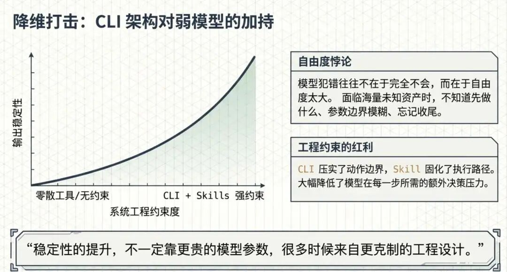

而 CLI 能把能力压成了动作边界。Skill / Rules 会再进一步，把顺序和约束固化下来。这样模型自由度减少了许多。

这对系统设计非常重要。因为它意味着，**稳定性的提升，不一定都要靠更贵的模型。很多时候，来自你对动作层和工作流层的工程设计**。

# 为什么我会觉得 ANTD 这条路径有代表性

我觉得它代表的是一种更成熟的产品思路。

### 第一，能力要同时服务两类消费者

- **给人查**
- **给 Agent 调**

如果只有网页文档，Agent 用起来很吃力。如果只有 MCP，人类开发者的终端体验又不够直接。CLI 恰好把两边接住了。官方文档中，CLI 本身就是直接给开发者和 Agent 共用的统一入口，同时支持文本、Markdown、JSON 输出。

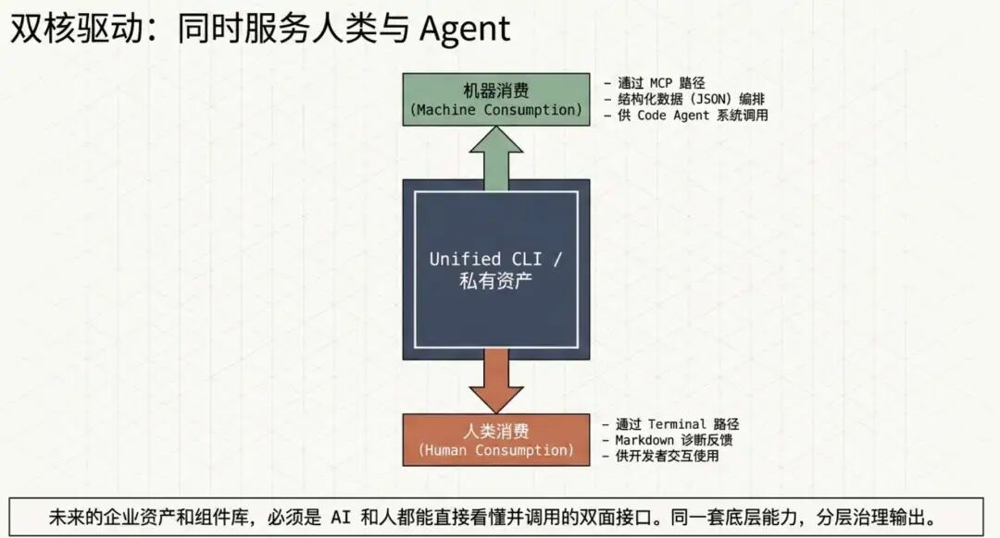

> 未来的组件库，肯定是 AI 和人都能看得懂的

### 第二，平台能力要分层治理

ANTD 这套组合，本质上就是在做能力分层。

- 动作层要可维护
- 工作流层要可演进
- 接入层要可扩展

# Antd Cli 的难点

如果只讲好处，这篇文章就显得硬夸了。

## 第一，命令边界设计很难

什么能力该做成一个命令，什么能力该做成子命令，什么参数应该显式暴露，什么参数适合由系统自动推断，这些都很考验判断。

命令太粗，Agent 不好编排。命令太细，系统会变碎。

## 第二，版本治理要求高

像 ANTD CLI 这种工具，如果要同时支持知识查询、诊断、迁移和版本指定，本质上就是在维护一套长期演进的版本化资产。Antd cli官方文档里已经明确体现了这种版本能力。

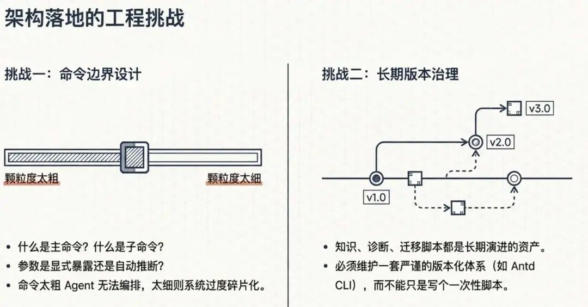

# 总结

真正在企业 AI Coding 中，最难的是：**AI 根本不认识你们公司的私有能力**。

**它不认识私有组件。不认识私有规则。不认识私有流程。不认识你们真正赖以交付的软件资产**。

这时候，系统如果没有把这些能力整理成结构化、可调用、可编排的动作层，模型就只能靠猜。

而企业最不该把生产力建立在“猜得差不多”上。

**文章开头那个问题，答案其实已经很清楚了：**

如果 AI 不认识你们公司的私有组件，就不要指望它自己悟出来。更现实的做法，是把这些私有能力重新整理成一层它能识别、能调用、能编排的接口。

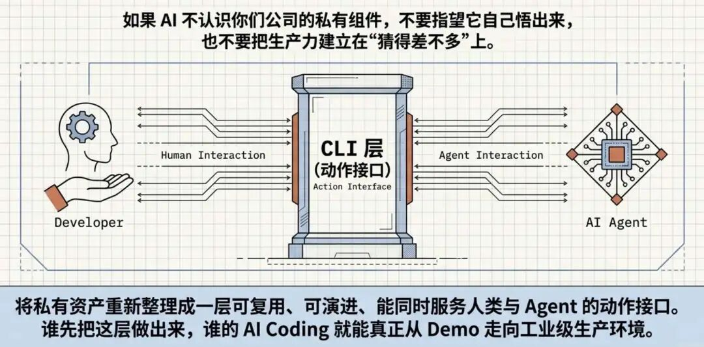

- **会长期复用**
- **流程相对稳定**
- **同时服务人和 Agent**
- **需要被持续治理**
- **对接多个团队**

谁先把这层做出来，谁的 AI Coding 才更有可能从 demo 走进真实生产环境。
