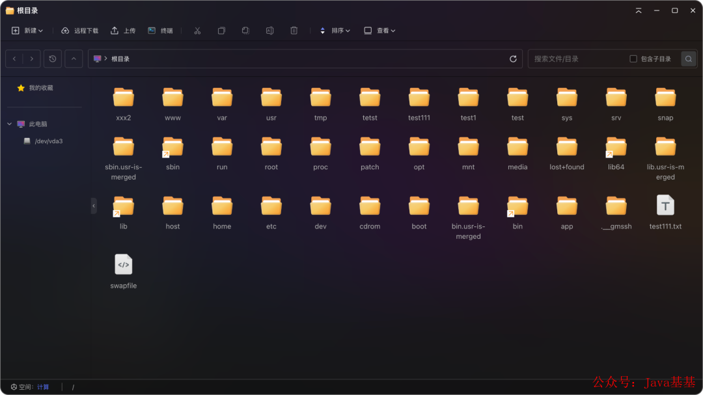
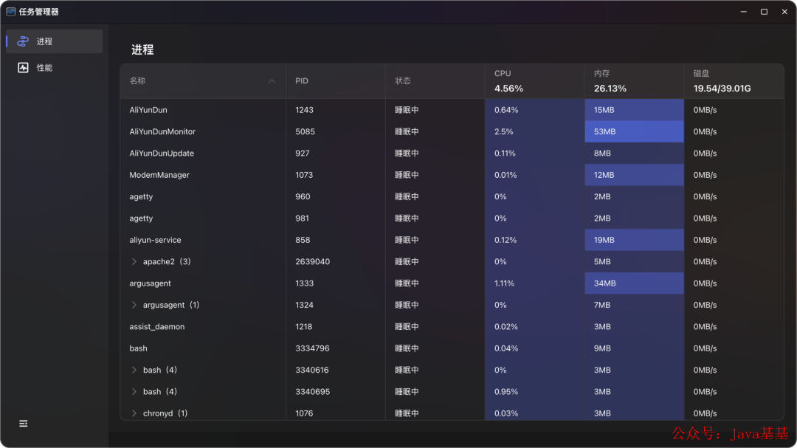
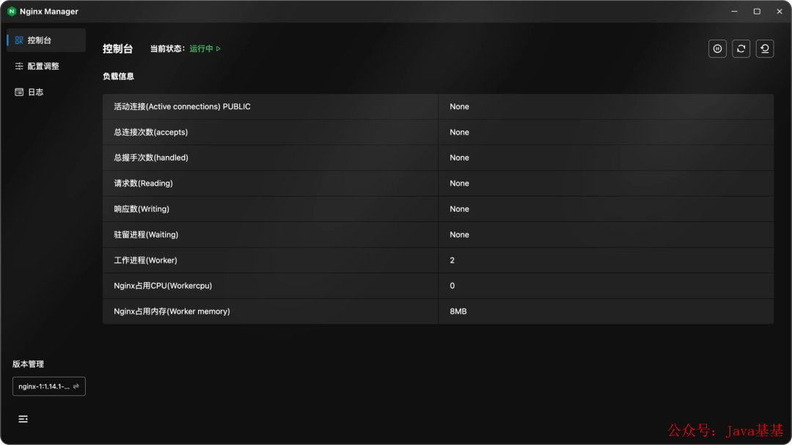
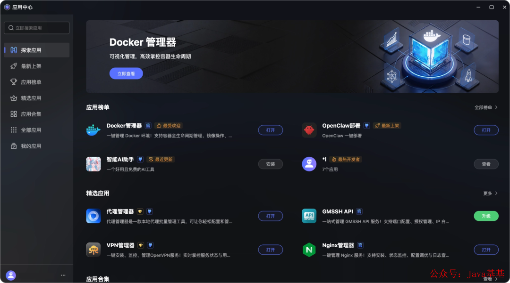
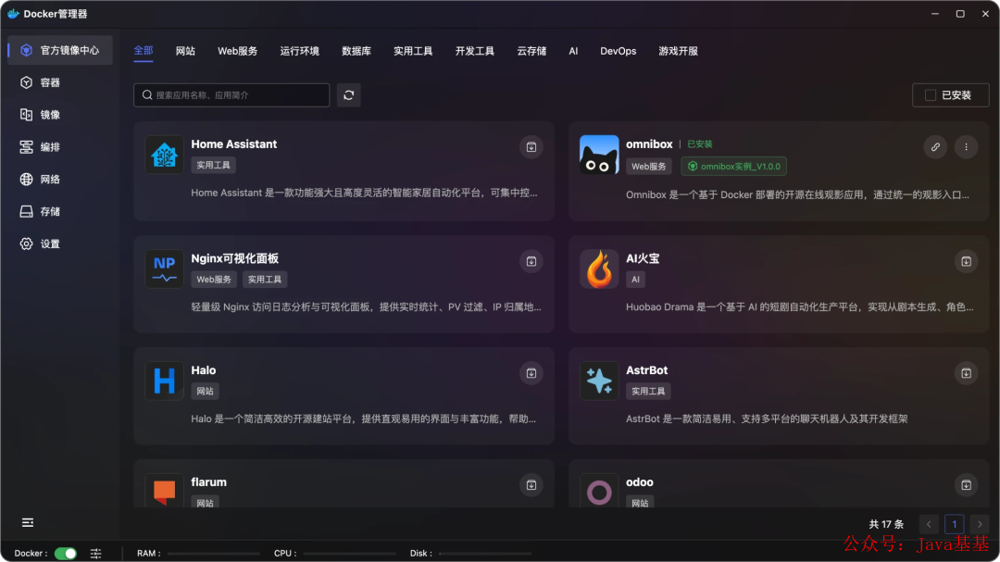
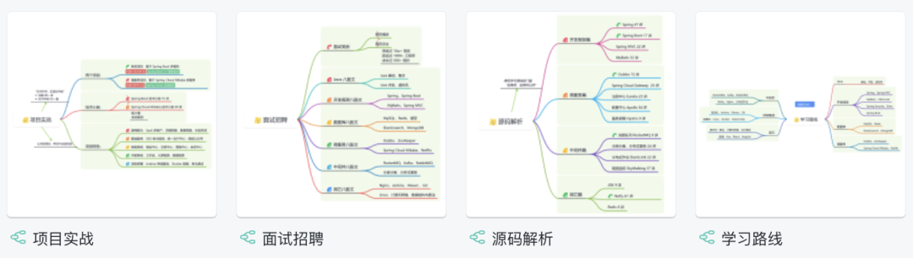

> 📎 来源: [芋道源码](https://mp.weixin.qq.com/s?__biz=MzUzMTA2NTU2Ng==&mid=2247620461&idx=1&sn=2dd2211dbf5e1b4de8a5965ba9e247e2&chksm=fb67deed376b5e3f1f35b6295fc6904c7b1f12417795a0ae92dd1756cc3cffea13e8c7a24458&mpshare=1&scene=1&srcid=0524JzAPbcU9yYWoGhBVDOyO&sharer_shareinfo=8bb2ea0bd57814fdfe1eea2d0d44add0&sharer_shareinfo_first=8bb2ea0bd57814fdfe1eea2d0d44add0) | 时间: 2026-05-24 16:42

---

👉 **这是一个或许对你有用****的社群**

🐱 一对一交流/面试小册/简历优化/求职解惑，欢迎加入「**[芋道快速开发平台](http://mp.weixin.qq.com/s?__biz=MzUzMTA2NTU2Ng==&mid=2247576697&idx=1&sn=a5f8a37fe0c6f05509c5bed6244471a8&chksm=fa4bd3c8cd3c5aded28a6b68a9944ce671f3d2748644f71550c0468d75058e90dd378a1babe8&scene=21#wechat_redirect)**」知识星球。下面是星球提供的部分资料： 

- [《项目实战（视频）》](http://mp.weixin.qq.com/s?__biz=MzUxOTc4NjEyMw==&mid=2247561735&idx=1&sn=1b0a95d87fc647c3cf5e2b88576a8f55&chksm=f9f7e9e3ce8060f5809daa189fea465e95fa5445797f96fd8023f424c2acf4d31751a62792fc&scene=21#wechat_redirect)：从书中学，往事中**“练”**
- [《互联网高频面试题》](http://mp.weixin.qq.com/s?__biz=MzUxOTc4NjEyMw==&mid=2247561735&idx=1&sn=1b0a95d87fc647c3cf5e2b88576a8f55&chksm=f9f7e9e3ce8060f5809daa189fea465e95fa5445797f96fd8023f424c2acf4d31751a62792fc&scene=21#wechat_redirect)：面朝简历学习，春暖花开
- [《架构 x 系统设计》](http://mp.weixin.qq.com/s?__biz=MzUxOTc4NjEyMw==&mid=2247561735&idx=1&sn=1b0a95d87fc647c3cf5e2b88576a8f55&chksm=f9f7e9e3ce8060f5809daa189fea465e95fa5445797f96fd8023f424c2acf4d31751a62792fc&scene=21#wechat_redirect)：摧枯拉朽，掌控面试高频场景题
- [《精进 Java 学习指南》](http://mp.weixin.qq.com/s?__biz=MzUxOTc4NjEyMw==&mid=2247561735&idx=1&sn=1b0a95d87fc647c3cf5e2b88576a8f55&chksm=f9f7e9e3ce8060f5809daa189fea465e95fa5445797f96fd8023f424c2acf4d31751a62792fc&scene=21#wechat_redirect)：系统学习，互联网主流技术栈
- [《必读 Java 源码专栏》](http://mp.weixin.qq.com/s?__biz=MzUxOTc4NjEyMw==&mid=2247561735&idx=1&sn=1b0a95d87fc647c3cf5e2b88576a8f55&chksm=f9f7e9e3ce8060f5809daa189fea465e95fa5445797f96fd8023f424c2acf4d31751a62792fc&scene=21#wechat_redirect)：知其然，知其所以然


👉**这是一个或许对你有用的开源项目**

国产Star破10w的开源项目，前端包括管理后台、微信小程序，后端支持单体、微服务架构

RBAC权限、数据权限、SaaS多租户、**商城**、支付、工作流、大屏报表、**ERP、CRM**、**AI大模型、IoT物联网**等功能：

- 多模块：https://gitee.com/zhijiantianya/ruoyi-vue-pro
- 微服务：https://gitee.com/zhijiantianya/yudao-cloud
- 视频教程：https://doc.iocoder.cn

【国内首批】支持 JDK17/21+SpringBoot3、JDK8/11+Spring Boot2双版本

- [不是又一个宝塔](https://mp.weixin.qq.com/s?__biz=MzUzMTA2NTU2Ng==&mid=2247487551&idx=1&sn=18f64ba49f3f0f9d8be9d1fdef8857d9&chksm=fa496f8ecd3ee698f4954c00efb80fe955ec9198fff3ef4011e331aa37f55a6a17bc8c0335a8&scene=21&token=899450012&lang=zh_CN#wechat_redirect)
- [零侵入：纯 SSH 隧道，服务器什么都不用装](https://mp.weixin.qq.com/s?__biz=MzUzMTA2NTU2Ng==&mid=2247487551&idx=1&sn=18f64ba49f3f0f9d8be9d1fdef8857d9&chksm=fa496f8ecd3ee698f4954c00efb80fe955ec9198fff3ef4011e331aa37f55a6a17bc8c0335a8&scene=21&token=899450012&lang=zh_CN#wechat_redirect)
- [架构设计：进程隔离 + UDS 通信](https://mp.weixin.qq.com/s?__biz=MzUzMTA2NTU2Ng==&mid=2247487551&idx=1&sn=18f64ba49f3f0f9d8be9d1fdef8857d9&chksm=fa496f8ecd3ee698f4954c00efb80fe955ec9198fff3ef4011e331aa37f55a6a17bc8c0335a8&scene=21&token=899450012&lang=zh_CN#wechat_redirect)
- [AI 运维：不只是聊天](https://mp.weixin.qq.com/s?__biz=MzUzMTA2NTU2Ng==&mid=2247487551&idx=1&sn=18f64ba49f3f0f9d8be9d1fdef8857d9&chksm=fa496f8ecd3ee698f4954c00efb80fe955ec9198fff3ef4011e331aa37f55a6a17bc8c0335a8&scene=21&token=899450012&lang=zh_CN#wechat_redirect)
- [插件机制和 App Center](https://mp.weixin.qq.com/s?__biz=MzUzMTA2NTU2Ng==&mid=2247487551&idx=1&sn=18f64ba49f3f0f9d8be9d1fdef8857d9&chksm=fa496f8ecd3ee698f4954c00efb80fe955ec9198fff3ef4011e331aa37f55a6a17bc8c0335a8&scene=21&token=899450012&lang=zh_CN#wechat_redirect)
- [功能体验](https://mp.weixin.qq.com/s?__biz=MzUzMTA2NTU2Ng==&mid=2247487551&idx=1&sn=18f64ba49f3f0f9d8be9d1fdef8857d9&chksm=fa496f8ecd3ee698f4954c00efb80fe955ec9198fff3ef4011e331aa37f55a6a17bc8c0335a8&scene=21&token=899450012&lang=zh_CN#wechat_redirect)
- [开源地址](https://mp.weixin.qq.com/s?__biz=MzUzMTA2NTU2Ng==&mid=2247487551&idx=1&sn=18f64ba49f3f0f9d8be9d1fdef8857d9&chksm=fa496f8ecd3ee698f4954c00efb80fe955ec9198fff3ef4011e331aa37f55a6a17bc8c0335a8&scene=21&token=899450012&lang=zh_CN#wechat_redirect)

---

我第一次看到 GMSSH 的截图时，以为是某个商业 SaaS 的宣传图——界面很干净，布局像 Windows 桌面，完全不像一个 SSH 客户端该有的样子。


## [不是又一个宝塔](https://mp.weixin.qq.com/s?__biz=MzUzMTA2NTU2Ng==&mid=2247576728&idx=1&sn=1298645b025eb51d9078e8c3de7b3c17&scene=21#wechat_redirect)

GMSSH 的官方定位是"Desktop-Grade AI-Driven Operations Terminal"——**桌面级 AI 驱动运维终端** 。

说白了，GMSSH 想做的是：连上一台 Linux 服务器后，看到的不是命令行提示符，而是一个类似 Windows 的图形化桌面——能双击打开文件夹、拖拽上传文件、右键解压缩，旁边还有个 AI 助手随时待命。

这种思路不算全新。宝塔面板干了很多年"图形化管理 Linux"的事，1Panel 最近也在走这条路。但 GMSSH 的切入角度不一样——**它不在服务器上装东西** 。宝塔要装 Agent，1Panel 也要装后端服务；GMSSH 把可视化逻辑全放在客户端，通过原生 SSH 隧道和服务器通信。

这个区别很关键：**你的服务器保持干净，攻击面不会增加。**

基于 Spring Boot + MyBatis Plus + Vue & Element 实现的后台管理系统 + 用户小程序，支持 RBAC 动态权限、多租户、数据权限、工作流、三方登录、支付、短信、商城等功能

- 项目地址：https://github.com/YunaiV/ruoyi-vue-pro
- 视频教程：https://doc.iocoder.cn/video/

## [零侵入：纯 SSH 隧道，服务器什么都不用装](https://mp.weixin.qq.com/s?__biz=MzUzMTA2NTU2Ng==&mid=2247576728&idx=1&sn=1298645b025eb51d9078e8c3de7b3c17&scene=21#wechat_redirect)

很多运维工具要在服务器上装 Agent，每次部署心里都犯嘀咕：这玩意儿稳不稳？会不会吃资源？安全性怎么保证？

GMSSH 把这些顾虑全部解决：完全基于标准 SSH 协议，只要服务器开着 22 端口就行。客户端通过 SSH 隧道把所有通信加密传输，和直接 

```
ssh
```

 上去本质是同一条路。

基于 Spring Cloud Alibaba + Gateway + Nacos + RocketMQ + Vue & Element 实现的后台管理系统 + 用户小程序，支持 RBAC 动态权限、多租户、数据权限、工作流、三方登录、支付、短信、商城等功能

- 项目地址：https://github.com/YunaiV/yudao-cloud
- 视频教程：https://doc.iocoder.cn/video/

## [架构设计：进程隔离 + UDS 通信](https://mp.weixin.qq.com/s?__biz=MzUzMTA2NTU2Ng==&mid=2247576728&idx=1&sn=1298645b025eb51d9078e8c3de7b3c17&scene=21#wechat_redirect)

GMSSH 的核心引擎 

```
ga_main
```

 是整个系统的中枢，负责进程生命周期管理和流量分发。所有功能模块——文件管理器、Nginx 管理器、各种插件——都作为独立子进程运行。

**某个插件崩了，只影响那一个进程，主进程和其他服务不受影响，系统会自动重启挂掉的进程。**

内部通信用 Unix Domain Socket（UDS），数据在内核内存缓冲区里直接拷贝，绕过网络协议栈，延迟是微秒级的。应用层用 JSON-RPC 2.0 协议，意味着 Python、Go、Node.js、Rust 都能写插件，语言无关。

## [AI 运维：不只是聊天](https://mp.weixin.qq.com/s?__biz=MzUzMTA2NTU2Ng==&mid=2247576728&idx=1&sn=1298645b025eb51d9078e8c3de7b3c17&scene=21#wechat_redirect)

内置 AI 是 GMSSH 的主打卖点。预置了 50+ 运维技能包，覆盖巡检、配置优化、故障排查等常见场景。关键在于：**AI 不只是对话框，而是通过 MCP（Model Context Protocol）感知服务器实时状态，给出有上下文的建议。**

比如你问"为什么 CPU 使用率突然飙高"，它不是给你一段通用的排查流程，而是直接看当前进程列表、最近的日志，然后告诉你"是 PID 12345 的 Java 进程在做 Full GC"。

## [插件机制和 App Center](https://mp.weixin.qq.com/s?__biz=MzUzMTA2NTU2Ng==&mid=2247576728&idx=1&sn=1298645b025eb51d9078e8c3de7b3c17&scene=21#wechat_redirect)

GMSSH 的策略是"**核心闭源 + 生态开放** "。核心引擎自己维护，但提供 SDK，开发者可以用 Web 技术（HTML/JS/Vue/React）或 Python/Go 脚本来开发插件。

开发流程：注册开发者账号 → 选技术栈模板 → 拉代码 → 开发 → 提交审核 → 上架 App Center。

支持的技术栈组合：纯 HTML+JS 适合轻量工具，Vue3+Vite 或 React+Vite 适合有复杂 UI 的应用，加上 Python 或 Sanic 后端就能做需要服务器端逻辑的功能。

## [功能体验](https://mp.weixin.qq.com/s?__biz=MzUzMTA2NTU2Ng==&mid=2247576728&idx=1&sn=1298645b025eb51d9078e8c3de7b3c17&scene=21#wechat_redirect)

##### 桌面


##### 文件系统



##### 实时监控



##### 控制台



##### 应用中心



##### 镜像市场



## [开源地址](https://mp.weixin.qq.com/s?__biz=MzUzMTA2NTU2Ng==&mid=2247576728&idx=1&sn=1298645b025eb51d9078e8c3de7b3c17&scene=21#wechat_redirect)

https://github.com/GMSSH/GMSSH

---

欢迎加入我的知识星球，全面提升技术能力。

👉 加入方式，**“**长按**”或“**扫描**”下方二维码噢**：


星球的**内容包括**：项目实战、面试招聘、源码解析、学习路线。




```
文章有帮助的话，在看，转发吧。谢谢支持哟 (*^__^*）
```
