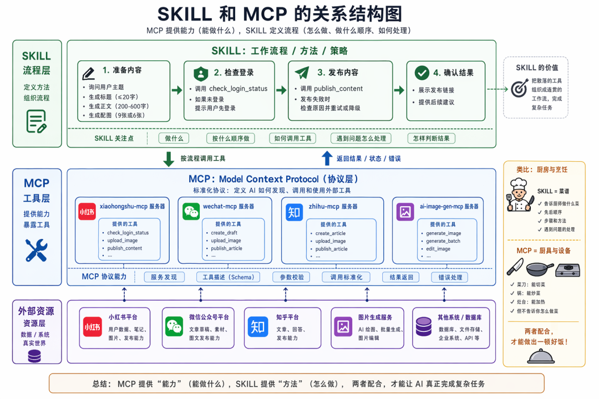
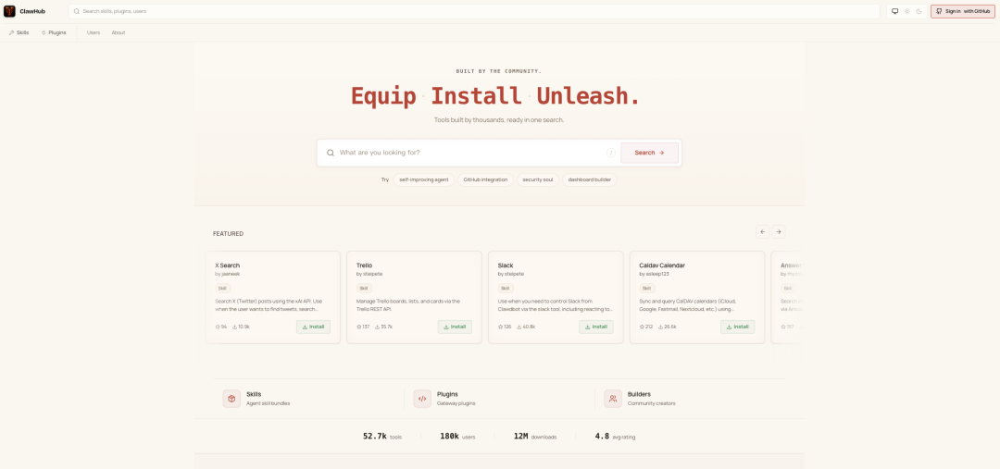
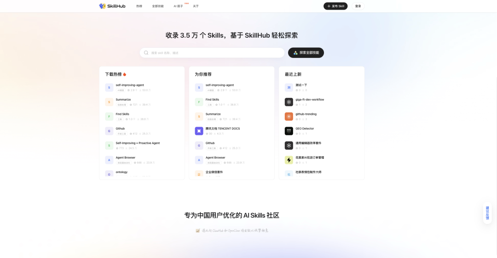
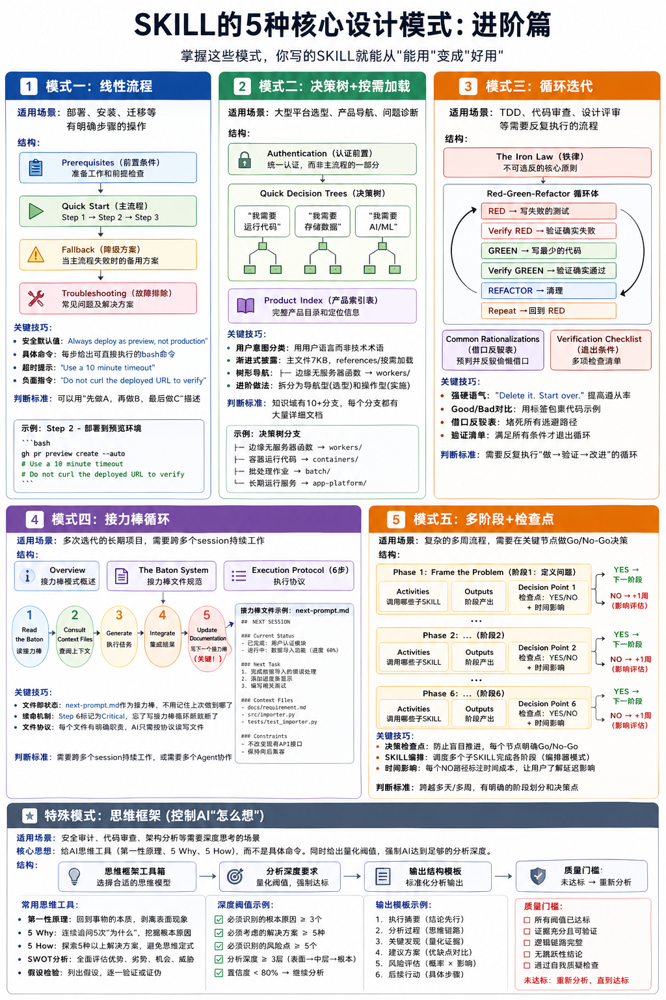

> 📎 来源: [梦朝思夕技术与管理博客](https://mp.weixin.qq.com/s?__biz=MzI2OTA3MDk4Mw==&mid=2458635896&idx=1&sn=439b90afdda9e373f8acd8cbf06b4fd0&chksm=fc21b0630be5d29a99a4f42a22a4f3bf71419b1de19192091dffe36dacab1f66c4d0b66ba764&mpshare=1&scene=1&srcid=0430V2a6GhgmFAEKbBdCQK2x&sharer_shareinfo=8ba9f98e663cdde7e59bb8337a200254&sharer_shareinfo_first=8ba9f98e663cdde7e59bb8337a200254) | 时间: 2026-04-30 19:11

---

## 前言

你可能花了一下午时间，让AI帮我整理一份分析报告。来来回回聊了二十多轮，每轮都在重复解释我要什么。最后输出的东西，我改了半天才能用。

问题出在哪？

很多人第一反应是"这AI不够聪明"。但我用了这么久的AI产品，真实的感受是：**大多数时候是我们对AI说话的方式不对。**

我们只说了目标，没说步骤、没给上下文、没定边界。AI只能靠猜，猜错了就得重来。

今天要聊的这个东西，叫**SKILL**。这是这波AI浪潮里，真正被验证过、能让AI听话干活的一套方法论。说得更直白一点：**SKILL就是AI Agent的SOP（标准操作程序）。**

就像你入职一家新公司，公司会给你发一本员工手册。手册里写了公司的价值观、工作流程、行为规范。你看完就知道该怎么工作了。SKILL就是这样一本手册，只不过它是写给AI看的。

这篇文章从入门到精通，保姆级教程，读完你就能上手写自己的SKILL。

---

## 一、为什么你跟AI对话总是"鸡同鸭讲"

先问大家一个问题：你平时是怎么跟AI说话的？

大概率是这样：打开聊天框，直接说你想让它干什么。"帮我写一封邮件""分析一下这份数据""做个方案"。

这种方式能完成简单任务，但一旦遇到复杂场景就歇菜。

比如你说"帮我分析一下竞品"，AI会问一堆问题：分析哪些竞品？用什么维度分析？输出什么格式？你一个一个回答，聊了二十轮，最后发现AI根本没理解你的真实需求。

问题出在哪？是你没有把"做这件事的完整流程"告诉AI。

你以为AI什么都知道，其实它只知道你这次对话里告诉它的东西。它不知道你的公司是什么风格、不知道你们项目文档有什么模板、不知道你prefer简洁还是详细。

SKILL做的事情是"**知识注入**"。它把你公司的规范和模板、你团队的工作流程、你行业的专业术语、你个人的偏好和习惯，这些东西打包成AI能理解的指令，让它每次都能准确执行。

这不是什么玄学。想想我们日常工作是怎么做的。

一个新员工入职，老板不会让他"自己摸索"。公司会有一套SOP：怎么写邮件、怎么做汇报、怎么走审批流程。这些SOP保证了每个人做事的一致性和质量。

AI也一样。没有SOP，AI就是一团混沌。有了SKILL，AI就变成一个能按规矩办事的"员工"。

---

## 二、SKILL到底是什么

SKILL的概念最早是Anthropic提出来的，后来成了AI行业的一个开放标准。现在几乎所有主流AI工具都支持SKILL——Claude Code、OpenClaw、Cursor、Codex、Hermes Agent等等。

简单来说，**SKILL就是一份给AI看的"工作手册"**。

你可以把OpenClaw看作是一部智能手机，SKILL相当于手机上安装的APP。没有SKILL的OpenClaw，只是一个能聊天的机器人。装上了SKILL后，它能搜索、自动化、操作系统、调用API、执行脚本。

SKILL的核心就是：一个文件夹 + 一个SKILL.md文件。

你可能觉得这东西很复杂，要写代码什么的。其实不是。**一个SKILL最简单的形式只需要一个文件**，叫SKILL.md。

但如果你想做得更专业，一个完整的SKILL目录结构是这样的：

```
my-skill/├── SKILL.md              # 主文件（必须）├── scripts/              # 可执行脚本（可选）├── references/           # 详细参考文档（可选，按需加载）├── resources/            # 模板、清单等资源（可选）└── examples/             # 示例（可选）
```

SKILL.md是核心文件，包含所有指令。scripts/目录放复杂操作的脚本文件。references/目录放详细的参考文档，AI按需读取，不占用初始上下文。resources/目录放模板文件、配置清单等资源。examples/目录放使用示例。

对于大多数场景，只需要SKILL.md就够了。其他目录是在SKILL变得复杂时才需要的。

一个完整的SKILL.md文件包含两部分：

\*\*第一部分是Frontmatter（文件头）\*\*，这是YAML格式的元数据，最关键的是description字段。AI会扫描所有SKILL的description，决定是否加载这个SKILL。

```
---name:xiaohongshu-auto-publishdescription:将微信文章、Bilibili/YouTube视频链接或网页内容转成小红书图文笔记草稿，生成标题、正文、标签和配图，并在用户确认后通过xiaohongshu-mcp发布。适用于“链接转小红书笔记/生成并发布小红书图文”；不适用于普通文案润色、非小红书平台发布或无授权内容搬运。version:1.1.0requirements:-python3,requests,beautifulsoup4,yt-dlp,playwright-mcporter+xiaohongshu-mcp已配置-环境变量VOLCENGINE_IMAGE_KEY/DASHSCOPE_API_KEY-依赖skill:wechat-article-to-markdown,download-video-subtitle,ai-image-gen,agent-reachtools: [bash, read, write, sessions_spawn]triggers:-发布到小红书-小红书笔记-文章转小红书-视频转小红书-微信文章转小红书-B站视频转小红书-YouTube视频转小红书---
```

**description写得好不好，直接决定AI会不会用你的SKILL。**

好的description有三个特征：列举触发短语，把用户可能说的话写进去；定义时序位置，说明"在什么之前/之后"使用；包含关键词，相关产品名、场景词都列出来。

**第二部分是Markdown正文**，这是具体的指令内容，告诉AI怎么做。

关键机制是：SKILL本质是"知识注入"——它不会动态生成新工具，而是把指令文本注入到AI的上下文中，AI用已有的工具（bash、read、edit等）来执行这些指令。

---

## 三、SKILL与MCP的关系：工具层与流程层

说到SKILL，很多人会问：这跟MCP有什么区别？

这个问题很关键，因为理解了两者关系，你才能真正用好它们。

**MCP（Model Context Protocol）是工具层。**

MCP是一个协议，定义了AI如何调用外部工具。比如你想让AI查询天气，你需要一个"天气查询"的MCP服务器。你想让AI操作数据库，你需要一个"数据库操作"的MCP服务器。

MCP负责的是"能力"——让AI能够做某件事。但MCP不告诉AI"怎么做这件事"。

举个例子，你有一个"发布小红书"的MCP服务器。这个服务器提供了几个工具：检查登录状态、上传图片、发布笔记。

AI有了这个MCP，"能"发布小红书了。但它不知道：

- 图片该怎么排版？
- 标题要怎么写才吸引人？
- 正文要控制在多少字？
- 先检查登录状态还是先准备内容？

**SKILL是流程层。**

SKILL负责的是"方法"——告诉AI怎么做这件事，按什么顺序做，遇到问题怎么处理。

一个"小红书发布"的SKILL会这样写：

```
## 工作流程### 第一步：准备内容- 询问用户：要发布什么主题？- 生成标题（不超过20字，有吸引力）- 生成正文（200-600字，分段清晰）- 生成配图（9张或6张，尺寸一致）### 第二步：检查登录- 调用 xiaohongshu-mcp 的 check_login_status 工具- 如果未登录，提示用户先登录### 第三步：发布- 调用 xiaohongshu-mcp 的 publish_content 工具- 发布失败时，检查错误原因，尝试重试或降级方案### 第四步：确认结果- 展示发布链接给用户
```

**两者配合，才能真正干活。**

MCP提供了"工具"，SKILL提供了"流程"。就像厨房里的厨师：

- MCP是菜刀、锅、灶台——让厨师"能"切菜、炒菜
- SKILL是菜谱——告诉厨师先切什么、后炒什么、放多少调料

没有菜刀锅灶，厨师没法做饭。只有菜刀锅灶没有菜谱，厨师不知道做什么菜。

两者配合，才能做出一顿好饭。

**更具体地说，SKILL可以把多个MCP工具组织成一个完整的任务流程。**

现实中一个任务往往需要多个工具配合完成。比如"发布一篇技术文章到多个平台"：

```
## 发布技术文章流程### 第一步：准备内容- 用AI生成文章正文（内部能力）- 用AI生成配图（调用 ai-image-gen MCP）### 第二步：发布到微信公众号- 调用 wechat-mcp 的 create_draft 工具- 上传图片、填写正文、设置封面### 第三步：发布到小红书- 将正文改写成小红书风格（不超过600字）- 调用 xiaohongshu-mcp 的 publish_content 工具### 第四步：发布到知乎- 调用 zhihu-mcp 的 create_article 工具### 第五步：汇总结果- 列出所有发布链接- 建议用户检查各平台效果
```

一个SKILL调用了4个MCP服务器的多个工具，把它们组织成一个完整的"多平台发布"流程。



这就是SKILL的真正价值：**把散落的工具，变成连贯的工作流。**

## 四、OpenClaw如何安装SKILL

明白了SKILL是什么，下一个问题是：怎么把SKILL装进你的OpenClaw？

这里有两种主要渠道：ClawHub和SkillHub。

**渠道一：ClawHub（官方市场）**

ClawHub是OpenClaw官方的SKILL市场，相当于苹果的App Store。上面已经有超过五万个SKILL，从简单的文本处理到复杂的代码部署，各种场景都有覆盖。

访问官网：https://clawhub.ai/



点击"Skills"菜单，选择"Most installed"或"Most recent"找到你需要的SKILL。

安装方式有三种：

**方法一：命令行安装（推荐）**

```
# 直接安装，无需预先安装clawhub工具npx clawhub@latest install skill-vetter
```

把"skill-vetter"替换成你想要的SKILL名称即可。

**方法二：先安装clawhub工具**

```
# 安装clawhub工具npm i -g clawhub# 查看版本clawhub --version# 安装指定SKILLclawhub install skill-vetter
```

**方法三：让OpenClaw自己安装**

在OpenClaw对话框里直接告诉它：

```
请帮我安装 skill-vetter 这个SKILL
```

OpenClaw会自动执行安装命令。

**渠道二：SkillHub（腾讯镜像）**

如果你在国内，访问ClawHub可能有网络问题。腾讯推出了SkillHub，相当于ClawHub在国内的镜像站。

访问官网：https://skillhub.cn/

选择"热榜"或分类浏览，找到需要的SKILL。



安装方式同样有三种：

**方法一：让OpenClaw安装**

请按以下命令安装 excel-xlsx SKILL：

```
npx clawhub@latest install excel-xlsx
```

**方法二：命令行安装**

```
npx clawhub@latest install excel-xlsx
```

**方法三：下载安装包手动安装**

从SkillHub下载SKILL压缩包，解压后放到OpenClaw的skills目录下：

```
~/.openclaw/skills/
```

**安装建议**

第一，刚上手OpenClaw时，强烈建议先安装"skill-vetter"。这个SKILL会在你安装其他SKILL时，自动进行安全检测。如果检测到潜在危险，会提示你是否继续安装。

第二，安装前要想清楚：你需要OpenClaw帮你完成哪类工作？需要安装哪些SKILL？不建议安装太多，非必需不安装。

第三，无论从ClawHub还是SkillHub安装，真正适合装进你"龙虾"里的，都应该是来源清晰、用途明确、风险较低的通用型SKILL。

---

## 五、SKILL的三种使用方式

你可能在想：这东西听起来不错，但用起来会不会很麻烦？

其实分三个层次，越往后越强大，但简单用也很容易上手。

**方式一：直接用现成的**

很多AI平台已经内置了大量SKILL。你只需要说"用XX SKILL帮我做XX"，AI会自动调用对应的SKILL工作。

比如Claude Code内置了做文档、做数据分析、做代码审查的各种SKILL。OpenClaw内置了发布小红书、微信公众号、写技术文章的SKILL。你可以直接用，不需要自己创建。

实际操作示例：

```
> 用户：用 commit skill 帮我提交代码> AI：好的，我会调用 commit skill 来帮你创建 git commit。     [AI自动执行：查看 git status → 分析改动 → 生成 commit message → 创建 commit]     已创建 commit: "feat: 添加用户登录功能"
```

**方式二：安装别人分享的**

SKILL有一个开放的生态，很多人会分享自己创建的SKILL。你可以去各种SKILL市场找别人做好的，直接安装使用。

比如有人做了"写小红书文案的SKILL"，有人做了"做产品方案的SKILL"。你找到合适的，装上就能用。

实际操作示例：

```
> 用户：帮我安装 humanizer-zh skill> AI：好的，我来安装这个 skill。     [AI执行：npx clawhub@latest install humanizer-zh]     安装完成！这个 skill 可以去除文本中的 AI 生成痕迹。> 用户：用 humanizer-zh 润色一下这段文字> AI：[调用 humanizer-zh skill 进行润色]
```

**方式三：自己创建一个**

这是最强大的用法。你可以根据自己的需求，创建一个专属的SKILL。

比如你是做运营的，可以创建一个"活动策划SKILL"，里面写清楚你们公司做活动的标准流程、文档模板、常用工具等。以后做活动策划，直接调这个SKILL，AI就能按照你们公司的方式工作。

---

## 六、怎么写一个有效的SKILL：入门篇

这是今天最重要的部分。

很多人第一次写SKILL会陷入两个极端：要么写得太简单，"帮我写文案"五个字就完了；要么写得太复杂，恨不得把整个知识库都塞进去。

连我这种零基础都能搞定，你也一定可以。我们一步一步来。

**第一步：写好description**

这是SKILL文件最前面的description部分。很多人随便写，其实这部分非常重要，直接决定AI什么时候该调用这个SKILL。

看一个对比：

- 差写法：

```
description: 帮我写文案
```

- 好写法：

```
description: 当用户需要创建营销文案、推广文章、社交媒体内容时使用。触发词包括"写文案"、"做推广"、"发朋友圈"。
```

为什么差的写法有问题？因为太模糊了。AI不知道什么时候该触发这个SKILL，可能会在完全不相关的场景也触发，或者在你需要的时候不触发。

好的description要包含：触发短语（用户可能说的话）、功能范围、时序位置（什么时候用）。

**第二步：拆解工作流程**

把你要做的事情拆成步骤。每一步要有清晰的输入和输出。

- 差写法：

```
写一篇营销文案
```

- 好写法：

```
第一步：理解产品- 询问用户产品的核心卖点- 确认目标受众- 确认推广渠道第二步：撰写标题- 提供3个不同风格的标题选项- 说明每个标题的适用场景第三步：撰写正文- 按"痛点-解决方案-行动号召"结构- 第一段不超过3句话- 使用有说服力的语言，避免空洞的形容词
```

为什么要拆成步骤？因为AI不是人，它没有直觉。你告诉它"写文案"，它不知道从哪开始。你告诉它"先问产品卖点，再写标题，最后写正文"，它就有了一条清晰的路径。

**第三步：给出具体示例**

这是很多人忽略但极其重要的部分。

AI通过例子学习的效果，远比通过抽象描述好得多。

比如你想让AI写"有网感的文案"，与其解释什么是网感，不如直接给例子：

```
示例：用户：这个夏天超好用的防晒霜，SPF50+ PA++++好文案：阳光很猛，但你不会黑差文案：这款防晒霜采用先进配方，为您的肌肤提供全方位保护
```

看到这个例子，AI立刻就知道什么是"网感"了。比你说一堆"要有网感""要接地气""要有趣"强一万倍。

**第四步：处理边界情况**

现实情况往往比预期复杂。你应该提前想到可能的边界情况：

- 如果用户没提供足够信息怎么办？
- 如果执行过程中出错了怎么办？
- 如果用户的需求跟SKILL设定不符怎么办？

把这些写清楚，AI就能更好地处理意外情况，而不是遇到问题就卡住。

---

## 七、SKILL的5种核心设计模式：进阶篇

入门之后，我们来看看更高级的设计模式。



与设计模式类似，skill的设计也具备5种核心设计模式。掌握这些模式，你写的SKILL就能从"能用"变成"好用"。

**模式一：线性流程**

适用场景：部署、安装、迁移等有明确步骤的操作。

这是最简单也最常用的模式。结构是：

```
## Prerequisites（前置条件）## Quick Start（主流程：Step 1 → 2 → 3）## Fallback（降级方案）## Troubleshooting（故障排除）
```

关键技巧有几个：

**安全默认值：**比如"Always deploy as preview, not production"，防止AI做出危险操作。

**具体命令：**每步给出可直接执行的bash命令，AI不需要猜测。

**超时提示：**比如"Use a 10 minute timeout"，防止AI因超时中断。

**负面指令：**比如"Do not curl the deployed URL to verify"，明确禁止不该做的事。

判断你的SKILL是否适合这种模式：如果可以用"先做A，再做B，最后做C"描述，就用线性模式。

**模式二：决策树+按需加载**

适用场景：大型平台选型、产品导航、问题诊断。

这种模式适合知识域有10+个分支，每个分支都有大量详细文档的情况。

结构是：

```
## Authentication（认证前置）## Quick Decision Trees（决策树）  ### "I need to run code"（按用户意图分类）  ### "I need to store data"  ### "I need AI/ML"## Product Index（产品索引表）
```

关键技巧：

**用户意图分类：**用"我需要运行代码"而不是"计算产品"，用用户语言而非技术术语。

**渐进式披露：**主文件7KB，references/目录按需展开到几十万字，不浪费上下文窗口。

**树形导航：**用`├─ 边缘无服务器函数 → workers/`这种格式，AI快速定位正确产品。

进阶做法：同一个知识域可以拆成两个SKILL，导航型（只做选型，不涉及操作）和操作型（包含认证、命令、故障排除）。

**模式三：循环迭代**

适用场景：TDD、代码审查、设计评审等需要反复执行的流程。

这种模式的特点是有一个循环体，AI反复执行"做→验证→改进"直到满足退出条件。

结构是：

```
## The Iron Law（铁律——不可违反的核心原则）## Red-Green-Refactor（循环体）  ### RED — 写失败的测试  ### Verify RED — 验证确实失败  ### GREEN — 写最少的代码  ### Verify GREEN — 验证确实通过  ### REFACTOR — 清理  ### Repeat（回到RED）## Common Rationalizations（借口反驳表）## Verification Checklist（退出条件）
```

关键技巧：

**强硬语气：**比如"Delete it. Start over."，AI倾向于"灵活变通"，强硬语气提高遵从率。

**Good/Bad对比：**用标签包裹代码示例，对比教学效果最好。

**借口反驳表：**预判AI可能的偷懒借口并逐一反驳，堵死所有逃避路径。

**验证清单：**多项checklist作为循环退出条件，确保质量达标才能结束。

判断你的SKILL是否适合这种模式：如果需要AI反复执行"做→验证→改进"的循环，就用迭代模式。

**模式四：接力棒循环**

适用场景：多次迭代的长期项目，需要跨多个session持续工作。

这种模式和模式三的区别在于：循环迭代的状态存储在AI对话上下文中，只能用于单次会话；接力棒循环的状态存储在外部文件系统中，可以跨多个session持久化。

结构是：

```
## Overview（接力棒模式概述）## The Baton System（接力棒文件规范）## Execution Protocol（6步执行协议）  ### Step 1: Read the Baton（读接力棒）  ### Step 2: Consult Context Files（查阅上下文）  ### Step 3: Generate（执行任务）  ### Step 4: Integrate（集成结果）  ### Step 5: Update Documentation（更新文档）  ### Step 6: Prepare the Next Baton（写下一个接力棒——关键！）
```

关键技巧：

**文件即状态：**`next-prompt.md`作为接力棒，AI不需要记住"上次做到哪了"。

**续命机制：**Step 6标记为Critical，忘了写接力棒循环就断了。

**文件协议：**每个文件有明确职责，AI只需按协议读写文件。

判断你的SKILL是否适合这种模式：如果需要跨多个session持续工作，或者需要多个Agent协作，就用接力棒模式。

**模式五：多阶段+检查点**

适用场景：复杂的多周流程，需要在关键节点做Go/No-Go决策。

这种模式像一个项目管理流程，有明确的阶段划分和决策检查点。

结构是：

```
## Phase 1: Frame the Problem（阶段1）  ### Activities（调用哪些子SKILL）  ### Outputs（阶段产出）  ### Decision Point 1（检查点：YES/NO + 时间影响）## Phase 2-6...（重复相同结构）
```

关键技巧：

**决策检查点：**比如"达到饱和了吗？YES → 下一阶段，NO → +1周"，防止盲目推进。

**SKILL编排：**调度多个子SKILL完成各阶段，编排器模式，大SKILL调度小SKILL。

**时间影响：**每个NO路径标注时间成本，让用户了解延迟影响。

判断你的SKILL是否适合这种模式：如果跨越多天/多周，有明确的阶段划分和决策点，就用多阶段模式。

还有一个**特殊模式：思维框架**，用于控制AI"怎么想"而非"做什么"。

适用场景：安全审计、代码审查、架构分析等需要深度思考的场景。

这种模式给AI思维工具（第一性原理、5 Why、5 How），而不是具体命令。同时给出量化阈值，强制AI达到足够的分析深度。

---

## 八、SKILL评估框架：你写的SKILL及格了吗

写完SKILL，怎么知道它好不好？

百度Geek说团队提出了一套8维度的SKILL量化评估框架，从元数据质量、执行引导清晰度、领域知识密度等指标对SKILL进行打分评级。

这套框架把8个维度分布在一个SKILL从被发现到被执行完成的完整生命周期，分成三个评估阶段：

**第一阶段：能不能被找到**

一个SKILL装好之后，AI在每次对话中只会读到它的name和description。如果这几十个字写得不好，SKILL就根本不会被触发，后面写得再好也没用了。

**D1. 元数据质量**评估的就是这个第一印象。description是否精准地描述了功能？是否包含了用户可能使用的关键词？最好的description甚至会写明不该在什么场景触发，防止误触发。

这是唯一一个决定SKILL生死的维度。其他维度影响的是"好不好用"，D1决定的是"有没有机会被用到"。

**第二阶段：用起来顺不顺**

AI决定触发后，会加载SKILL.md的完整内容。这时候考验的是：AI能不能顺畅地把任务执行完？

这一阶段有四个维度：

**D2. 执行引导清晰度：**AI加载了SKILL，但面对用户的具体输入，它知道该走哪条路吗？什么情况需要追问用户？什么情况该直接执行？什么操作不该做？好的SKILL像一本清晰的操作手册，而不是一堆信息的堆砌。

**D4. 工作流完整性：**如果说D2是每一步怎么走，D4就是整条路是否走得通。流程是否端到端？步骤之间的衔接是否顺畅？碰到异常有没有处理方案？

**D5. 输入输出清晰度：**用户给什么、最终得到什么？很多SKILL只写了中间步骤，用户第一次看完全不知道整个流程的起点和终点是什么。

**D6. 资源利用：**该用脚本的地方是不是用了脚本？该放参考文档的地方是不是放了？还是把所有东西都塞在一个巨大的SKILL.md里？好的资源结构遵循渐进式披露。

**第三阶段：值不值得存在**

最后，跳出执行细节，从更高的视角审视这个SKILL本身。

**D3. 领域知识密度：**这是SKILL存在的根本理由。如果SKILL里的内容，通用AI不靠它也能做到，那它就没必要存在。好的SKILL内嵌了难以获取的专业知识：私有API的调用方式、内部系统的数据模型、行业特定的最佳实践。

**D7. 写作质量：**SKILL.md本质上是写给另一个AI看的技术文档。结构是否清晰？有没有冗余？AI能否快速扫读并抓到关键信息？

**D8. 范围与聚焦：**一个SKILL应该做好一件事，而不是试图包揽一切。过宽的SKILL什么都做不好，过窄的SKILL不值得封装。

每个维度有权重和评分标准，加权求和后，总分映射为五个等级：S/A/B/C/D。

---

## 九、防止AI偷懒的4种武器

写SKILL时，你会发现AI有时候会"偷懒"——它倾向于选择最简单的路径，而不是最正确的路径。

从顶级SKILL项目中，总结出了4种防止AI偷懒的武器：

**武器一：强硬语气**

AI对命令式语气的遵从率更高。

差写法：建议你先写测试

好写法：你必须先写测试。没有测试的代码一律删除，从头开始。

为什么有效？因为AI倾向于"灵活变通"，强硬语气提高遵从率。

**武器二：借口反驳表**

预判AI可能的自我合理化路径并堵死。

```
AI可能会说："这个功能太简单，不需要测试"→ 回应：简单功能更容易出bug，测试成本更低"时间紧迫，先上线再说"→ 回应：上线后修复bug的成本是开发时的10倍"用户不会用这个边界情况"→ 回答：用户永远会用你没想到的方式使用产品
```

为什么有效？因为AI会找借口逃避工作，你提前把所有借口都堵死，它就没法偷懒了。

**武器三：量化阈值**

给出硬性的最低标准。

差写法：多写一些测试

好写法：每个函数至少需要3个测试：一个正常情况、一个边界情况、一个异常情况。

为什么有效？因为"多一点"太模糊，AI不知道多少才算够。给出具体数字，AI就有了明确的底线。

**武器四：负面指令**

明确说"不要做X"。

```
不要在部署后curl URL来验证不要在测试通过后继续修改代码不要跳过任何步骤，即使你觉得"没必要"
```

为什么有效？因为AI有时候会自作聪明，做一些不该做的事。明确禁止，避免它走歪路。

---

## 十、知识组织的3层架构

写SKILL时，还有一个重要的问题：怎么控制SKILL的大小？

AI的上下文窗口是有限的。如果你的SKILL太大，会占用大量token，影响AI的工作效率。

顶级SKILL项目都采用了"3层架构"来组织知识：

**第1层：Frontmatter（约100 tokens）**

只包含name和description。AI扫描所有SKILL的description，决定是否加载。

**第2层：SKILL.md正文（2K-5K tokens）**

核心指令、决策树、流程步骤。这是AI加载后直接看到的内容。

**第3层：references/和resources/（按需加载）**

详细文档、示例、清单。AI用read工具按需读取，不占用初始上下文。

这样设计的好处是：AI初始加载时只看到核心内容，需要详细信息时再按需读取，既保证了效率，又不丢失细节。

实际使用示例：

假设你在写一个"代码审查SKILL"，内容很多。按3层架构组织：

```
code-review-skill/├── SKILL.md（核心流程，2KB）├── references/│   ├── security-checklist.md（安全检查项，10KB）│   ├── performance-checklist.md（性能检查项，8KB）│   └── style-guide.md（代码风格指南，15KB）
```

SKILL.md中这样引用：

```
## 安全检查执行安全检查时，读取 references/security-checklist.md，按清单逐项检查。
```

---

## 十一、SKILL安全：一个你必须知道的风险

说到这里，你可能觉得SKILL是个完美的东西。

但有一件事必须告诉你：**SKILL有安全风险**。

腾讯朱雀实验室扫描了ClawHub上近五万个SKILL，发现危险仍然存在。

2026年2月的ClawHavoc是迄今规模最大的Agent SKILL供应链攻击。攻击者采用域名仿冒策略，伪装成Google Assistant Pro、YouTube Summarize Pro等热门工具名称。高峰期间，下载量Top 7中有5个是恶意SKILL。24.7万次确认安装，230万美元加密货币被盗。

更可怕的是，他们发现了一个能绕过平台多层检测的恶意SKILL。这个SKILL自称是"分布式状态恢复工具"，文档写得非常专业，架构图、用例表格、安全说明一应俱全。

但实际上，它是一个远程控制后门。它从远程服务器获取指令，通过多层编码混淆还原，最终使用Python pickle反序列化导致任意代码执行，用户机器被控制。

上海交大SkillProbe团队的发现更令人警惕：超过90%的高下载量SKILL未能通过严格安全审计。下载量与安全性之间存在显著的反直觉矛盾——"流行度-安全性悖论"。

**安装前三看：**

看作者：点进主页，如果一个人发了200+ SKILL，谨慎安装

看权限：打开SKILL.md，查看权限是否和功能匹配

看域名：搜索http，如果出现你不认识的域名，保持警惕

**安装后三查：**

查列表：超过20个SKILL？清理掉不常用的

查权限：检查谁拥有全局Bash和敏感文件读写权限

查来源：非官方且不知名作者的高权限SKILL，优先卸载

---

## 十二、一个真实的SKILL示例

光说不练假把式，给你看发布小红书帖子的真实场景。

```
---name: xiaohongshu-auto-publishdescription: 自动发布小红书笔记工具，支持读取微信文章、Bilibili 和 YouTube 字幕内容，使用 AI 生成笔记文案与配图，并发布到小红书。version: 1.0.0requirements:  - python3  - requests  - beautifulsoup4  - yt-dlp  - playwrighttools:  - bash  - read  - write  - sessions_spawntriggers:  - 发布到小红书  - 小红书笔记  - 文章转小红书---# 小红书自动发布## 输入/输出契约**输入**：一个 URL（必填）+ 可选的风格倾向（默认"醒目大字风格"）+ 可选的图片数量（默认按内容判断1-3张）**输出**：发布成功后返回 `PostID`，失败时返回错误原因和恢复建议**前置确认**：发布前必须先 `check_login_status`，未登录则中止并提示用户扫码## 步骤1：抓取内容| URL 特征 | 处理方式 | 产物 ||---|---|---|| 域名含 `mp.weixin.qq.com` | 调用 wechat-article-to-markdown | markdown 文件路径 || 域名含 `bilibili.com` 或 `youtube.com` | 调用 download-video-subtitle 流程 | 字幕文本 || 视频无字幕 | 降级使用 agent-reach 下载音视频转字幕 | 字幕文本 || 其他网页 | `browser action=open` + `snapshot` | 页面结构化文本 |各分支的具体命令详见 `references/fetch-content.md`。## 步骤2：生成小红书文案**核心原则**：1. 隐藏所有原文来源（不出现作者/平台/链接）2. 标题 ≤ 20 字，含 emoji 和情绪钩子3. 正文：开门见山 + 分点呈现 + 反问收尾4. 自动生成 4-6 个话题标签**风格库与完整示例**：见 `references/style-guide.md`**何时追问用户**：当原文存在以下情况时，必须先确认再生成：- 涉及敏感话题（政治/医疗/金融建议）- 原文立场强烈，需确认是否保留观点- 原文超过 5000 字，需确认侧重哪个部分## 步骤3：生成配图确保环境变量可用：```bashsource ~/.bash_profile && echo$VOLCENGINE_IMAGE_KEYsource ~/.bash_profile && echo$DASHSCOPE_API_KEY```使用 ai-image-gen 生成图片,可以生成1-3张的图片，你根据内容的热度和效果指定生成数量。```bashsource ~/.bash_profilenode ~/.openclaw/skills/ai-image-gen/generate-image.js \"<中文提示词>" \  --model doubao-seedream-5-0-260128 \  --n <1-3> \  --images "<参考图URL，逗号分隔>" \  --output ~/.openclaw/workspace```图片数量决策：- 短资讯/单一话题 → 1 张- 对比类/多观点 → 2 张- 教程/盘点类 → 3 张- 风格参考图清单：见 references/image-styles.md## 步骤4：发布```bash1. 检查登录（必做）mcporter call xiaohongshu-mcp.check_login_status2. 发布（content 必须用单引号包裹，避免引号冲突）mcporter call xiaohongshu-mcp.publish_content \  title:'<标题>' \  content:'<正文>' \  images:'[<绝对路径1>,<绝对路径2>]' \  tags:'[,]' \  is_original:false```成功判定：输出包含 Status:发布完成 且有 PostID:xxx，不要仅凭打印的中文字符判断（subprocess 会显示 Unicode 转义）。## 异常处理（与主流程对应）| 阶段 | 异常                       | 恢复方案                                                     || ---- | -------------------------- | ------------------------------------------------------------ || 抓取 | 视频无字幕                 | 切换到 agent-reach 音转文                                    || 抓取 | 网页加载失败               | 重试1次→提示用户检查URL                                      || 发布 | check_login_status 卡死30s | 执行 `mcporter list`，再 `get_login_qrcode` 触发重启         || 发布 | 所有 mcp call 超时         | 提示用户在本地终端 `pkill -f xiaohongshu-mcp`（Agent无权限） || 发布 | shell `unexpected EOF`     | 检查是否用了双引号包裹 content，改单引号                     |## 参考资源（渐进式披露）- `references/fetch-content.md` — 各类URL抓取的具体命令- `references/style-guide.md` — 表达技巧、完整示例、风格对照表- `references/image-styles.md` — 配图风格库与参考图- `references/mcp-commands.md` — xiaohongshu-mcp 全部命令速查
```

`references/style-guide.md`的示例：

```
## 示例原文：```豆瓣薅羊毛事件：满200减200bug豆瓣商城凌晨因优惠券系统漏洞引发全网薅羊毛热潮。事件经过豆瓣商城原计划推出满200减20的妇女节优惠活动，但因后台设置错误，将优惠力度错置为满200减200券。用户只需支付10元运费即可获得原价200元以上的商品，部分订单实付金额仅17元。传播速度漏洞在3月2日凌晨2到3点被发现，迅速通过微博话题豆瓣薅羊毛传播。大量用户涌入下单，截至上午9点修复时，豆瓣市集几乎全部商品售罄。官方回应豆瓣发布致歉及退款说明：将对异常订单自动退款为自动退款用户发放20元无门槛红包有用户称半夜起床捡到大漏。这波操作，你是薅到了还是错过了？```优化案例一：```标题：💥半夜惊天大Bug！豆瓣满200减200，全网疯抢💸昨晚睡得早的姐妹们，今天醒来是不是感觉错过了一个亿？！🫠豆瓣商城凌晨爆出史诗级大Bug，直接引发全网“薅羊毛”狂欢！🐑📝 【课代表吃瓜总结】👉 起因多离谱： 本来是三八节“满200减20”的活动，结果后台运营疑似手抖，硬生生设置成了“满200减200”大额券！📉👉 羊毛有多厚： 买200多块钱的东西，竟然只需付10块钱邮费！部分天选之子实付才17块钱就拿下了！🤯⏱️ 【疯狂的凌晨】凌晨2-3点Bug被发现，#豆瓣薅羊毛# 词条瞬间引爆微博🔥。大批“夜猫子”连夜爬起来疯狂下单！到了早上9点官方修复时，豆瓣市集的商品几乎已经被全！部！搬！空！🛒💨📣 【官方最新结局】豆瓣今天已发布致歉说明，羊毛党们的结局如下：❌ 异常订单将全部自动退款（发货是不可能发货的🤣）🎁 补偿方案：给被退款用户发20元无门槛红包🧧网友神评论：“起夜上个厕所，白赚20块钱补偿哈哈哈哈！”🚽✨👇 来来来，评论区集合：昨晚这波史诗级羊毛，你是成功上车了🐑，还是和我一样睡得很香完美错过？😭#薅羊毛 #豆瓣 #打工人省钱 #bug #睡醒错过了什么 #三八妇女节 #吃瓜爆料```优化案例二：```标题：🔥豆瓣大撒币？满200减200！凌晨羊毛事件始末👇今天全网都在讨论的“豆瓣薅羊毛”事件，带你一分钟速览！这波Bug真的太魔幻了！👇1️⃣ 【离谱错误】原计划妇女节“满200-20”，后台设错秒变“满200-200”！这波反向抹零太狠了😵💫2️⃣ 【0元购体验】用户支付10元运费，就能白拿200+的商品。据说有人实付17元清空了购物车！🛍️3️⃣ 【手慢无】凌晨2点发现，上午9点修复。在这7小时里，全网羊毛党蜂拥而至，豆瓣市集商品险些被彻底买空！4️⃣ 【官方大结局】目前豆瓣已发公告：▪️ 所有异常订单统统“自动退款”💰▪️ 补偿每人“20元无门槛红包”🧧（相当于就算没发货，大半夜没睡的网友也白赚了20块！）真的是“早睡错过一个亿，熬夜白捡二十块”😂 运营这下估计要被扣鸡腿了！💬 互动一下：这波神仙操作，你是眼疾手快的“薅羊毛大师”，还是今天刚通网的“围观群众”？在评论区举个手🙋！#薅羊毛全攻略 #羊毛 #豆瓣大无语事件 #今日热点 #吃瓜 #省钱小妙招```
```

---

## 十三、SKILL写作的五个原则

最后说几个踩过坑之后总结出来的原则。

**原则一：先跑通，再完善**

不要想着一口气写一个完美的SKILL。先用一个最简单的版本跑起来，看看哪里不对，再一点点改。

很多人陷入"完美主义陷阱"，想一次性把所有细节都想清楚。结果写了一周还没写完，最后放弃了。

正确的做法是：写一个50字的最小版本，跑一下，发现问题就改。迭代10次之后，你就有一个好用的SKILL了。

**原则二：站在AI的角度思考**

写SKILL的时候要想象AI看到这段文字会怎么理解。有歧义的地方要明确，模糊的表述要具体。

比如你写"输出一个简洁的总结"，AI不知道什么叫简洁。你得写"不超过200字，去掉所有形容词和修饰语"。

**原则三：例子比描述重要**

"具体怎么做"比"做什么"重要得多。能用例子说清楚的，别用抽象语言。

AI通过例子学习的效果远比通过抽象描述好。你想让AI做什么，直接给它看一个你期望的输出，它立刻就明白了。

**原则四：保持简洁**

一个SKILL最好控制在几百字以内。太长的SKILL会让AI难以聚焦，反而效果不好。

如果内容确实很多，分成多个SKILL，或者用references目录把详细内容移出去，主文件只保留核心流程。

**原则五：持续迭代**

SKILL写完不是终点。用一段时间，发现问题就修改。AI在进步，你的SKILL也应该跟着进步。

每次AI执行SKILL出问题的时候，都是改进SKILL的机会。把问题记下来，找到原因，修改SKILL，下次就不会再出同样的问题了。

---

## 十四、模式选择决策树

读完上面所有内容，你可能还有一个问题：我的场景到底该用哪种模式？

这里给你一个决策树：

```
你的SKILL需要做什么？│├─ 执行一个有明确步骤的操作（部署、安装、迁移）│  └─ → 模式1：线性流程│├─ 在大量选项中帮用户选择正确的方向（平台选型、产品导航）│  └─ → 模式2：决策树+按需加载│├─ 在单次会话中反复执行"做→验证→改进"（TDD、代码审查）│  └─ → 模式3：循环迭代│├─ 跨多个session持续推进一个长期项目（设计迭代、文档编写）│  └─ → 模式4：接力棒循环│├─ 跨越多天/多周，有阶段划分和决策点（产品开发、项目管理）│  └─ → 模式5：多阶段+检查点│└─ 需要AI进行深度分析而非快速执行（安全审计、架构分析）   └─ → 特殊模式：思维框架
```

---

## 写在最后

SKILL这个东西，说白了就是"怎么把话说清楚"。

很多人觉得AI不够聪明，用不起来。但我观察下来，大多数时候问题出在我们自己身上。我们没有把需求说清楚，没有把上下文给到位，没有把流程定义明白。

学会写SKILL，你会发现AI突然"开窍"了。它不再是一问三不知的傻子，而是真正能帮你干活的助手。

**不懂技术不再是你无法落地的借口。**

SKILL是AI Agent的SOP。有了SOP，AI才能从"能聊天"变成"能干活"。你花点时间给自己常用的场景创建几个SKILL，回报是巨大的。

**MCP提供了工具，SKILL提供了流程。两者配合，才能真正干活。**

连我这种零基础都能搞定，你也一定可以。

---

## 附录：参考资源

**官方规范**

1. Agent Skills开放标准：https://agentskills.io/
2. anthropics/skills官方模板：https://github.com/anthropics/skills/tree/main/template
3. anthropics/skills规范文档：https://github.com/anthropics/skills/tree/main/spec

**SKILL市场**

1. ClawHub官方市场：https://clawhub.ai/
2. SkillHub腾讯镜像：https://skillhub.cn/

**精选仓库**

1. openai/skills — OpenAI Codex官方SKILL目录
2. obra/superpowers — 14个工作流型SKILL
3. google-labs-code/stitch-skills — 设计到代码的SKILL
4. deanpeters/Product-Manager-Skills — 40+产品管理SKILL
5. trailofbits/skills — 安全审计SKILL
6. openclaw/clawhub — SKILL注册中心

**安全相关**

1. 腾讯A.I.G安全检测：https://github.com/tencent/AI-Infra-Guard
2. OWASP Agentic Skills Top 10：https://owasp.org/www-project-agentic-skills-top-10/
3. SkillProbe论文：https://arxiv.org/abs/2603.21019
