> 📎 来源: [趁早做事](https://mp.weixin.qq.com/s?__biz=MzU3Mjg1NjEwNQ==&mid=2247484641&idx=1&sn=1c3e747d9a80d3a9aa74125384828e12&chksm=fd369978914dbd67b7ac3f4b761be261cf3c4ca5fd495899fa9a856cae698702c0d75bb72f79&mpshare=1&scene=1&srcid=0415qGHgRcv0WkzfY7iKfs5K&sharer_shareinfo=3e0d22836fd011b21672ff6cdcd83e1f&sharer_shareinfo_first=3e0d22836fd011b21672ff6cdcd83e1f) | 时间: 2026-04-15 22:24

---

最近在写2026年度的产品规划PPT，说实话，写PPT对于每一个人来讲，都是很考验的，因为PPT非常考验一个人对于信息的整合和精简提炼的能力。

PPT不像写PRD文档，可以把逻辑拆解得事无巨细。它要求极致的精简——一页纸、一个核心观点，让人一眼就能抓住重点，表达还不能啰嗦。这背后考验的，其实是对信息的整合、提炼，以及视觉化呈现的能力。

最近在赶产品年度规划材料，试了不少市面上号称“一键生成PPT”的AI工具。有个深刻的体会是：千万别指望直接把一大段文字丢给AI，它就能吐出50页完美无瑕的成品。 目前绝大多数工具的输出效果，坦白讲，还不如我自己动手写。

不过，在探索过程中，也发现了一些能实实在在提升效率的小工具和技巧，今天一并分享给大家。

之前无意中发现一个平台叫 三顿（https://sandun.cc/），本质上也是一个AI生成PPT的工具。但试用下来，撇开绝对的完美可用度不谈，它跑完全流程后的效果，让我有些惊艳。

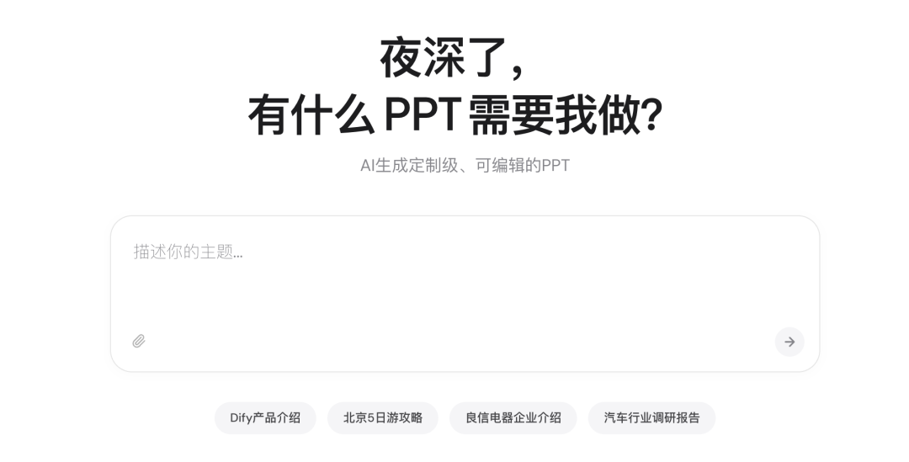

它最特别的地方在于流程的自动化。我只需要输入一个主题，比如“Harness Engineering(驾驭工程)”，它就会自动跑完下面这一整套流程：

> 需求调研 → 资料搜集 → 大纲策划 → 生成策划稿 → 生成设计稿

首先，输入主题后，它会基于这个主题搜索资料，以及做背景调研，过程中会和你确认相关的问题，以及它所需的信息，确保方向不跑偏。

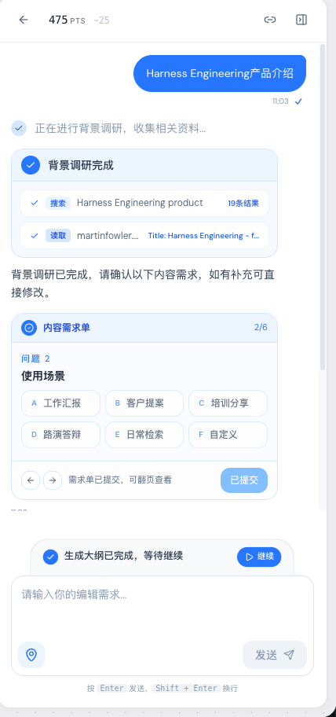

然后，它会基于确认的信息，以及联网搜索的能力，列出大纲，确认后没有问题再生成PPT。

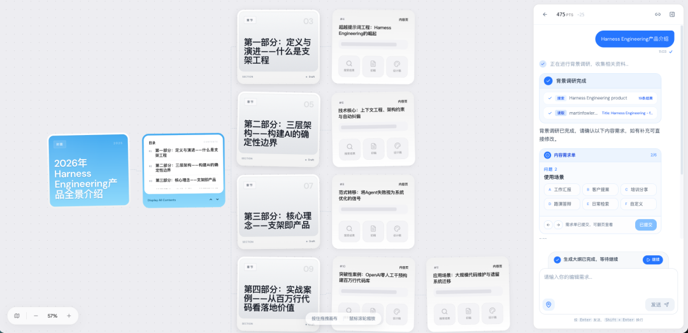

过程中大量检索了相关的资料，至少从来源看，它的输入是相对合理且有一定依据的。

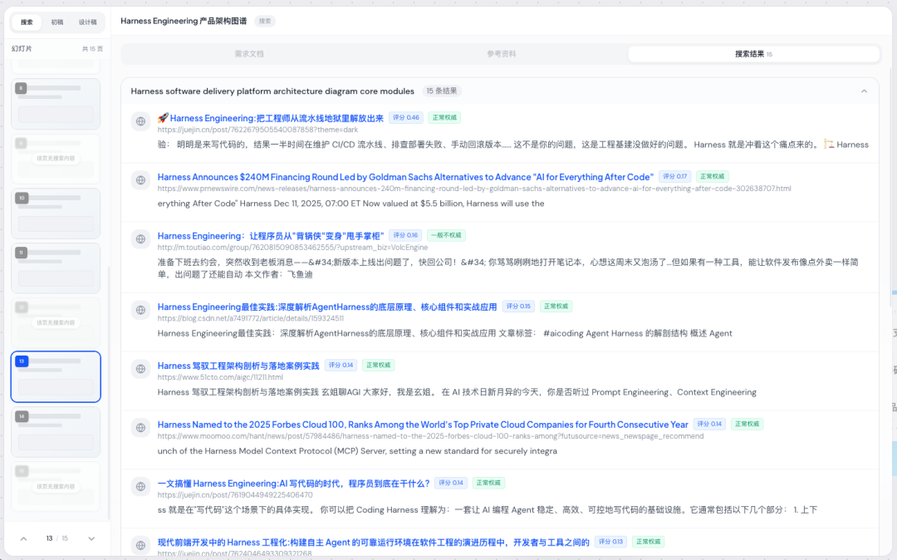

平台内置了预置的模板，当然也可以切换其他风格。

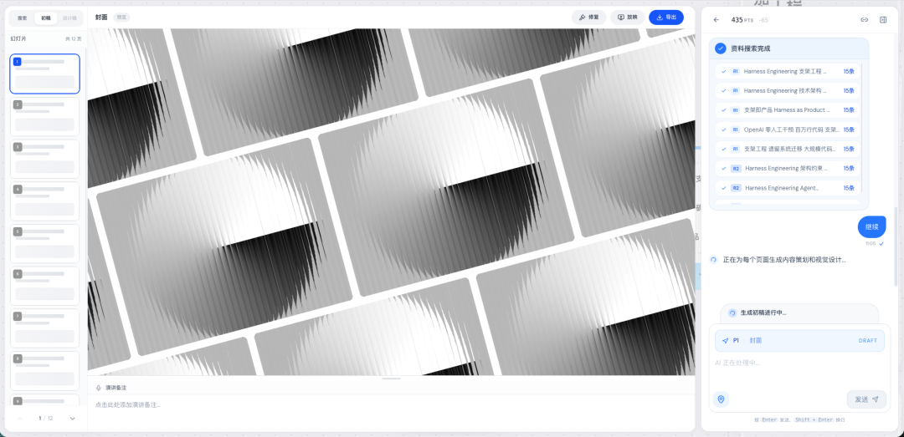

生成之后下载到本地，整体的效果我觉得还是很不错的，如果不是有特定的格式要求，这种效果的PPT在培训，交流，对外宣讲的场景下完全是可以满足的，且仅仅告诉了它主题，无任何其他补充的信息，自己跑完从**需求调研 → 资料搜集 → 大纲策划 → 生成策划稿 → 生成设计稿**的全流程。

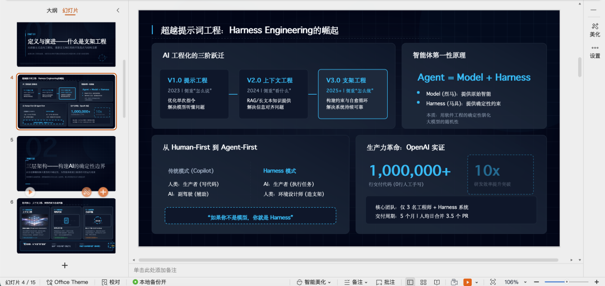

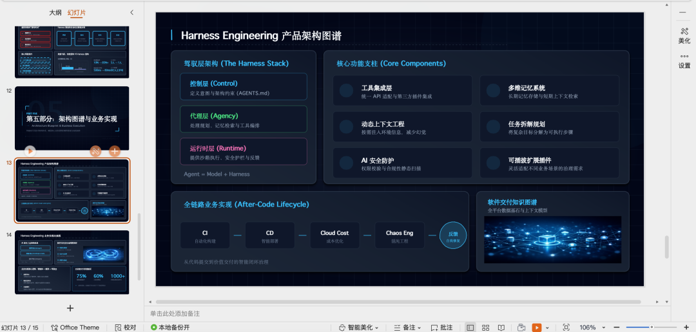

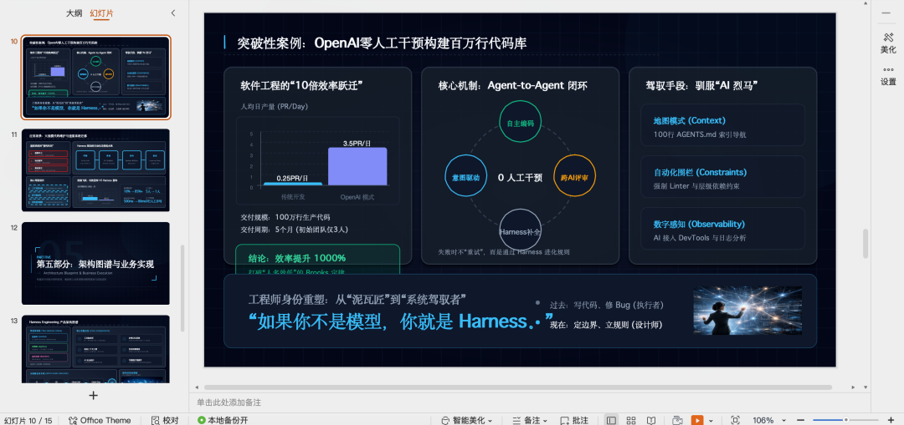

官网上目前也放了其他的案例：比如dify等其他的场景，感兴趣的可以去看看。

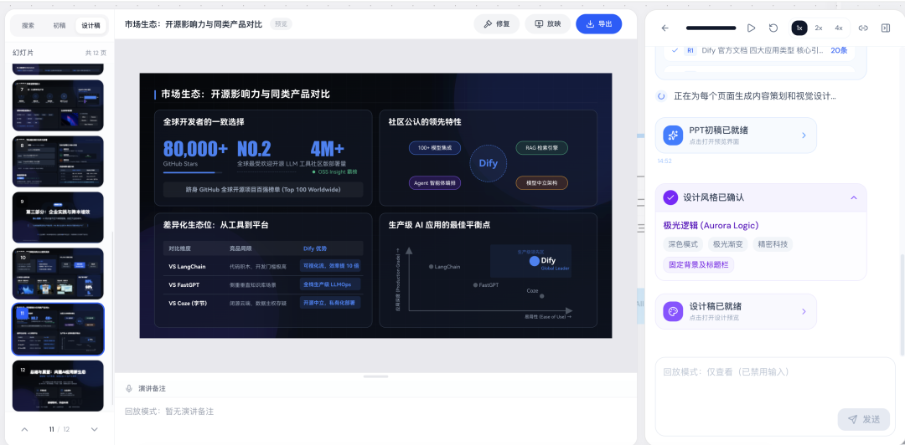

从他们官方的公众号来看，目前不管是什么样的主题，应该都内置了一个固定的提示词框架，不同主题生成的效果基本一致。

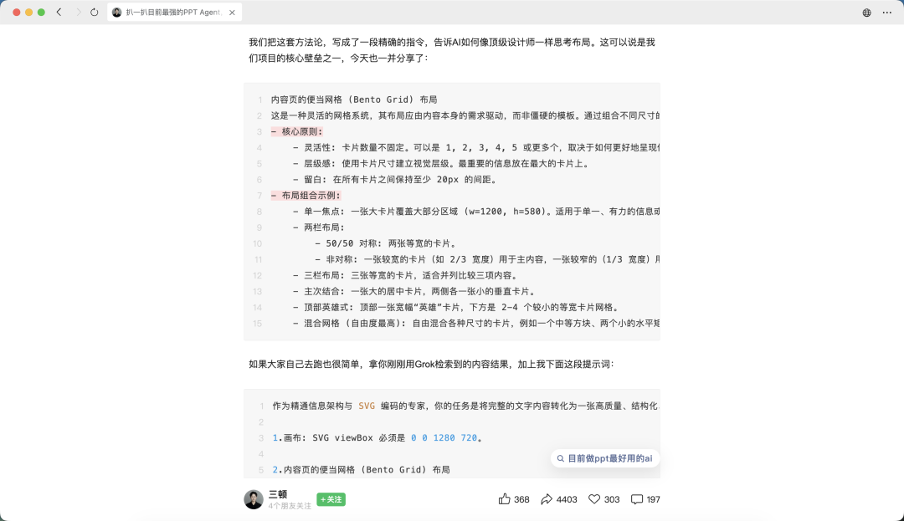

受到它提到的生成整页 SVG 方案的启发，由于我们日常在写产品规划PPT的时候，往往有固定的格式，比如下方的图，上方是标题，下方是架构图，右边是架构图描述，这种是常见的给客户或立项汇报的PPT，出于敏感内容，屏蔽了。

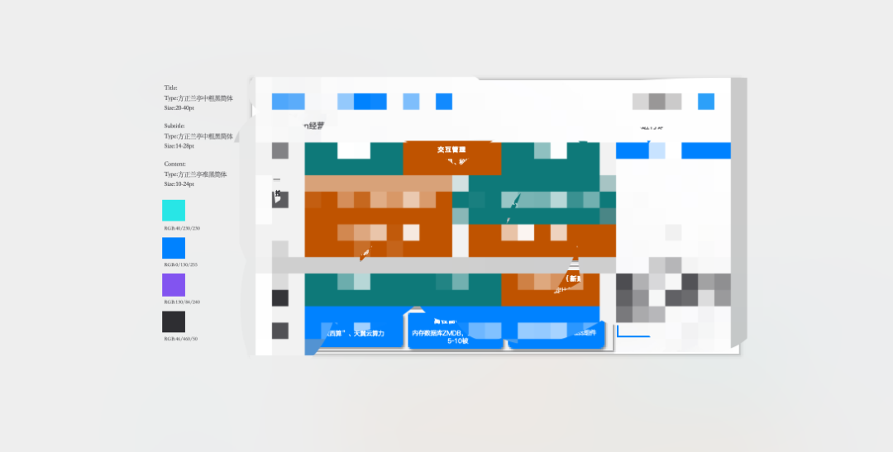

此时，可以把这一页PPT发送给大模型，支持多模态的模型，让它详细描述出图片的布局、色块、文字位置关系，然后再把下方的这一个提示词复制给到AI，内容放在最后：

```
作为精通信息架构与 SVG 编码的专家，你的任务是将完整的文字内容转化为一张高质量、结构化、具备高级感、简洁感和专业感的 SVG 演示文稿页面。要求如下：
```

然后发送给到ds，生成后点击运行，这种方法生成出的效果比直接让大模型输出ppt的效果要好很多。

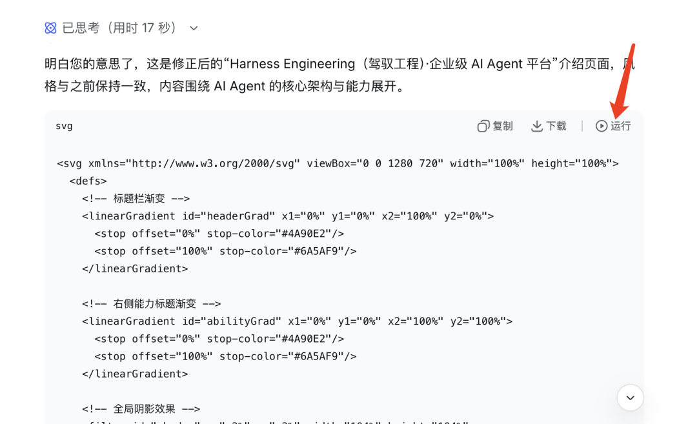

能够看到一个和此前风格比较相似的PPT就出来了，后续再用AI PPT或对照着来调整内容即可，这样效果比原本自己构思要快得多。

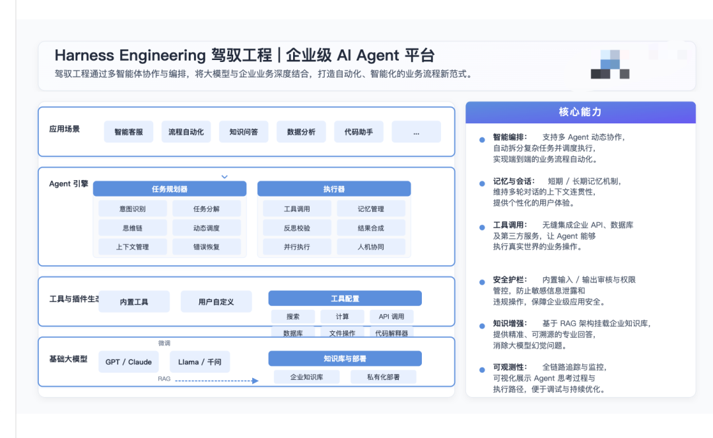

这个方法的优势在于：它解决了PPT里最让人头疼的排版构图时间。以前可能花半小时去找文本框和图形，现在只需要几十秒生成代码，后续只需要对照着SVG图，在PPT里微调文字或替换图标即可，效率提升非常明显。

为什么用SVG的效果比直接让它生成PPT的效果要好很多，大模型给出了答案：

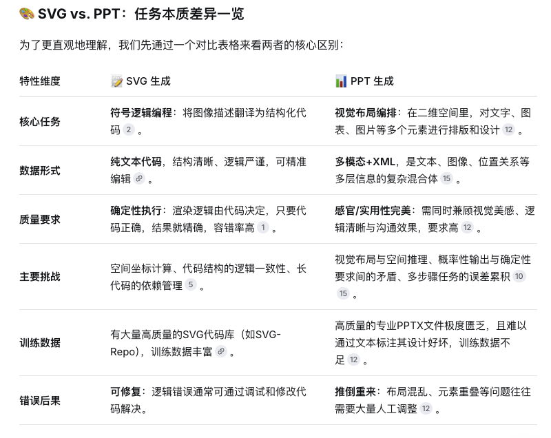

如果你也在被PPT折磨，不妨试试这个方法，希望能帮你省下一些宝贵的时间。
