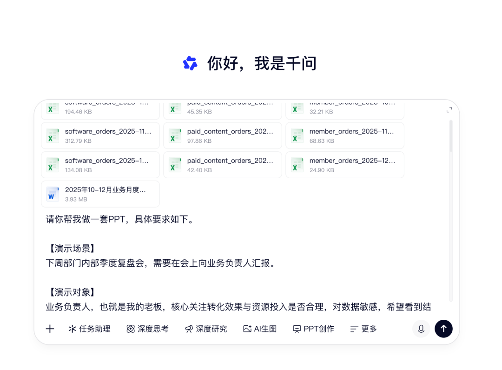
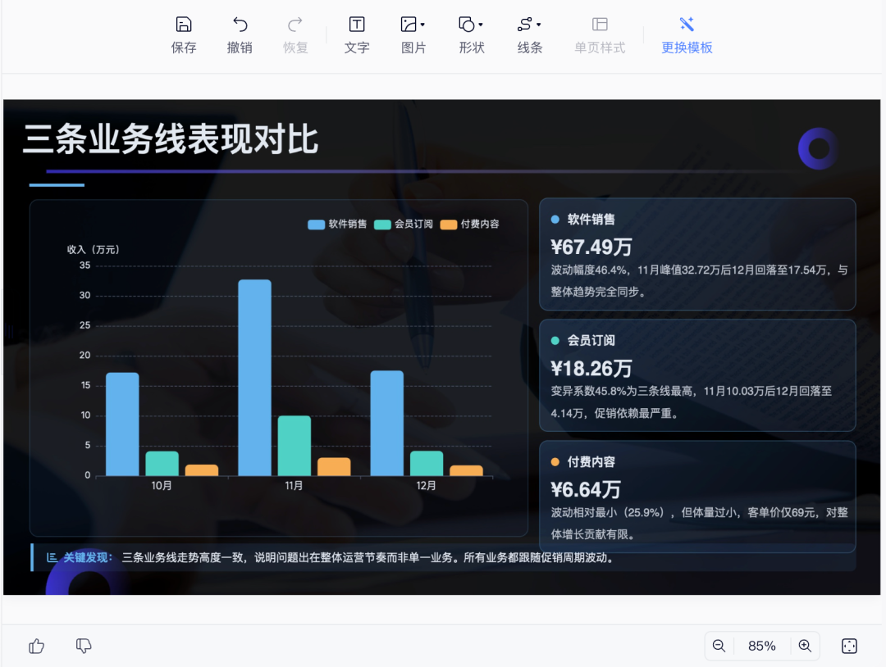
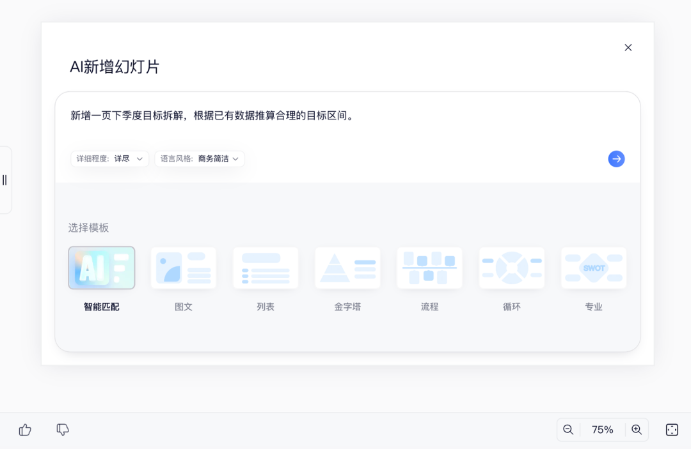
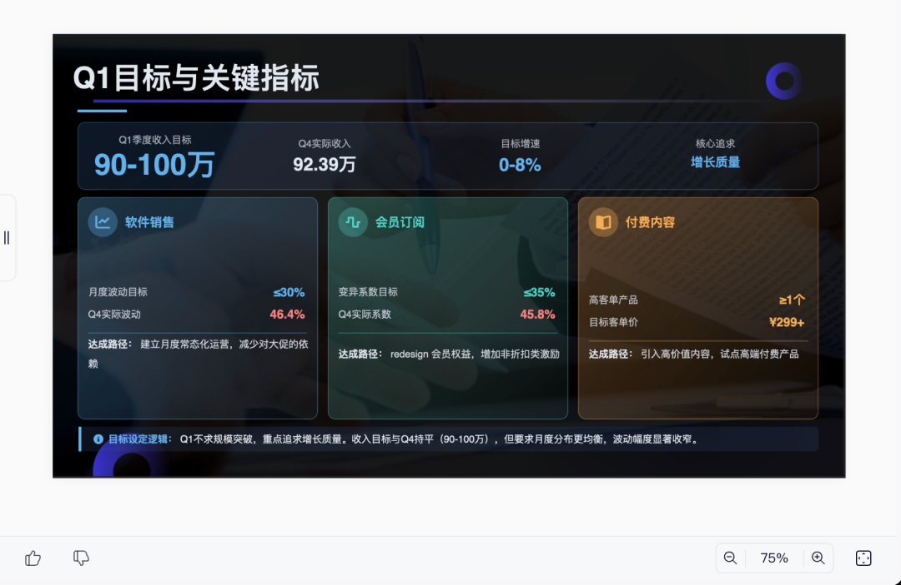
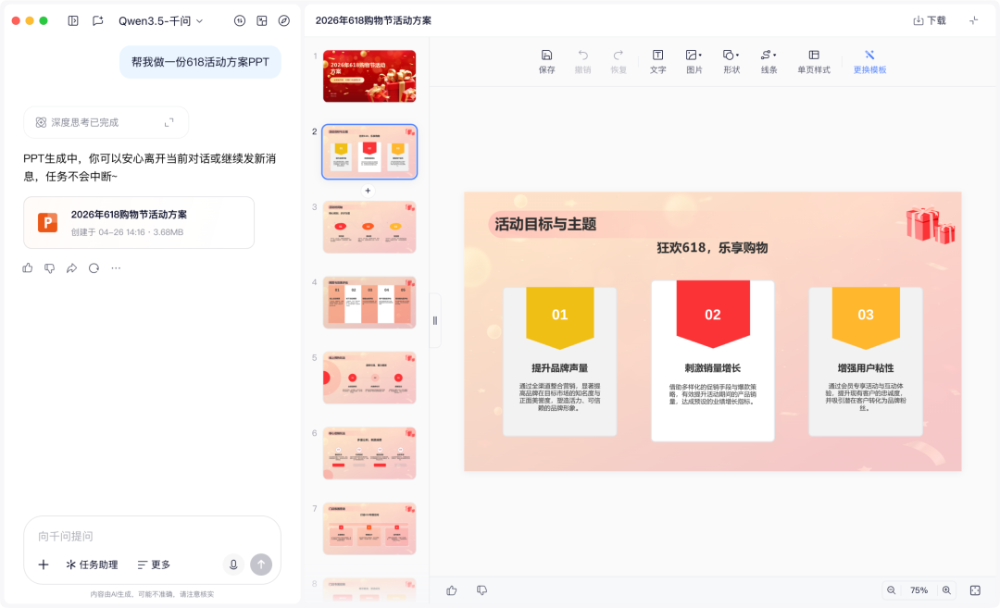
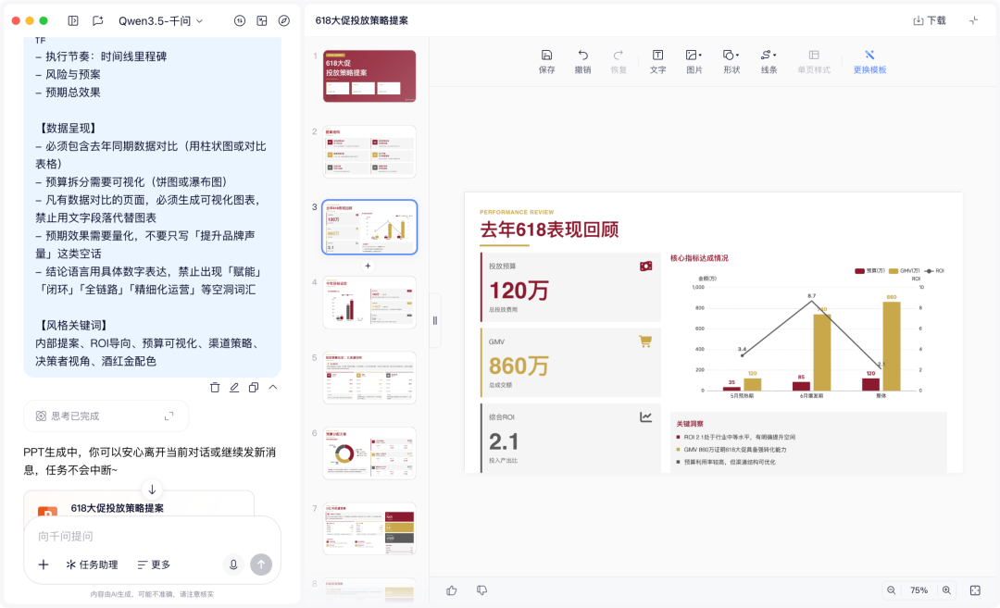
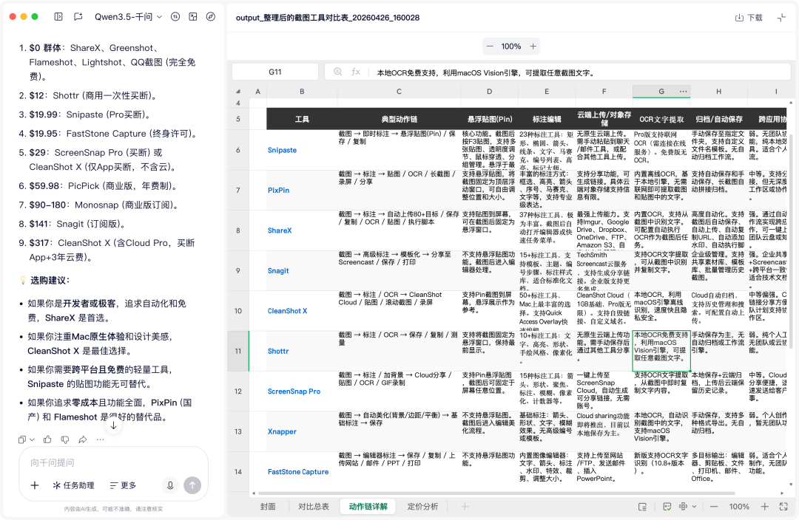
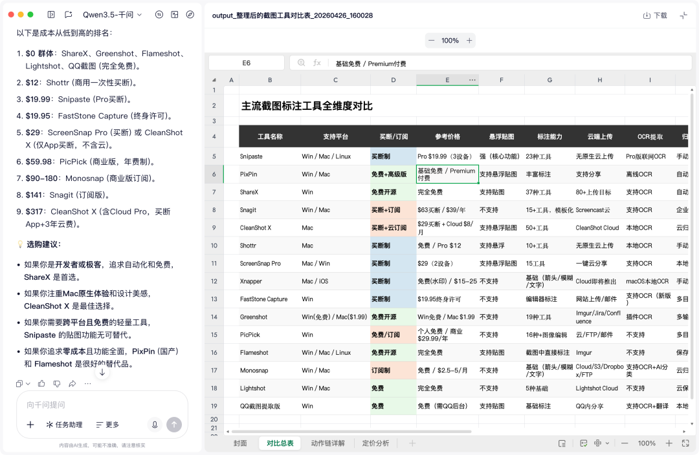

> 📎 来源: [少数派](https://mp.weixin.qq.com/s?__biz=MzU4Mjg3MDAyMQ==&mid=2247613215&idx=1&sn=5e8677d907c0b975f4229b0b452f692b&chksm=fc30c11cefa6fb69f1ea9d4ac561d5498acdd6a3104b850aae291bcadea4160452f30e088868&mpshare=1&scene=1&srcid=04282EtMP5ISPf6bHdQs05SV&sharer_shareinfo=cd9b537b00bfa7d65be6b0c4a3655f87&sharer_shareinfo_first=cd9b537b00bfa7d65be6b0c4a3655f87) | 时间: 2026-04-28 19:44

---

做 PPT 这件事，我一直有种说不上来的抵触感。倒不是不知道该讲什么——方案想好了，结论也有了，数据在表格里，会议纪要里也有，甚至脑子里大概能想象出每页放什么——但就是迟迟不想开始。

原因很简单：接下来要做的，是把已经想好的东西，从四五个地方分别找出来，再逐页「翻译」成幻灯片。找数据、找结论、对齐文本框、调配色……这一套流程和思考本身半点关系没有，但它能轻松吃掉你半天，有时候更多。

有句话说得直接：「宁愿多想十个创意，也不想做一个 PPT。」不是懒，做 PPT 的过程本身是一种消耗，而这种消耗和你真正想做的事情毫无关系。

昨天，千问 APP 联合 11 位嘉宾做了一场持续八小时的生产力直播，集中展示 AI 做 PPT 和 Excel 建表的能力。我当时盯着直播里陆续出现的成品，想到一个问题：同样是「动动嘴生成」，为什么有人生成的东西能直接用，有人的结果只是把文字重新排了一遍？

答案或许就在提示词里——同样的工具，有人用一句话，有人用五句话，结果差了一个 PPT 的距离。带着这个问题，我自己试了一遍。

▍第一个测试：一份季度复盘，看千问怎么「读」

做运营的人应该熟悉这个感受：季度结束，数据散在好几个表格里，结论记在各种地方，活动总结、问题反思可能还分布在周报和复盘文档的不同位置。所有素材都有，但要把这些东西整理成一份能说服业务负责人的汇报 PPT，往往比实际分析本身还费时间。

直播里有一幕让我印象很深。科研博主 THANK 的方向是电力系统与机器学习交叉研究，他面临的是读博过程中最高频的「脏活累活」之一：文献汇报。做一次组会汇报，要先读完几篇文献，自己判断哪篇是核心文献，再提炼争议点，最后把这些整理成 PPT。每个环节都要自己做，整个流程下来一两天没了。

他尝试了一件事：一次性上传十几篇学术文献，但提示词里写得很清楚——以研一工科生身份，要准备一次多篇文献联合汇报，汇报目标是要「讲清楚这组文献在该问题上的研究脉络、核心争议、方法差异、主要结论」，还附上了一份格式要求文件。

这让我好奇：如果把一堆运营文档扔进去，它会不会做同样的事？

我把一份脱敏处理后的运营季度文档上传给千问，里面包含数据表格、活动记录和散记式的结论，还从数据库里拖出几份 csv 文档一并上传。同时，我参照「五要素框架」写了一段完整的提示词，把演示场景、演示对象、演示人身份、演示目标（结论+归因+优化方向）和演示形式（工作汇报模板，15 页，专业克制）都交代清楚了。

上传那么多的原始数据，无非是想看看千问能否在如此多复杂数据中自行挑选和总结出「汇报所必要的部分」，并将其重新组织在 PPT 大纲中，并结合文档推出进一步的延伸结论。

结果和直播里 THANK 描述的感觉很像——千问没有「什么都塞进去」，而是做了选择。

原始文档里的「本次活动问题」通常是一段夹杂着情绪和背景的流水账。千问生成的对应页面变成了「归因分析+改进建议」的双栏卡片——左边是问题，右边是对应的下一步动作。这不是格式转换——我感受到千问在这里做了一个判断：业务负责人想看的是结论和动作，不是过程和情绪。

数据趋势页自动用了折线图，对比类的数据用了柱状图，和我在提示词里的要求对上了。我又学着直播中的主持人，追加了一个修改需求：「新增一页下季度目标拆解，根据已有数据推算合理的目标区间。

新增的页面和原有风格没有违和感，配色字体都延续了下来。目标拆解页里，千问基于文档中的历史数据给出了一个目标区间，并注重减少月度波动、减少变异系数、打造高客单付费内容产品这些数据方向，而不是一味追求数值上的绝对增长。这些没有凭空生造，也没有把这一页做成空洞的口号。

这时候我想起直播里一位高校传媒专业教授分享的经历。他把自己积累多年、已经有些老旧的课件扔给千问，只说「图文并茂、简约大气、符合传媒生审美地美化一下」，结果几乎可以直接拿上课用。更有意思的是，他还会让千问把 PPT 反向转成讲稿——时隔一学期再上同一门课，千问读出来的语气和他本人的表达习惯高度吻合。

这个细节让我觉得典型：你对千问说得越具体，它给你的东西就越像是你自己做的。直播里有一句话说到了点子上：「越专业，你的指令才会越清晰——这跟人和人之间的沟通是一样的，你不说，对方根本不知道你想干嘛。」放在我这次复盘 PPT 的测试上，同样成立。

▍第二个测试：同一个需求，两种提示词，差距有多大

这是我最好奇的一部分。同样的主题，提示词的详细程度，直接决定了千问给你的是一份「通用答案」，还是真正属于你这个场景的结果。

直播里奥古斯特八爷是一位广告创意行业的从业者，带来的场景都很反常规。第一个：让千问做一份「证明 PPT 没用」的 PPT——内容逻辑要说形式没用，但形式要尽量精美夸张；第二个：帮一个「非常讨厌做自我介绍的人」做自我介绍 PPT——视觉要呈现出敷衍、不情愿，但信息必须全部记住。

这两个案例能出效果，根本原因是需求够具体：情绪态度、形式约束和内容要求，全都说清楚了。她有一句话让我很有共鸣：「AI 在抢着做一个什么都会的全能人才，把我们逼成只能做天才。我反而觉得挺好的。」——表达形式部分可以完全交出去，人没有理由不把精力投回到想说什么上面。

这让我想做一个反向验证：八爷给的需求足够具体。那如果故意把信息抹掉，结果会差多少？实验设计很简单。用同一个主题（618 活动方案 PPT），分别给两版提示词，对比成品。

简单版：「帮我做一份 618 活动方案 PPT。」

五要素完整版：我在其中交代了演示场景、演示对象、演示人身份（品牌运营，争取预算）、演示主题（618 投放策略，含数据对比和预算拆分）、演示形式（12 页，工作汇报风格，数据页必须有图表）。

两版成品放在一起，差距一目了然。简单版给出的是一份结构合理的「标准活动方案 PPT」——该有的页面都有，但读不出汇报对象是谁、提案目的是什么。五要素版明显不一样：封面措辞偏向「提案」，数据页自动出现了同期对比柱状图，预算分配单独用了环形图，语气也调整成了「向决策者争取支持」的节奏。

把五要素版的提示词拆开来看：

|  |  |
| --- | --- |
| 提示词片段 | 对应维度 |
| 「下周部门内部提案会」 | 演示场景 |
| 「市场总监，最关心 ROI 和渠道分配」 | 演示对象 + 核心关切 |
| 「我是品牌运营，以执行者身份争取预算」 | 演示人身份 |
| 「618 大促投放策略，含数据对比和预期效果」 | 演示主题 |
| 「12 页，工作汇报风格，数据页有图表」 | 演示形式 |

这五个维度没有高下之分，但每多写一个，千问能做出精准判断的空间就多一分。直播里有一句话说到了点子上：「很多用户生成质量不好，是因为背景信息只存在于人脑中，大模型并不知道。」这不是 AI 的问题，是我们在职场中你来我往、已经默认对方能读懂自己处境的习惯。

如果说五要素是「够用的门槛」，那直播里 AI 博主卡尔的 AI 沃茨做的事，是把提示词推向另一个极端。他设计了一套从简单到极限的压力测试 Prompt，对千问 PPT 做系统性评估。最有意思的一次是把一套完整的「前端设计规范文档」级别的超长提示词给了千问——细化到每页字体型号、色号，以及纯文字页、数据页、卡片展示页等不同布局场景各自的规范。他说，这个提示词本质上是在给 AI「立规矩」，让生成结果可控可复用：「最核心的事情，就是把自己的理念说明白。」

值得说明的是，这五个维度不是必须全部写完。写了三个，千问能做出精准判断的维度就是三个；写了五个六个七个，它服务的就是你这个更具体的场景。提示词的本质，是帮千问还原你所在的处境。你描述得越清楚，它给出的结果就越贴合你。

▍第三个测试：一句话，让千问把调研整理成表

PPT 之外，我还想试试另一类让人头疼的工作——调研整理。

选型调研这种需求，做运营的人应该熟悉：小红书、知乎各平台上的推荐文章收藏了一堆，群里也有人提过，但真要落成一份可以直接用的对比表，要花的时间远超预期。工具名倒好记，但参考维度要自己定，具体功能要逐个查，最后要手动整理成表格去对比。

测试之前，我想起直播 Excel 场次里的几个场景。

内容博主 Mango 也是一名英语老师，刚搬到杭州，自由职业之后反而觉得生活热情减退了。她给千问出了个题：列出 100 个这座城市值得深入探索的地方，偏文艺、非商业化，最后以 Excel 呈现，要有打卡列。千问按文艺/书店/人文分类，附上推荐理由，还隔行配色。她说：「以前信息都收藏在手机里，又乱又找不到，有了这个表格，感觉想出门的欲望都回来了。」表格做对了，是能改变一个人行动意愿的。

退役程序员出身、现在做金融的森森，给千问出的题更能体现 Excel Agent 的结构理解力。他让千问参考金融领域的公司估值框架，设计一个评估模型：「这份工作值不值得去上？」——没给模板，让千问自己定义维度（财务回报、学习成长、情绪价值）和权重，最后输出一个带公式、带颜色分级的 Excel。他的评价是：「搭这个模型的逻辑我懂，但要把它落进 Excel 里，超出了许多人的 Excel 技能范围。」这说明千问理解的不只是「你要什么」，还包括「怎么把结构建出来」——这正是我后面那个调研 Excel 测试里最关键的一环。

这几个场景的共同点，是他们都把维度想清楚了才开口——维度越具体，表格越能直接用。

带着这个思路，我给千问发了一句话，没有附任何文件：

帮我整理一份主流截图标注工具的对比 Excel 表，维度包括截图后的动作链（直接贴图/标注/上传云端对象存储/OCR/归档/悬浮展示）、跨应用协作能力、批注层级深度、GIF 与视频录制支持，以及一次性买断还是订阅制、支持平台等。

千问没有立刻开始填表。它先做的是维度理解——「截图后的动作链」其实各家工具没有统一标准，但是它基于我的举例定了一套描述框架：推断出了工具背后可以实现的「典型动作链」，基于每个功能做细分描述，再按这个框架去搜索和评估每款工具。

这个顺序很关键。「先建结构，再填内容」和「边搜边堆」，最终出来的结果完全不是一回事。

最终生成的表格里，有几个细节让我觉得超出预期：每款工具不只写了「订阅制」，还补了具体的价格区间，算了一笔两年三年下来大概的成本；还主动标注了「Windows 免费、macOS 版收费」的差异，这些都是我没有要求的。

当然，表格并不完美，部分工具的信息轻微滞后，需要自己二次确认。但作为选型的起点，够用了。

一次是文件驱动生成 PPT，一次是无附件对比测试，一次是无附件驱动生成 Excel，千问完成需求的方式截然不同——但有一件事是共通的：在「帮你填模板」和「替你做决策」之间，千问选择了后者。

什么内容应该放在哪页、数据该用柱状图还是卡片格式、「批注层级深度」这种模糊维度该怎么量化——这些判断，过去要么靠经验，要么靠时间堆出来。千问把这些决策吸收了进去，你只需要告诉它：在什么场景、面对什么人、想讲什么、想达成什么效果。

这也是直播里那些不同领域嘉宾能各自「用顺」的原因——无论是那位用金融估值逻辑来评估工作值不值得上的金融博主，还是用文献综述替自己省下两天整理时间的科研博主，还是做出了「用 PPT 证明 PPT 没用」这种创意提案的广告人，同一个工具在不同人手里呈现出的样子是不同的，因为他们把自己的处境说清楚了。

▍AI 生产力，正在成为 AI 时代真正的竞争力

如果把视角拉远一些，这件事背后有一条更值得关注的逻辑。AI 大模型发展到今天，能生成文字、能聊天、能写代码，已经不是什么门槛。真正的分水岭，开始落在一个更具体的问题上：能不能在真实工作场景里替人把事做成？

PPT 能不能用？Excel 下载下来能直接填数据？文献综述能不能拿去开组会？——这些才是验证一个 AI 工具「真的能办事」的检验区。

从今年 4 月起，千问连续在生产力场景密集发力：先是上线表格 Agent，被官方表述为「国内首个支持全场景能力」的表格 Agent；紧接着 PPT Agent 完成全新智能体架构升级，从内容构思、素材检索到视觉排版全流程都有增强。叠加此前已经成熟的 AI 写作和文档处理能力，「文档—PPT—表格」三块拼图被装进了同一个对话框。

这个节奏不是偶然的。AI 生产力正在成为 AI 时代的新竞争力，而竞争力的评判标准，已经从「它能说什么」演变成了「它能做成什么」。千问在这一轮的动作——密集迭代、持续补足场景覆盖——是这个方向上的持续押注。对手们还在内容生成层面打转，千问已经把生产力闭环这件事，做成了具体可交付的产品能力。

相较之下，国内多数 AI 产品在表格场景仍停留在「文本表格展示」的阶段，难以直接生成可编辑、带格式、带公式的标准文件。而这恰恰是普通用户离「能用」最远的那一步。

这次的实验让我重新想了一遍自己的工作流。以前习惯了在五六个工具之间跳来跳去，现在发现有越来越多的节点可以在同一个窗口里完成。这不单单是效率的变化，而是「我该怎么分配注意力」这件事的变化——把更多时间花在判断上，少花一些时间在搬运和格式化上。

直播里有一句话我很喜欢：「表格跟行动有关，它是从想法到执行的一个连接器。」换成我的语境就是：AI 工具做的这件事，其实是把「知道要做什么」和「真正开始做」之间的那段摩擦，给消掉了。

提示词是这里面唯一一个「你需要自己练」的部分。工具会迭代，但把自己的处境说清楚这件事，是 AI 替代不了的。这也是这次测完之后，我觉得最值得反复打磨的地方。
