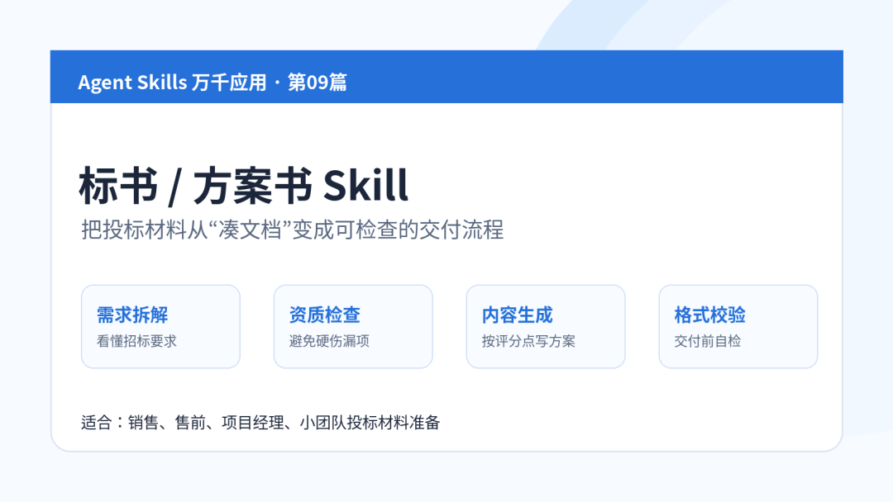
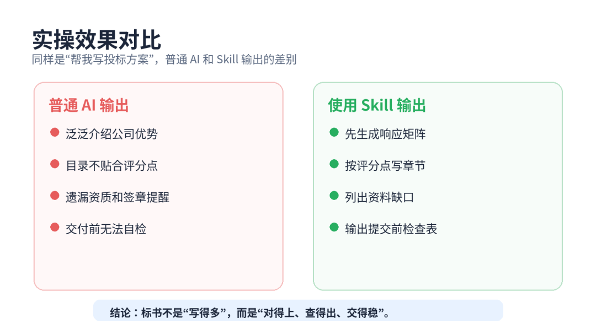
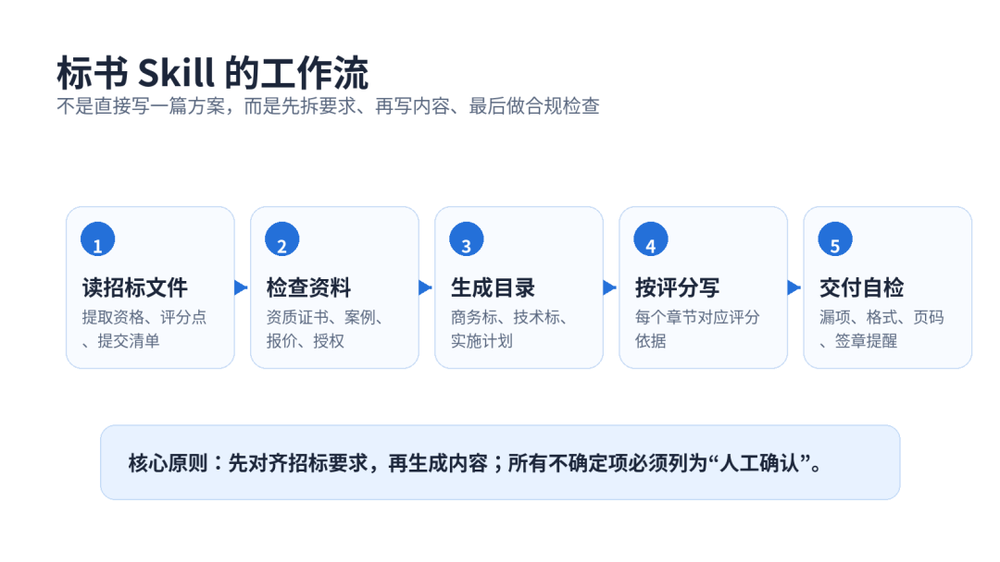
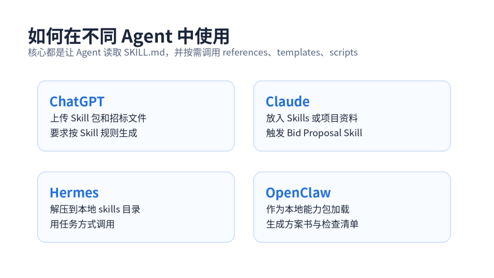

> 📎 来源: [厚国兄](https://mp.weixin.qq.com/s?__biz=Mzk1NzM1MTI1Ng==&mid=2247490396&idx=1&sn=a33478ed7e9c0da8adb7a131c306fe4c&chksm=c21f68fb795ab45592a3d8a9b5a5ba603d1fdf279dc52b01299e78db05750ecf22f84e8b3667&mpshare=1&scene=1&srcid=0527e4V60UlfhUzQA6B8vrxp&sharer_shareinfo=6ca1fe5a80565fbd35f0a82de2e3651c&sharer_shareinfo_first=6ca1fe5a80565fbd35f0a82de2e3651c) | 时间: 2026-05-27 20:12

---

Agent Skills 万千应用 · 第09篇

标书/方案书 Skill：帮小团队快速写投标材料

▌ 01｜场景痛点：小团队最怕“临时要投标”

很多小团队不是没有能力接项目，而是卡在投标材料上。

客户突然发来一份招标文件，截止时间只剩三天。销售说“先做一版方案”，技术说“需求还没看完”，老板又催“这个项目必须争取”。

最后大家开始临时拼材料：公司简介复制一段，产品介绍复制一段，案例截图塞几张，实施计划随便排一排。看起来页数不少，但真正的问题是：资格条件有没有漏？评分点有没有响应？报价、交付、售后有没有前后一致？

标书/方案书 Skill 要解决的，就是把“临时凑文档”变成一套可检查、可复用的交付流程。

▌ 02｜Skill 实操效果：两个真实场景对比

📌 案例一：智慧园区系统投标

普通 AI 的输出通常是：“本方案围绕智慧园区建设，提供平台能力、数据能力、运维能力……”文字很顺，但没有对照招标评分表。

使用 Skill 后，会先输出《响应矩阵》：

|  |  |  |  |
| --- | --- | --- | --- |
| 招标要求 | 响应章节 | 当前状态 | 风险 |
| 需提供 3 个同类案例 | 资质与案例 | 缺 1 个案例证明 | 需人工补充 |
| 需说明实施周期 | 项目实施计划 | 已覆盖 | 无 |
| 需 7x24 售后 | 服务保障 | 已覆盖 | 需确认热线 |

 

接着再生成技术方案、项目计划、服务承诺和资料缺口清单。这样团队知道哪里能直接交，哪里必须补。

📌 案例二：设备采购方案书

普通 AI 容易写成“产品优势介绍”，但采购类方案真正关注的是型号、参数、交期、质保、付款和验收。

使用 Skill 后，输出会变成：

1. 参数响应表：逐项对照客户需求；

2. 商务偏离表：列出交期、付款、质保是否偏离；

3. 风险提示：某型号认证文件缺失；

4. 提交清单：营业执照、授权书、报价表、案例证明。

这不是一篇“好看的文案”，而是一份更接近真实投标工作的材料包。

▌ 03｜Skill 简介：它是什么，解决什么问题？

标书/方案书 Skill，是一个面向投标材料、客户方案、售前文档的 Agent 能力包。

它不只是帮你写文字，而是帮助 Agent 完成三件事：看懂招标要求、组织方案结构、交付前做漏项检查。

本篇没有直接使用网上某个现成通用 Skill，而是生成了一份适合中文办公场景的增强版：bid-proposal-skill-zh-v1.zip。

它包含这些文件：

bid-proposal-skill-zh-v1/          
├── SKILL.md          
├── references/          
│   ├── bid\_review\_checklist.md          
│   ├── scoring\_response\_matrix.md          
│   └── proposal\_outline\_template.md          
├── scripts/          
│   └── checklist\_generator.py          
└── assets/          
    └── proposal\_brief\_template.md          

适合场景：招投标材料初稿、客户方案书、售前技术方案、商务响应材料、项目实施方案。

▌ 04｜核心机制：先响应，再写作，最后检查

这个 Skill 的核心，不是“让 AI 多写点”，而是让 Agent 按顺序做事。

第一步：提取招标要求。包括资格条件、技术参数、商务条款、评分点、提交材料。

第二步：生成响应矩阵。每一项要求都要对应到方案章节，不能只靠大段文字覆盖。

第三步：按模板写内容。商务部分、技术部分、实施计划、售后服务、案例证明分别生成。

第四步：输出人工确认项。凡是证书、报价、签章、授权、案例真实性，都必须提醒人工确认。

这就是渐进式加载逻辑：日常只让 Agent 看到 SKILL.md；遇到评分点，就加载 scoring\_response\_matrix；遇到交付检查，就加载 bid\_review\_checklist；需要生成清单时，再调用脚本。

▌ 05｜使用方式：四类 Agent 都能用

使用方式很简单：把 Skill 包和招标文件一起交给 Agent。

在 ChatGPT 中，可以上传 Skill 包、招标文件和公司资料，然后要求：“请按 Bid Proposal Skill 生成响应矩阵和方案书初稿。”

在 Claude 中，可以把它作为项目 Skill 或资料上传，让 Claude 按 SKILL.md 工作流处理。

在 Hermes / OpenClaw 中，可以把 Skill 解压到本地 skills 目录，再用任务方式调用：读取招标文件、生成方案、输出检查清单。

建议的输入材料包括：招标文件、公司介绍、产品资料、成功案例、资质证书、报价表、售后承诺。

▌ 06｜避坑指南：标书不能只靠 AI 直接写

⚠️ 坑一：只写方案，不做响应矩阵。没有矩阵，就很难确认每个评分点是否覆盖。

⚠️ 坑二：把不确定资料写死。资质证书、授权书、案例合同、报价金额，必须人工确认。

⚠️ 坑三：技术方案写得很满，但商务条款漏了。很多投标失败不是技术不行，而是盖章、格式、附件、偏离表出了问题。

⚠️ 坑四：所有项目都套同一个模板。Skill 应该保留结构，但内容必须贴合客户行业和招标要求。

⚠️ 坑五：忽略最后自检。提交前一定要检查文件名、页码、目录、签章、报价一致性和附件完整性。

▌ 07｜下期预告

下一篇继续讲一个更贴近企业文档资产的 Skill：

企业品牌规范 Skill：让所有文档统一成公司风格。

很多公司不是没有模板，而是每个人写出来都不一样。下一篇我们拆：怎么让 Agent 自动统一字体、颜色、Logo、术语、语气和交付格式。

▌ 配套资源

本篇配套 Skill 包：

bid-proposal-skill-zh-v1.zip。

链接：https://pan.quark.cn/s/c0fb8d0aa0af
