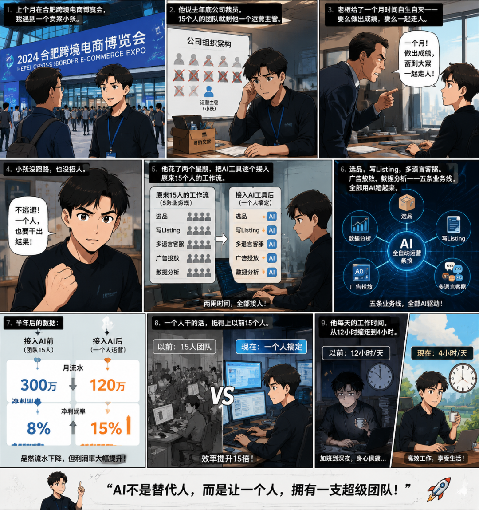
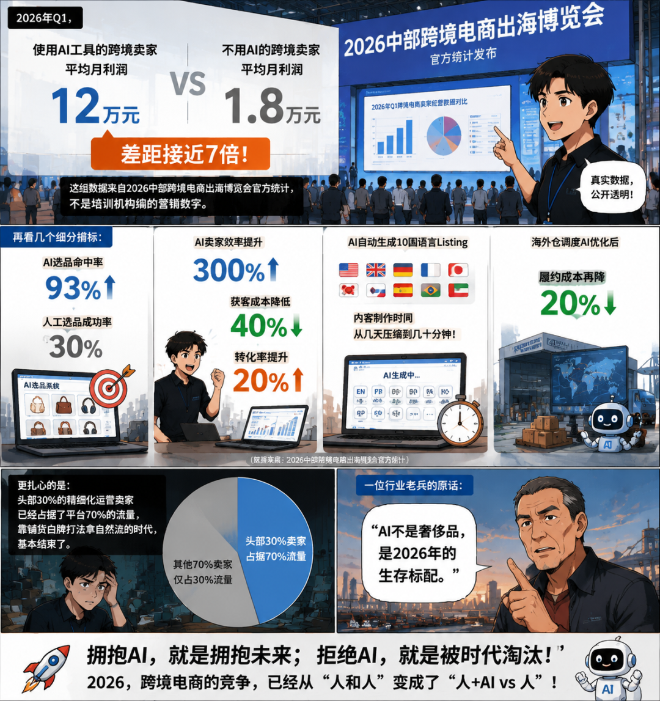
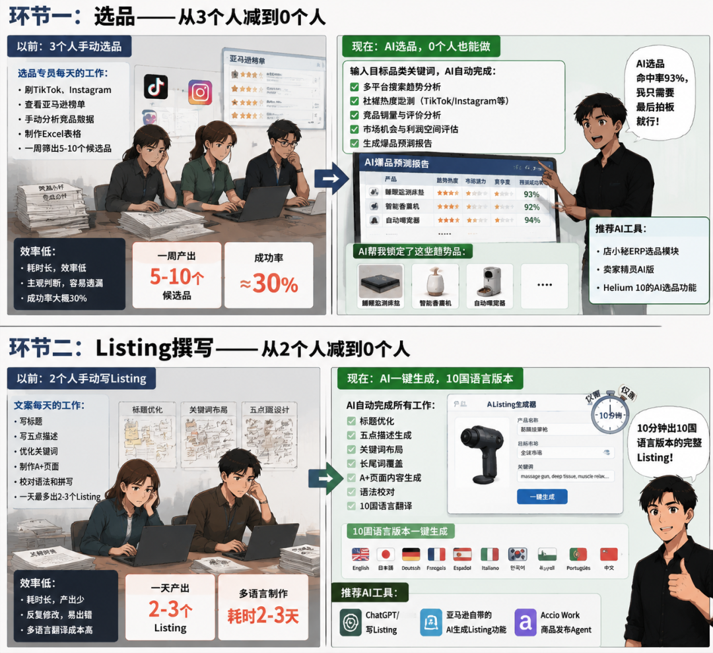
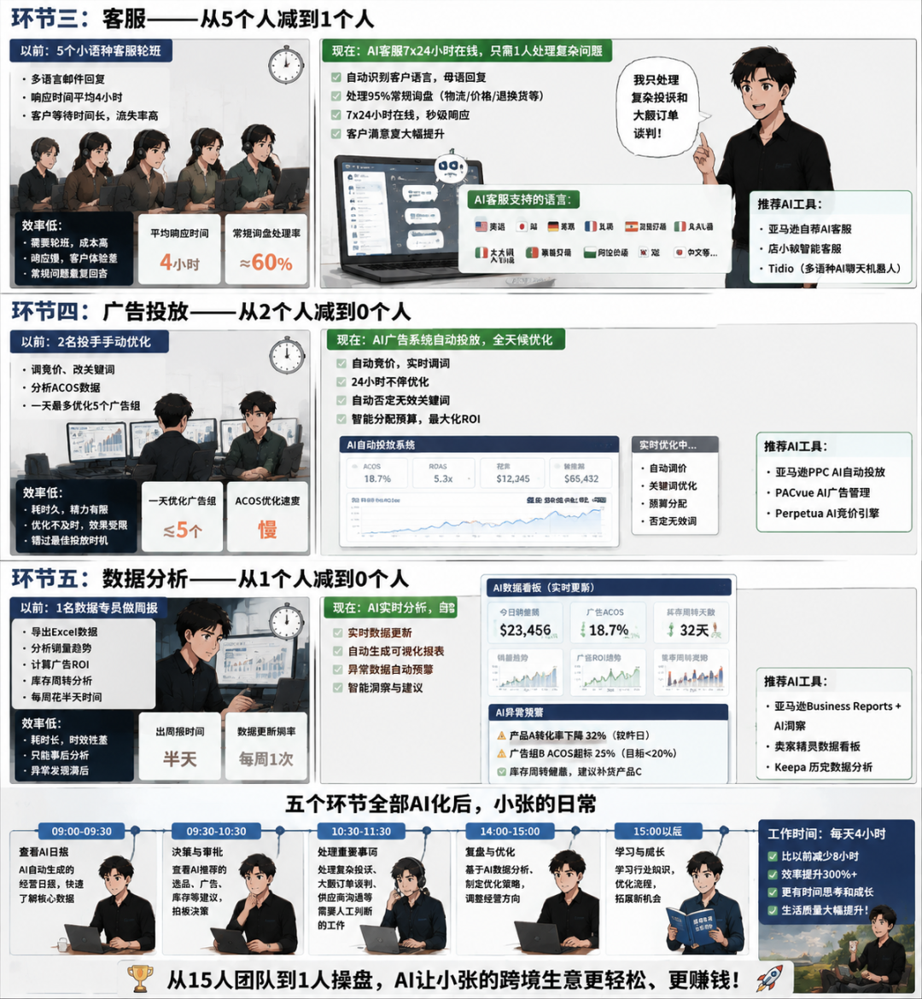
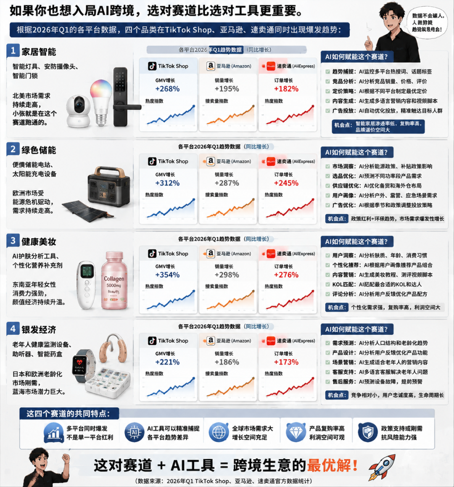
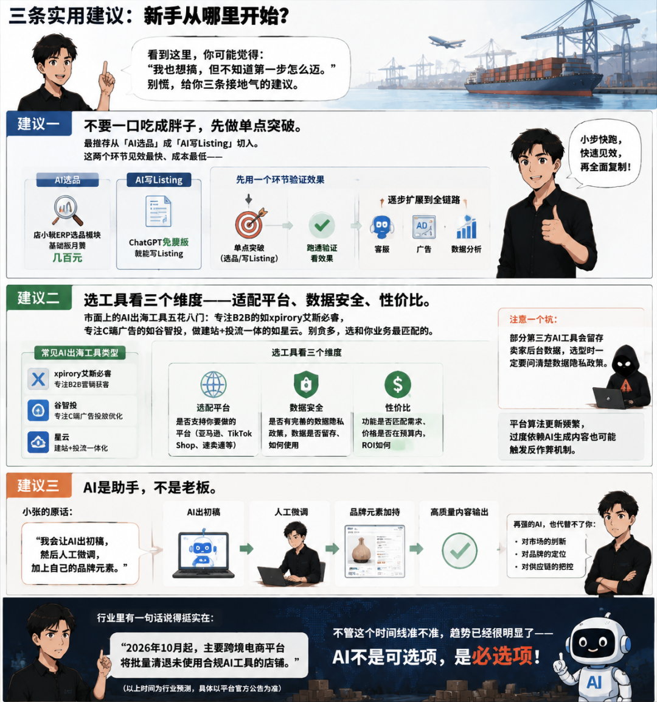

> 📎 来源: [数字生命-迪利姆](https://mp.weixin.qq.com/s?__biz=MzY5NTI2Mjc1NQ==&mid=2247484788&idx=1&sn=6e14b79e2dd14cff9d65e0db133f7020&chksm=f5f1cfe889029604220966869899cf9c1475987ce74428fec0122c7aa34aa4509310292642a6&mpshare=1&scene=1&srcid=0527S9jOIeyrFMXgctFYgCOb&sharer_shareinfo=c708389893014e9c8b059d8a24d5bebd&sharer_shareinfo_first=c708389893014e9c8b059d8a24d5bebd) | 时间: 2026-05-27 12:27

---

## 裁员那天，他成了"最后一个人"

上个月在合肥跨境电商博览会，我遇到一个卖家小张。

他说去年底公司裁员，15个人的团队就剩他一个运营主管。

老板给了一个月时间自生自灭——要么做出成绩，要么一起走人。

小张没跑路，也没招人。

他花了两个星期，把AI工具逐个接入原来15个人的工作流。

选品、写Listing、多语言客服、广告投放、数据分析——五条业务线，全部用AI跑起来。

半年后的数据：

- 月流水从300万降到120万（毕竟少了人），但净利润率从8%涨到15%
- 一个人干的活，抵得上以前15个人
- 他每天的工作时间，从12小时缩短到4小时

这个故事不是鸡汤，是2026年跨境电商圈正在批量发生的现实。（数据来源：合肥跨境电商博览会现场交流，2026年5月）

今天我把他的AI工作流完整拆开，每个环节用的什么工具、怎么配置、效果如何，全部给你列出来。

## 7倍利润差：AI卖家和非AI卖家的真实差距

先看一组数据，不吹不黑，都有出处。

2026年Q1，**使用AI工具的跨境卖家平均月利润12万元，不用AI的卖家仅1.8万元，差距接近7倍。**

这组数据来自2026中部跨境电商出海博览会官方统计，不是培训机构编的营销数字。

再看几个细分指标：

- AI选品命中率93%，人工选品成功率仅30%
- AI卖家效率提升300%，获客成本降低40%，转化率提升20%
- AI自动生成10国语言Listing，内容制作时间从几天压缩到几十分钟
- 海外仓调度AI优化后，履约成本再降20%

（数据来源：2026中部跨境电商出海博览会官方统计）

更扎心的是：头部30%的精细化运营卖家已经占据了平台70%的流量，靠铺货白牌打法拿自然流的时代，基本结束了。

一位行业老兵的原话：**"AI不是奢侈品，是2026年的生存标配。"**

## 小张的AI工作流：5个环节完整拆解

小张主要做亚马逊美国站，品类是家居智能产品。

以前15个人的团队配置是这样的：

选品专员3人 + Listing文案2人 + 多语言客服5人 + 广告投手2人 + 数据分析1人 + 美工2人 = 15人

裁员后，他用AI重构了每一条线。下面逐一拆解。

**环节一：选品——从3个人减到0个人**

以前选品专员每天刷TikTok、Instagram、亚马逊榜单，手动分析竞品，一周筛出5-10个候选品，成功率大概30%。

现在他用AI选品工具，输入目标品类关键词，系统自动抓取多个平台的搜索趋势、社媒热度、竞品销量数据，直接输出爆品预测报告。

AI帮他锁定了"睡眠监测床垫""智能香薰机""自动喂宠器"等趋势品。

**他自己的话："AI选品命中率93%，我只需要最后拍板就行。"**

可选工具：店小秘ERP选品模块、卖家精灵AI版、Helium 10的AI选品功能。

**环节二：Listing撰写——从2个人减到0个人**

以前两名文案天天写标题、五点描述、A+页面，一天最多出2-3个Listing，还要反复校对语法和关键词。

现在AI一键生成，10分钟出10国语言版本的完整Listing。

标题优化、关键词布局、长尾词覆盖，AI全部自动处理。

可选工具：ChatGPT/Claude写Listing、亚马逊自带的AI生成Listing功能、Accio Work的商品发布Agent。

**环节三：客服——从5个人减到1个人**

以前需要5个小语种客服轮班处理邮件，响应时间平均4小时，客户经常等不及就跑了。

现在AI客服7x24小时在线，自动识别客户语言并用母语回复，处理了95%的常规询盘（物流查询、价格咨询、退换货流程）。

小张只处理复杂投诉和大额订单谈判。

可选工具：亚马逊自带的AI客服、店小秘智能客服、Tidio（支持多语种AI聊天机器人）。

**环节四：广告投放——从2个人减到0个人**

以前两名投手每天调竞价、改关键词、分析ACOS数据，一天最多优化5个广告组。

现在AI广告系统自动竞价、自动调词、实时优化，24小时不停。

可选工具：亚马逊PPC的AI自动投放、PACvue的AI广告管理、Perpetua的AI竞价引擎。

**环节五：数据分析——从1个人减到0个人**

以前数据专员每周花半天做Excel周报，分析销量趋势、广告ROI、库存周转。

现在AI实时产出可视化报表，还能自动标注异常数据（某款产品转化率突然下降、某个广告组ACOS超标）。

可选工具：亚马逊自带的Business Reports + AI洞察、卖家精灵数据看板、Keepa的历史数据分析。

五个环节全部AI化后，小张的日常变成了这样：

**早上看一眼AI选品报告，审核通过 → 中午检查AI自动上架的新品 → 下午处理几个复杂客服问题 → 晚上扫一眼数据报表。**

4个小时，搞定以前15个人12个小时的活。

## 四个赛道正在爆发：家居智能、绿色储能、健康美妆、银发经济

如果你也想入局AI跨境，选对赛道比选对工具更重要。

根据2026年Q1的各平台数据，**四个品类在TikTok Shop、亚马逊、速卖通同时出现爆发趋势**：

**1. 家居智能**——智能灯具、安防摄像头、智能门锁，北美市场需求持续走高，小张就是在这个赛道跑通的。

**2. 绿色储能**——便携储能电站、太阳能充电设备，欧洲市场受能源危机驱动，需求持续走高。

**3. 健康美妆**——AI护肤分析工具、个性化营养补充剂，东南亚年轻女性消费力强劲。

**4. 银发经济**——老年人健康监测设备、助听器、智能药盒，日本和欧洲老龄化市场刚需。

这四个赛道的共同特点：**AI工具可以精准捕捉各平台的趋势差异，帮你制定分平台运营策略。**

中小卖家如果能在其中一个细分品类建立AI工作流，月利润突破10万元并不困难。（数据来源：76Ai出海综合分析）

## 三条实用建议：新手从哪里开始？

看到这里，你可能觉得："我也想搞，但不知道第一步怎么迈。"

别慌，给你三条接地气的建议。

**建议一：不要一口吃成胖子，先做单点突破。**

最推荐从「AI选品」或「AI写Listing」切入。这两个环节见效最快、成本最低——ChatGPT免费版就能写Listing，店小秘的基础选品功能月费只要几百块。

先用一个环节验证效果，跑通之后再扩展到客服、广告、数据分析。

**建议二：选工具看三个维度——适配平台、数据安全、性价比。**

市面上的AI出海工具五花八门：专注B2B的如xpirory艾斯必睿，专注C端广告的如谷智投，做建站+投流一体的如星云。别贪多，选和你业务最匹配的。

注意一个坑：**部分第三方AI工具会留存卖家后台数据**，选型时一定要问清楚数据隐私政策。平台算法更新频繁，过度依赖AI生成内容也可能触发反作弊机制。

**建议三：AI是助手，不是老板。**

小张的原话：**"我会让AI出初稿，然后人工微调，加上自己的品牌元素。"**

再强的AI，也代替不了你对市场的判断、对品牌的定位、对供应链的把控。用AI提效，但不要把"大脑"也交给AI。

行业里有一句话说得挺实在：**"2026年10月起，主要跨境电商平台将批量清退未使用合规AI工具的店铺。"**不管这个时间线准不准，趋势已经很明显了——AI不是可选项，是必选项。

趁现在还有时间窗口，先跑起来。**评论区聊聊你现在用的是什么AI工具 👇**
