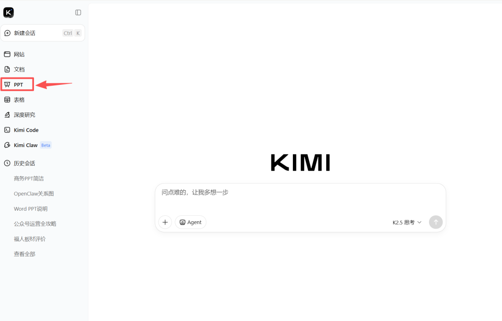
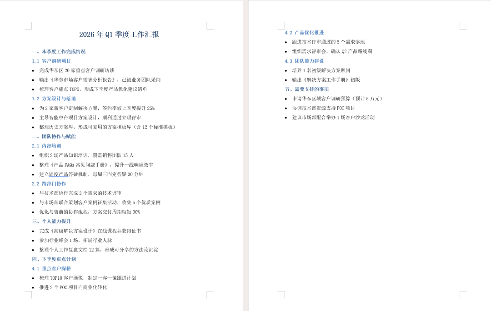
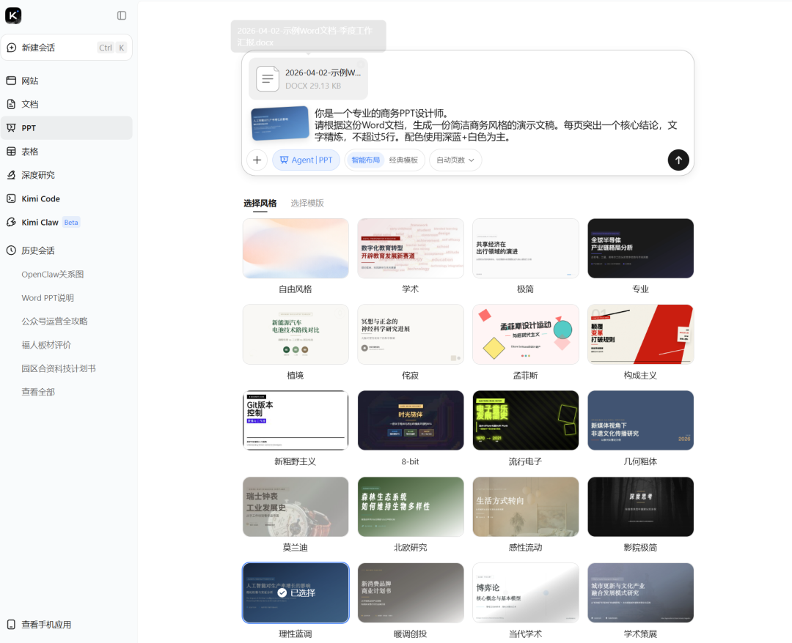
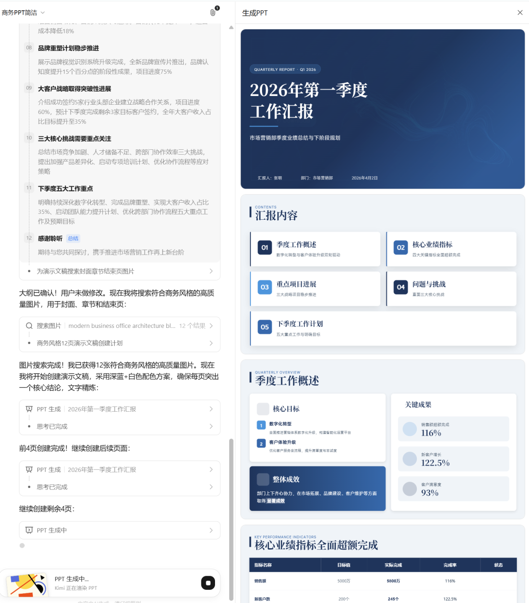
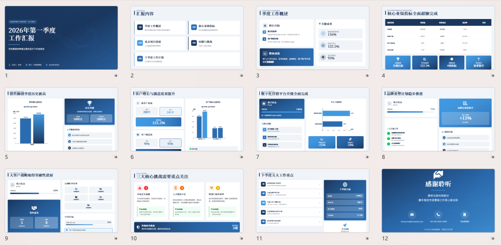
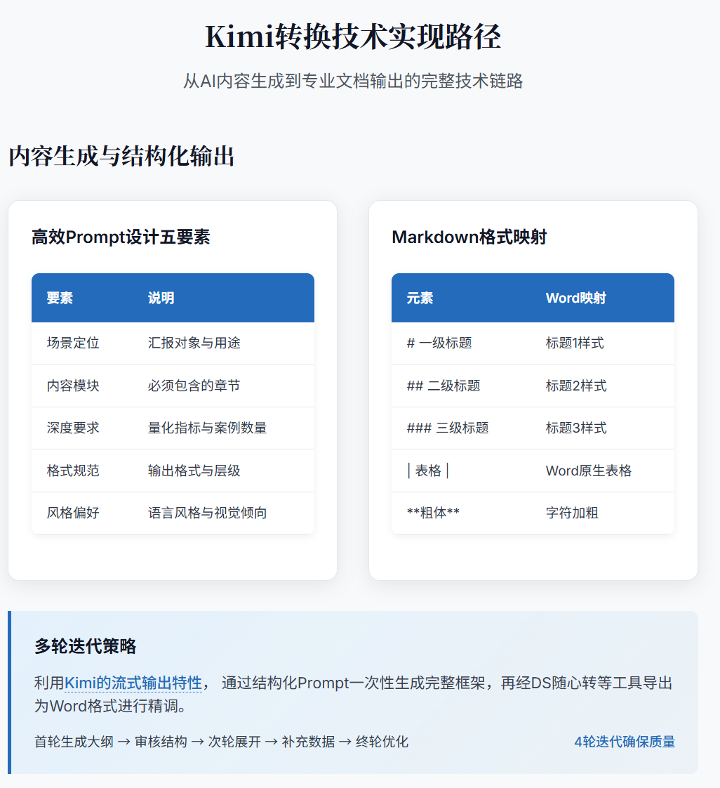

> 📎 来源: [咖啡的效率盒](https://mp.weixin.qq.com/s?__biz=MzU2MTYwNzk4NA==&mid=2247484066&idx=1&sn=fca8a7bd4113670531906df05b53b828&chksm=fd8ef5af6217f33220fdf4c14360ffcd78be0c931be403984ccc16dffd888b6b89ae4e6b14cc&mpshare=1&scene=1&srcid=0511xeTs4YtT80038KKUdo79&sharer_shareinfo=2609023fd5ba73adb4138035f5f9b95d&sharer_shareinfo_first=2609023fd5ba73adb4138035f5f9b95d) | 时间: 2026-05-11 15:41

---

下午4点50分，老板说："明天上午10点开会汇报，把PPT发我。"

你心里一沉——手里那份Word汇报文档才刚写完，PPT还没动。

以前的我：默默打开PowerPoint，从空白页开始，一页一页Ctrl+C、Ctrl+V，排版对齐调字体，一直熬到11点。

现在的我：**5分钟搞定。**

把Word丢给AI，一键生成完整演示文稿。剩下的时间摸鱼等下班。

这期内容，就教你这个"偷懒"技能。

---

01 为什么我们讨厌做PPT？

说句大实话：**PPT本质上不是"创作"，而是"翻译"。**

你的核心内容——数据、结论、方案——都在Word里了。PPT只是换了个包装。

但这个"翻译"工作，偏偏特别费时间：

- 排版要对齐，配色要协调
- 字体大小要统一，标题要加粗
- 图片要配图，图要调位置
- 20页的汇报，光排版就能耗掉你一两个小时

更气人的是：**每次做PPT都要从零开始。**

你明明写过类似的项目汇报，换了一个项目，PPT还是得重新做。

这就是打工人做PPT的真实困境：**内容生产只花1小时，PPT制作却要花2小时。**

---

02 解决方案：AI一键Word转PPT

好，现在说正题。

**核心思路很简单：Word文档准备好了，丢给AI，5分钟出PPT。**

我实测了市面上几款主流工具，核心流程都一样：

> **上传Word → AI自动分析内容结构 → 一键生成PPT → 下载**

下面以 **KimiPPT：https://www.kimi.com/**（国内可直接访问）为例，演示完整操作步骤。



### 第一步：整理好你的Word文档（1分钟）

这是最关键的一步，决定AI生成的质量。

**文档结构要清晰：**

- 使用Word的"标题1/标题2/标题3"来分层级
- 每页PPT对应的内容单独一段
- 重点结论加粗，AI会识别为核心要点
- 删除无关废话，只留精华

**举个例子：**

这份周报Word的结构是这样的：

```
📌 本周工作完成情况（标题1）- 客户调研报告已完成（标题2）- 方案初稿已提交（标题2）📌 下周计划（标题1）- 客户提案会议（标题2）- 产品测试跟进（标题2）
```

**这样的结构丢给AI，生成出来的PPT会自动分页、层级清晰。**



（生成的PPT文档示例）

### 第二步：上传Word，生成PPT（2分钟）

打开 KimiPPT（或其他类似工具），找到"Word转PPT"功能，把文档上传。



（导入Kimi参考，附提示词）

AI会自动：

- 识别文档层级结构
- 提炼每页核心内容
- 匹配适合的PPT模板
- 生成完整的演示文稿



（来杯咖啡，大纲识别完成，并自动生成PPT）

整个过程**全自动**，你只需要点两下鼠标。

### 第三步：微调与导出（2分钟）

AI生成初稿后，你需要做三件事：

**1. 检查内容有没有错误** AI偶尔会"发挥过度"，添加一些你没说过的话。如果有，让AI重新生成或手动删除。

**2. 调整配色/字体** 如果你们公司有固定VI，导出后手动替换一下品牌色即可。

**3. 导出发送** 导出为PDF或PPTX格式，直接发给老板。



（PPT生成效果）

---

03 效果对比：手工 vs AI

|  | 手工做PPT | AI辅助做PPT |
| --- | --- | --- |
| 耗时 | 60-120分钟 | 5分钟 |
| 排版质量 | 看心情和水平 | 稳定输出，中上水平 |
| 精力消耗 | 极大，做完累瘫 | 极低，奶茶还没凉就做完了 |
| 修改成本 | 牵一发动全身 | 随时局部调整 |

**核心观点：AI做的是"框架+美化"，人的精力应该放在"内容质量"和"汇报表达"上。**

你用省下来的60分钟，好好打磨汇报话术，比花时间调字体值多了。

---

04 进阶技巧：如何让AI生成的PPT更好看？

利用Kimi的流式输出特性， 通过结构化Prompt一次性生成完整框架，再经DS随心转等工具导出相应格式后进行精调，想要让PPT看起来更高级，可以在结构上、设计要求上等进行更规范的说明



### （Kimi-生成PPT的转换技术实现路径）

### 技巧一：Word结构越清晰，PPT越准

AI识别PPT结构的能力，取决于你的Word排版水平。

**推荐结构：**

```
标题1（一级标题）→ PPT单页标题2（二级标题）→ 这页的小标题正文（3-4个要点）→ 这页的正文内容
```

**每页内容不要超过6行，否则PPT会显得拥挤。**

### 技巧二：给AI一个"角色Prompt"

如果你用的是Gamma.app或ChatGPT类的工具，可以给AI一段角色指令，让它更懂你要的风格。

**示例Prompt：**

> “你是一个专业的商务PPT设计师。

> 请根据这份Word文档，生成一份简洁商务风格的演示文稿。

> 每页突出一个核心结论，文字精炼，不超过5行。

> 配色使用深蓝+白色为主。"

**Prompt越具体，生成效果越好。**

### 技巧三：生成后先"审稿"再美化

AI有时候会"添油加醋"，把话说得太过或跑偏。

**必做：导出后通读一遍，确保内容准确。**

品牌LOGO、公司名称、关键数据这些细节，AI不一定能自动补全，导出后手动加上。

---

05 适用场景 vs 不适用场景

**非常适合的场景：**

- 周报/月报/季度汇报
- 项目提案和方案展示
- 内部培训PPT初稿
- 客户方案的第一版演示
- 任何"内容已经有了，只需要换个形式"的场景

**需要谨慎的场景：**

- 高度创意设计要求的演讲（如TED-style）
- 涉及商业机密不便上传到第三方平台的内容
- 需要大量数据可视化的复杂分析

**安全提示：** 使用任何在线AI工具时，建议先对文档进行脱敏处理，去掉敏感客户名、内部代号等再上传。

---

06 总结

做PPT这件事，打工人花了太多时间在"翻译"上，而忽略了真正重要的事——**内容的价值**和**汇报的表达**。

AI工具把这个"翻译"工作接过去了。你要做的，就是：

1. 把Word写好（这是你的核心价值）
2. 丢给AI生成PPT（5分钟）
3. 花10分钟检查和调整
4. 按时发出，准时下班

**工具永远只是工具。真正值钱的，是你的内容和你这张嘴。**

 需要文中示例的Word和PPT源文件，欢迎留言区评论，移步后台回复”汇报PPT“领取

---

既然看到这里了，如果觉得我的内容还不错，不妨顺手点个赞、在看、转发三连吧～想要第一时间收到推送，也可以给我个星标⭐

欢迎点击上方公众号（咖啡的效率盒）关注我
