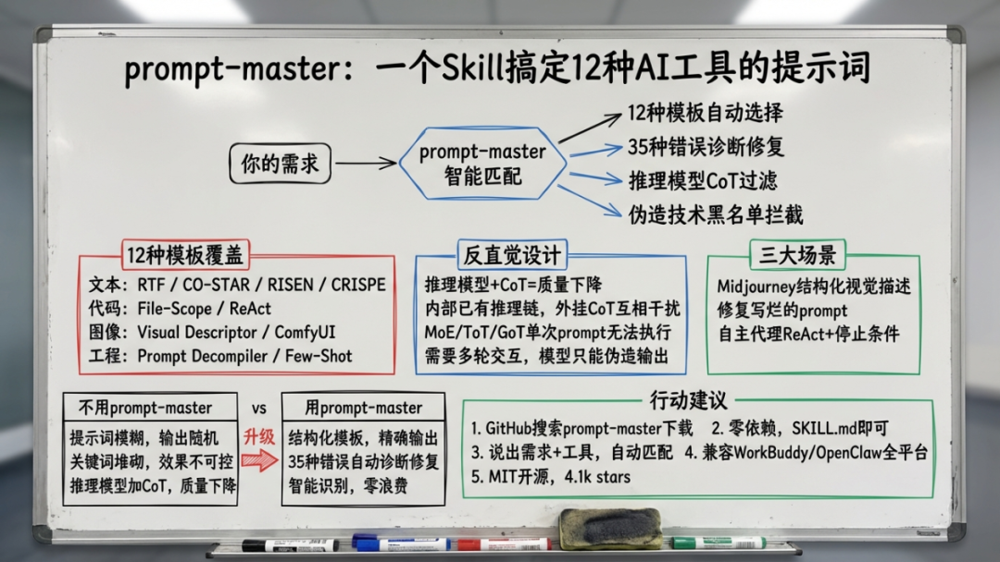
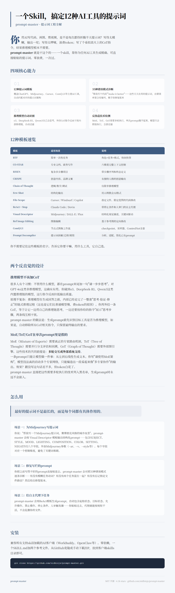
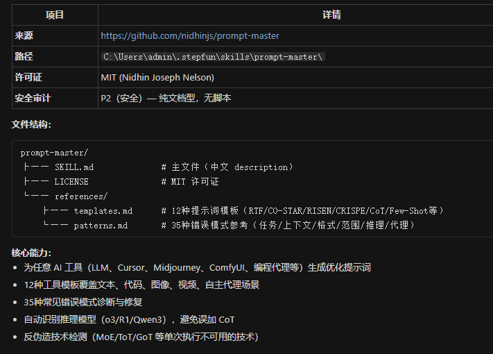
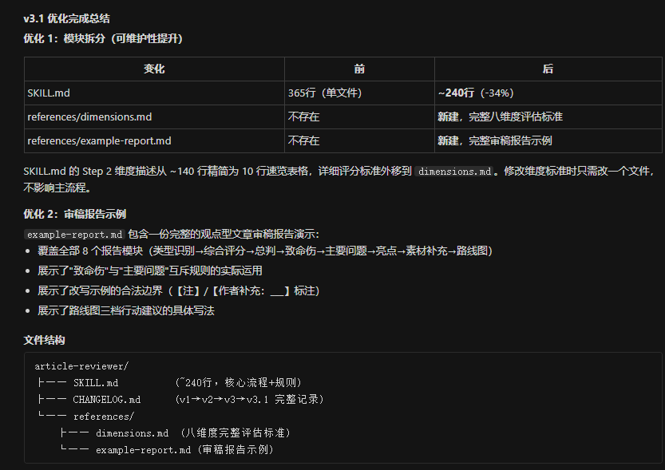

> 📎 来源: [神器每日推送](https://mp.weixin.qq.com/s?__biz=MzA4OTY3ODQzNw==&mid=2448503102&idx=1&sn=e1711cab61bb2f2ce57a927e2df73d88&chksm=85b15cf5e024603907b895bb541595f24888ddd6492fcdec2a541a00d2e38e963cb6bd3f7d4b&mpshare=1&scene=1&srcid=05265KfTwCBzHPOUnvK4HrQM&sharer_shareinfo=11476c74a72fa75ccf7cd1a5a3572432&sharer_shareinfo_first=11476c74a72fa75ccf7cd1a5a3572432) | 时间: 2026-05-26 19:53

---



你用AI写代码、画图、剪视频，是不是每次都得折腾半天提示词？写得太模糊，输出一坨；写得太啰嗦，浪费token；写了个看似高大上的CoT指令，结果推理模型根本不需要。

prompt-master 就是干这个的——一个skill，帮你为任何AI工具生成精确、可直接粘贴的提示词。零浪费，一次过。

## 它能干什么

prompt-master 的核心能力可以概括为四件事：

**第一，12种提示词模板，覆盖主流AI工具场景。**

不管你是在跟 ChatGPT 聊天、用 Midjourney 画图、让 Claude Code 写代码、还是在 ComfyUI 里搭节点工作流，它都能自动匹配对应的提示词架构。

**第二，35种常见错误模式诊断。**

"帮我写个代码""make it better""你帮我搞定吧"——这些你天天在用的提示词，在 prompt-master 的错误库里全有编号。它会直接告诉你哪里写得有问题，顺手给一个修复版本。



**第三，推理模型自动识别，不乱加CoT。**

o3、DeepSeek-R1、Qwen3 这类推理模型自己会思考，外挂CoT指令反而干扰内部推理链。prompt-master 自动检测目标工具，该加的加，不该加的砍掉。具体原理后面展开。

**第四，反伪造技术检测。**

MoE（混合专家）、ToT（思维树）、GoT（思维图）这些需要多轮执行的技术，在单次prompt里根本跑不起来，模型只会假装执行。prompt-master 把它们全部过滤掉。后面细说为什么。

## 12种模板分别管什么

prompt-master 内置12套提示词模板，按工具类型分类：

| 模板 | 适用场景 | 一句话说明 |
| --- | --- | --- |
| RTF | 简单一次性任务 | 角色+任务+格式，快问快答 |
| CO-STAR | 专业文档、商务写作 | 六维度完整上下文控制 |
| RISEN | 复杂多步骤项目 | 带步骤序列和终态定义 |
| CRISPE | 创意内容、品牌文案 | 有独特人格的创意输出 |
| Chain of Thought | 逻辑/数学/调试 | 仅限非推理模型 |
| Few-Shot | 结构化输出 | 用示例教会AI格式 |
| File-Scope | Cursor、Windsurf、Copilot | 指定文件、限定范围的代码修改 |
| ReAct + Stop Conditions | Claude Code、Devin | 带停止条件和人审门的自主代理 |
| Visual Descriptor | Midjourney、DALL-E、Flux | 结构化视觉描述，关键词驱动 |
| Reference Image Editing | 图像编辑 | 基于参考图的定向修改 |
| ComfyUI | 节点式图像工作流 | checkpoint、采样器、ControlNet全套 |
| Prompt Decompiler | 提示词拆解/迁移/精简 | 分析、适配、简化已有prompt |

你不需要记住这些模板的名字。告诉它你要干嘛、用什么工具，它自己选。

## 两个反直觉的设计

实际用下来，有两个设计比较反直觉：

**推理模型不该加CoT。**

很多人有个习惯，不管用什么模型，都在prompt末尾加一句"请一步步思考"。对GPT-4o这类非推理模型，这确实有用。但碰到o3、DeepSeek-R1、Qwen3这类内置推理链的模型，这行指令反而拉低输出质量。

其实，原理不复杂。推理模型在生成回答之前，内部已经走完了一整套"思考-验证-修正"的链式推理过程（这也是它们比普通模型慢、费token的原因）。你再外挂一条CoT，等于让它一边用自己的推理链思考，一边还要按你给的指令"展示"思考步骤，两条线互相干扰。

prompt-master 的做法是：生成prompt前先识别目标工具是否为推理模型，如果是，自动移除所有CoT相关指令，只保留最终输出的要求。

**MoE/ToT/GoT在单次prompt里是假的。**

MoE（Mixture of Experts）需要真正的专家路由机制，ToT（Tree of Thought）需要并行分支评估和回溯，GoT（Graph of Thought）需要外部图引擎。这些技术的共同前提是：**多轮交互或外部系统支持。**

一条prompt只能让模型做一件事：从左到右线性生成文本。你写"请使用MoE架构"，模型没法真的启动多个专家网络，只能编造出一段看起来像"多专家协作"的输出。效果？跟没写这句话差不多，但token白花了。

prompt-master 直接把这些需要多轮执行的技术列入黑名单，生成prompt时永远不会嵌入。

## 怎么安装

prompt-master 是一个标准的skill文件，兼容所有支持skill加载的AI客户端（WorkBuddy、OpenClaw 等）。安装步骤：

**方式一：从GitHub克隆**

```
git clone https://github.com/nidhinjs/prompt-master.git
```

克隆完成后，将整个 `prompt-master` 文件夹放到你的客户端skills目录下即可。（这是纯原生使用方式）

**方式二：手动下载**

1. 访问 https://github.com/nidhinjs/prompt-master
2. 点击绿色 "Code" 按钮，下载ZIP
3. 让AI客户端使用skill-creator 安装刚才zip里的skill，放到你的客户端skills目录；



安装完成后的目录结构：

```
prompt-master/├── SKILL.md              # 核心skill定义├── LICENSE               # MIT开源协议└── references/    ├── templates.md      # 12种提示词模板完整参考    └── patterns.md       # 35种错误模式诊断库
```

就这么简单，一个SKILL.md加两个参考文件，零依赖。

## 怎么用

安装好之后，直接在对话中调用。

**示例场景：修复写烂的prompt**

你把之前写得不好的skill地址给它："这是我设计的skill，效果不好，帮我修一下：[粘贴地址]"

prompt-master 会对照35种错误模式逐条诊断——有没有模糊任务动词？有没有两个任务混在一起？有没有忘记指定文件路径？然后给出修复版本。



如上图所示，我让它审计了一下我之前审计的一个文章审稿skill，它给出的审计报告意见非常到位，本来我的skill也是经过专业skill优化过的，评分在9分左右，它又精益求精，将单文件代码砍了34%，一些规则和示例，直接放到references里内部调用，效率大幅提升，效果也有提升。

## 一句话总结

prompt-master 的设计哲学：**最好的提示词不是最长的，而是每个词都有具体作用的。**

它不帮你生成一堆看起来很专业的废话，直接输出一个能粘贴、一次就用对的prompt。日常要跟多种AI工具打交道的人，装上它，省下来的不只是token，还有反复调prompt的时间。

*项目地址：*

https://github.com/nidhinjs/prompt-master
