> 📎 来源: [永恒君的百宝箱](https://mp.weixin.qq.com/s?__biz=MzIzMTU2OTkwOQ==&mid=2247501468&idx=1&sn=89ec520b60091fb3dba55b4fb513a3a0&chksm=e9b7eea725b796fb273d154a8d784aedebe48ad47ed376d1fa249c3feea9cd2714e072c64462&mpshare=1&scene=1&srcid=0511l9ArDEpTQY3jE9yl0Gz8&sharer_shareinfo=43708ba452dc9bc6ee41619cc94ffb53&sharer_shareinfo_first=43708ba452dc9bc6ee41619cc94ffb53) | 时间: 2026-05-11 10:53

---


微信最近改版，为了不错过精彩，请把我设为⭐星标


哈喽，大家好，我是永恒君！

以前咱们想让程序自动处理 Word、Excel、PPT，要么得学一堆复杂的 Python 库，要么就得老老实实装上庞大的 Microsoft Office 套件，光折腾环境就能劝退一大波人。

最近发现了一款特别有意思的工具 - 

```
OfficeCLI
```

，可以说是我见过的对新手最友好的办公文档自动化工具了。

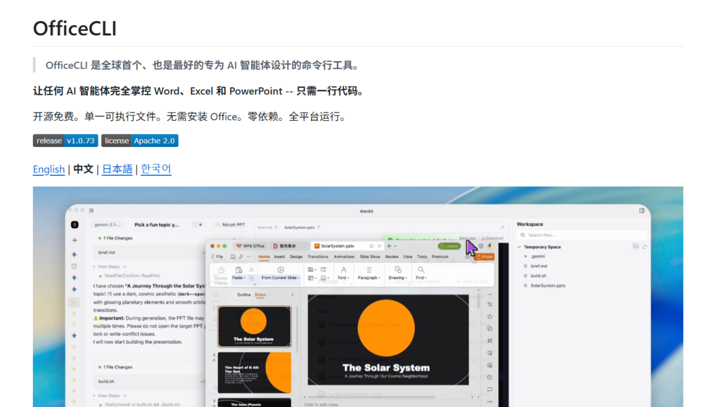

简单来说，你只要用自然语言告诉 AI 想做什么，它就能通过 OfficeCLI 帮你直接控制文档，创建、编辑、改格式，统统没问题。

对于咱们日常办公来说，真的能省下不少时间和力气。

### 使用示例

先看看使用的示例。

#### 01 处理PPT

比如我让他给我生成一份3页内容的工作总结PPT，具体内容没有指定，由AI自己定，如图

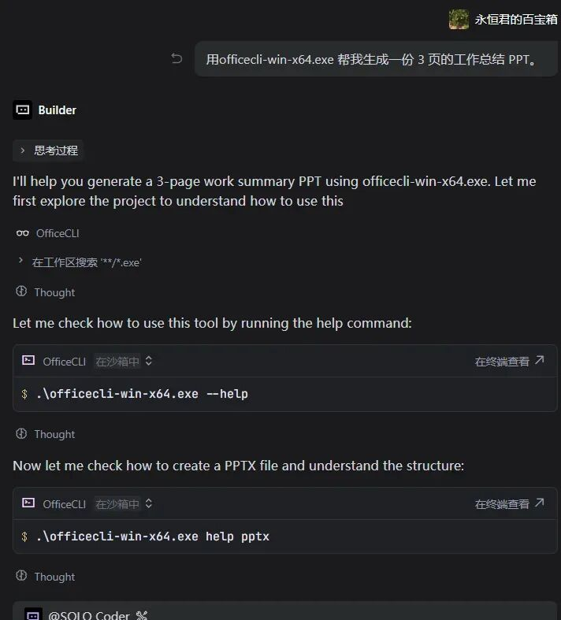

就和我们日常使用AI聊天一样。

一会AI就告诉我们已经生成好了，并且告诉了3页PPT的内容

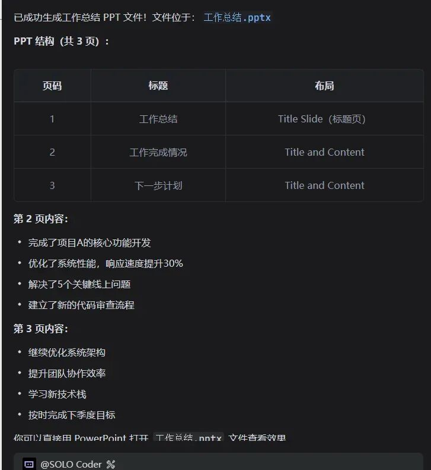

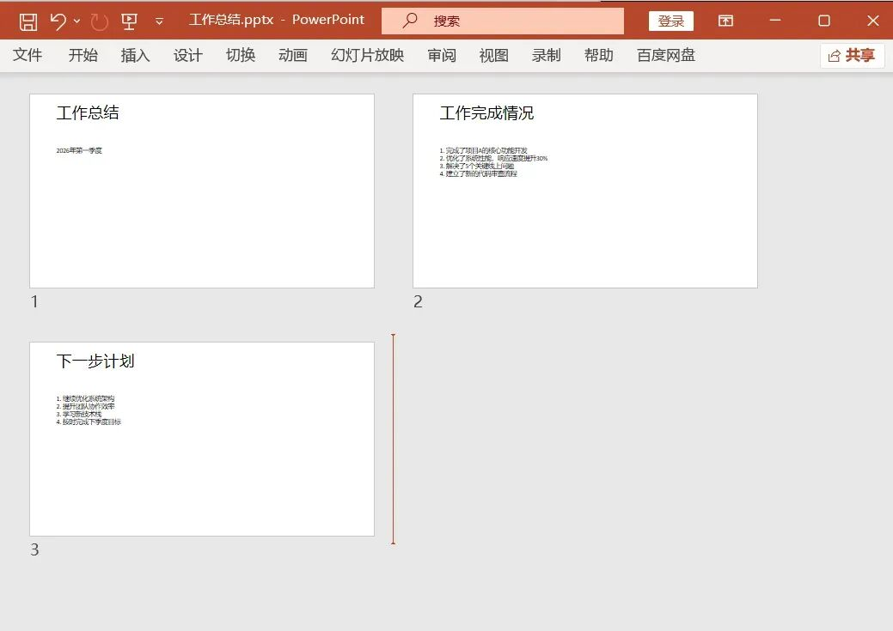

我让他给我把第二页的标题改成“工作业绩”


速度也很快。

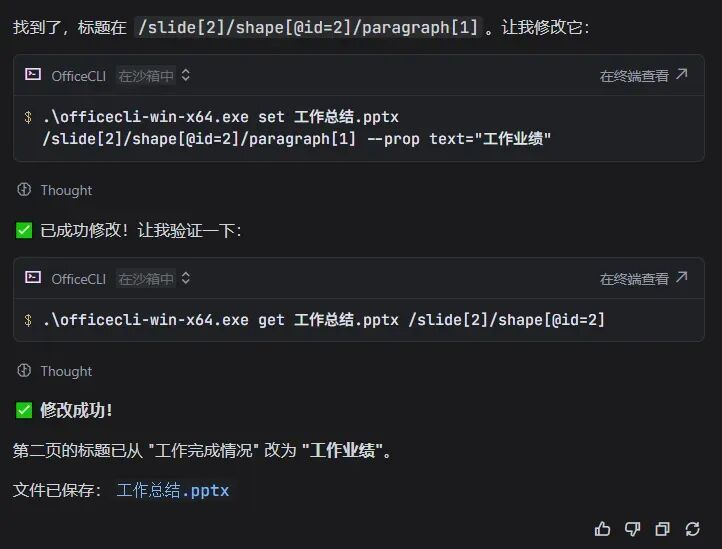

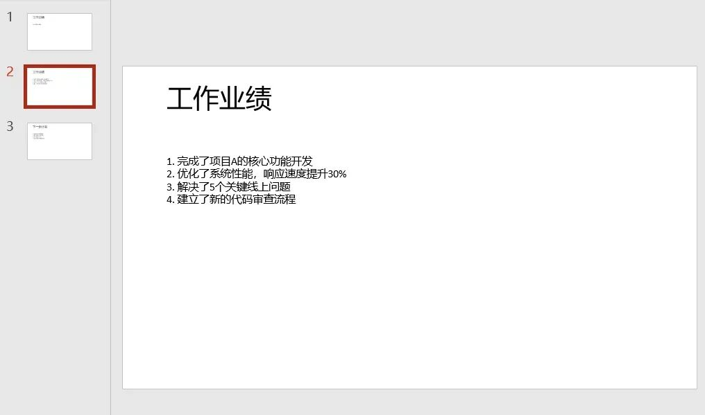

是不是有点意思？

#### 02 处理Excel

再来一个，“新建一个销售数据 Excel，包含姓名、金额、日期”


生成了一个空的模版，总体还是可以的。

虽然没有数据，但我也没说要数据吧~~

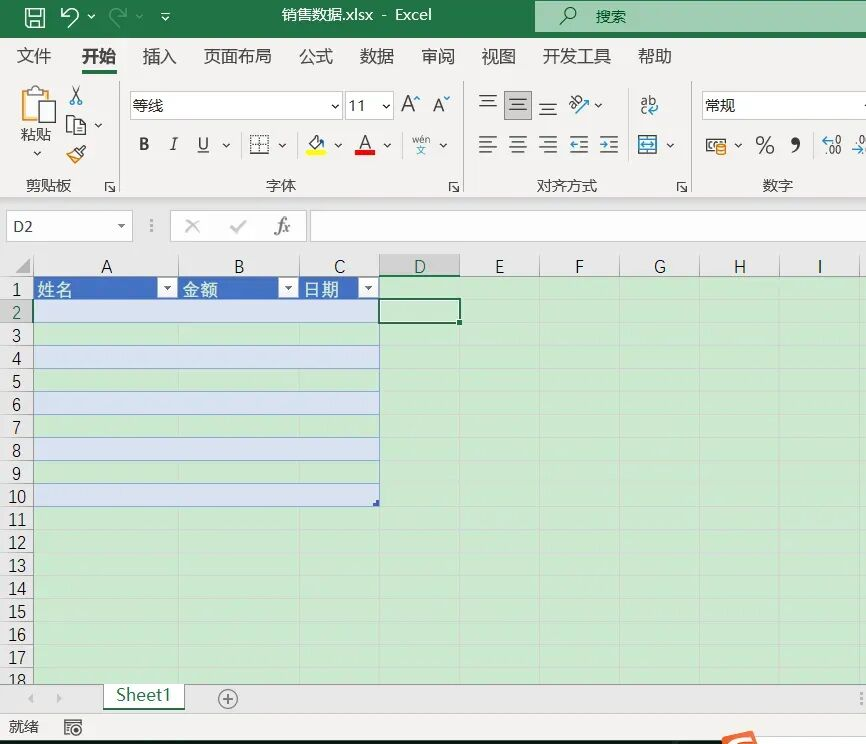

#### 03 批量修改word

给批量给文件夹所有docx文末加入文字“2026年4月29日”，格式是：右对齐，宋体加粗，5号大小。


生成的结果

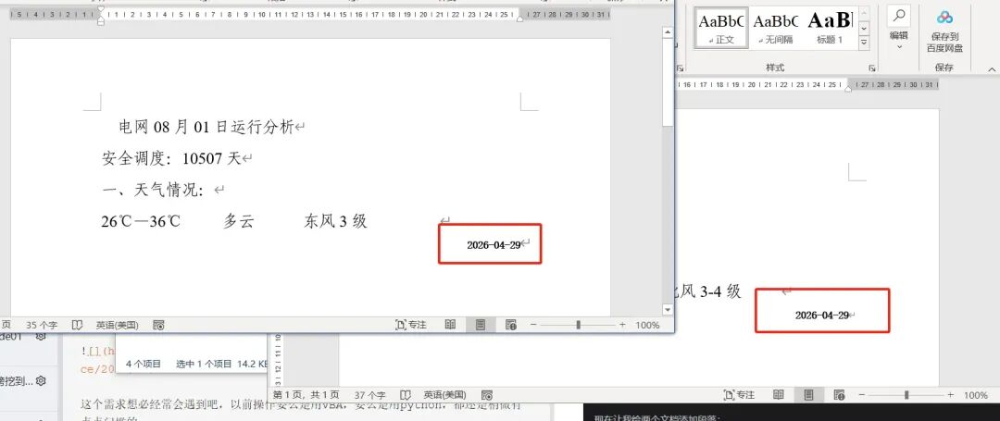

#### 04 word、Excel联动

再来一个稍微复杂点的。

文件夹里面有2个word文档和1个excel文件

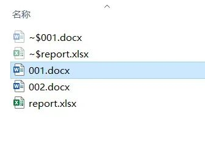

word文档的内容样式基本一样，需要把2个word里面的温度，天气，风力等数据填入到excel表里面对应的单元格里面去。

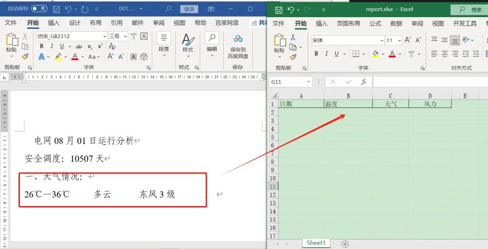

这个需求想必经常会遇到吧，以前操作要么是用VBA，要么是用python，都还是稍微有点点门槛的。

现在，我直接在AI里面说

```
帮我用officecli这个技能，从 test 文件夹里面的所有docx文档中，依次提取日期、温度、天气、风力等内容，填入到 report.xlsx 文件对应的单元格里面。注意要对应单元格的内容
```

收到指令后，AI自己会分析需求，然后调用officecli，挨个去查看word的内容，找到相应的字段内容，填入到对应的excel单元格里面去。

完整的过程如下：

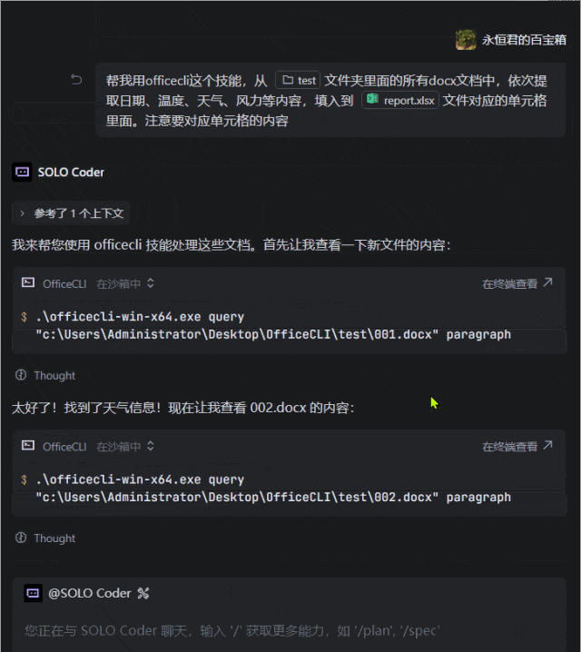

生成的excel

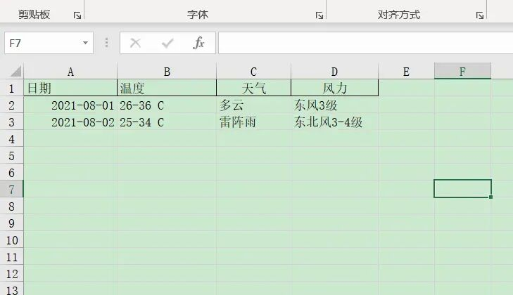

以上，从创建到修改，全程你只需要动动嘴皮子，或者打几行大白话就行。

什么 Word 排版、Excel 数据整理、PPT 设计，以后都可以让 AI 直接帮你接管。

对于咱们普通上班族或者刚入门的小白来说，再也不用被那些复杂的办公软件操作折磨了。

### 如何安装使用

安装其实很简单，找一个 AI IDE就可以很方便的实现上面的效果了，VS code、Trae、Qoder、CodeBuddy等等都可以。

永恒君这边是用的Trae，没啥特别，就是习惯了。

安装好之后，登录Trae账号，然后新建一个项目，在输入框里面输入下面的指令安装即可。

```
帮我安装这个技能 `https://officecli.ai/SKILL.md`
```


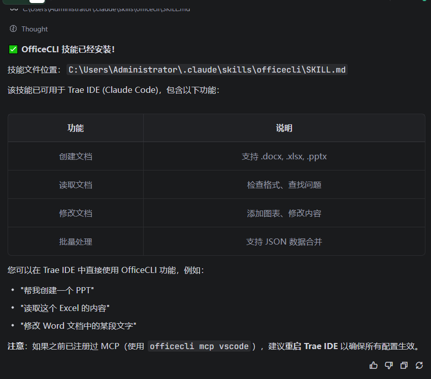

对就是这么简单。

如果你也想试试，或者想看看更多高级玩法，地址我放在下面了，感兴趣的小伙伴可以去逛逛。

项目地址：https://github.com/iOfficeAI/OfficeCLI

*END*

你可能还会想看：

- [收藏 | 实用软件工具汇总](http://mp.weixin.qq.com/s?__biz=MzIzMTU2OTkwOQ==&mid=2247490300&idx=1&sn=2566b366575342a36dc61f756631c5fd&chksm=e8a37a66dfd4f3701befe9400b4ee79d286a36851e97a6ddc29c0534dd02fced04e570525103&scene=21#wechat_redirect)
- [爬虫利器Web Scraper系列教程及7个实例](http://mp.weixin.qq.com/s?__biz=MzIzMTU2OTkwOQ==&mid=2247491942&idx=1&sn=0436e2145b1fbcccff9697ba9f1ebe31&chksm=e8a081fcdfd708eae78ee322292283d6d4b609cedd8ab167dd42df46bc40f76e5e604805cb80&scene=21#wechat_redirect)
- [Windows实用效率工具分享！](http://mp.weixin.qq.com/s?__biz=MzIzMTU2OTkwOQ==&mid=2247494533&idx=1&sn=233638ddf7896e806cbaec634b73d032&chksm=e8a08b1fdfd70209e1599f90a608d7768bbd05f52f25c8436bb00c8cc9b7990c0d602f5d95f7&scene=21#wechat_redirect)

- [告别翻译 AI 味！这个三步法，真的好用...](https://mp.weixin.qq.com/s?__biz=MzIzMTU2OTkwOQ==&mid=2247501065&idx=1&sn=aba5c246d8339939b4caa69abc45c69f&scene=21#wechat_redirect)

- [网页Logo怎么下载？自制了Chrome扩展，一键搞定！](https://mp.weixin.qq.com/s?__biz=MzIzMTU2OTkwOQ==&mid=2247501301&idx=1&sn=2683f728ab8c002b725ca51ef6fb72bf&scene=21#wechat_redirect)
- [“带修正栏”作文排版怎么弄？别用Word死磕了，用它一键搞定](https://mp.weixin.qq.com/s?__biz=MzIzMTU2OTkwOQ==&mid=2247501391&idx=1&sn=b59c6a7f335ca7d750a06abb96b6b5d1&scene=21#wechat_redirect)
- [不用改排版！A3 试卷自动切分成 2 张 A4，太省心了](https://mp.weixin.qq.com/s?__biz=MzIzMTU2OTkwOQ==&mid=2247501406&idx=1&sn=445c8a47baeba4ed28e937b0a9f7bc13&scene=21#wechat_redirect)


