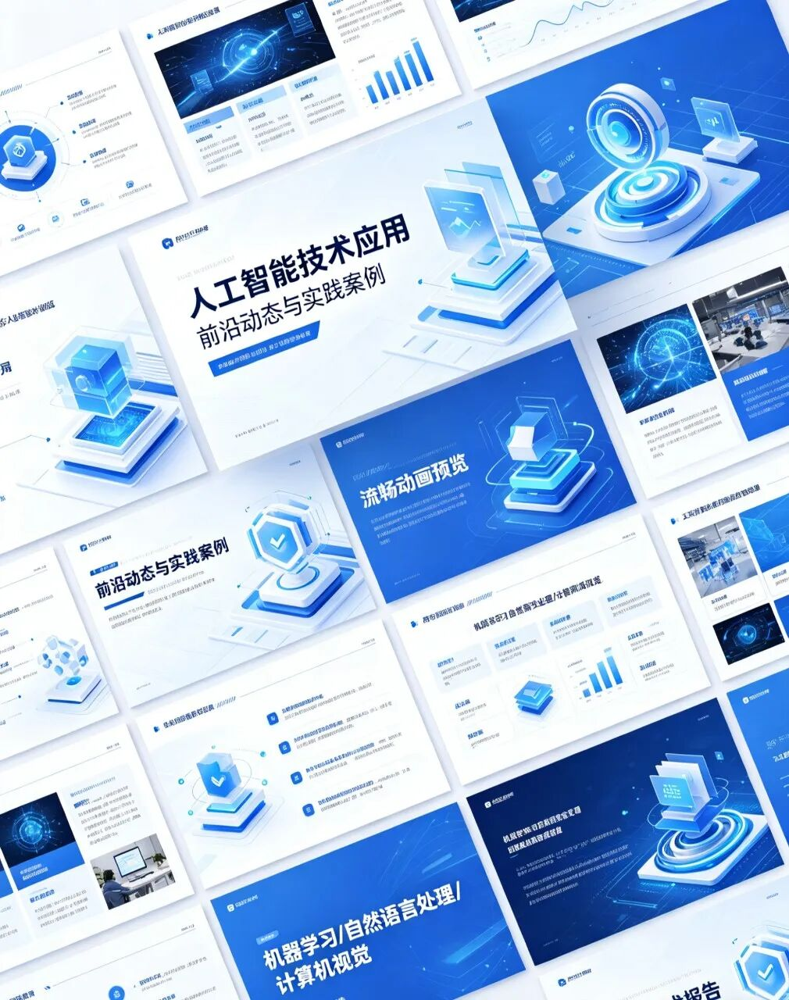

> 📎 来源: [ai辅助讲解](https://mp.weixin.qq.com/s?__biz=MzkzNjc1ODE4Nw==&mid=2247483729&idx=1&sn=129ba4488780121c6e92c8f11c1db59e&chksm=c3399b90a7357d157daadbbc71bbdbe9a0930ffaa46280003fbd8abbd9a6a57fc7d6bfa9e187&mpshare=1&scene=1&srcid=04209C5Rshfi4PxWuT1j75mz&sharer_shareinfo=1c11a46876b3783ce86e8d650b66a82f&sharer_shareinfo_first=1c11a46876b3783ce86e8d650b66a82f) | 时间: 2026-04-20 00:07

---

一提到做PPT，很多职场人和学生都会忍不住头疼。明明工作内容、汇报要点都清晰明了，可一坐到电脑前排版、找图、调字体、做逻辑框架，几个小时就悄悄溜走了。遇到赶项目、期末汇报、竞聘演讲这种紧急时刻，熬夜做PPT更是家常便饭，好不容易做完还显得杂乱无章、毫无质感，既浪费时间，又影响 presentation 效果。

对大多数人来说，做PPT的痛苦根本不是内容，而是繁琐的排版设计、配色搭配、版式布局、图片素材筛选。一页PPT反复修改十几遍，整体风格不统一，动画生硬，图表难看，交上去要么被领导打回重改，要么在汇报时显得不够专业。很多人明明能力很强，却因为PPT做得普通，白白错失展示自己的机会。

但现在不一样了，AI工具的出现，彻底把人从低效的PPT制作中解放出来。不用设计基础，不用熬夜排版，只要输入主题，就能自动生成完整演示文稿，对上班族、学生、副业接单的人来说，都是效率神器。

今天就给大家分享3个完全免费、新手也能秒上手的AI做PPT工具，不用安装复杂软件，打开网页就能用，功能足够日常使用。

第一个工具，主打一键生成完整PPT，输入主题、使用场景、页数要求，AI会自动梳理逻辑结构，从封面、目录、内页内容到总结页一次性生成，非常适合赶时间的职场汇报。第二个工具侧重高颜值排版，自带大量商务、校园、简约风格模板，AI会自动匹配配色和字体，做出来的PPT质感拉满。第三个工具则擅长智能配图与动画，能根据内容自动匹配高清无版权图片，还能一键添加流畅过渡动画，不用手动调整。

使用方法也简单到极致。第一步，打开工具，输入你的PPT主题，比如“月度工作总结”“产品推广方案”“班级活动策划”；第二步，简单选择风格，商务风、简约风、校园风、科技风任选；第三步，点击生成，等待几十秒，一套完整的20页PPT就自动做好了。

整个过程不需要你动手排版，AI会自动统一字体、字号、配色，让每一页风格高度一致。内容逻辑也会帮你梳理清楚，封面吸睛、目录清晰、内页重点突出、结尾总结有力。更省心的是，AI还会根据文字内容自动匹配高清配图、图表、图标，避免通篇大段文字，让PPT看起来更专业、更有说服力。如果需要动画效果，也可以一键开启，过渡自然不浮夸，汇报时直接播放就行。

这样高效的工具，适用场景非常广。职场人做工作汇报、项目提案、年终总结，不用再加班加点；学生做课堂展示、毕业设计、答辩PPT，省时又出彩；想做副业的人，还可以用AI快速接单做PPT定制，一单几十到上百元，每天花一点时间，就能多一份稳定收入。

以前做一套20页的PPT至少要两三小时，现在用AI只需要10分钟，质量还更高。学会利用AI工具提升效率，才能把更多时间花在真正重要的事情上。

关注我，后续分享更多AI效率工具与副业搞钱干货，让你在职场和生活中都快人一步。
