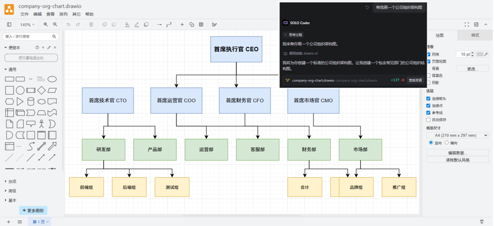
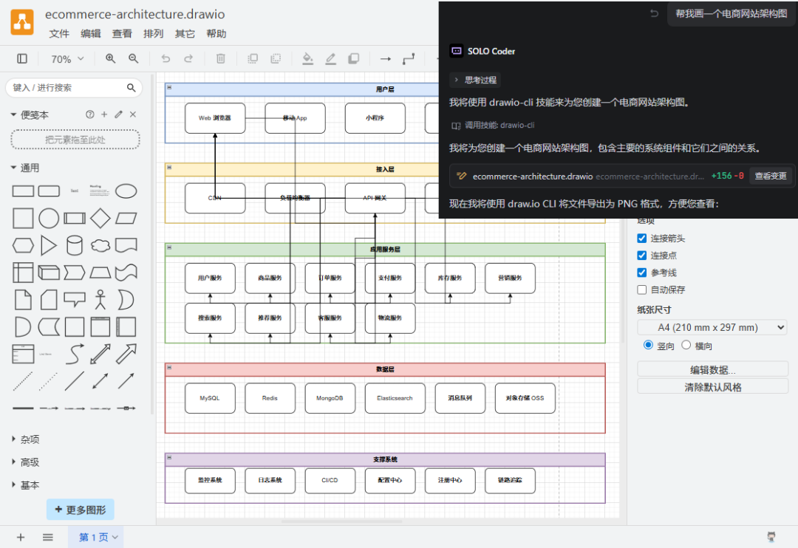
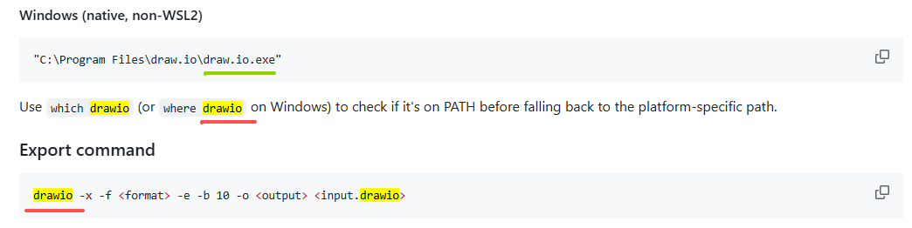
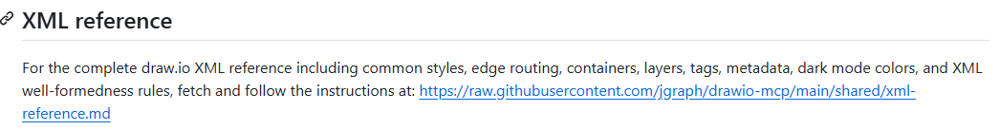
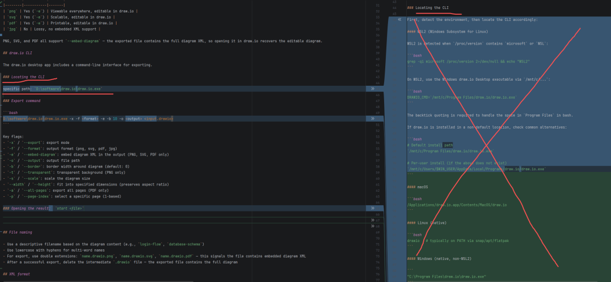
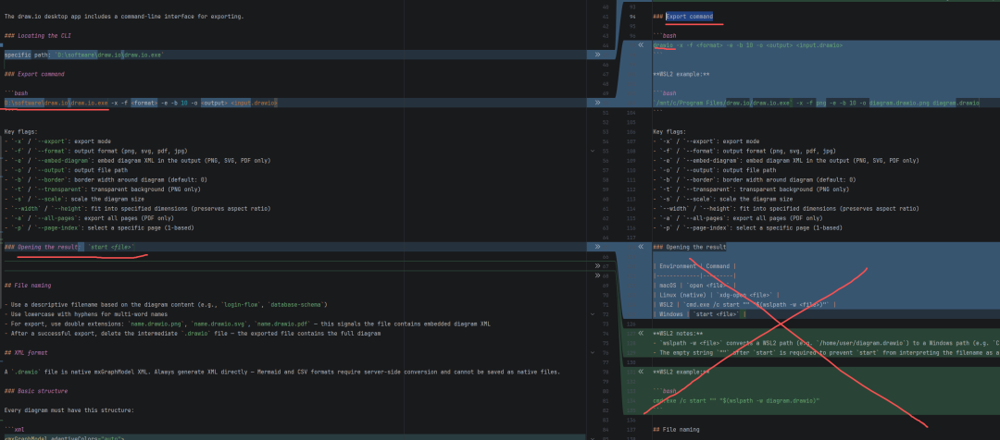
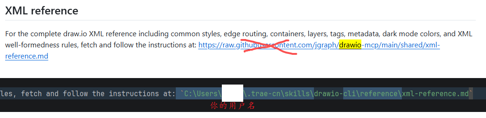

> 📎 来源: [GetLost FindMyself](https://mp.weixin.qq.com/s?__biz=MzkyMTA1NTQxOA==&mid=2247484055&idx=1&sn=bd988a05eb5b027319b89bd8131e5eee&chksm=c0e1180cb825cd14cfed248b10397d8360ba390159ab29634b75efdb1ab3d679be3d2eebb657&mpshare=1&scene=1&srcid=0522vvXlDkWDt7DDYHkSFXWg&sharer_shareinfo=1051abe0c8ba25f19f44316516fdc34c&sharer_shareinfo_first=1051abe0c8ba25f19f44316516fdc34c) | 时间: 2026-05-22 02:08

---

先看效果：





你还可以让AI改形状/颜色/线条 等等各种格式。

虽然AI画出来的图，可能不咋地（一部分原因也取决于我们提要求的提示词），但是好在我们可以直接打开文件继续修改完善。这比我们从一个空白页从零开始一个个拖拽框线好。

一. 下载drawio

drawio是开源免费的软件，直接从官网下载，然后安装：

```
https://www.drawio.com/
```

二. 下载drawio skill

（我用的软件是trae，只用trae举例）

```
https://github.com/jgraph/drawio-mcp/blob/main/skill-cli/drawio/SKILL.md
```

没法上网的朋友，可以关注我的公众号，回复关键字：drawio   (前面6个英文字母)下载skill

三. 修改skill

为什么要改？

虽然这是官方的skill，但是也有写的不严谨的地方，我导入技能后没法直接使用，需要修改才行。

比如：



Windows上安装完过后是 draw.io.exe, 命令应该是draw.io 才对，而我上图画红线的地方写的却是drawio，这在实际使用中AI会报错：找不到这个命令。

其次官方skill把XML的语法参考写到了一个链接里面，每次调用技能都需要联网去读那个XML文件，而且这个链接对无法上网的用户来说很不友好：



所以我把这个XML下载放到了本地：

```
drawio-cli
```

怎么改？

记事本打开SKILL.md

1. （以Windows为例，我只保留Windows相关的部分，如果你是其他系统，你自行修改对应部分），Locating the CLI里面那堆什么环境变量、Linux、macOS、WSL 全都用不上，还干扰模型上下文，直接改成draw.io.exe的绝对路径（你的安装路径）：



2. Export command 只给一条命令就够了，改成安装路径。Opening the result 只保留你系统的对应一条命令



3. XML reference 把在线文档的链接，换成本地的路径



四. 导入使用

把修改后的drawio-cli文件夹，重新打成zip压缩包，导入skill 即可使用
