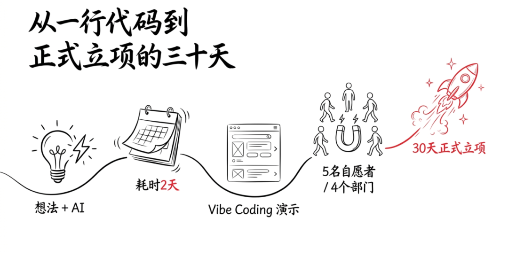
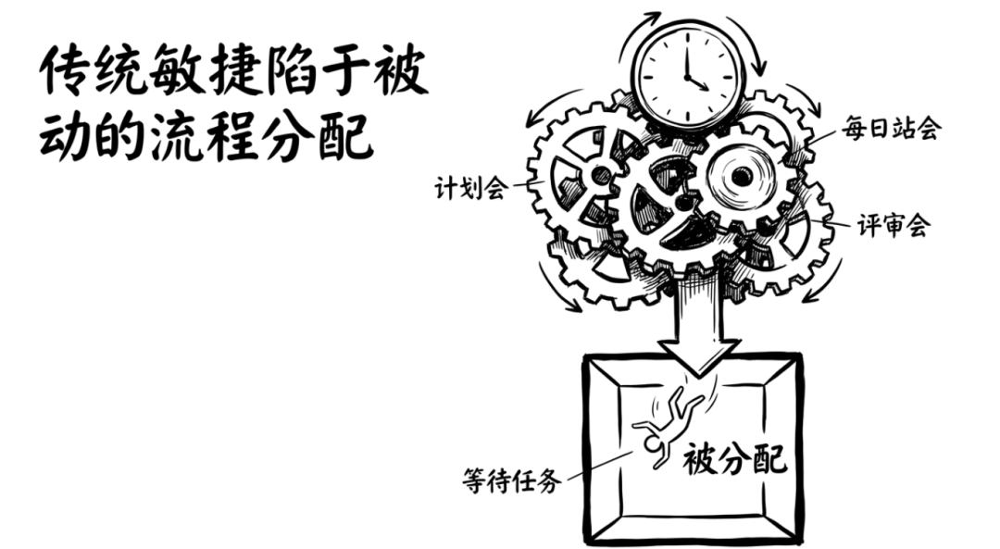
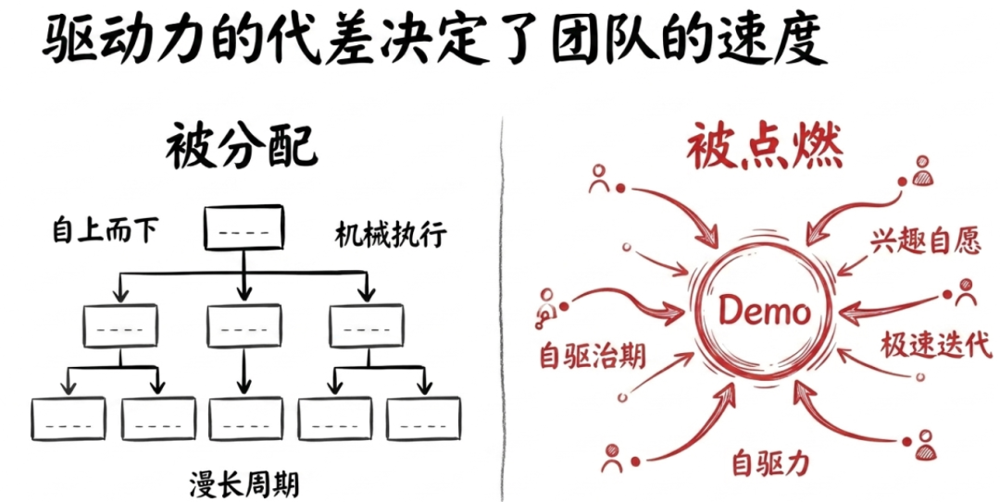
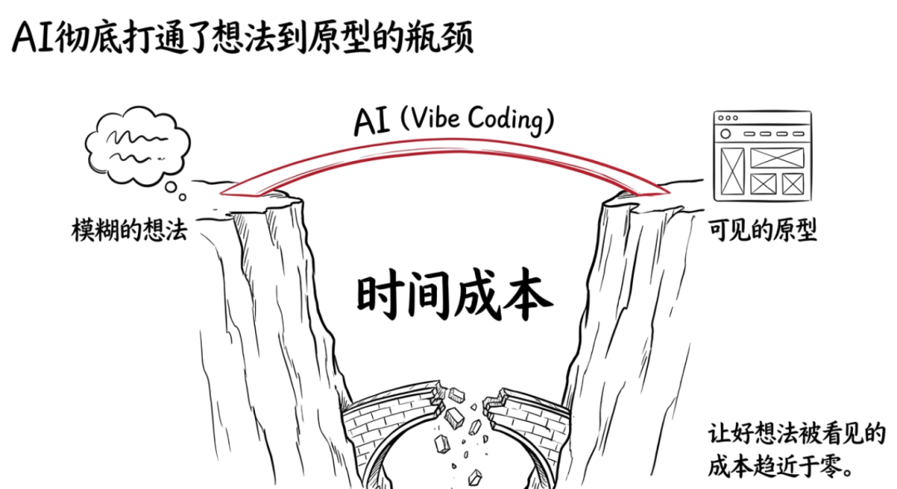
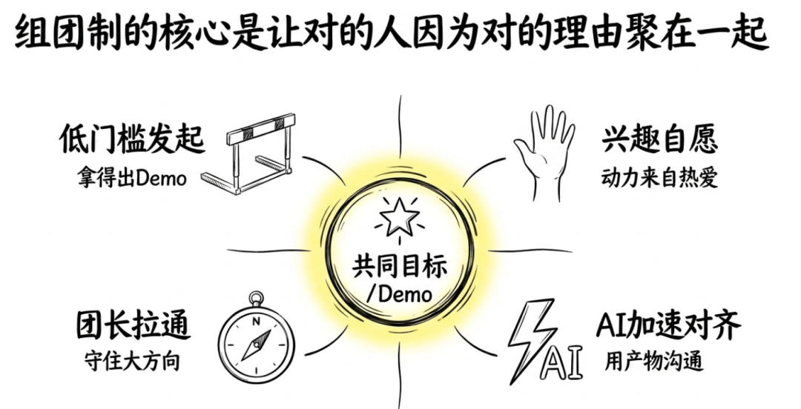
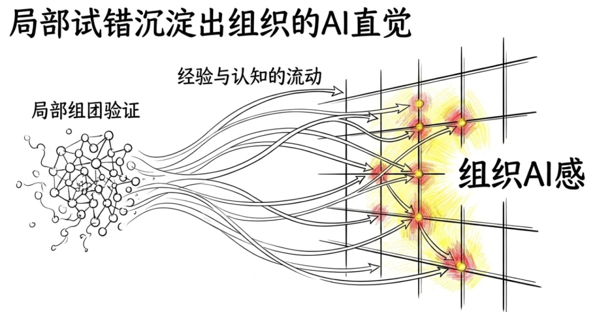
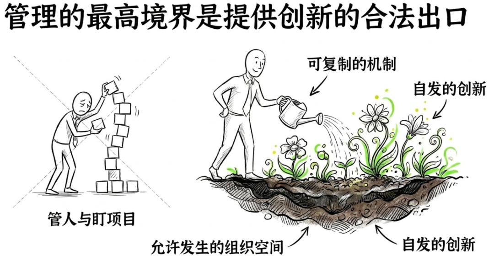
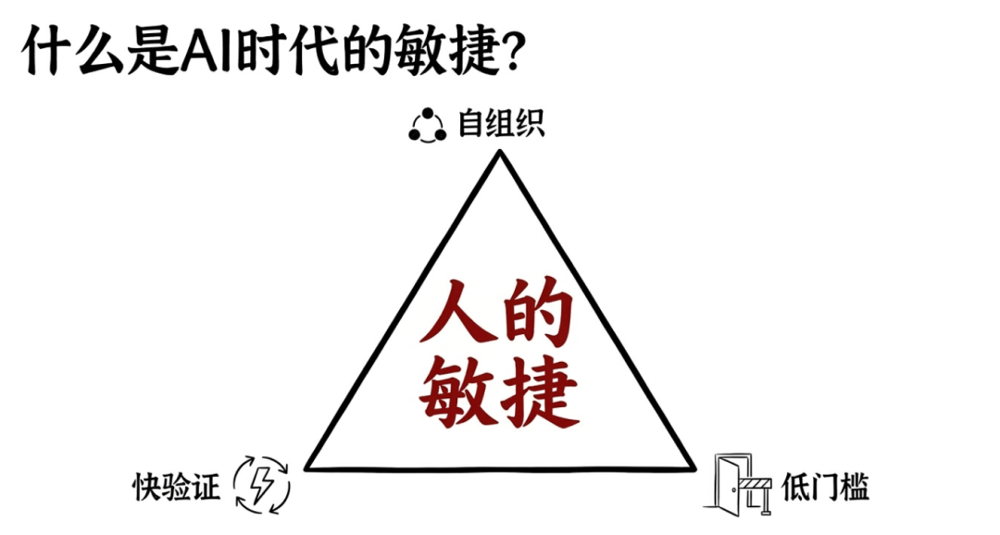

> 📎 来源: [金技局](https://mp.weixin.qq.com/s?__biz=MzE5ODU0NjU0Mg==&mid=2247484879&idx=1&sn=4a642edf58d63302e2688fc14995d08d&chksm=974927d2000270c350d4c7a3534d9fd335f289b3bdab41fe300bba6a9449a7a9dd193430ea87&mpshare=1&scene=1&srcid=0514vsRa94sCS2SyXdUHfSe3&sharer_shareinfo=925cace97740c19dfbaa6397262db437&sharer_shareinfo_first=925cace97740c19dfbaa6397262db437) | 时间: 2026-05-14 10:45

---

最近我们团队内部发生了一件小事，让我对"敏捷"这个词有了不同的理解。

起初，局长用AI花了两天时间vibe coding出一个demo，往团队群里一丢，配了一句话："这个方向我觉得有搞头，有没有感兴趣的同学一起来？工作之余搞，探索性质，一起试试。"

没有立项流程。没有资源审批。没有排期评审。

结果呢？三分钟之内，四个人主动报名，来自三个不同的专业方向。有做战略的，有做运营的，有做商务的。这些人之前并不在同一个组里，把他们聚在一起的不是组织架构图上的虚线，是一个他们都觉得"值得试一试"的想法。

一个月后，这个想法通过了老板的决策评审，正式进入开发。从一个人的demo到一个被正式立项的产品，中间只隔了三十天，而且大部分工作发生在大家的业务间隙里。

后来我和老板复盘这件事的时候意识到：这可能不是一个偶发的幸运案例。这是一种可以被复制的组织模式。于是团队负责人做了一个新的尝试，把这种"自发组团、快速验证"的方式变成团队内部的正式机制，叫做"组团制"。

今天局长想聊聊这件事背后的逻辑。

## 传统敏捷的瓶颈：人是被分配的，不是被点燃的

先说一个让很多人不舒服的事实：大多数公司讲的"敏捷"，一点都不敏捷。

你仔细看那些Scrum流程。Sprint Planning花半天，Daily Standup每天十五分钟（经常开成半小时），Sprint Review再花半天，Retrospective又半天。一个两周的Sprint，光流程仪式就吃掉了将近两天。

但真正的问题不是流程太重。真正的问题是：做事的人是被安排进来的。

一个项目立项了，leader看看手上有谁空着，把人分配过去。这些人可能对这个项目完全没有感觉，但因为"被分了"，所以就做了。做的过程中，主动性靠自觉，热情靠运气，如果刚好遇到一个好的项目经理能鼓舞士气，那就好一点，如果没有，那就是机械地完成任务、等着结项。

这在过去也不是不行。因为过去一个项目从立项到上线周期很长，三个月、半年甚至一年，你有时间慢慢磨合、慢慢建立共识。

但AI时代不允许你慢慢来了。

技术迭代按周计算，市场窗口按天计算。一个想法如果三个月后才能落地，很可能落地的那天发现市场已经变了。你需要的是一种能在几周内把一个想法从模糊变成具体、从具体变成可验证的组织能力。

靠"分配人进项目组"这种方式，跑不出这个速度。

## 组团制：让对的人因为对的理由聚在一起

回到我们团队的做法。

组团制的逻辑非常简单：任何人有了一个想法，经过初步论证之后，可以在团队内部公开发起组团，邀请感兴趣的同事自愿加入，一起把这个想法推到下一步。

几个关键设计。

第一，发起门槛要低，但不是零门槛。你不能光说"我有个想法"，你得拿出点东西来。比如局长第一次组团的时候，我没有写一份十页的方案文档，但我花两天用AI做了一个能跑的demo。看得见、摸得着。"你觉得这个方向怎么样"和"你看这个东西，它已经能跑了，你要不要一起来"，这两句话的说服力是不同量级的。

AI在这里的角色非常关键。过去你有一个想法，想让别人看到它的可能性，你需要投入大量时间做原型。现在有了vibe coding，一两天就能把一个粗糙但可感知的东西做出来。这极大地降低了"让想法被看见"的成本。过去很多好想法死在了"没有时间做出来给人看"这一步，现在这个瓶颈被AI打通了。

第二，加入是自愿的，动力来自兴趣和判断。没有人被"分配"到一个组团里。你加入是因为你看了demo之后觉得"这个事我想做"，或者"这个方向我看好"，或者"我正好有相关的资源和能力可以贡献"。这种自驱力带来的执行力，和被安排进来"反正做完考核就行"的执行力，差距是数量级的。

第三，每个团有一个"团长"，但团长不是传统意义上的管理者。团长就是最初发起想法的那个人。他可能是一个很普通的同学，没有任何管理职级，但他对这件事有最强烈的信念和最完整的思考。团长的职责不是分配任务和盯进度，而是守住方向、拉通信息、在关键节点做判断。

这跟局长之前写的一个观点高度吻合：AI时代的团队分工在加速流动，岗位边界在溶解，但这不意味着没有组织。恰恰相反，组织形态在进化。从"固定的格子装固定的人"进化成"灵活的团围绕共同的目标自组织"。团长不是因为Title高所以带队，是因为他对这件事看得最清楚所以带队。

第四，节奏极快，靠AI加速思路对齐。局长的团，四个人分散在不同方向，日常业务都很忙。但对齐效率极高。怎么做到的？每个人用AI快速把自己负责的模块梳理成结构化的方案，拿着可交互的demo直接去跟外部团队对接。不是开会讨论"我们应该怎么做"，而是直接拿东西出来说"你看这个行不行"。每个人对接一个外部团队，做那个方向的收口人，信息汇总到团群。

一个月。从想法到老板决策再到进入正式开发评审，一个月。

## 复制组团制，就是在建立"组织AI感"

一个团跑通之后，更有意思的事情发生了。

我老板做了一个很有前瞻的决定：不是把这一次的成功当成个案来总结，而是把这种模式固化下来，鼓励团队内部更多人发起组团。

后来又出现了第二个团、第三个团。每个团的团长不同、成员不同、方向不同，但底层的运转逻辑一样：有想法的人先做出demo，公开招募团友，自愿加入，快速推进，用AI加速从想法到可验证产物的全流程。

这件事让我想到我之前文章里写过的一个概念："组织AI感"。

什么叫组织AI感？就是整个组织对"AI能做什么、怎么用AI、什么场景值得用AI去试"形成了一种集体直觉。这种直觉不是靠一次培训或者一个文件传达的，是靠一次次真实的实践长出来的。

组团制恰恰就是建立组织AI感的最佳载体。

因为每一次组团，本质上都是一次"局部试错"。有人提出一个原生的想法，一群人聚在一起用AI去验证它、推进它。不管最终结果是成功立项还是验证后放弃，参与的每个人都从中积累了"能做什么、做到什么程度、在哪里会卡住"的第一手认知。

而且这种认知不是锁在一个人脑子里的。因为组团的成员来自不同方向，项目结束后他们回到各自的业务里，会把这些认知带回去。下次他们在自己的业务场景中遇到类似的问题，就会本能地想到"这个也许可以用上次的 AI经验试一下"。

这就是AI感的扩散机制。不是从上到下的文件传达，是通过人的流动和实践经验的传递，像毛细血管一样渗透到组织的每一个角落。

从这个角度来看，组团制最大的价值可能不是某个具体项目的成功，而是它让组织里越来越多的人"碰过AI、用过AI、对AI有手感"。这个集体认知的厚度，才是真正的竞争力。技术差距可以花钱追，认知差距追不上。

## 最后说两句

回头看这件事，有几个判断我越来越确信。

第一，AI时代最快的团队不是被组建的，是自己长出来的。最强的执行力不来自分配，来自自驱。当一个人因为"我相信这件事"而加入一个项目，他贡献的不只是时间，是思考、是主动性、是在遇到困难时不会轻易放弃的韧性。组团制做的最重要的事就是给这种自驱力一个最顺的出口。

第二，AI把"让想法被看见"的成本打到了极低。过去一个好想法可能因为"做不出demo""排不上期""找不到人"而死掉。现在一个人加两天时间加一个AI工具就能做出一个能跑的东西。这意味着组织中潜在的创新密度被极大地释放了。过去不是没有好想法，是好想法没有机会变成别人能看见的东西。

第三，管理者最大的杠杆不是自己做对一件事，而是设计一种机制让更多对的事自发地发生。我老板做的那个决定，把一次偶发的组团变成一种可复制的机制，这本身就是一种高级的管理能力。不是管人，是管机制。不是盯项目，是激活组织。

最后，如果你问我AI时代的敏捷到底是什么，我的回答是九个字：自组织、低门槛、快验证。

不需要完美的计划，不需要齐全的人手，不需要层层审批。需要的是一个有信念的人、一个能跑的demo、一群被点燃的队友，以及一个允许这一切发生的组织。

最好的敏捷不是流程的敏捷，是人的敏捷。而人的敏捷，需要组织给出空间。

关联阅读：

[一个HTML文件，就是最小的AI产品](https://mp.weixin.qq.com/s?__biz=MzE5ODU0NjU0Mg==&mid=2247484866&idx=1&sn=a88a25e4be69272d31ff51a3e1e32abf&scene=21#wechat_redirect)

[守住不变、局部试错、建立"组织AI感"](https://mp.weixin.qq.com/s?__biz=MzE5ODU0NjU0Mg==&mid=2247484865&idx=1&sn=3bb4fd00b288f3b0c208346a74f5dbe1&scene=21#wechat_redirect)

[AI时代的团队，不是没有分工，是分工在加速流动](https://mp.weixin.qq.com/s?__biz=MzE5ODU0NjU0Mg==&mid=2247484840&idx=1&sn=7885fc99edba4ebf4f5a62e2aef7063b&scene=21#wechat_redirect)

[岗位说明书背后的那套逻辑，正在整体性地过时](https://mp.weixin.qq.com/s?__biz=MzE5ODU0NjU0Mg==&mid=2247484838&idx=1&sn=b05bcad8560f0c901107b5750e66a71a&scene=21#wechat_redirect)

[Eval才是AI产品的真正产品力](https://mp.weixin.qq.com/s?__biz=MzE5ODU0NjU0Mg==&mid=2247484838&idx=2&sn=941069d53c9fde25f6abba239b155981&scene=21#wechat_redirect)

["差不多先上线"，是AI时代新的专业](https://mp.weixin.qq.com/s?__biz=MzE5ODU0NjU0Mg==&mid=2247484812&idx=1&sn=ac3a36ea5d6711b6213a38d9c84346c6&scene=21#wechat_redirect)
