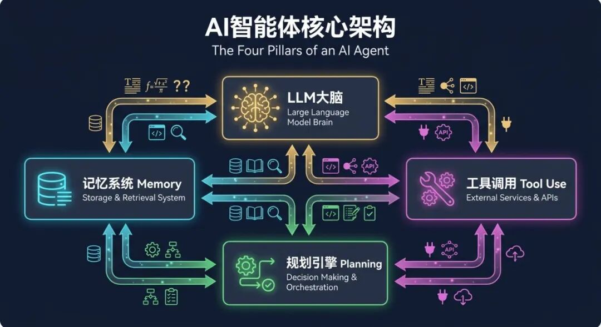
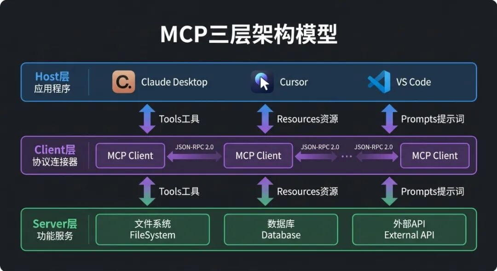
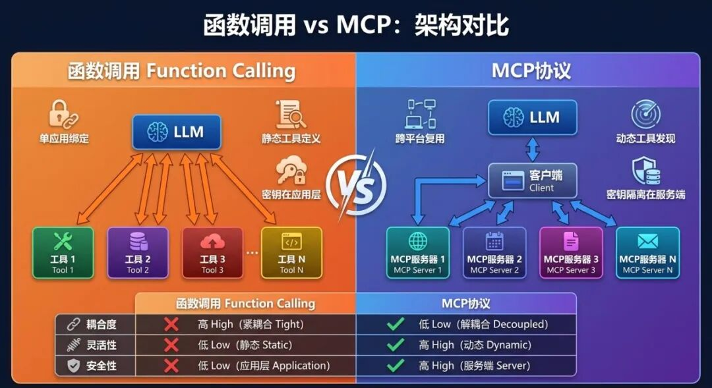
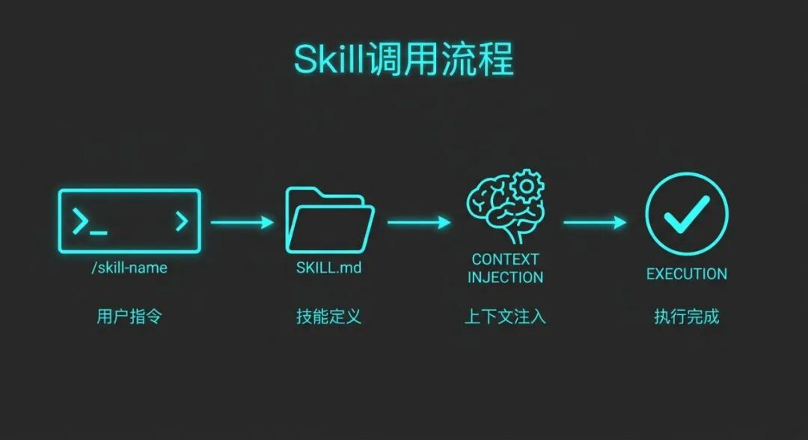
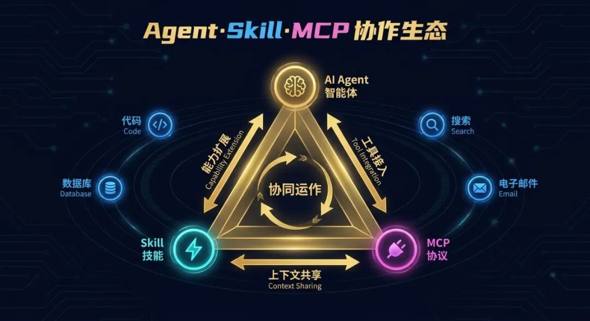
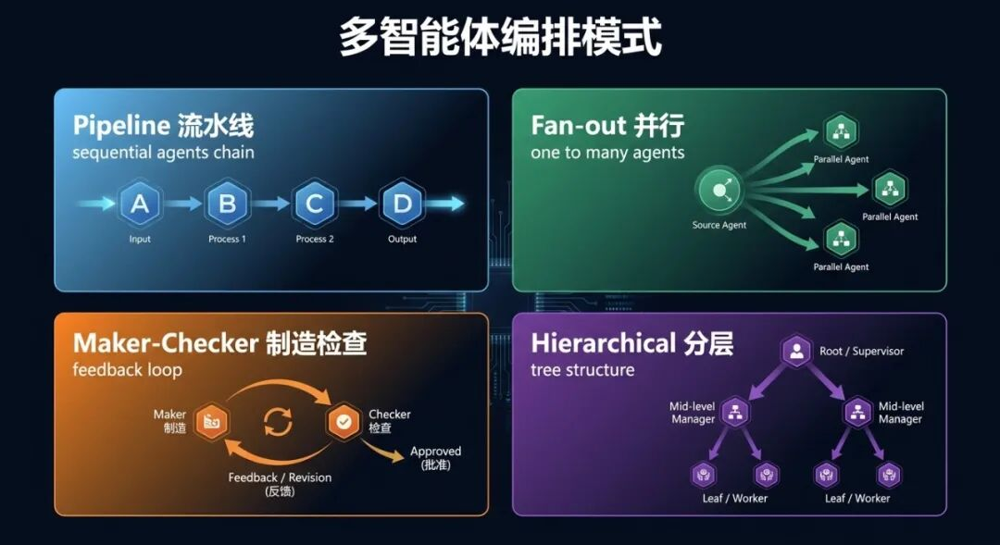
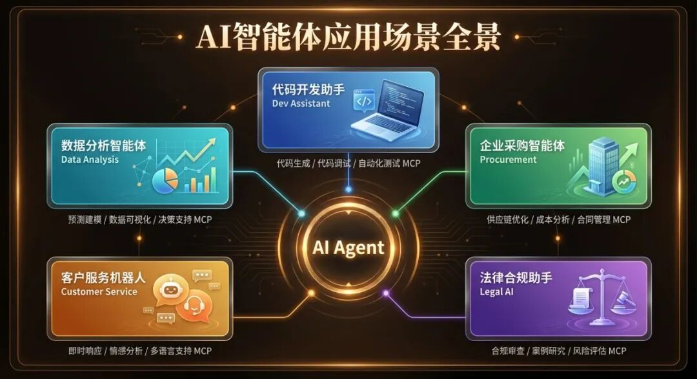

> 📎 来源: [智核视界](https://mp.weixin.qq.com/s?__biz=MzU4MzQxODEwMg==&mid=2247484371&idx=1&sn=74a047cf91fb0c58e2bdab20fe3cff40&chksm=fc920ccf43d90a972e04009c1f08ff9d5feff4ff6515394c8942b50ae9022d9b6082b7f03f15&mpshare=1&scene=1&srcid=0428hnX0FGjhMBIeDXnTFD4i&sharer_shareinfo=1693f2673c36f2b2ff13f9cecc941c36&sharer_shareinfo_first=1693f2673c36f2b2ff13f9cecc941c36) | 时间: 2026-04-28 19:44

---

如果你最近在折腾 Claude Code、Cursor 或者任何主流 AI 编程工具，你一定见过这三个词：**AI Agent**（智能体）、**Skill**（技能）、**MCP**（模型上下文协议）。它们频繁出现，彼此交织，却很少有人把三者的关系说清楚。

这篇文章就来做这件事：从实现原理出发，彻底搞懂这三个概念是什么、怎么运作，以及为什么它们必须放在一起理解。

## 一、AI智能体：不只是"会聊天的程序"

大多数人对 AI 的印象还停留在对话框——输入问题，等待回答。但今天的 AI Agent 早已超越这个框架。

一个真正的 AI 智能体能够**感知环境、制定计划、调用工具、持续记忆**，像一名员工一样独立完成多步骤任务，而不只是回答一个问题。



*图：AI智能体的四大核心组件*

**LLM大脑**是决策中心。它接收输入、理解意图、规划行动序列，决定下一步该调用哪个工具、该查询哪段记忆。

**规划引擎**负责把目标拆解成可执行的步骤。面对"帮我整理本月所有销售数据并生成报告"这类复合任务，规划引擎会分解出：①查询数据库 → ②清洗数据 → ③生成图表 → ④撰写报告，形成有序的执行链路。

**记忆系统**维护跨步骤的状态。这不只是"记住你说过什么"，更包括短期记忆（当前对话上下文）、长期记忆（用户偏好、历史操作）和外部记忆（向量数据库检索）。

**工具调用**是智能体与现实世界的接口。浏览网页、执行代码、读写文件、调用 API——这些能力将 LLM 从语言模型升级为行动主体。

Anthropic 在其研究报告《Building Effective Agents》中点明了一个关键区别：**工作流（Workflow）**通过预设代码路径编排 LLM，而**智能体（Agent）**则由 LLM 自主决定调用顺序。前者是流水线，后者是有自主意识的协作者。

## 二、MCP：AI工具集成的USB-C接口

在 MCP 诞生之前，每个 AI 应用要接入一个外部工具，都得写一套专属的集成代码。有 100 个工具就有 100 种写法，有 10 个 AI 产品就有 1000 种组合，维护成本指数级爆炸。

2024 年 11 月，Anthropic 发布了**模型上下文协议（Model Context Protocol，MCP）**，用一句话描述：AI 系统的 USB-C 接口——任何符合标准的 AI 应用都能即插即用地连接任何符合标准的工具服务。



*图：MCP的Host-Client-Server三层架构*

MCP 的架构分三层：

**Host层**是 AI 应用本身，比如 Claude Desktop、Cursor、VS Code Copilot。它包含编排逻辑，负责管理 MCP Client 的生命周期。

**Client层**是协议的连接器。每个 Client 与一个 MCP Server 保持 1:1 的连接，将用户请求转换为标准化的 JSON-RPC 2.0 消息格式。

**Server层**是真正干活的服务。每个 Server 专注一个领域——文件系统访问、数据库查询、外部 API 调用——以标准接口对外暴露三类原语：

- **Tools（工具）**

  ：可执行的操作，比如

  ```
  search_web(query)
  ```

  、

  ```
  write_file(path, content)
  ```
- **Resources（资源）**

  ：只读的数据来源，比如项目文档、数据库记录
- **Prompts（提示词）**

  ：可复用的提示词模板，让不同客户端共享相同的提示逻辑

到 2025 年底，MCP 的规范已扩展至支持 OAuth 2.1 授权框架，引入增量权限申请机制，并被 OpenAI、Google 等主流厂商相继采纳，成为 AI 工具集成的事实标准。

## 三、Function Calling 与 MCP：两个层次，不是对手

很多人把 MCP 和 Function Calling 当成竞争关系，这是个误解。它们解决的是同一条调用链上的不同问题。



*图：Function Calling 与 MCP 的核心差异对比*

**Function Calling**是 LLM 的能力——当模型判断需要执行某个操作时，输出结构化的 JSON 而非自然语言，告诉调用方"我要调用

```
get_weather(city='北京')
```

"。这是第一阶段：**意图生成**。

**MCP**是执行层的标准化协议——规定工具如何被发现、如何被调用、权限如何验证。这是第二阶段：**标准化执行**。

两者的核心差异在于：

Function Calling 的工具定义**静态硬编码**在应用里，只能用于当前这一个 Agent，换一个项目就得重写。MCP 的工具运行在独立 Server 上，**支持运行时动态发现**——Server 上线了新工具，所有接入的 AI 应用立即可用，无需改代码。

安全性上，Function Calling 把 API 密钥暴露在应用运行时，提示词泄露就可能暴露凭证。MCP 把密钥隔离在 Server 端，AI 永远不接触原始凭证。

一个成熟的生产系统里，两者通常共存：MCP 处理共享工具和跨应用集成，Function Calling 处理 Agent 特有的内部逻辑。

## 四、Skill：给智能体装载"肌肉记忆"

如果说 MCP 解决的是"如何连接外部工具"，那 Skill 解决的是"如何封装可复用的专家知识"。

一个 Skill 不是一个函数，而是一份**可复用的操作手册**——告诉 Agent 面对特定任务时，应该按什么流程、遵循什么规范、调用哪些工具来完成工作。



*图：Skill从命令到执行的完整调用链路*

以 Claude Code 的 Skill 系统为例，一个 Skill 的核心文件是

```
SKILL.md
```

，由两部分组成：

**YAML前置元数据（Frontmatter）**控制 Skill 的行为模式：

```
---name:deploydescription:部署应用到生产环境，在用户执行部署操作时自动调用model:opuscontext:forkdisable-model-invocation:false---
```

- ```
  description
  ```

  ：Claude 读取这段描述来判断何时自动激活该 Skill
- ```
  context: fork
  ```

  ：触发时在隔离的子 Agent 上下文中运行，不污染主对话
- ```
  model
  ```

  ：指定该 Skill 使用特定模型（复杂任务用 Opus，快速执行用 Sonnet）
- ```
  disable-model-invocation: true
  ```

  ：禁止自动触发，只允许用户手动

  ```
  /skill-name
  ```

  调用

**Markdown正文**是 Claude 拿到控制权后执行的操作手册，包含分步骤的流程说明、质量检查清单、对外部脚本的引用。

Skill 的加载机制采用**惰性加载（Lazy Loading）**：Claude 的 System Prompt 中只存放各 Skill 的

```
name
```

和

```
description
```

，用于意图识别；只有当 Skill 被触发时，完整的

```
SKILL.md
```

内容才注入上下文。这避免了把所有 Skill 文档都塞进上下文导致的 token 浪费。

Skill 与传统 Slash Command 的根本差别在于：Slash Command 需要人手动输入触发，而 Skill 可以**由 Claude 自主判断激活**——用户说"帮我发布这个版本"，Claude 会主动加载

```
deploy
```

Skill，而不需要用户记住具体命令名称。

## 五、三者如何协同：黄金三角的运转逻辑

现在把三者放在一起理解。



*图：AI智能体、Skill、MCP的协作生态三角*

**AI Agent**是思考与决策的核心，负责理解用户意图、制定执行计划、协调其他模块。

**Skill**是 Agent 的"肌肉记忆"——预置的专家知识和操作规范。Agent 遇到熟悉的任务类型，直接加载对应 Skill，无需从零推理操作流程。Skill 扩展了 Agent 的**能力边界**，让它成为领域专家。

**MCP**是 Agent 连接外部世界的标准化通道。无论 Skill 里描述的操作需要读数据库、调 API 还是执行代码，都通过 MCP 协议与对应的 Server 通信。MCP 解决**工具接入**问题，让 Agent 的工具箱随时可扩展。

三者的分工用一句话总结：**Agent 决定做什么，Skill 知道怎么做，MCP 负责执行**。

一个典型的协同场景：用户对 AI 编程助手说"帮我把新功能提交并部署到测试环境"。Agent 识别出这是部署任务，自动加载

```
deploy
```

Skill；Skill 的操作手册指导 Agent 依次执行：代码检查 → 运行测试 → 打包构建 → 触发部署；每个步骤的实际操作（调用 CI/CD API、写日志文件、发送通知）都通过 MCP 协议与对应的 Server 交互。整个过程，用户只说了一句话。

## 六、多智能体：协作改变边界

单个 Agent 有上下文窗口和专业深度的天花板，多智能体系统（Multi-Agent System）通过分工协作突破这一限制。



*图：四种主流多智能体编排模式*

**流水线模式（Pipeline）**：任务在多个专职 Agent 间串行流转，每个 Agent 只做自己最擅长的一步。内容生成流水线可能包括：搜集资料的 Research Agent → 撰写初稿的 Writer Agent → 审核质量的 Editor Agent。

**并行模式（Fan-out）**：主编排 Agent 将任务拆分后同时下发给多个专家 Agent，最后汇总结果。适合相互独立的子任务，大幅缩短总耗时。

**制造者-检查者模式（Maker-Checker）**：Maker Agent 生成输出，Checker Agent 按标准评审，不通过则打回修改，形成质量自检闭环。代码生成场景中，Maker 写代码，Checker 跑测试并反馈错误，直到代码通过所有用例。

**分层编排模式（Hierarchical）**：主 Agent 负责全局规划和子任务分发，下级专家 Agent 各司其职。适合目标复杂、子任务异构的场景，是目前大型 AI 系统的主流架构。

每个子 Agent 都可以有自己独立的 Skill 集合和 MCP Server 配置，整个多智能体网络因此具备高度灵活的能力组合。

## 七、真实应用场景：它们已经在工作了

这套体系不是纸上谈兵，它正在真实场景中运转。



*图：五大行业的AI智能体落地场景*

**代码开发助手**：Claude Code 就是最典型的案例。Skill 封装了 code-review、deploy、test 等开发规范，MCP Server 接入本地文件系统、GitHub、CI/CD 平台，Agent 可以从理解需求到提交代码全程自主执行。

**企业采购智能体**：Agent 通过 MCP 连接内部物料数据库、供应商 API 和价格系统，用 Skill 封装询价流程和合规检查规范，实现从需求提交到比价下单的全自动采购流水线。

**法律合规助手**：Agent 通过 MCP Resource 接入法规数据库，用 Skill 封装合同审查标准，自动标注风险条款、生成合规报告。多 Agent 协作时，一个负责检索，一个负责分析，一个负责生成报告。

**客户服务机器人**：Skills 封装了不同产品线的服务流程，MCP 接入工单系统、CRM、知识库，Agent 能够理解问题、查询历史、执行退款等操作，真正"解决问题"而非"回答问题"。

**数据分析智能体**：Agent 通过 MCP 连接数据仓库，用 Skill 封装数据分析方法论，自动执行数据探索 → 假设验证 → 可视化生成 → 洞察报告的全流程。

## 结语

AI Agent、Skill、MCP 不是三个独立的技术，而是一套分工明确、相互依赖的系统：

- **Agent**

  ：有意志的决策者，负责理解目标和统筹全局
- **Skill**

  ：可复用的专家知识，赋予 Agent 领域深度
- **MCP**

  ：标准化的能力总线，让 Agent 连接无限工具

这套体系正从实验室走向生产环境。理解它们的运作原理，不只是为了跟上技术潮流，更是为了真正掌握下一代 AI 系统的设计逻辑。

当你的下一个项目需要构建一个能自主完成复杂任务的 AI 系统时，这个黄金三角就是你的设计起点。

官方文档：
- Anthropic MCP规范：https://modelcontextprotocol.io/specification/2025-11-25
- Claude Code Skills：https://code.claude.com/docs/en/skills
- Building Effective Agents：https://www.anthropic.com/research/building-effective-agents
