> 📎 来源: [空格的键盘](https://mp.weixin.qq.com/s?__biz=MzkxMTQ0ODE3Ng==&mid=2247494554&idx=1&sn=ae7244ffb4e16c904fb50446d532660d&chksm=c036d4fb04c0707a4e39e6fa499a9faf6271afe9234d0e89190f79b2262d8ed015793ce41a6c&mpshare=1&scene=1&srcid=0421sPi68N23b3zI1I07c96U&sharer_shareinfo=430756a5abbbc3a70907ceed38ef81d5&sharer_shareinfo_first=430756a5abbbc3a70907ceed38ef81d5) | 时间: 2026-04-21 11:58

---

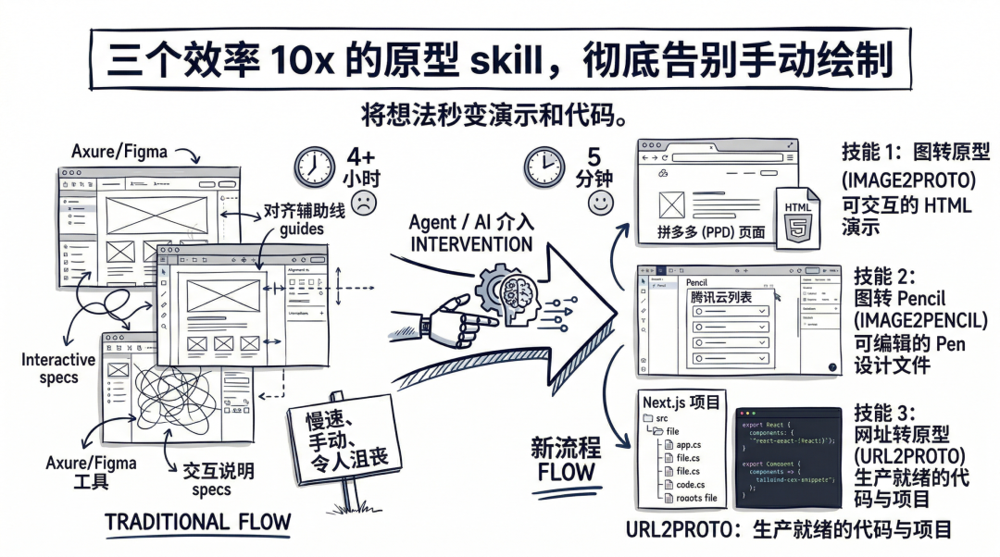

作为在一线工作了快七年的产品经理，这一年我几乎没再用过设计工具画原型。

根据我这一年用 AI 画原型的经验，我提炼了3个画原型的skill。

在之前分享的那个画原型的基础上，我又基于反馈，新增了两个。

效果好到爆炸，几乎可以覆盖所有的画原型需求。

在分享之前，我们先回顾下传统的画原型的流程：

**打开****Axure/****Figma→从组件库里拖控件→对齐间距→标注交互→导出切图→写设计说明→****评审****。**

现在的流程变成了：

**截图→Agent 处理→原型和设计文档一起出来→口头描述调节细节→****评审****。**

整个过程从半天压缩到几分钟。提升至少 10 倍。

01 三个 Skill 做三件不同的事

**1 image2proto：**

**截图进去，****输出****可运行的 HTML 原型出来**

一张截图丢给 AI，直接生成一个单 HTML 文件，浏览器打开就能交互。Tab 能切换、弹窗能开关、筛选栏能展开，所有 CSS 和 JS 打包在一个文件里，发给任何人都能直接打开，不用装环境。

适合快速验证、单页面、轻量修改。老板说"下午开会先看看效果"，这个最快。

下面是我用它做了一个拼多多页面的原型，左边是原图，右边是修改后的：

输入：


输出：

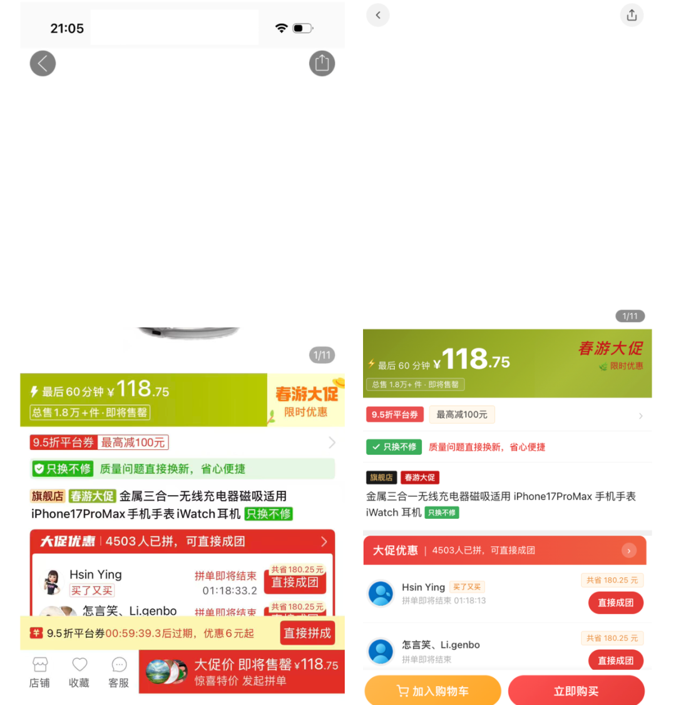

skill 地址：github.com/zephyrwang6/pm-skills/tree/main/pm-image2proto

**2 image2pencil：**

**截图进去，****输出可修改的****Pencil 设计稿****。**

Pencil 是前段时间火起来的给Agent使用的设计工具。

同样是一张截图，但输出的是 Pencil 格式的 .pen 设计文件，**同时在画布旁边自动生成结构化的设计文档。**

生成之后可以直接用 Pencil 工具打开，手动微调每一个细节。

适合需要人工介入精修的场景。AI 先出 80%，人再改 20%。交付的不只是设计图，还有字段说明、交互规则、视觉规范，评审时一目了然。

**示例：**

我用了一张腾讯云的页面截图，这种适合 B 端场景的原型。

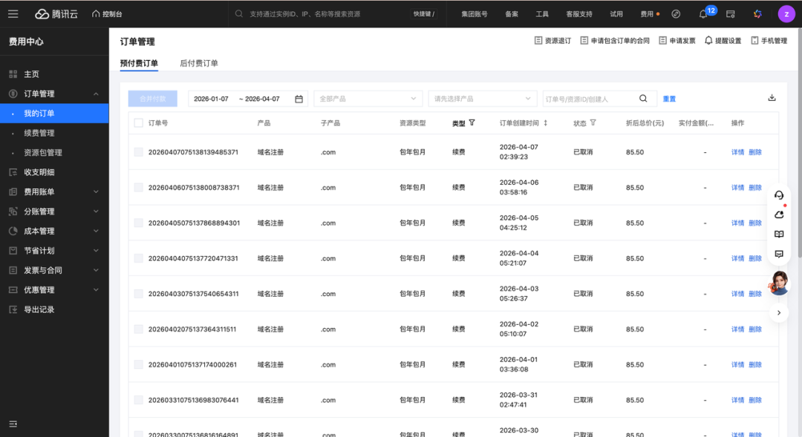

输入：把这个列表的字体改成蓝色。，同时增加一个按价格筛选的框。

输出：每一个元素都支持在 pencil 里修改

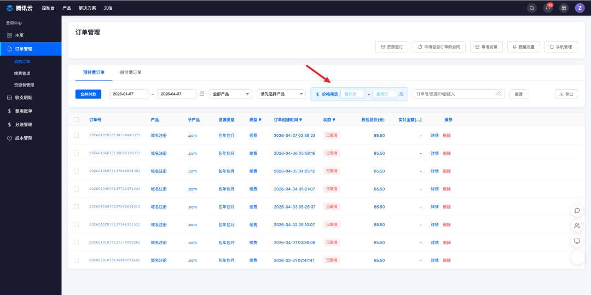

还有一个完善的可编辑的设计文档

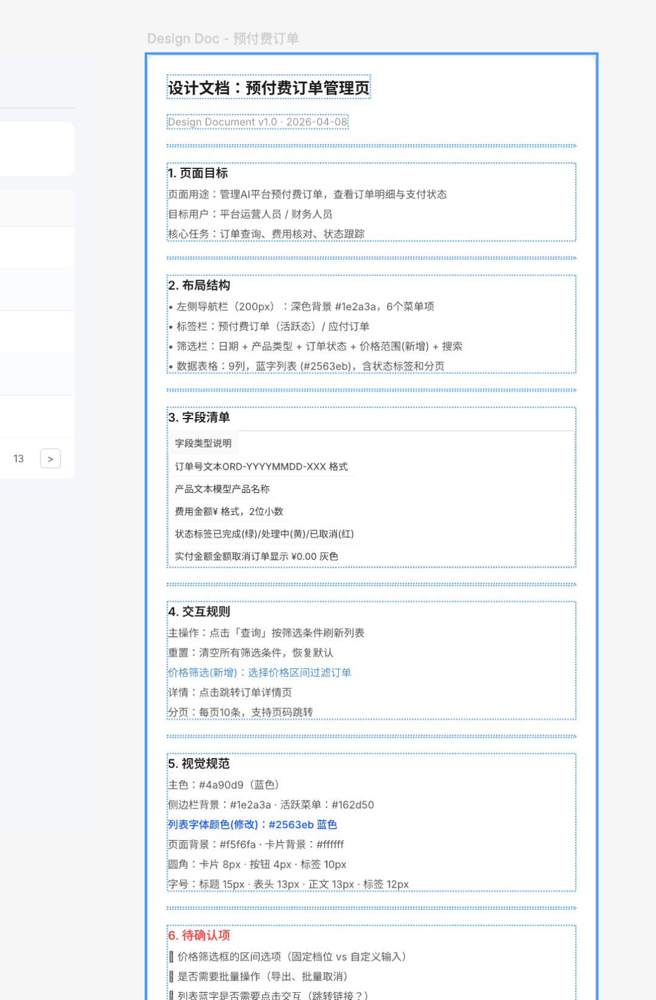

Skill 地址：github.com/zephyrwang6/pm-skills/tree/main/pm-image2pencil

pencil 的使用教程

- 安装 pencil 客户端：可以在这里下载安装，openpencil.dev，也可以在 cursor 这样 IDE 插件里安装
- 安装 pencil 的 mcp，在你的终端命令行输入：

```
bun add -g @open-pencil/mcp
```

- 使用 Agent 调用 MCP 就能在 pencil 里绘图

**3 url2proto：**

**网址进去，****输出****Next.js 本地项目****。**

给一个网址或图片，AI 自动抓取页面结构、设计 token、组件层级，然后用 React 组件重新搭建成一个完整的 Next.js + Tailwind CSS 项目。

工程化代码，能在本地跑、能改、能持续迭代。

适合大型项目、多页面协同、持续迭代的场景。竞品分析、新产品原型、前端快速启动，都从这里开始。

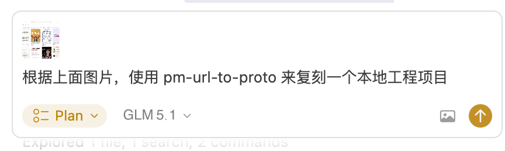

原页面，这里用了小红书的网页端页面。

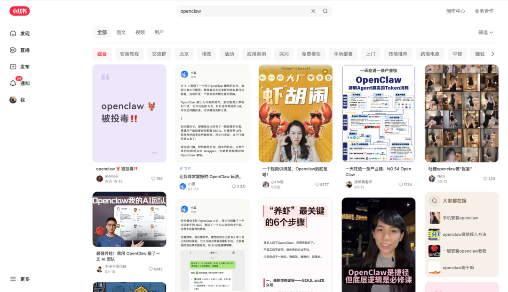

它先读取了完整的页面结构和样式信息。然后自己规划了项目架构，初始化了 Next.js 项目，配置 Tailwind CSS，开始逐个组件拆分还原。导航栏、侧边栏、卡片列表，一块一块地写。

下面是它复刻的本地化工程文件，几十个代码文件，很全面。

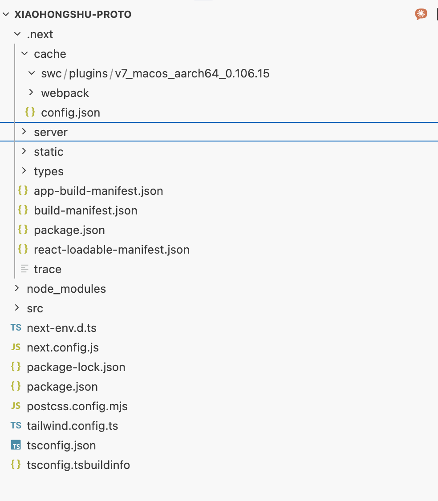

中间遇到了几次样式对不上的情况，它自己对比了原页面和本地渲染的差异，调整了布局参数。有一个组件的响应式断点没处理好，它也自己排查修掉了，全程没问我。

大概跑了半个多小时，任务完成。本地项目部署好了，浏览器打开直接能看到效果。出来的东西超出预期。项目结构清晰，组件拆分合理。

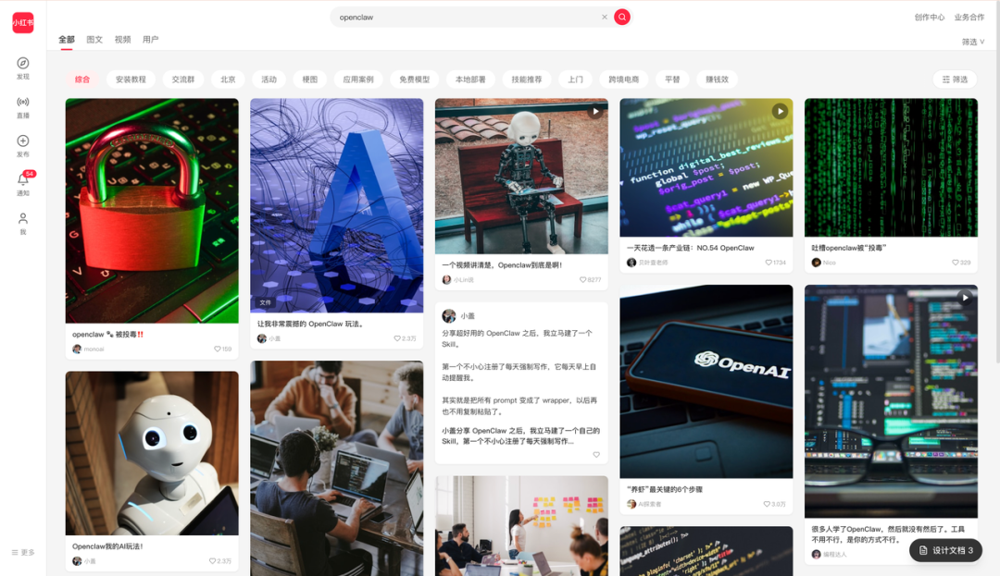

还附带了一份设计文档，记录了页面的布局逻辑、组件层级、交互说明。拿来做产品原型完全够用，甚至可以直接在这个基础上继续开发。

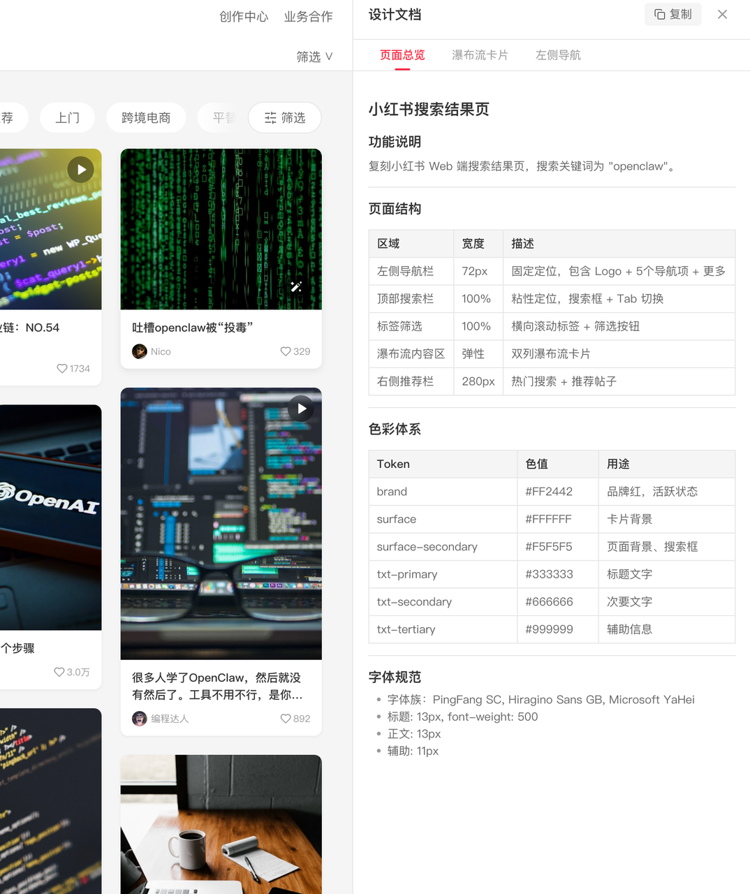

Skill 地址：github.com/zephyrwang6/pm-skills/tree/main/url2proto

如果这个设计文档的格式不满意，可以随便修改 skill，把你常用的模板整理发给Agent说：请按照这个模板修改 skill 里的设计文档，以后都按这个 格式输出。

这几个 skill怎么选，具体来说：

- 会议前 5 分钟出个 Demo → image2proto
- 需要精细化修改原型→ image2pencil
- 新产品原型搭建，多页面持续迭代 → url2proto
- 竞品截图快速出可交互 Demo → image2proto
- 竞品网站深度复刻 → url2proto
- 多状态设计稿交付 → image2pencil

02 不只是画原型

关于产品经理的相关的 skill，包括竞品分析、数据分析、绘制流程图，我都做了 skill，

全在这个仓库：https://github.com/zephyrwang6/pm-skills

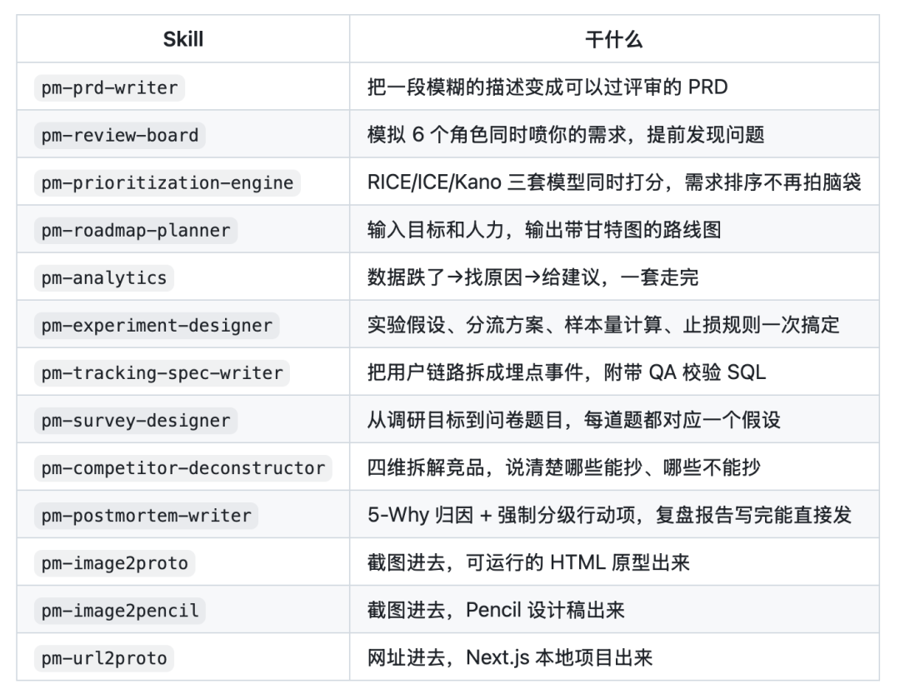

03 最后

三个 Skill 解决的是同一个问题：缩短从想法到可沟通原型之间的距离。区别只在于输出物的形态不同，适配的工作流不同。

一年前画一个弹窗原型要半天，现在截一张图，说一句话，原型就好了。省下来的时间用来想需求本身，这才是产品经理该花时间的地方。

关于 skill 和生产力提升的系统学习，如果需要，可以订阅专栏加入社群：


我是空格，持续分享 AI 产品的思考与实践。
