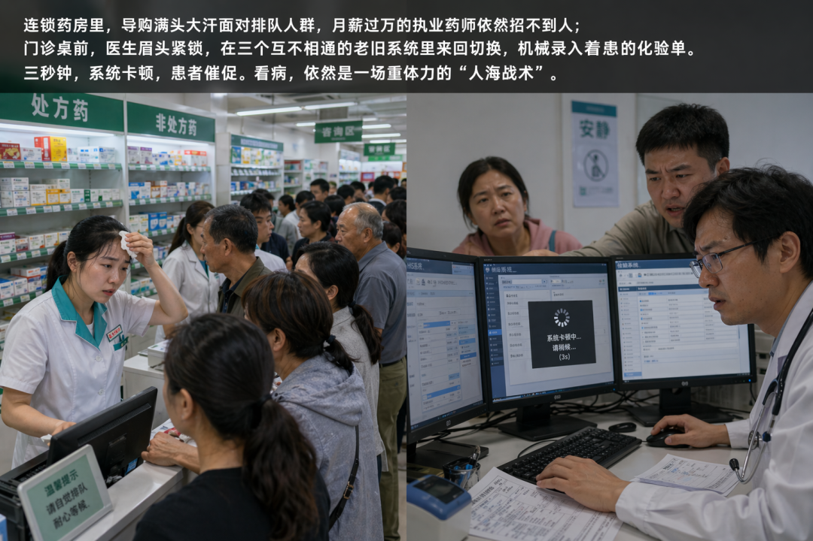
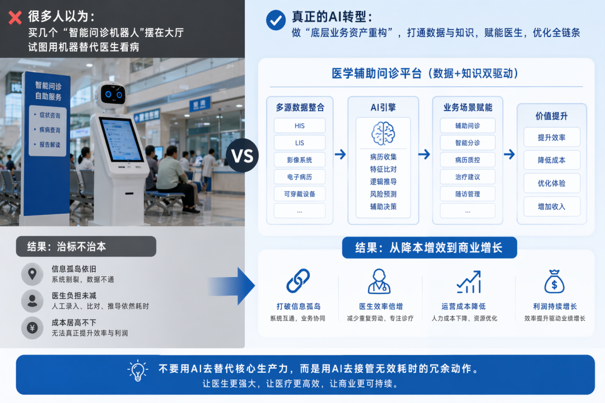
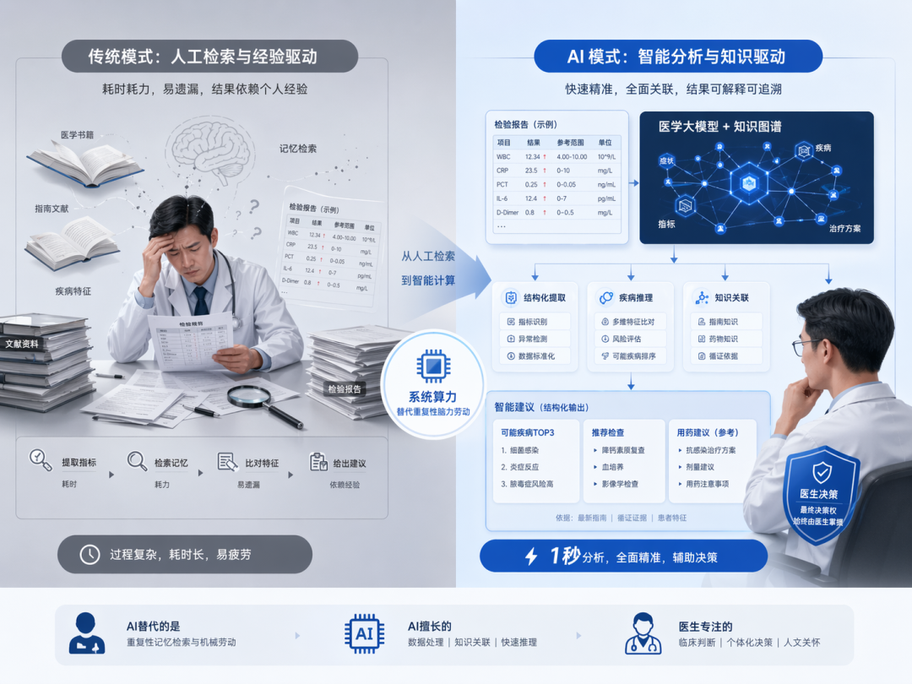
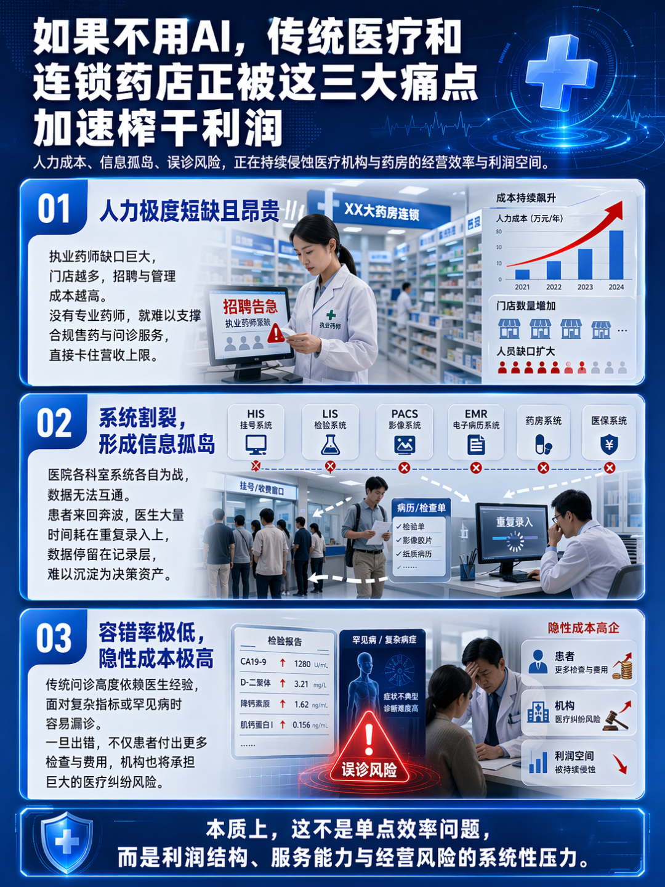
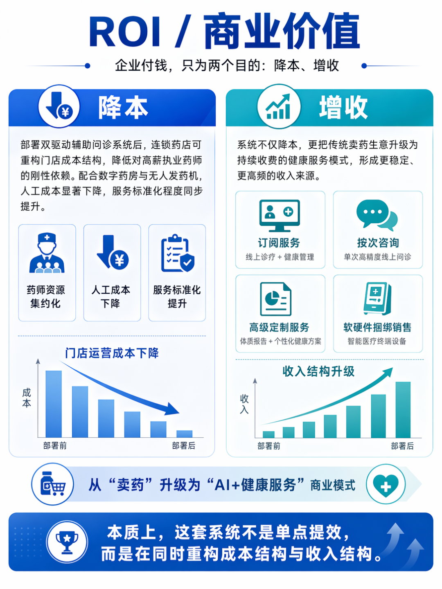
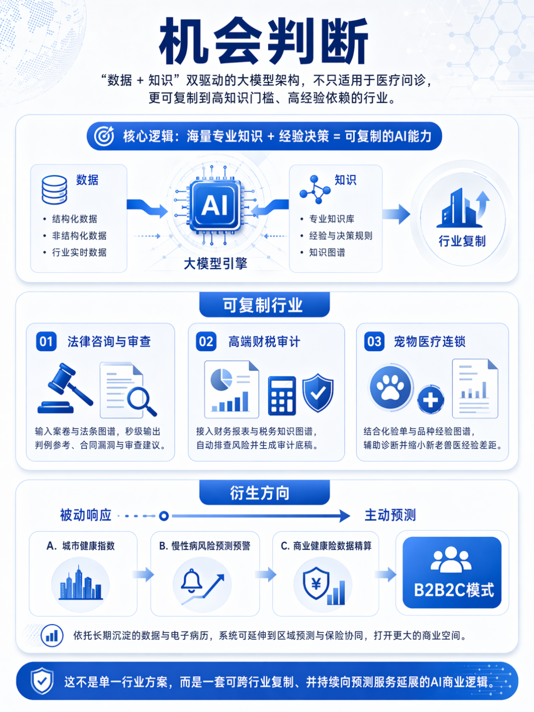
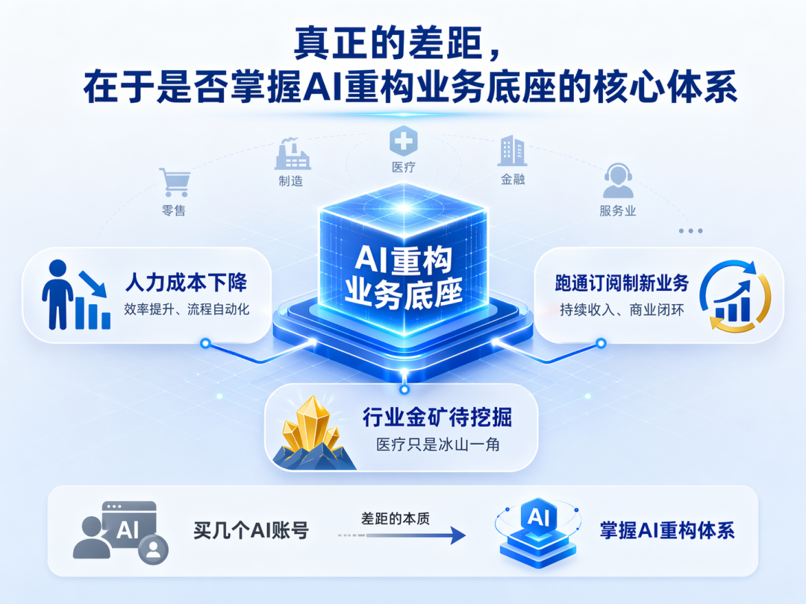

> 📎 来源: [AI应用引擎](https://mp.weixin.qq.com/s?__biz=MzcxMDAyNjAyNg==&mid=2247484349&idx=1&sn=2d65a27b55aa3b513e80d26affca9a63&chksm=f4bb1a2246e4400b913976e2c7c2e92d582261ca5b000d0972e8bbbb0da22f16b061a87ffbf8&mpshare=1&scene=1&srcid=04248wib8J6rVyBI8pCNtYhI&sharer_shareinfo=e212725f5ce1f06ee9788fc01aecd59c&sharer_shareinfo_first=e212725f5ce1f06ee9788fc01aecd59c) | 时间: 2026-04-24 21:53

---

1

**一.场景回顾**

连锁药房里，导购满头大汗面对排队人群，月薪过万的执业药师依然招不到人；门诊桌前，医生眉头紧锁，在三个互不相通的老旧系统里来回切换，机械录入着患者的化验单。系统卡顿，患者催促。看病，依然是一场重体力的“人海战术”。

2

**二、打脸认知**

 很多人以为，医疗行业做AI转型，就是花重金买几个冷冰冰的“智能问诊机器人”摆在大厅，试图用机器去替代医生看病。

大错特错。

在这个由“数据+知识”双驱动的医学辅助问诊项目中，他们看似在做“智能问诊平台”，**本质上却是在做“底层业务资产重构”。**

真正的AI商业化落地，从不追求造出一个全知全能的赛博神医。它真正在做的事，是**彻底粉碎那些阻碍利润增长的“信息孤岛”。**当同行还在为了招募执业药师打价格战时，这套系统已经悄悄**接管了医疗链条中最繁琐的病历收集、特征比对和逻辑推导工作。**不要用AI去替代核心生产力，而是用AI去接管无效耗时的冗余动作。

3

**三、项目本质**

剥开医疗服务的外衣，这个项目的核心价值非常冰冷且锋利：用系统算力，替代人类的“机械录入与记忆检索动作”。

传统模式下，医生或药师进行初步诊断，极度依赖个人的直觉和经验积累。面对一份复杂的检验报告单，人类大脑需要先提取十几个生化指标，再去大脑记忆库中匹配对应的疾病特征，最后给出用药建议。

这个过程存在两个致命瓶颈：人的记忆容量有上限，人的状态会疲劳。

该系统本质上替代了“人脑从海量文献中大海捞针”的动作。**通过深度紧耦合的大模型与知识图谱**，系统能在1秒内提取化验单特征，链式推理出潜在疾病，并直接生成结构化的诊疗建议。它替代的不是医生的最终决策权，而是医生做出决策前那长达数十分钟的“翻找、对比、排查”的人类苦力动作。

4

**四、行业痛点**

如果不用AI，传统医疗和连锁药店正在被以下三大痛点加速榨干利润：

1. **人力极度短缺且昂贵。**执业药师人才缺口巨大，连锁药房开得越多，专业人员的招聘成本和管理成本就呈指数级飙升。没有专业药师，就无法提供合规的处方药销售与问诊服务，直接卡死营收上限。
2. **系统割裂引发的“信息孤岛”。**医院内部各个科室的业务系统各自为战，数据无法互通。患者拿着纸质病历在各个窗口奔波，医生每天大量的时间浪费在重复录入数据上，数据只用于记录，根本无法形成决策资产。
3. **极低的容错率与高昂的隐性成本。**高度依赖医生直觉的传统问诊，面对罕见病或复杂指标时极易发生漏诊。错误一旦发生，不仅患者面临过度检查和高昂费用的痛点，机构自身也面临巨大的医疗纠纷风险。

5

**五、AI解决方案**

一套真正能落地的AI系统，必须跑通“输入-处理-输出”的全闭环。该系统打造了无懈可击的处理流：

- 输入端：多模态数据一键接入。不再依赖人工键盘敲击。患者的纸质病历、化验单PDF、甚至是口述的零散症状描述，全部通过终端设备直接提取、转化为系统可读的标准化文本。
- 处理端：“大模型+知识图谱”的链式推理。这里没有单纯依赖容易产生幻觉的通用大模型。系统将医学知识库中的事实进行细粒度切割。当数据进入系统，内容感知检索增强生成（RAG）机制瞬间启动。系统自动在海量医学图谱中找到最匹配的实体，并利用上下文学习等技术。这一步，系统不仅在做加法，更在做“清洗”，确保送入大脑的数据毫无杂质。
- 输出端：秒级生成行动指令。对于医生：屏幕上直接弹出高亮的关键异常指标、基于临床指南的处置建议以及相关的医学文献支撑，辅助精准断诊。 对于患者/药店：自动生成带有高度个性化的用药指导、康复食谱和生活作息调整方案，甚至直接驱动无人药房自动发药。

6

**六、ROI/商业价值**

**企业付钱，只为两个目的：降本、增收。**这套AI系统将这两点做到了极致。

**先看降本。**通过部署这套双驱动辅助问诊系统，连锁零售药店可以直接重构门店成本结构。以往每家店必须高薪标配的专业执业药师，现在可以实现资源的大幅集约化。配合数字药房与无人发药机，**人工成本呈现断崖式下降，而服务标准化程度却直线****拉满。**

**再看增收。**这套系统的计费模式堪称教科书级别的商业升维，直接将原本“一锤子买卖”的卖药生意，升级为“持续收费”的SaaS服务：

1. **千万级订阅服务：**患者可以按月或按年付费订阅线上诊疗与全天候健康管理服务。系统自动追踪数据、发送复诊提醒与养生食谱。把低频的看病，变成高频的健康订阅。
2. **按次付费咨询：**针对非会员，提供单次的高精度线上问诊，直接创造现金流。
3. **高级定制服务溢价：**根据系统深度分析生成的个性化体质报告，提供高客单价的定制健康管理计划与特配茶饮、食谱。
4. **软硬件捆绑销售：**向基层医疗机构打包售卖搭载该系统的智能医疗终端设备。

7

**七、机会判断**

看懂了这个逻辑，你会发现，这种“**数据+知识**”双驱动的大模型架构，根本不局限于医疗问诊。凡是存在“**海量专业知识门槛”+“高度依赖人工经验决策**”的行业，都可以被这套逻辑无缝复制。

可复制行业：

- **法律咨询与审查：**输入海量案卷与法条图谱，系统秒级输出判例参考与合同漏洞，彻底取代初级律师的检索工作。
- **高端财税审计**：将散落的财务报表接入税务知识图谱，自动排查税务风险，生成审计底稿。
- **宠物医疗连锁：**宠物无法说话，更加依赖化验单与品种经验图谱，AI辅助诊断能瞬间拉平新兽医与老兽医的经验差距。
- **衍生方向：**从“被动响应”向“主动预测”延伸。依托系统沉淀的城市健康指数与个人长效电子病历，可以衍生出区域慢性病风险预测预警服务，直接与商业健康险公司的数据精算业务打通，跑出更具想象力的B2B/B2C模式。

8

**八、总结**

       真正的差距，从来不在于你有没有买几个AI账号，而**在于你有没有掌握用AI重构业务底座的核心体系**。

       一套好的AI系统，不仅能帮你砍掉一半的人力成本，更能帮你无缝跑通年入千万的订阅制新业务。这套医疗领域的双驱动模型，只是AI改造传统实体的冰山一角。你的行业，其实也藏着这样一座未被挖掘的金矿。

如果您在观望AI机会或者企业处在AI转型阶段，请关注：

