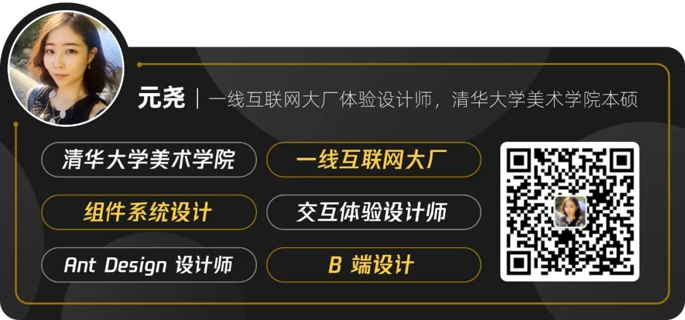
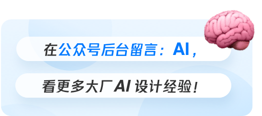
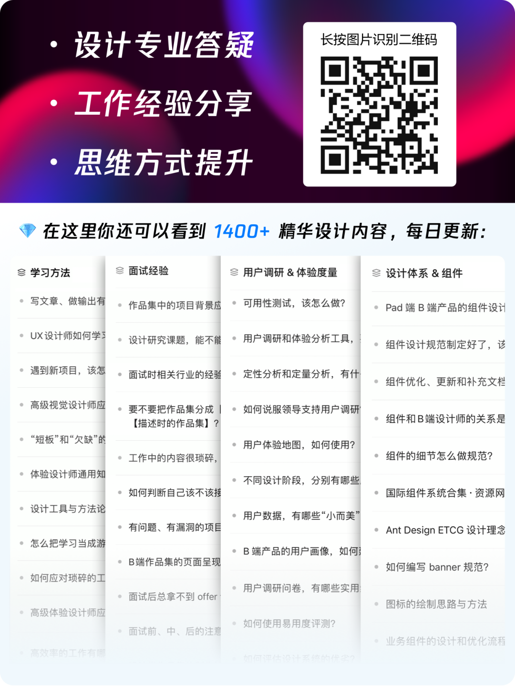
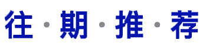

> 📎 来源: [长弓小子](https://mp.weixin.qq.com/s?__biz=MzU2NDA1Mjk4OQ==&mid=2247504260&idx=1&sn=799b25abcd6d39e333cbe7a1f962cf04&chksm=fdb4a5eb82a571bbf3b44e6d008a8385bd3e31c3777864e9ded0cb7207a36191a6a8f55ff36b&mpshare=1&scene=1&srcid=0427TWt5ZelHJ6GDUNVSqMjP&sharer_shareinfo=55a098c7451f99ef33fc380b40011149&sharer_shareinfo_first=55a098c7451f99ef33fc380b40011149) | 时间: 2026-04-27 16:15

---

⬆️ 关注**「长弓小子」**看更多设计干货！

Hi，我是元尧。记得将我设为星标 ⭐️ ，不错过每一条来自大厂的设计经验分享。

欢迎长按下图二维码加我微信，带你进设计师交流群，与上万小伙伴一起交流成长！

**「👇 添加好友请备注：设计交流」**

全文共 2272 字，阅读需要 7 分钟

当下 AI 技术迭代速度飞快，**Prompt、Skill、**Project、****MCP****这四个词汇频繁出现，也成为解锁 AI 高效工作的关键。但很多人对这四个概念一知半解，本文就为大家拆解下这四个词的核心概念和应用场景，并看看它们可以为设计环节带来哪些提效作用。

Definition‍‍‍‍‍‍‍

****核心概念****

‍‍‍‍‍‍

1. Prompt（提示词）

AI 的“基础指令”，沟通的启动信号

大家对于 Prompt 应该并不陌生，就是你给 AI 的**自然语言指令**，也是控制 AI 输出的最基础工具。比如你说“帮我画一张简约风的手机 APP 启动页”“帮我优化这张海报的排版”等等，这些都是 Prompt。它的核心作用是传递你的需求，让 AI 听懂“你要做什么、想要什么样的结果”。Prompt 特点如下：

- 门槛极低：不用懂代码，纯文本输入就能用，是 AI 新手的首选操作；
- 复用性差：基本属于一次性操作。比如这次写的“简约 App 启动页”提示词，下次要做同类页面，还要重新描述风格、色调，而同样的需求描述，也会得到不同的生成结果。

因此 Prompt 更适用简单、一次性的轻量任务，比如临时写一段文案、查一个简单知识点、补一张海报设计，而非长期复用需求的场景。

2. Skill（技能包）

AI 的“专业能力库”，可复用的方法论

Skill 是**可复用、可组合、按需加载的专业知识包**，本质是“教给 AI 一整套工作方法”，而不是每次只教它“解一道题”。Skill 可以把某类任务的标准化流程、方法论、操作步骤封装起来喂给 AI，让 AI 成为某个领域的“专家”。

我们在电影《黑客帝国》中能看到一个与之相似的经典片段：女主角崔妮蒂从没有开过飞机，但通过黑客同伴直接把 “驾驶直升机” 的技能程序下载进大脑，她立刻就能熟练操控飞机升空。这个技能程序就是 Skill。

再比如你经常需要做竞品分析，就可以把你做竞品分析的“流程、维度、输出格式”等一系列的要求和方法封装成一个 Skill，直接喂给 AI，AI 就能按照你所设定的统一标准完成竞品分析工作，不用你再反复对 AI 输入相关的 Prompt。由此可见，Skill 的核心特点是：

- 节省成本：既节省了人力、时间，也解决了 AI 在运行中消耗大量的 Token 问题；
- 风格一致：同一个 Skill 输出的结果，风格、结构完全统一，复用性极强，还能分享给团队、社区。
- 生态成熟：主流 AI Coding 工具均兼容，GitHub 上也有大量现成的 Skills 库，可以直接使用，不用从零搭建；

因此 Skill 更适用于有固定流程的重复性的复杂任务，比如竞品分析、代码审查、文案写作、文档处理等，适合个人/团队沉淀工作方法论，减少重复劳动。

3. Project（项目/工作区）

AI 的 "专属工作室"，持久化的任务空间

你也许也发现了，用 AI 处理复杂任务时，每次提问都要重新上传背景资料，Project 就是为解决这个问题而生的，它是 AI 处理复杂任务的**独立、持久化的工作区**，核心作用是存放一个任务的所有背景资料、中间成果、知识库和规则，让 AI 在这个空间内持续利用这些内容，无需重复上传或解释。

举个例子，你可以把一个设计项目的所有资料比如品牌 VI 规范、参考图、客户需求文档、中间设计草稿、修改意见，都上传到这个工作区，AI 在这个空间里持续干活，**不用你反复上传文件、反复解释设计背景、反复强调规范要求**。Project 的核心特点是：

- 持久管理：实现上下文持久化管理，告别一问一答的碎片化互动，复杂任务推进更连贯；
- 迭代修正：适配真实世界的复杂工作，比如从 0 到 1 做一个项目、设计一套技术方案、撰写一份长篇报告等等，这类工作需要拆解步骤、迭代修正，Project 能让所有相关资料全程可用，并能够基于上一步结果持续优化。

因此 Project 更适用的场景是：有完整流程的复杂任务，需要多步骤推进、长期的项目型工作。

4. MCP（Model Context Protocol）

AI 的 "现实桥梁"，外接工具与数据的协议

如果说 Prompt 是“让 AI 听懂话”，那 MCP 就是“让 AI 能接触现实”。它的全称是模型上下文协议，核心定位是让 AI 安全、规范地接入外部数据源/工具的开放标准。用大白话来说：就是给 AI 接上“外部手脚”，让它不再“闭门造车”，比如访问企业数据库、调用业务 API、查询实时数据（如股票、天气）等，都需要 MCP 来实现。MCP 的核心特点是：

- 本质是远程工具/数据服务协议，独立于 AI 主程序运行，能实现故障隔离，比如外部工具出问题，不会影响到 AI 本身；
- 配置复杂：需要自己搭建 Server、处理认证，而且工具描述和调用过程会导致Token 消耗极高，维护成本也高。

因此，MCP 适用于需要外部实时数据/工具的复杂工作场景，需要跨平台数据同步、功能插件调用等。

Connection

****四者关系****

以上这四个概念，不是替代关系，而是协同配合以形成 AI 工作的完整环节，从基础指令下达，到专业落地执行，串联起一套完整的 AI 工作流，让 AI 更高效、稳定、准确、可复用地帮我们干活：

Prompt：为 AI 下达看得懂、听得懂的指令；

Skill：让 AI 做事更专业，输出更稳定、一致；

Project：为 AI 提供专属的空间存放项目资料；

MCP：让 AI 连接外部资源、工具、数据库等。

举个例子，假设你是设计师，你的工作流程可以是：

- 先预设出需要用 Prompt 说清楚的具体设计需求，比如“帮我生成 3 组 XXX 品牌的美妆电商主图”；

- 进入专属 Project 工作区，这里已预先归档并管理该产品品牌营销活动需要的 VI 规范、色值、字体、产品实拍图、logo 源文件等全部项目素材，在 Prompt 中命令 AI 可直接调用，保证输出不离谱、不跑偏。

- 同时启用对应 Skills 专业能力模块，比如“电商主图标准化处理能力”，让 AI 按统一规则构图、排版、调色、打标，输出更稳定、一致、专业的成稿。

- 生图之后，如需在整个产品的交互页面中进行主图设计方案的预览和进一步细化，可以在 Figma Make 中调用绑定团队组件库的 MCP 能力，让 AI 直接使用公司业务组件库中的组件、样式规范与设计效果，自动按既有的组件设计语言进行修正细节、对齐组件风格，最终快速落地高可用、可直接上线的交互设计稿。

我也会持续为你分享和总结相关的经验和案例。公众号后台回复 “AI”，看更多大厂 AI 设计工作经验：

---

更多干货硬核内容，欢迎识别下图二维码，加入我们知识社群获取👇👇👇，有任何设计问题也都可以**向我****提问，有问必答，答必有获**：

如果你想加入**设计师交流群**，也可以识别二维码👇👇👇添加我的微信。**添加好友请备注：设计交流。**

学海无涯，盼你同舟！😊

**[>  经验｜GenUI 时代的组件库如何发展？](https://mp.weixin.qq.com/s?__biz=MzU2NDA1Mjk4OQ==&mid=2247504080&idx=1&sn=4857f490382e6ed4e2fba7d00df83ea0&scene=21#wechat_redirect)****‍‍‍‍‍‍‍‍‍‍‍‍**

**[>  经验｜为什么定制化 Agent 才是趋势？](https://mp.weixin.qq.com/s?__biz=MzU2NDA1Mjk4OQ==&mid=2247504020&idx=1&sn=68c54d1dc0a66c0b2aa05a7439cb12ba&scene=21#wechat_redirect)**

**[>  干货｜Gemini AI 设计语言升级3大策略！](https://mp.weixin.qq.com/s?__biz=MzU2NDA1Mjk4OQ==&mid=2247503994&idx=1&sn=2c4c9c0909041bc38902bd7fb1599ed9&scene=21#wechat_redirect)**

**- END -**

欢迎长按图片👇👇👇加我微信

带你加入设计师社群

了解更多设计理念和设计方法

期待与你的交集！

**「添加好友请备注：设计交流」**

