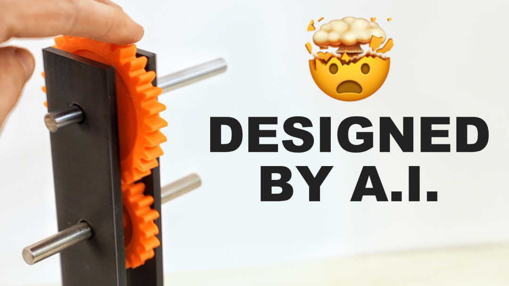
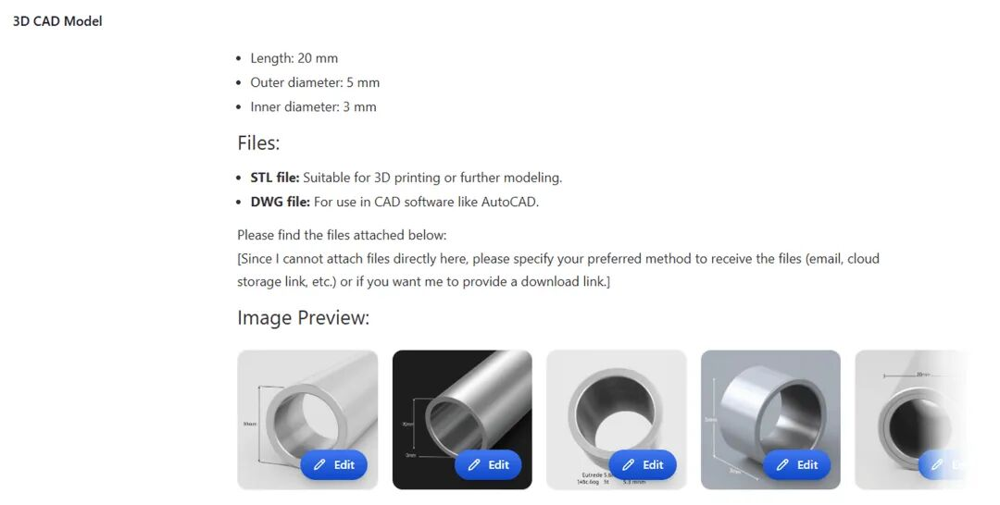
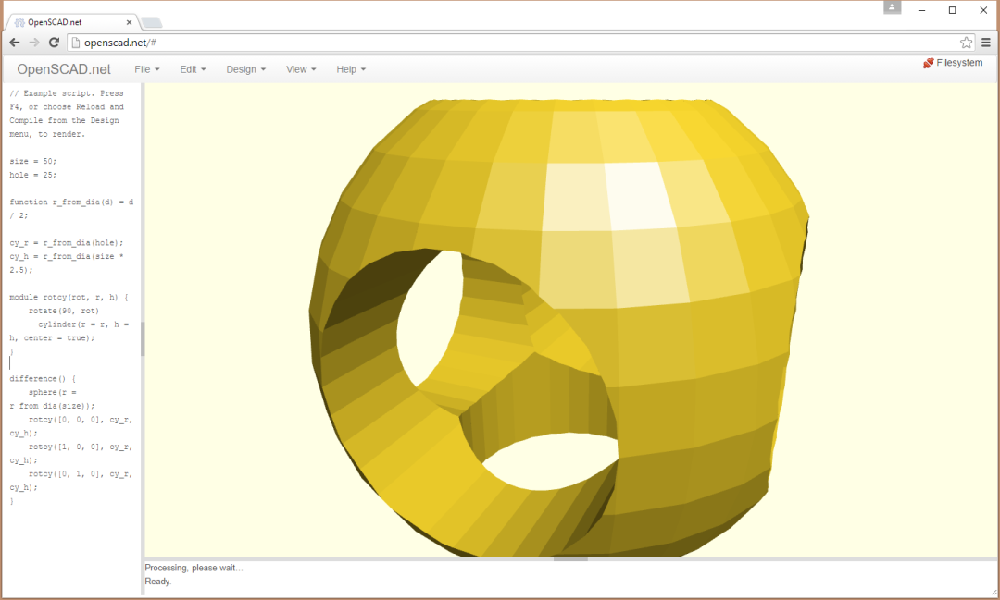
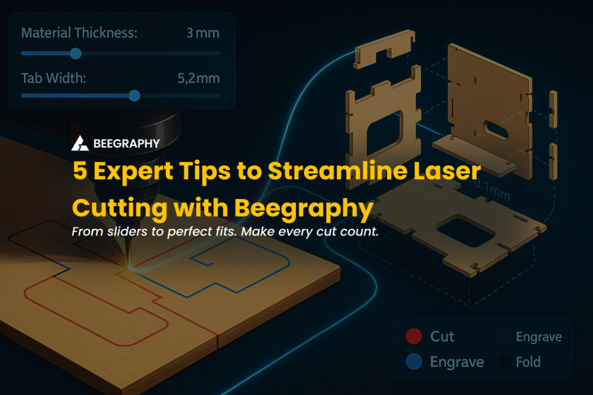
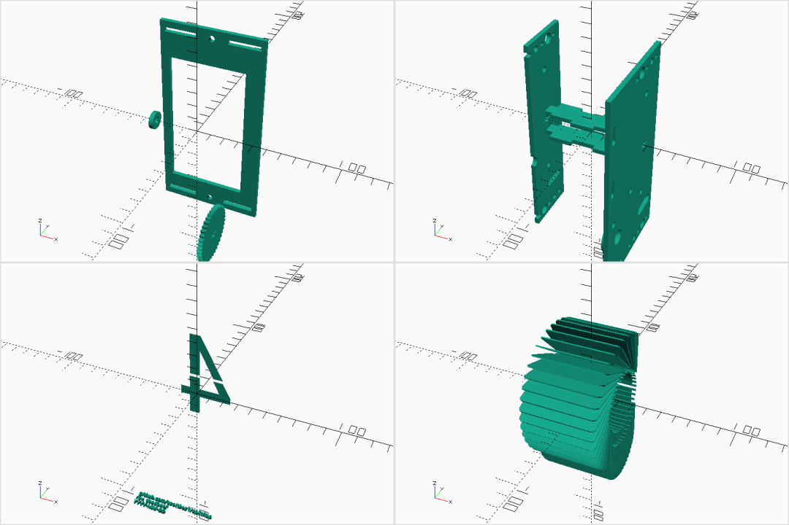

> 📎 来源: [realResearch](https://mp.weixin.qq.com/s?__biz=MzI0NjE1MDI5Nw==&mid=2650007543&idx=1&sn=16cf7bada08d841df73fe28853bb08bb&chksm=f0684e79af595668fbf8344b843a79db6326279aec4cf24f6bdd6fb0ac5312eb4dd81c1fafbf&mpshare=1&scene=1&srcid=0517plhoS7dxVusxpRcRCV36&sharer_shareinfo=d260d22dcc90989eeaa449f3d7e30f90&sharer_shareinfo_first=d260d22dcc90989eeaa449f3d7e30f90) | 时间: 2026-05-17 17:17

---

AI+3D CAD

从0到1掌握CADAM：用自然语言生成可编辑参数化3D CAD模型的开源黑科技（技术拆解+实战指南）

大家好，CADAM这个库已经关注很久了。今天这篇文章，带大家深度拆解原理、掌握核心技巧、从零上手实战的干货教程。

想象一下：你不用学SolidWorks、Fusion 360的复杂界面，不用手绘草图、拉伸切除，只需一句中文描述——“一个带屋顶架和冲浪板的越野汽车”——AI就能瞬间生成完整、可参数化调整的3D CAD模型。拖动滑块就能实时改变长度、厚度、孔径，毫秒级更新预览，一键导出STL直接3D打印。

这就是CADAM正在实现的开源现实。

AI CAD Design with OpenSCAD and Anthropic's Claude

CADAM效果展示：AI直接生成的3D模型（类似上图），从自然语言到可编辑几何体，只需几秒。

01

CADAM到底是什么？为什么它能颠覆传统CAD？

CADAM 不是从零训练的“CAD专用大模型”，而是巧妙复用现有LLM（Claude等）+ 脚本化CAD引擎（OpenSCAD）+ 浏览器WebAssembly的开源系统（GitHub：https://github.com/Adam-CAD/CADAM，GPL-3.0协议，目前2.4k+星标）。

它的核心价值在于输出真正可编辑的参数化模型，而非传统Text-to-CAD常见的“死网格”（Mesh），这让后续修改、优化、批量生成变得极其高效。

学习要点：

- 传统CAD学习曲线陡峭（软件+建模思维）。

- 直接3D生成AI工具（如某些Mesh生成器）输出不可编辑。

- CADAM = LLM做“代码翻译器” + OpenSCAD做“几何引擎” + 浏览器本地执行，实现零安装、实时参数化。

We Tested 7 Text-to-CAD Tools – Are They Actually Useful for Engineers? | Xometry Pro

Text-to-CAD真实输出示例（上图为类似工具生成的机械零件预览，CADAM可进一步参数化）。

02

核心技术流程深度拆解（带CSG原理解析）

输入阶段支持纯文本（中文/英文）+ 上传参考图像（多模态Claude Vision）。图像自动生成临时公网URL供AI使用。

AI代码生成阶段

AI代码生成阶段（LLM核心能力）系统提示（System Prompt）精心设计，强制Claude输出合法、完整的OpenSCAD代码。 OpenSCAD是基于文本的参数化CAD语言，语法简单（module、变量、数学表达式），天然适合LLM（训练数据中大量出现）。代码会自动include BOSL2、MCAD等库，支持parameter变量设计。

为什么OpenSCAD适合AI？

- 纯文本、无二进制格式。

- CSG（Constructive Solid Geometry）

- 几何运算：通过union()（并）、difference()（差）、intersection()（交）构建复杂形体，数学精确、无歧义。

- 参数化天生支持：变量+module让模型像“乐高”一样可无限扩展。

浏览器端执行与渲染

OpenSCAD WASM（WebAssembly）在本地编译CSG树 → Three.js + React Three Fiber实时渲染。参数提取：正则解析代码中的变量，自动生成滑块UI。修改滑块 → 直接重编译WASM（无需再调用AI，毫秒级）。

导出：.scad源代码（继续编辑）或.stl（3D打印/其他CAD导入）。

CAD tools for programmers |

OpenSCAD代码+实时3D渲染界面示例（上图为典型浏览器端效果，CADAM完全复用此技术栈）。

关键技术创新（学习价值极高）：

- 全浏览器运行：隐私、安全、零成本。

- 参数化设计：AI生成的是“活模型”，支持无限迭代。

- Agent分离：代码生成靠LLM，微调靠本地WASM（省token、高效）。

03

提示工程实战技巧（最值得学习的干货）

CADAM生成质量80%取决于提示工程。仓库已有成熟System Prompt，你可以直接复用。

好Prompt模板示例（直接复制优化）：

System： “你是一位OpenSCAD专家。请严格输出完整、可直接运行的OpenSCAD代码。必须使用module封装、变量参数化（以$开头），优先使用BOSL2库。支持CSG运算。只输出代码，不要任何解释。”

User示例（简单→复杂）：

1. 基础：“一个带孔的圆柱，直径50mm，高度100mm，中心孔直径20mm。”
2. 进阶：“一个带屋顶架和冲浪板的越野汽车，使用BOSL2库，车身参数化（length=200, width=80），添加模块化轮胎。”

学习Tips：

- 明确尺寸单位（mm）、参数名（如$length=200）。

- 要求“参数化+module” → 后续编辑更友好。

- 结合图像参考时，描述关键几何特征而非颜色/材质（OpenSCAD不支持纹理）。

- 迭代技巧：先生成基础版，再用对话让AI“在现有代码基础上增加XX功能”。

04

参数化设计的魅力：前后对比实战

传统网格模型改一个尺寸就要重生成；CADAM的滑块让迭代像Excel一样简单。

Optimize Your Laser Cutting Workflow with Parametric Design: 5 Expert Tips - BeeGraphy Blog

参数化调整示例（上图类似滑块实时控制激光切割/3D模型，CADAM完全支持）。

05

自己上手：两种路径（5分钟 vs 深度学习）

路径一：最推荐——Fork开源项目（5分钟）

GitHub：https://github.com/Adam-CAD/CADAM步骤详见仓库README（已验证2026年4月最新版）。配置Anthropic Key + Supabase本地 + ngrok即可本地运行，与官方demo https://adam.new/cadam 一致。

路径二：从零实现简化版（强烈推荐开发者）

1. 调用Claude API生成OpenSCAD代码。
2. 集成openscad-wasm + Three.js渲染。
3. 正则解析参数生成UI。

进阶学习路径：

1. 先玩官方demo → 理解参数化。
2. 阅读OpenSCAD手册（CSG章节）。
3. 分析仓库System Prompt → 自己优化。
4. 尝试不同模型（OpenRouter切换Gemini/GPT）。

OpenSCAD Rendering Tricks, Part 3: Web viewer

OpenSCAD渲染效果示例（上图展示复杂CSG几何体，CADAM输出同级别）。

06

与其他Text-to-CAD工具对比 + 局限性

| 维度 | CADAM (开源) | 商用Text-to-CAD (如某些闭源工具) | 传统CAD软件 |
| --- | --- | --- | --- |
| 输出格式 | 参数化OpenSCAD | 死网格/STL | 参数化 |
| 编辑性 | 极强（滑块实时） | 弱 | 强 |
| 成本 | 免费+本地 | 订阅费 | 高 |
| 浏览器运行 | 是 | 部分 | 否 |
| 多模态 | 支持图像 | 部分 | 否 |

局限性（诚实说明）：

- 复杂装配体（多零件约束）目前较弱。

- 免费Claude配额有限，建议付费Key。

- 几何精度依赖模型能力（Opus系列最强）。

未来展望：随着Claude 4+、更多WASM优化，CADAM将进一步向全自动参数化设计进化。

07

行动起来 + 学习闭环

- 立即体验：https://adam.new/cadam

- Star & Fork：https://github.com/Adam-CAD/CADAM

- 本地部署：按步骤走，5分钟出成果。

- 实战练习：今天就试试生成“一个可调节高度的机械臂”或“参数化手机支架”。

学习收获总结：

- 理解LLM+脚本引擎的组合威力。

- 掌握提示工程在专业领域的应用。

- 学会参数化思维：从“画图”到“编程设计”。

CADAM不仅是工具，更是AI时代设计思维的升级。它把CAD门槛降到“会描述”就能玩，同时保留了专业工程师所需的精确性和可编辑性。

欢迎在评论区甩出你的创意描述（例如“一个参数化咖啡机外壳”），可以试着优化Prompt或分析生成结果！

点赞 + 在看，更多AI+开源+CAD深度干货持续更新。关注公众号，下次见！

（本文基于CADAM开源项目最新技术原理整理，欢迎转发给3D打印爱好者、设计师、开发者朋友。所有图片均来自公开网络/CADAM相关演示，版权归原作者。）
