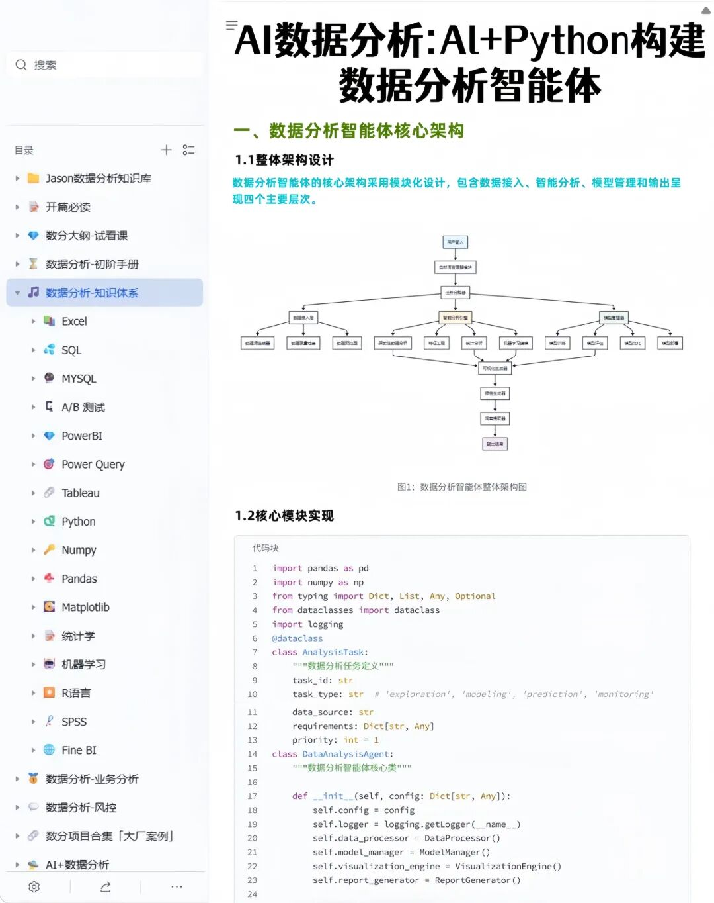
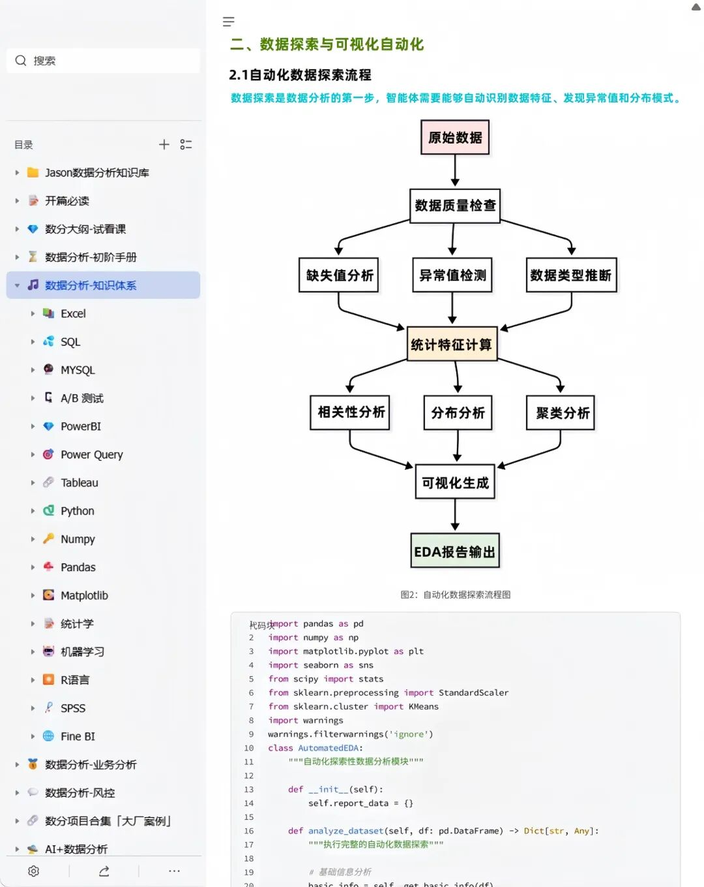
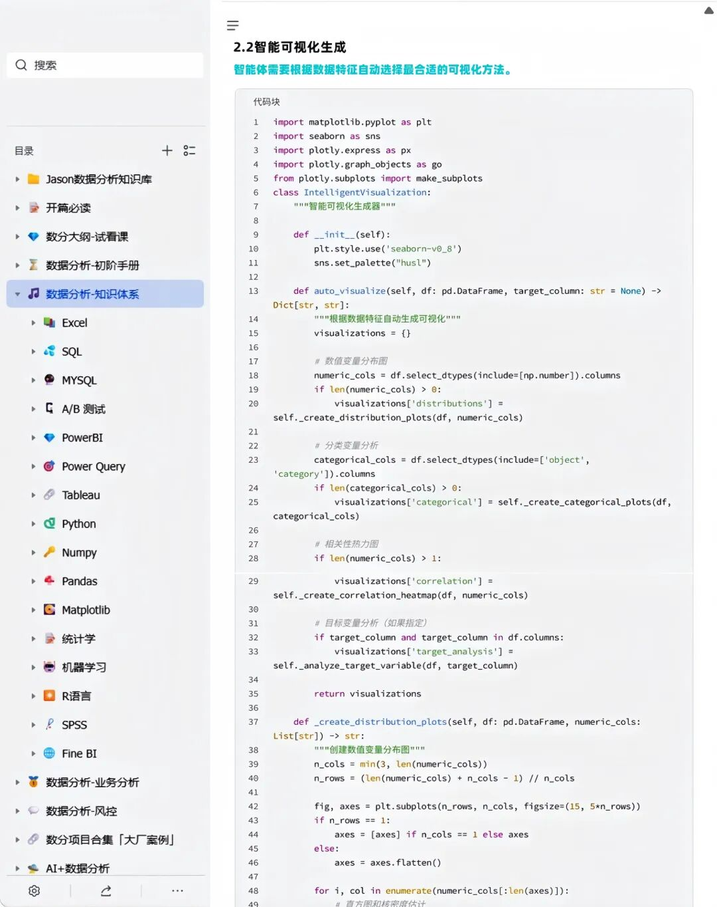
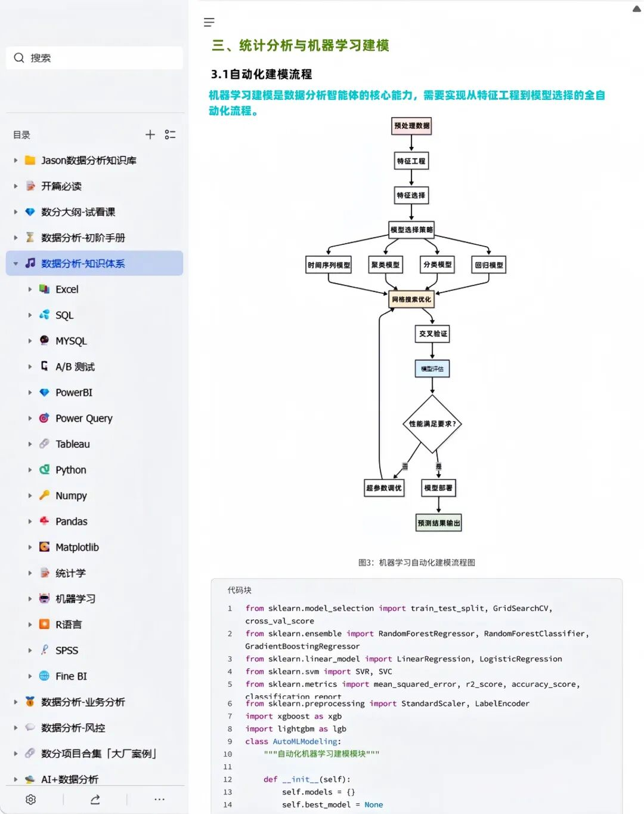
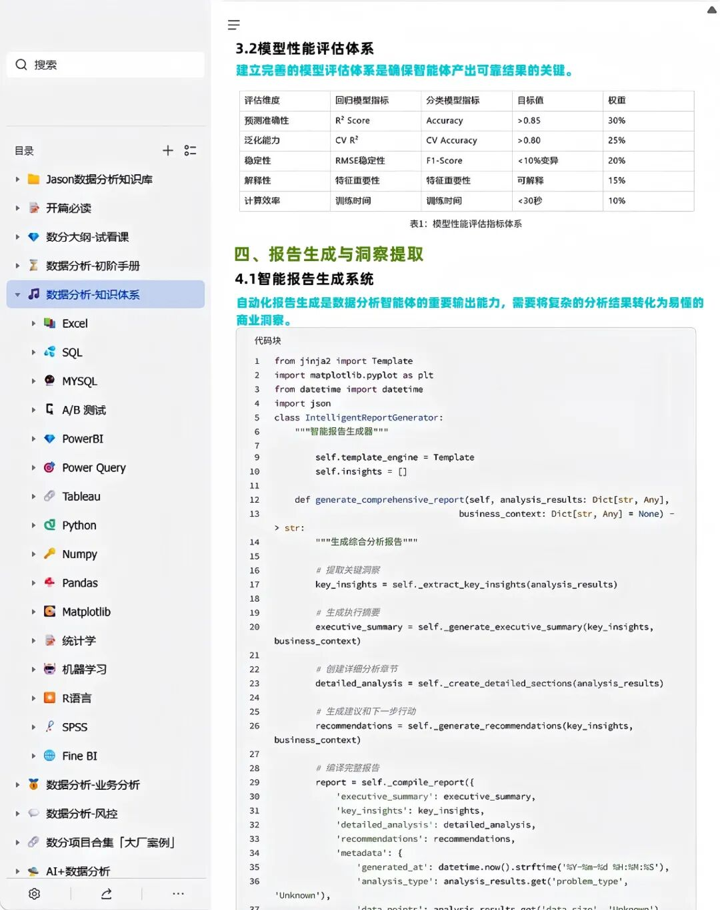
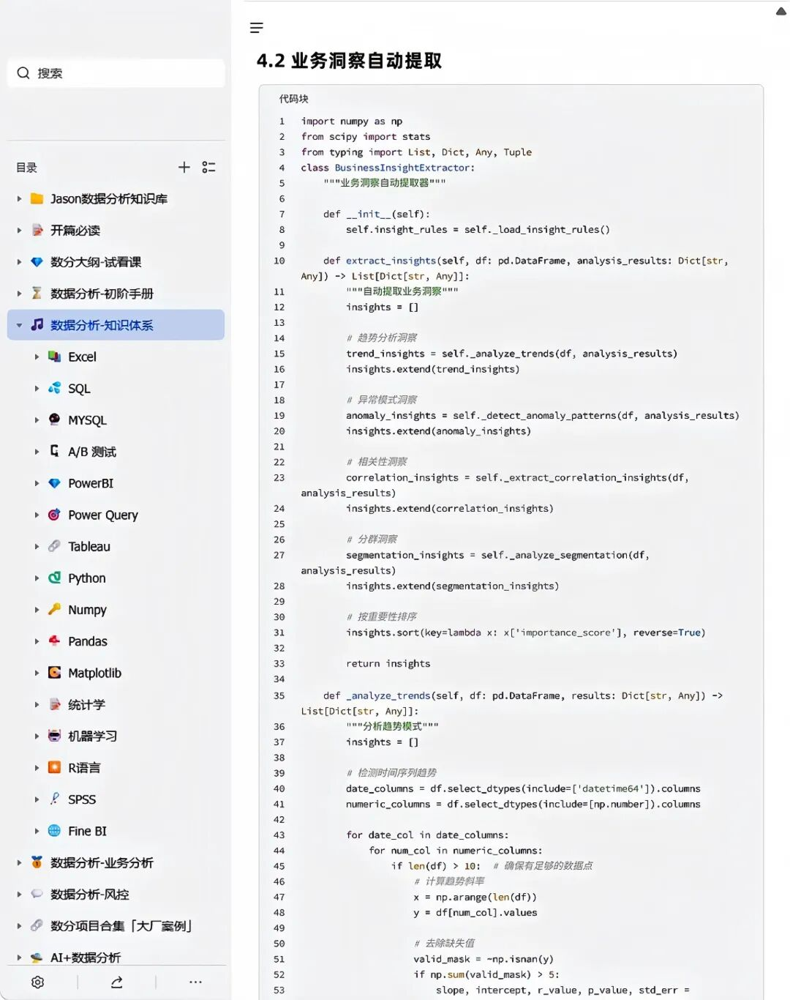
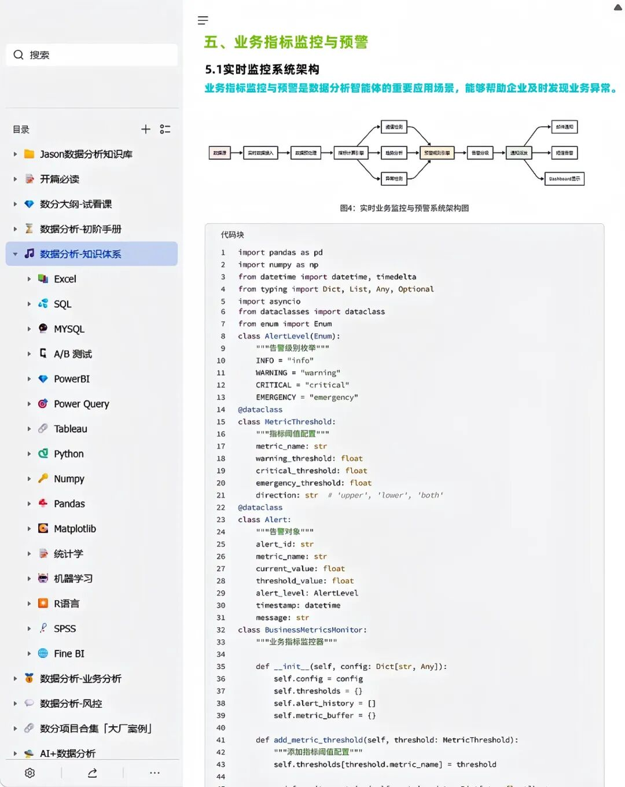
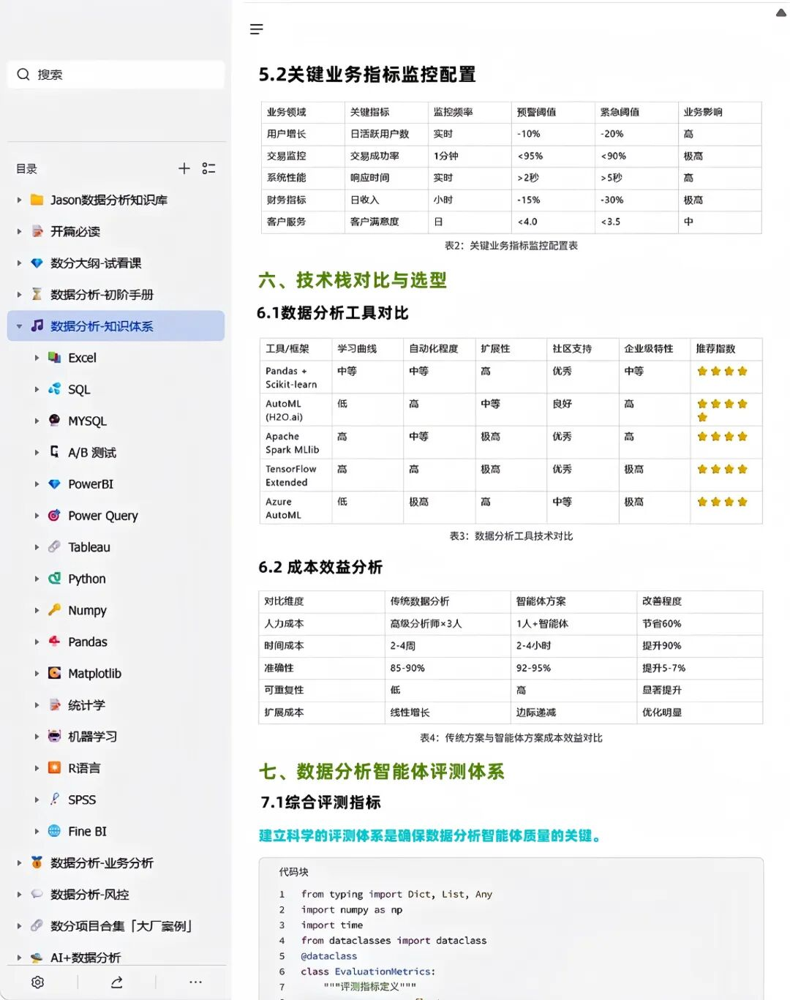

> 📎 来源: [依依讲数分](https://mp.weixin.qq.com/s?__biz=MzYyNTAwNTE1MQ==&mid=2247490122&idx=1&sn=1df6beed752b1efb941cd16dd3d393ca&chksm=f1ece0a0728e8a7242da34360e50a7aeaaa4b553f6205b9b6e6359693bca604219baff0edc29&mpshare=1&scene=1&srcid=0517k4ocLzza02Xt8P7KX1fd&sharer_shareinfo=3848b0abd8de6d7f8799fff0ac5d93d7&sharer_shareinfo_first=3848b0abd8de6d7f8799fff0ac5d93d7) | 时间: 2026-05-17 23:29

---

**AI工具现在越来越普遍，并且融入生活与工作当中，对于数据分析师来说是从重复劳动中解放出来，去专注于更有价值的业务决策。**

**分享一个基于AI+Python构建一个功能完善的数据分析智能体，实现从数据处理到结果输出的全流程自动化，提升数据分析效率与可靠性。**

**内容比较多，篇幅有限，完整版已上传知识库，希望能帮到大家~**

✅**数据分析智能体核心架构**

✅**数据探索与可视化自动化**

****

✅**统计分析与机器学习建模**

✅**报告生成与洞察提取**

✅**业务指标监控与预警**

****

****
