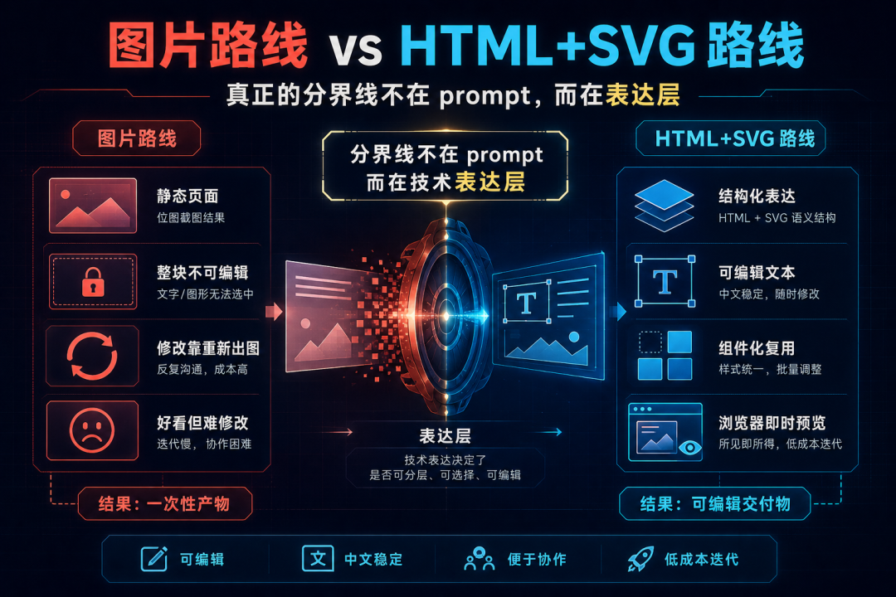
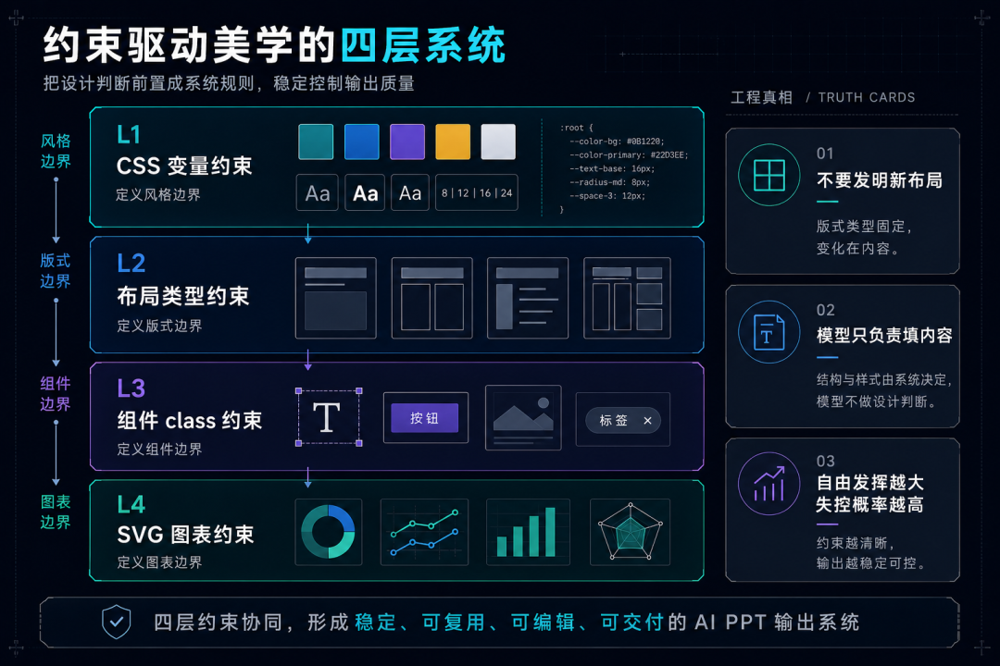
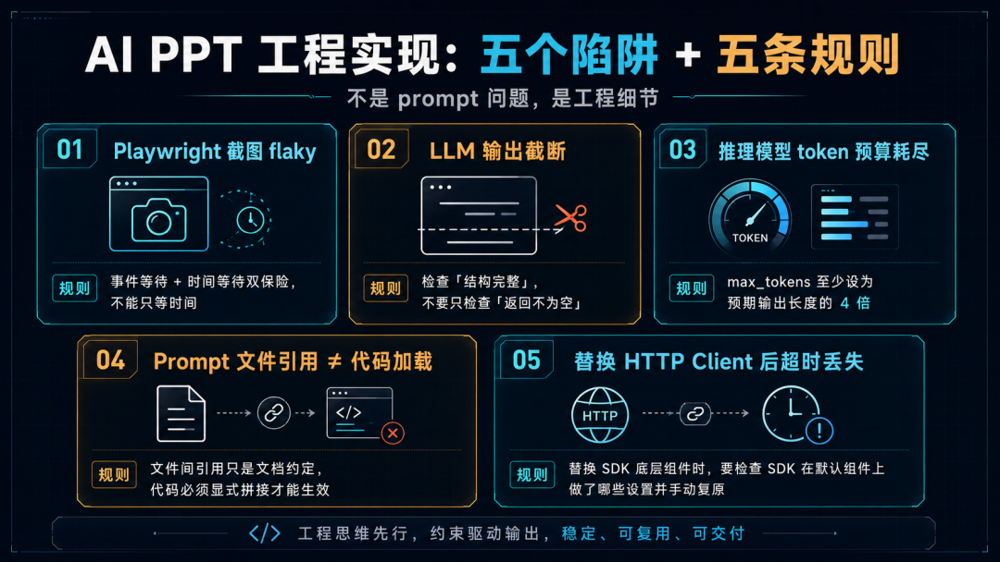

> 📎 来源: [智码探路](https://mp.weixin.qq.com/s?__biz=MzU2NDIyOTUxMw==&mid=2247483895&idx=1&sn=6b7ac6d0de8b2eaed201d54603072159&chksm=fd922d3796795a13a74bf19ccef7543f25ea4cb6e3a51fbe5e398a499f7c3144cd1aa5cd1b37&mpshare=1&scene=1&srcid=0525xgoDjhWEDlYXEvm0fzX1&sharer_shareinfo=b94b68cc507bc2061d38598f1bceffec&sharer_shareinfo_first=b94b68cc507bc2061d38598f1bceffec) | 时间: 2026-05-25 15:24

---

AI 做 PPT 这件事，已经不稀奇了。

真正稀奇的问题是：**生成之后，能不能接着修改编辑和使用？**

我见过太多这样的情况：第一眼惊艳，截个图发群里，大家鼓掌。然后到了要交付、要演示、要修改的那一刻——坏了，字改不了，图调不了，重新出图又得等半小时。

**AI 生成的 PPT，如果只能看、不能改，本质上是一张截图，不是一份交付物。**

我在做 SlideMind，核心就是在解这件事。这篇文章不讲功能，只复盘三个设计决策——每一个都有代价，每一个代价都是我主动选的。

---

## 先问自己一个问题：你的 AI 输出，是最终成品，还是协作中间态？

这个问题不想清楚，后面的技术路线基本都会选错。

「最终成品」和「协作中间态」对系统的要求完全不同：

- 最终成品：一次性好看就行，生成后不用再动
- 协作中间态：生成后还要被人接手、修改、演示、发版

对大多数真实场景来说，PPT 是协作中间态，不是最终成品。团队汇报、售前演示、技术分享——没有哪个场景是「AI 生成完就直接上台」，中间总要有人改一改。

按这个标准，现有工具各有各的好，但没能同时解决我的痛点：

| 工具 | 它擅长的事 | 我没被满足的痛点 |
| --- | --- | --- |
| Gamma / NotebookLM | 图片路线，第一眼视觉很惊艳 | 结果不可编辑，中文偶有乱码，改文字要重新出图 |
| PPT Master | 可编辑，操作体验流畅 | 偏商务简约风格，技术分享类的重架构图表模板偏少 |
| 手工做 PPT | 内容完全可控 | 排版和布局才是真正耗时的部分 |

它们都很好，只是和我的需求有错位——我需要的是「技术风格 + 可编辑 + AI 帮排版」。

「可编辑」和「好看」，通常是对立的。我当时的核心判断是：**这个对立是假的，真正的分界线在技术表达层。选错表达层，后面怎么补 prompt 都是徒劳。**

---

## 决策一：放弃图片生成，改走 HTML+SVG

这是整个项目最底层、也最重要的一刀。

图片路线很直观：调图像生成 API，直接得到一张「看起来像 PPT 的图」，塞进 PPTX。第一眼效果往往不错，成本也低，代码最简单。

但它解决的是「渲染出结果」，不是「交付一个可继续工作的结果」。

我切换到 HTML+SVG 的核心理由很简单，一张表说清楚：

| 维度 | 图片路线 | HTML+SVG 路线 |
| --- | --- | --- |
| 中文支持 | 依赖图像模型渲染，偶有乱码 | 原生文本，不存在乱码问题 |
| 可编辑性 | 改不了，只能重出 | HTML 文本层 + SVG 矢量，浏览器直接改 |
| API 成本 | 每页一次图像 API，贵 | 只用文本 LLM，便宜 |
| 迭代方式 | 重新生图 | 直接改 HTML，即时预览 |

本质上，这是两种不同的「质量押注方式」：

- 图片路线，把质量押在模型单次生成效果上——随机性高，不可控
- HTML+SVG 路线，把质量押在设计系统和结构约束上——一次建好，持续复用

代价是：视觉效果的上限，不再靠图像模型「灵光一现」，而取决于设计系统写得够不够扎实。

**HTML+SVG 路线的审美上限，80% 靠 CSS 和组件系统，20% 靠模型填内容。**

这个代价我觉得完全值——设计系统是一次建设、持续复用；图片效果是一次调用、一次随机。如果目标是「可重复交付的系统」，随机性不能成为基础设施。



### 补一个关键问题：HTML 到底怎么变成可编辑的 PPTX？

这是很多人听完「HTML+SVG 路线」之后的第一个疑问。HTML 好归好，但最终交付格式是 PPTX，这中间怎么转？

SlideMind 的做法是**双层映射**：

- **文字元素**

  （标题、副标题、要点、页脚）→ 渲染后读取每个元素的实际位置和尺寸，再用 python-pptx 的 TextBox 放到对应坐标。字号、颜色、字重全部保留，**在 PowerPoint 里可以直接点击编辑**。
- **SVG 块**

  （架构图、流程图等）→ 截取该区域 PNG → 嵌入图片。SVG 本身不可编辑，但视觉保真度 100%。

这个方案的本质是：**能编辑的坚决用原生文本框，不能编辑的用图片保真**。最终效果是——打开 PPTX，标题能改，要点能加，图表虽然不能编辑元素但视觉不变。

这是 HTML+SVG 路线最容易被忽略、但也最能体现「可编辑性」落地的一步。如果没有这层映射，HTML 再好也只是浏览器里的东西，进不了 PowerPoint 的工作流。

---

## 决策二：不要让模型自由发挥，要让它在约束里发挥

确定 HTML+SVG 之后，第二个问题马上来了：**怎么保证 LLM 生成的 HTML 不会越写越乱？**

直觉反应是「继续优化 prompt」。我试了一段时间，收益不稳定。

真正有效的方向是：**不是给模型更多表达空间，而是把设计经验提前编码成约束。**

这个判断来自观察学习几个开源项目——

```
html-ppt-skill
```

、

```
guizang-ppt-skill
```

 等。这些项目把设计经验压缩成硬约束，让 LLM 在约束里工作。

```
html-ppt-skill
```

 的规则文档里甚至直接写着：**「不要发明新布局，优先组合现有的」**。

SlideMind 采用同样的思路，具体落在四层：

**第一层：CSS 变量约束**

整套视觉系统只暴露 6 个 CSS 变量：

```
--bg
```

、

```
--surface
```

、

```
--border
```

、

```
--text
```

、

```
--text-secondary
```

、

```
--accent
```

。

LLM 只能用这 6 个变量，不允许写任何自定义 hex 值。换主题 = 替换这 6 行，其余 CSS 全走 

```
var()
```

 引用，结构不变。

**第二层：布局类型约束**

12 种预定义布局（

```
cover
```

、

```
toc
```

、

```
bullets
```

、

```
code-showcase
```

、

```
architecture
```

、

```
timeline
```

……），每种对应固定的 grid class 和适用场景。

LLM 只能从中选，不能创造新布局。这条规则直接进了 self-validation checklist 第一条：**「layout\_type 必须来自表格，不允许发明布局」**。

**第三层：组件 class 约束**

数据卡片、引用框、流水线、对比列表——每种组件有固定的 class 名，不允许写自由 CSS 类。

**第四层：SVG 图表约束**

这一层容易被忽略，但实际上是约束体系里最细、也最有效的一层。

SVG 是 PPT 里最容易失控的部分——模型一旦自由画图，尺寸不一致、颜色不守规矩、元素数量爆炸，全是灾难。

SlideMind 预定义了 11 种 SVG 图表类型（流程图、架构图、时序图、思维导图、对比表、时间线、柱状图、折线图、KPI 大数字、2×2 矩阵等），每种都有硬规则——比如流程图最多 7 个节点、柱状图最多 8 个柱、最小字号 11px、统一颜色 token、禁止外部资源引用。

模型画图的自由度被压缩到了「选类型 + 填内容」，而不是「从零开始创作」。

这四层约束加在一起，模型在视觉层面的自由度只剩下：选哪种布局、选哪种图表、填什么内容。其他全部由设计系统决定。

这一套为什么有效？因为对 PPT 来说，「好看」很少来自无限创造，更多来自三件事：**一致性、节制、可预期**。而这三件事，恰好都不是 LLM 自然擅长的。模型天然倾向于多写一点、多变一点、多设计一点；但实际生产里，越这样越容易失控。

关键不是「限制创造力」，而是**把人的设计判断前置成规则，让模型只负责在规则里组织内容。**

这个思路不只适用于 PPT。任何面向交付的 AI 生成系统，只要输出需要被团队继续使用，最后都会走向同一句话：

> **自由生成负责惊艳，约束系统负责落地。**



---

## 决策三：不要直接批量生成，先做一次模板试跑

大纲通过后，很多系统直接进「全量生成」。demo 阶段没问题，但真实生产里，风险很高。

SlideMind 在「大纲锁定」和「批量出页」之间，强行插了一个短循环：

**先跑 2 页锚点页，确认视觉方向，再批量展开。**

原因很简单：如果直接批量生成 12 页，到第 8 页才发现色调或布局不对，前 7 页都得重做。LLM 生成每页的时间 + API 成本不低，重做代价很高。

具体流程是这样：

```
大纲通过  ↓选锚点页（封面 + 一页含图表的正文页）  ↓生成试跑页  ↓人工审核（浏览器打开，检查色调/字体/密度/图表风格）  ↓满意 → 写入 template-lock.json不满意 → 调整 prompt 参数 → 重新试跑  ↓基于锁定模板批量生成剩余页面
```

```
template-lock.json
```

 锁定的是视觉参数：

json

```
{  "theme": "tech-dark",  "layout_type": "bullets",  "grid_class": ".grid-6-6",  "typography": "h-xl + body",  "density": "balanced",  "chart_style": "minimal"}
```

锁定文件注入后续每页的生成 prompt，确保 12 页视觉风格完全一致，而不是「大致差不多」。


---

这一步解决的，不是页面本身，而是**不确定性的分层**。

内容方向对不对，是一类问题；视觉呈现稳不稳，是另一类问题。这两类问题表现都是「效果不好」，但根因完全不同。

如果不拆开，很容易陷入这种低效状态：

- 以为是 prompt 不行，其实是模板不稳
- 以为是模板不行，其实是大纲结构不对
- 每次重跑都改很多变量，最后不知道哪一步起作用

模板试跑的价值是：**先冻结视觉变量，再扩展内容变量。**

这是一种很通用的 AI 产线控制方法，不是 PPT 专用技巧。

---

## 工程实现里踩的五个坑

设计决策聊完，剩下是工程细节。这五个坑不是理论问题，是很容易在真实链路里把结果拖垮的细节。

**坑一：Playwright 截图 flaky**

HTML → PPTX 的转换路径是：Playwright 渲染截图 → python-pptx 拼合。冷启动时偶发截图失败，原因是 Chromium 第一次启动渲染引擎未完全初始化，纯时间等待不够。

修复：事件等待 + 时间等待双保险——先等 DOM 解析完成，再留额外时间给字体和 SVG 渲染。

**坑二：LLM 输出截断**

含复杂 SVG（架构图、服务器拓扑）的页面，LLM 输出可达 3000–8000 token。

```
max_tokens
```

 设小了容易截断，返回残缺 HTML。

防御方案：调大 token 上限，再在生成循环里检测 HTML 结构是否完整（比如检查闭合标签），缺失就重试。

关键经验：**要检查「结构完整」，不要只检查「返回不为空」。**

**坑三：推理模型 token 预算被吃完**

使用支持 reasoning 的模型时，推理 token 和输出 token 共用同一个 budget。如果 

```
max_tokens
```

 设太小，推理过程消耗完所有 token，content 返回空字符串，而且重试无效（budget 不变）。

工程规则：**使用推理模型时，

```
max_tokens
```

 至少设为预期输出长度的 4 倍。** 否则你以为模型「能力不够」，其实只是预算分配错了。

**坑四：Prompt 文件引用 ≠ 代码加载**

这是 Prompt-as-Artifact 架构里最容易踩的坑。

prompt 文件里写了「SVG 规则见 

```
00-svg-rules.md
```

」，但代码只加载了主 prompt 文件，LLM 实际看不到 SVG 规则。结果：生成的 SVG 尺寸不一致，颜色不遵守 token。

诊断时容易误以为是「prompt 描述不够清晰」，实际是**根本没传给模型**。修复很简单——调用前显式拼接两个文件内容。

规律：**prompt 文件之间的「引用」只是人类可读的文档约定，代码必须显式拼接才能生效。**

**坑五：替换 HTTP Client 后 SDK 默认超时丢失**

给 OpenAI SDK 传了自定义 

```
httpx.Client
```

 绕过代理，结果生成含复杂 SVG 的幻灯片时报 

```
ReadTimeout
```

——SDK 默认的 10 分钟超时一旦传入自定义 client 就不再生效，回退到 httpx 默认的 5 秒。

规律：**替换第三方 SDK 的底层组件时，要检查 SDK 在默认组件上做了哪些设置，手动复原。** 另外，超时值要根据 

```
max_tokens ÷ 模型速度
```

 估算，不能拍脑袋——含复杂 SVG 的页面单页可达 13–20 分钟。



---

## 实测结果

用一份真实的技术分享文稿（AI Coding 落地分享，含 SDD 实践内容）跑了前 8 页完整 pipeline：

- 内容分析：38 秒
- 大纲生成：105 秒
- 模板试跑 + 人工确认
- 逐页生成：8 页，63 分钟（DeepSeek，速度是制约，测试用的 flash模型）

8 页全部完成，无截断、无报错。封面、目录、三栏对比、架构演进图（SVG）、阶梯图、代码对比页都跑通了，中文全程无乱码。

这 8 页跑完，三个决策的可行性都有了真实样本。当前最明显的约束是速度——63 分钟对内部分享尚可接受，但显然不是终点。

---

## 意外收获：HTML 底层带来的「演讲者模式」

生成完 HTML 幻灯片，下一个问题来了：怎么演示？

PPTX 有演讲者模式，HTML 没有内置的。借鉴 

```
html-ppt-skill
```

 的思路，顺手加了进去：

- ```
  viewer.html
  ```

  ：全屏播放器，键盘翻页，

  ```
  F
  ```

   全屏
- ```
  presenter.html
  ```

  ：演讲者视图，四格布局：当前页 / 下一页 / 备注 / 计时器

关键设计：两个窗口都用 

```
</span></span></code><span leaf=""><span textstyle="" style="font-size: 15px;"> 加载</span></span><strong style="color: #07C160;font-weight: bold;"><span leaf=""><span textstyle="" style="font-size: 15px;">真实的 HTML 文件</span></span></strong><span leaf=""><span textstyle="" style="font-size: 15px;">，而不是截图。字体、CSS、颜色在预览窗口和观众窗口像素级一致，不会「我这里好好的，投出去就糊了」。</span></span></p><p style="margin: 12px 0;"><span leaf=""><span textstyle="" style="font-size: 15px;">翻页同步用 </span></span><code style="background: #f0f0f0;padding: 2px 6px;border-radius: 3px;font-size: 14px;color: #e74c3c;font-family: 'Courier New', monospace;"><span leaf=""><span textstyle="" style="font-size: 15px;">BroadcastChannel</span></span></code><span leaf=""><span textstyle="" style="font-size: 15px;">——即使先开演示、后开演讲者窗口，两边也会自动对齐。</span></span></p><p style="margin: 12px 0;"><span leaf=""><span textstyle="" style="font-size: 15px;">计时器在 35 分钟变黄、45 分钟变红，刚好覆盖技术分享的常见时长。</span></span></p><p style="margin: 12px 0;"><span leaf=""><span textstyle="" style="font-size: 15px;">这个功能不在最初计划里，但它很能说明一件事：</span></span><strong style="color: #07C160;font-weight: bold;"><span leaf=""><span textstyle="" style="font-size: 15px;">当底层是 HTML 时，很多「传统 PPT 软件自带的能力」，你都可以用 Web 技术重新拿回来。</span></span></strong></p><p style="margin: 12px 0;"><span leaf=""><span textstyle="" style="font-size: 15px;">HTML+SVG 不只是导出手段，更像一个可编程的中间操作系统。</span></span></p><hr style="border: none;border-top: 1px solid #e5e5e5;margin: 24px 0;"  /><h2 style="font-size: 20px;font-weight: bold;margin: 24px 0 12px;padding-left: 12px;border-left: 4px solid #07C160;color: #1a1a1a;"><span leaf=""><span textstyle="" style="font-size: 15px;">最后：三个问题，想清楚了技术路线会自己浮出来</span></span></h2><p style="margin: 12px 0;"><span leaf=""><span textstyle="" style="font-size: 15px;">回头看，三个决策都在回答同一件事：</span></span><strong style="color: #07C160;font-weight: bold;"><span leaf=""><span textstyle="" style="font-size: 15px;">如何让 AI 生成的结果，能被人类低成本接手。</span></span></strong></p><p style="margin: 12px 0;"><span leaf=""><span textstyle="" style="font-size: 15px;">每个决策都有代价：</span></span></p><ul style="padding-left: 24px;margin: 12px 0;" class="list-paddingleft-1"><li style="margin: 6px 0;"><section><span leaf=""><span textstyle="" style="font-size: 15px;">HTML+SVG：放弃图像生成的效果上限，换来可编辑性和中文稳定性</span></span></section></li><li style="margin: 6px 0;"><section><span leaf=""><span textstyle="" style="font-size: 15px;">约束驱动：放弃 LLM 自由发挥，换来一致性和可预期的输出质量</span></span></section></li><li style="margin: 6px 0;"><section><span leaf=""><span textstyle="" style="font-size: 15px;">模板试跑：多了一个人工审核环节，换来批量生成的视觉稳定性</span></span></section></li></ul><p style="margin: 12px 0;"><span leaf=""><span textstyle="" style="font-size: 15px;">这些代价都不是问题——</span></span><strong style="color: #07C160;font-weight: bold;"><span leaf=""><span textstyle="" style="font-size: 15px;">前提是你明确知道自己在用什么换什么。设计决策最怕的不是取舍，而是糊里糊涂地付出代价，却不知道自己换来了什么。</span></span></strong></p><p style="margin: 12px 0;"><span leaf=""><span textstyle="" style="font-size: 15px;">需要补充说明的是：约束体系的设计思路部分参考了 </span></span><code style="background: #f0f0f0;padding: 2px 6px;border-radius: 3px;font-size: 14px;color: #e74c3c;font-family: 'Courier New', monospace;"><span leaf=""><span textstyle="" style="font-size: 15px;">html-ppt-skill</span></span></code><span leaf=""><span textstyle="" style="font-size: 15px;">、</span></span><code style="background: #f0f0f0;padding: 2px 6px;border-radius: 3px;font-size: 14px;color: #e74c3c;font-family: 'Courier New', monospace;"><span leaf=""><span textstyle="" style="font-size: 15px;">guizang-ppt-skill</span></span></code><span leaf=""><span textstyle="" style="font-size: 15px;"> 等开源项目，是站在别人工作上的延伸；另本版视觉效果上，和 GPT-Image-2 这类图像生成路线或 banana 这类成熟工具相比，差距还很明显，需要继续打磨迭代。如果你有想法或建议，欢迎随时拍砖留言交流。</span></span></p><p style="margin: 12px 0;"><span leaf=""><span textstyle="" style="font-size: 15px;">如果你也在做 AI 生成类产品，尤其是「生成后还要继续编辑、继续协作」的场景，建议想清楚这三个问题：</span></span></p><ol style="padding-left: 24px;margin: 12px 0;" class="list-paddingleft-1"><li style="margin: 6px 0;"><strong style="color: #07C160;font-weight: bold;"><span leaf=""><span textstyle="" style="font-size: 15px;">你的输出是最终成品，还是协作中间态？</span></span></strong></li><li style="margin: 6px 0;"><strong style="color: #07C160;font-weight: bold;"><span leaf=""><span textstyle="" style="font-size: 15px;">你把质量押在模型随机性上，还是押在系统约束上？</span></span></strong></li><li style="margin: 6px 0;"><strong style="color: #07C160;font-weight: bold;"><span leaf=""><span textstyle="" style="font-size: 15px;">你有没有在批量生成前，设计一个足够便宜的试错环节？</span></span></strong></li></ol><p style="margin: 12px 0;"><span leaf=""><span textstyle="" style="font-size: 15px;">这三个问题想清楚了，很多技术路线其实会自己浮出来。</span></span></p><hr style="border: none;border-top: 1px solid #e5e5e5;margin: 24px 0;"  /><blockquote style="background: #f8f8f8;border-left: 4px solid #07C160;padding: 12px 16px;margin: 16px 0;color: #666;"><p style="margin: 12px 0;"><span leaf=""><span textstyle="" style="font-size: 15px;">SlideMind 的核心约束（CSS 规则、布局限制、组件 class）已沉淀成 </span></span><code style="background: #f0f0f0;padding: 2px 6px;border-radius: 3px;font-size: 14px;color: #e74c3c;font-family: 'Courier New', monospace;"><span leaf=""><span textstyle="" style="font-size: 15px;">skills/slidemind.md</span></span></code><span leaf=""><span textstyle="" style="font-size: 15px;">，打磨好之后会分享出来，支持 AgentSkill 协议的工具可以直接调用，不用从头踩一遍这些坑。</span></span></p></blockquote><section><strong style="box-sizing: border-box;font-weight: 600;color: rgb(59, 59, 59);font-family: -apple-system, "system-ui", "Segoe UI", Roboto, "Helvetica Neue", sans-serif;font-size: 13px;font-style: normal;font-variant-ligatures: normal;font-variant-caps: normal;letter-spacing: normal;orphans: 2;text-align: start;text-indent: 0px;text-transform: none;widows: 2;word-spacing: 0px;-webkit-text-stroke-width: 0px;white-space: normal;background-color: rgb(255, 255, 255);text-decoration-thickness: initial;text-decoration-style: initial;text-decoration-color: initial;" data-pm-slice="0 0 []"><span leaf=""><span textstyle="" style="font-size: 15px;font-weight: normal;">关注「</span><span textstyle="" style="font-size: 15px;font-weight: bold;">智码探路</span><span textstyle="" style="font-size: 15px;font-weight: normal;">」，一起在 AI 工程与提效工具的一线实践里，持续折腾。</span></span></strong></section><section class="mp_profile_iframe_wrp" nodeleaf=""><mp-common-profile class="js_uneditable custom_select_card mp_profile_iframe" data-pluginname="mpprofile" data-nickname="智码探路" data-alias="zima-explorer" data-from="0" data-headimg="http://mmbiz.qpic.cn/mmbiz_png/7EdibnpuQcaR63bBHvADsOtPWR64393UZDq1dibxvorr79mh1B6YE2b6rEia0IKWv1dlQnxiaBac7Jso7UpcImz3FX4ZQLCqOY0bEXFM06eBiaCc/0?wx_fmt=png" data-signature="智在探索，码在实践。一份助力提效与洞察的探路手记。" data-id="MzU2NDIyOTUxMw==" data-is_biz_ban="0" data-service_type="1" data-verify_status="0"></mp-common-profile></section><p style="display: none;"><mp-style-type data-value="3"></mp-style-type></p
```
