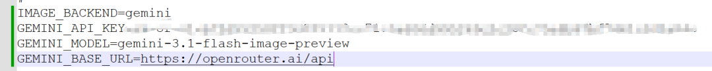
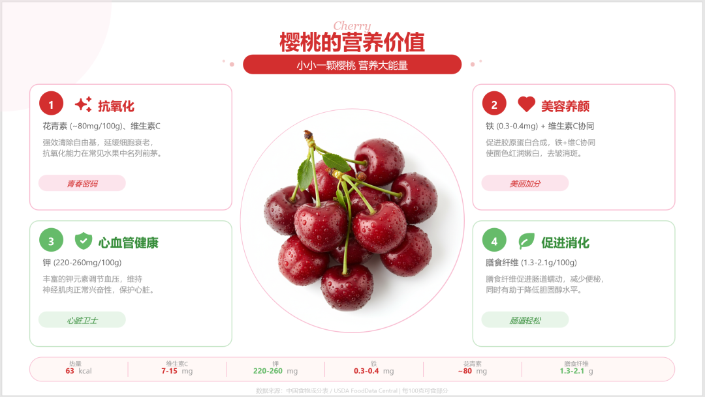
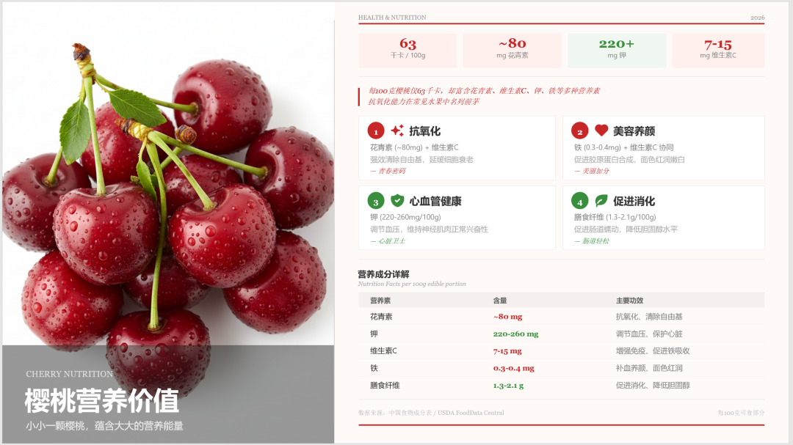
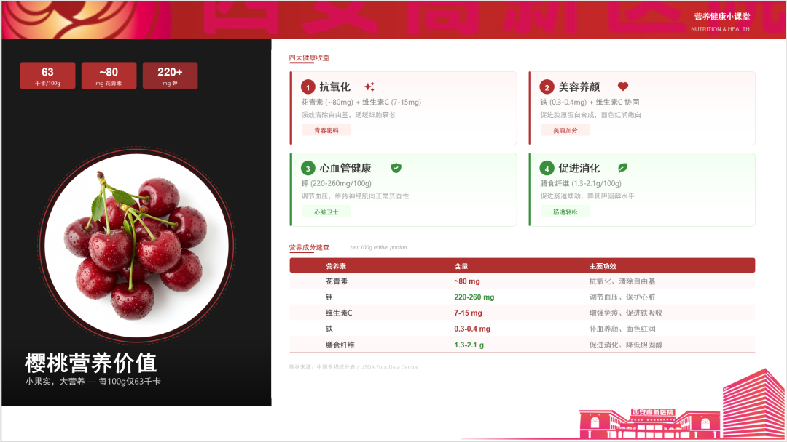
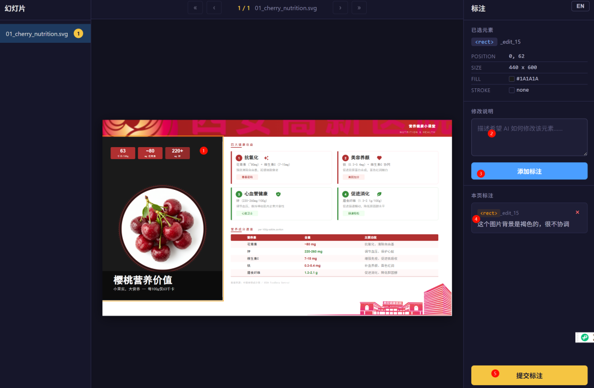
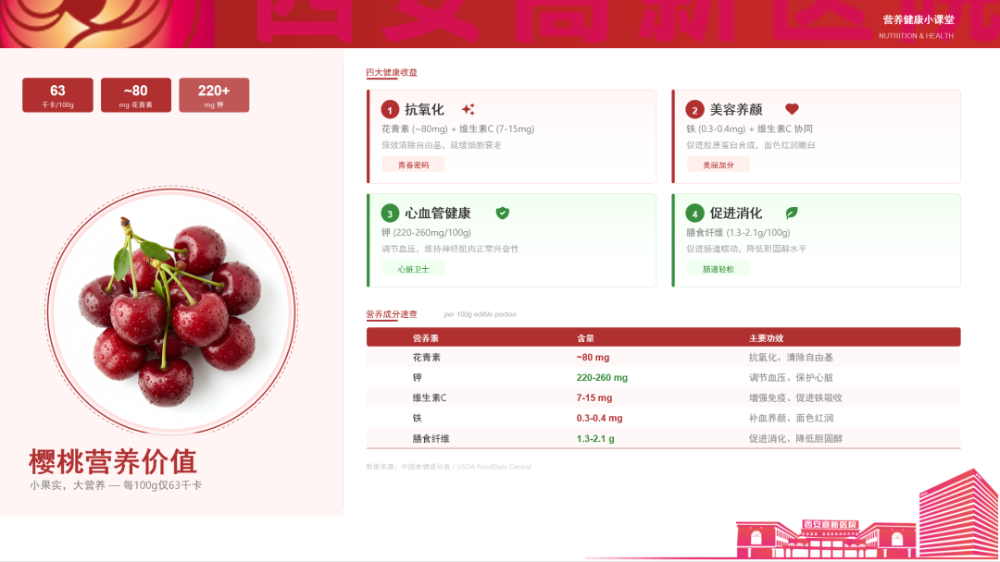
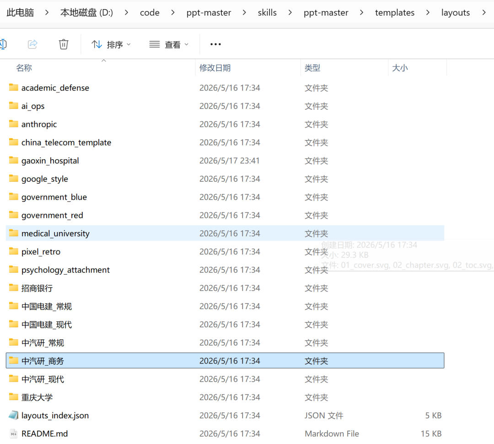
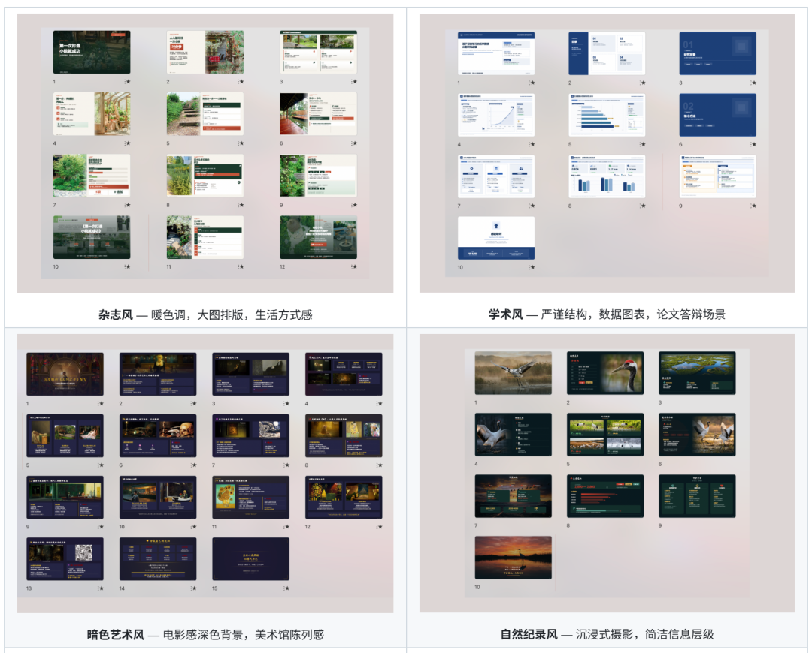
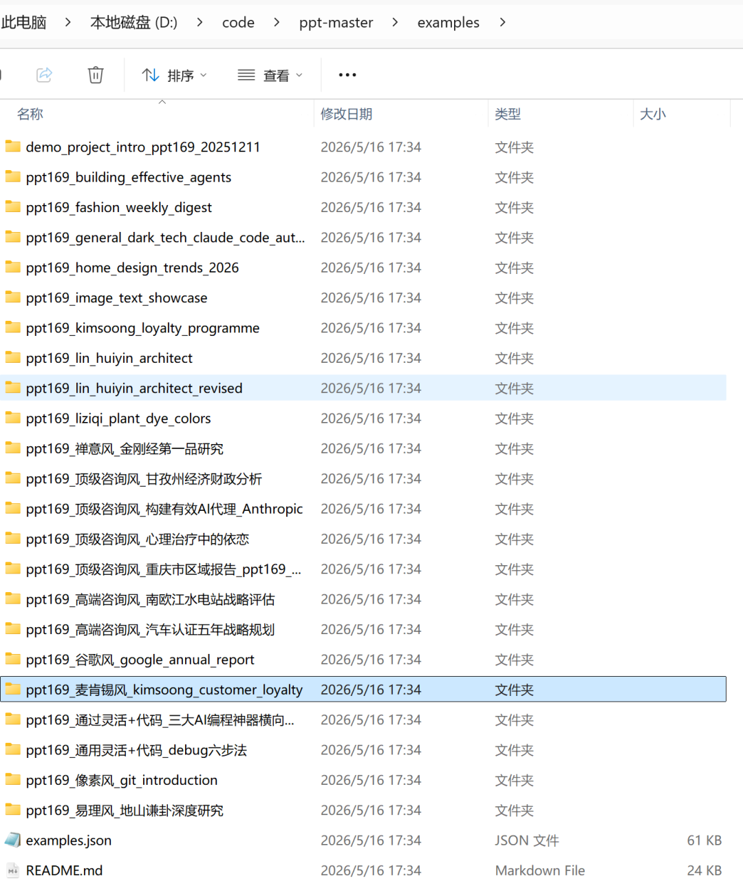
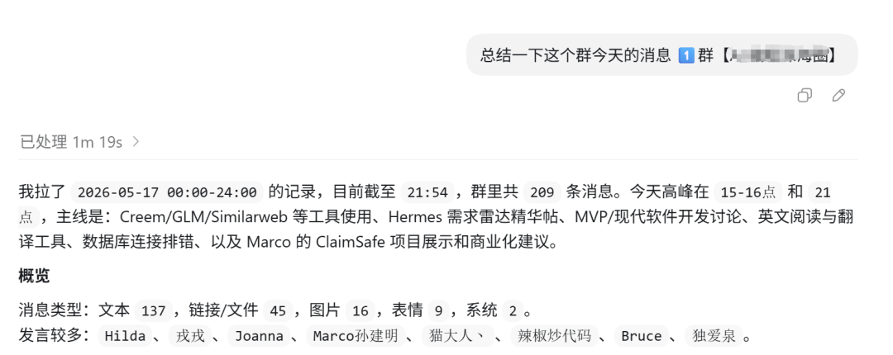

> 📎 来源: [把事儿捋顺了](https://mp.weixin.qq.com/s?__biz=MzYyNDU1Nzg2MQ==&mid=2247484193&idx=1&sn=9c94d04dad93e80c4035326075432443&chksm=f1e37920d2982533b8d893fa189441c03caa186bf4d217ecbbf52d5639be29ce95937ea86c66&mpshare=1&scene=1&srcid=0522QmMLYKTkRkGBKu2M3xaA&sharer_shareinfo=0ff836b80ab6873056ef619a6cd70929&sharer_shareinfo_first=0ff836b80ab6873056ef619a6cd70929) | 时间: 2026-05-22 22:32

---

上篇文章生成的ppt，主要构成是ppt基础元素「线 形 颜色」和文字构成。

我刚好有openrouter，直接使用openrouter调用Nano Banana生成ppt的图片素材。



生成ppt效果：



为了测试skill的灵活性，让它换种风格。

再换一种布局风格，像杂志一样精致。



效果比昨天那一稿高级多了。

---

下面重点介绍一下ppt master的主要功能。

**1/ 模板复刻**

**把任何一份你喜欢的 `.pptx` 丢给 AI，一句"用 `/create-template` 复刻成模板"，就能拿到一套可被 PPT Master 直接调用的页面布局——主题色、字体、母版/版式结构、复用图片、甚至精灵图裁剪关系都按 OOXML 真实抽取，封面/章节/装饰繁复的页面都能稳定还原。从此你不再受限于内置模板：公司品牌 deck、客户中标模板、找的高质量参考稿，都能一键变成你的私人模板库。**

**使用单位模版生成ppt，为了看效果，我用高新医院的模版改一下**

使用这个模板再改稿，模版 "D:\Download\过敏性鼻炎.pptx" 



模版倒是对了，左侧图片背景很丑，我标注一下，让它再优化一下



这个是根据标注修改后的ppt



有什么不满意的可以让AI不断修改，而不是黑盒，生成什么就用什么了。

另外也不用之前notebooklm生成好不能编辑的ppt，最后使用WPS会员版本进行pdf转ppt。

官方自带了一些模版，建议大家实践一下，知行合一是最好的学习方法。



在当前的基础上，和AI对话修改，最终生成满意的ppt后，

使用 /`create-template保存新模版`

```
请用 /create-template 工作流，基于下面的参考材料生成一个新模板。
```

2/ 使用官方预置的多种风格

适用 年报 / 咨询 / 答辩 / 政府汇报 各种场景。

喜欢哪种风格，直接告诉AI使用哪种风格。



3/ 基于内容生成ppt

将 PDF、DOCX、图片等文件放入 一个目录下，在 AI 聊天面板中告诉它使用哪些文件。在文件管理器中右键文件 → **复制文件地址**，直接粘贴进聊天框。

根据源文件生成ppt

```
请用 projects/q3-report/sources/report.pdf 这份文件生成一份 PPT
```

根据文字生成PPT

```
请根据以下内容制作成 PPT：[粘贴你的文字内容...]
```

下面是官方的一些例子



---

下一期给大家介绍一个可以阅读并总结群消息的工具，几百条消息不用再爬楼一条一条看了。


