> 📎 来源: [Jack Bytes](https://mp.weixin.qq.com/s?__biz=Mzg4NTIyNTU0NQ==&mid=2247497096&idx=1&sn=a1354af166a6b2df2531b3d8e3cac53b&chksm=ce64ecd5771fc01149426fd4e3cf3381455567be0b510e5b638a6a7ac9770090c63c22995fcb&mpshare=1&scene=1&srcid=0522Hkze7LhEAV7vk0y5mmdq&sharer_shareinfo=63358b4c095d0f48e64c18720b2d2da1&sharer_shareinfo_first=63358b4c095d0f48e64c18720b2d2da1) | 时间: 2026-05-22 02:50

---

> 大家好，我是 Jack Bytes，一个专注于将人工智能应用于日常生活的程序猿，平时主要分享 AI、NAS、开源项目等。

兄弟们，你们做演示文稿时你是不是总陷入两难？

要么用通用工具做的幻灯片千篇一律没设计感，要么纯手写 HTML/CSS 搭演示稿又费时间？

最近 AI 生成图片的能力越来越强，但是对 PPT 的审美却始终不在线，风格简单、内容空洞、色调单一、千篇一律等等。

比如下面是用一句话让大模型生成的 PPT：

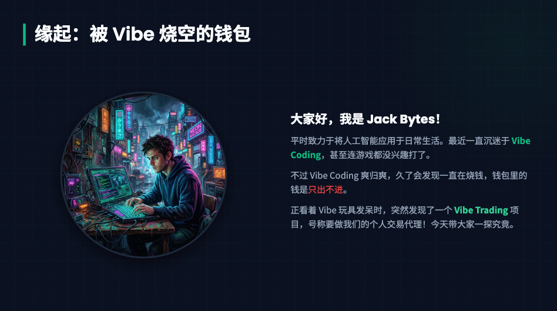

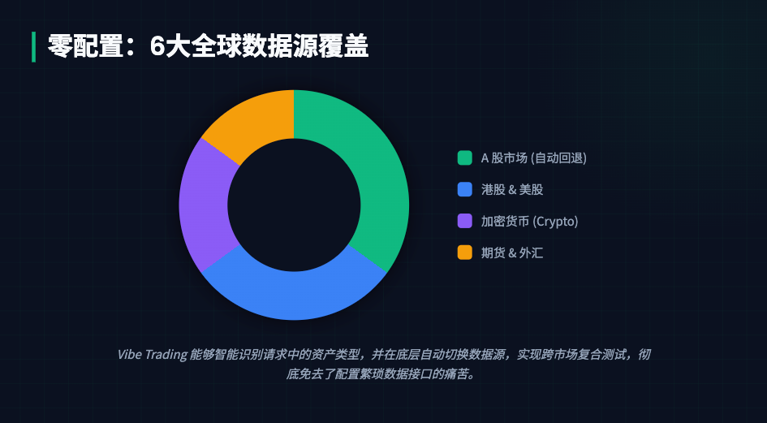

虽然用复杂的提示词可以用来控制模型生成精美的 PPT，但是对于普通人来说，提示词越复杂，操作起来越麻烦。

那么有没有办法，让我们用尽可能少的提示词生成尽可能精美的 PPT 呢？

我翻遍全网，终于找到了这个开源项目，能够让你的**AI Agent** 生成精美的 PPT。

下面我们一起来看下吧！

## 一、介绍

**beautiful-html-templates** 是一个可以复用的PPT 模板库，目标是让 AI Agent 可以选择合适的模板，并帮用户生成精美的 PPT。

**beautiful-html-templates** 包含了 32 个 PPT 模板。

不同于单调的通用模板，这个库的每一款模板都有独特的视觉体系：

- **文艺风**：Soft Editorial（温暖纸张 + 鼠尾草 / 腮红 / 柠檬色调）、Editorial Forest（森林绿 + 脏粉的沉静季度复盘质感）

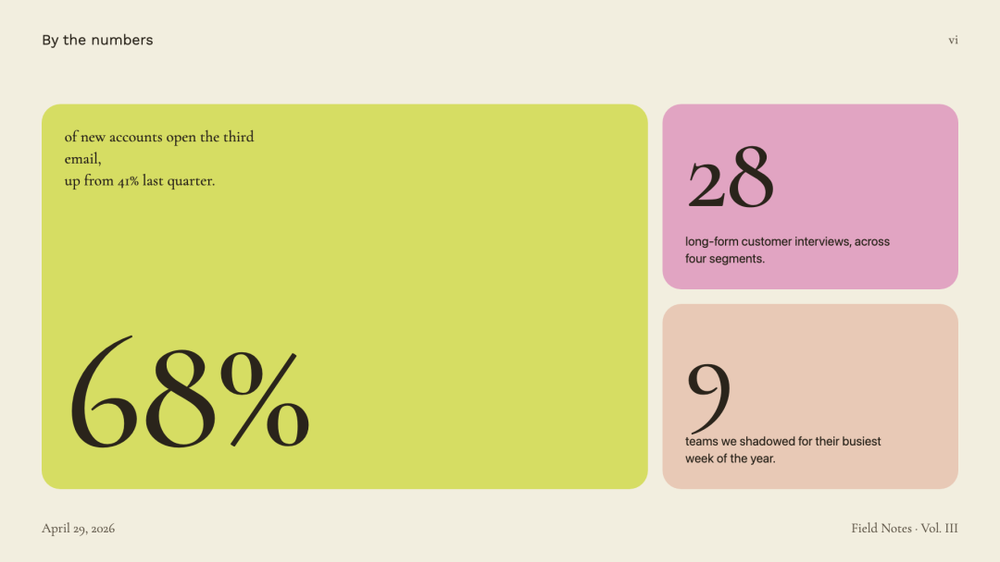

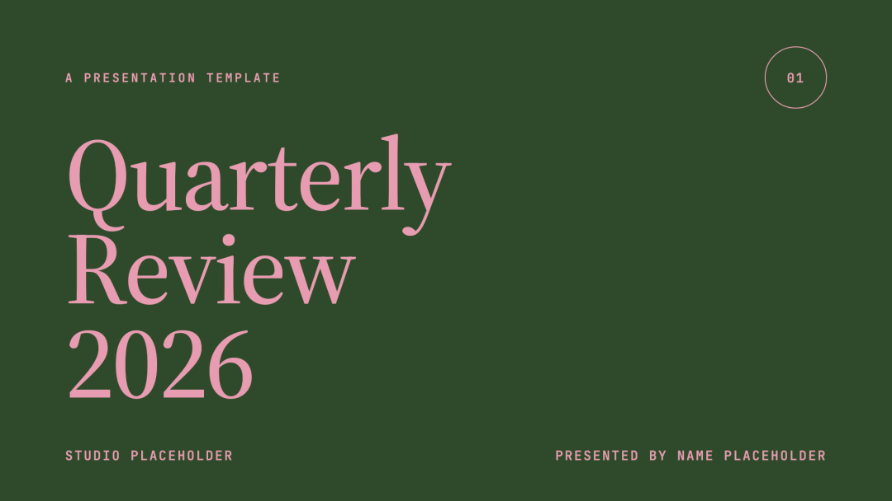

- **创意风**：Sakura Chroma（复古日式磁带包装美学，奶油纸 + 彩虹斜纹丝带）、Pin & Paper（黄纸 + 安全别针插画 + 手写字体，满满手作感）

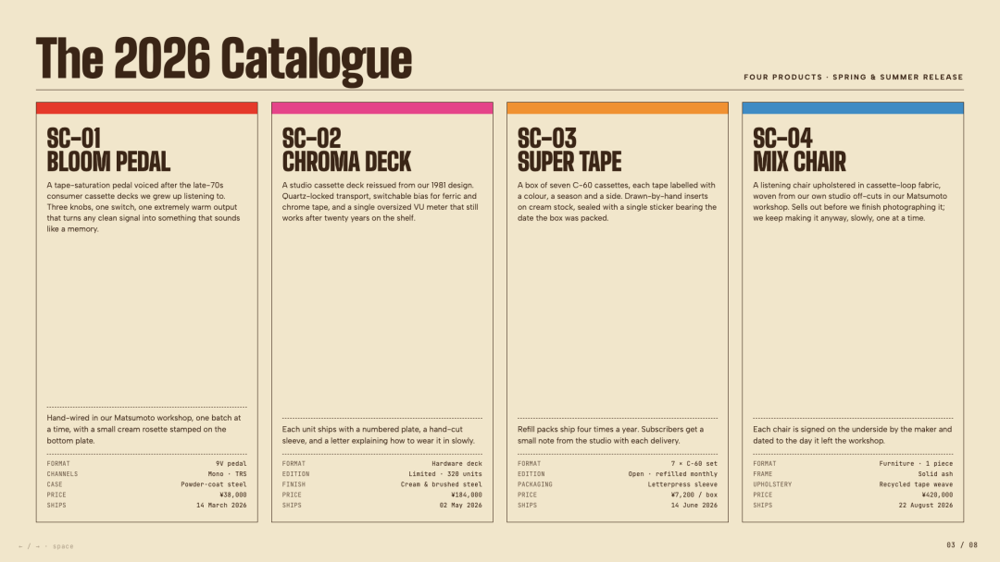

- **商务 / 学术风**：Vellum（藏青底 + 暖黄衬线字体，低调的学者气质）、Emerald Editorial（祖母绿 + 藏蓝，杂志封面级商务质感）

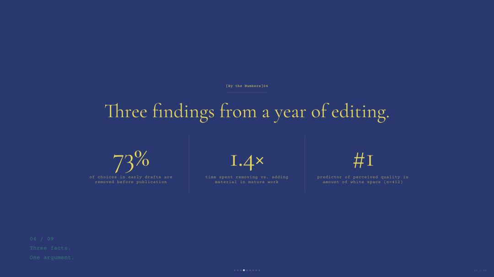

- **个性风**：Cobalt Grid（钴蓝衬线 + 方格纸画布 + 像素 glitch 装饰）、Stencil & Tablet（复古模板字体 + 大地色系，考古风撞品牌设计）

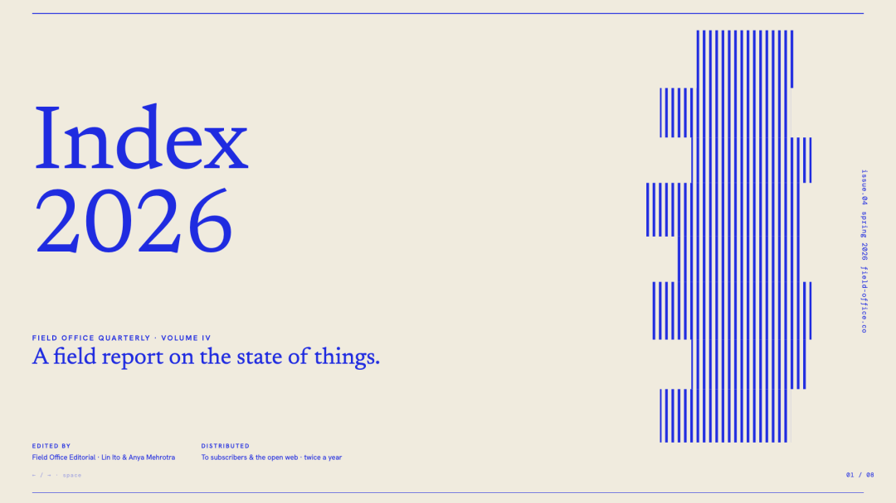

每款模板还提供「封面 + 中间页 + 后续页」3 类示例，直观展示不同布局的适配能力，不用再担心 **好看的模板只适配单页**！

另外，所有模板都是纯 HTML 编写，无复杂依赖，前端开发者可以直接克隆仓库复用，改改文字、配色就能快速适配自己的演示场景。

设计师也能参考模板的色彩搭配、排版逻辑，落地成可交互的 HTML 版本演示稿。

项目专门提供了「AGENTS.md」，说明了如何让 AI 代理读取

```
index.json
```

、匹配用户需求、自动克隆模板并适配内容，也就是说，你只需要描述想要的风格 / 场景，AI 就能帮你生成完整的高颜值幻灯片！

## 二、安装

只需把下面的内容告诉 AI Agent，就能自动安装这个 PPT 模板库：

```
Clone https://github.com/zarazhangrui/beautiful-html-templates and follow the instructions in AGENTS.md to build me a beautiful HTML slide deck.
```

## 三、体验

下面是使用这个 PPT 模板库，借助 AI Agent 生成的PPT：

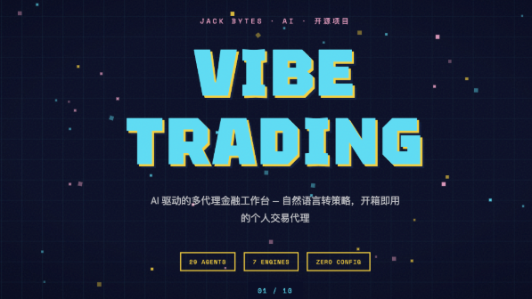

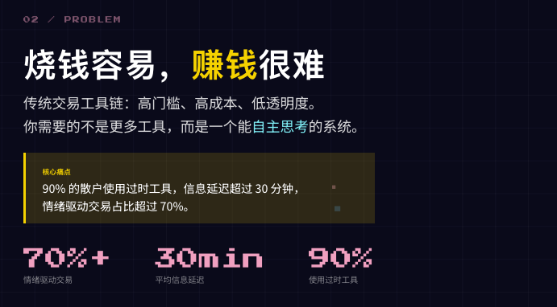

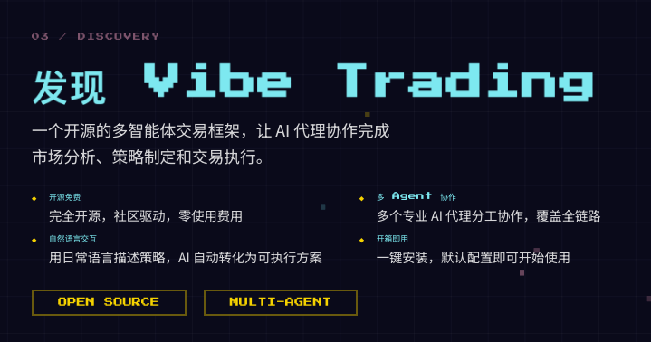

好了，今天的介绍就到这里了，大家感兴趣的话快去试试吧！

## 我是 Jack Bytes

一个专注于将人工智能应用于日常生活的半吊子程序猿！

**平时主要分享 AI、NAS、Docker、搞机技巧、开源项目等技术，喜欢的话请关注吧！**

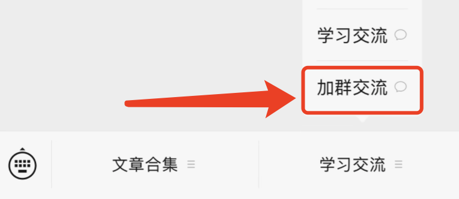
