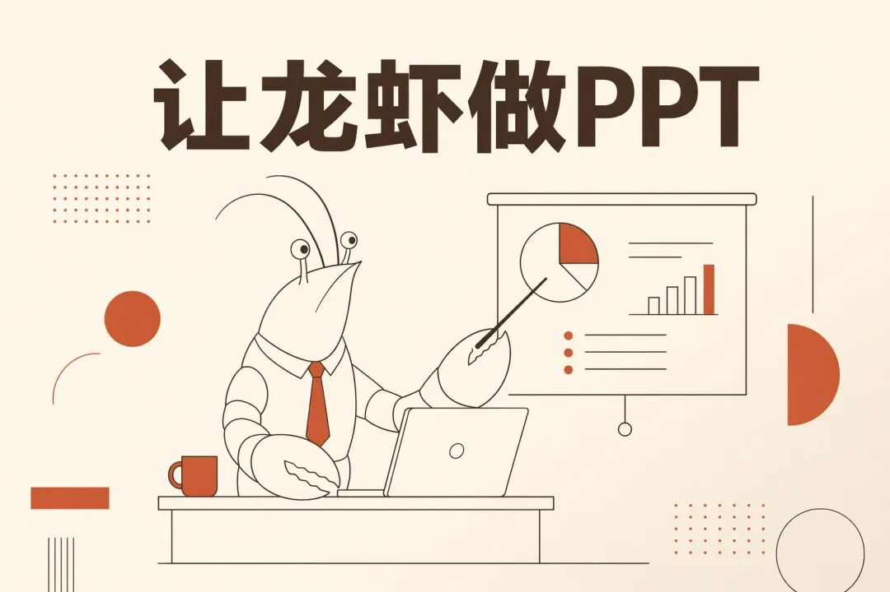
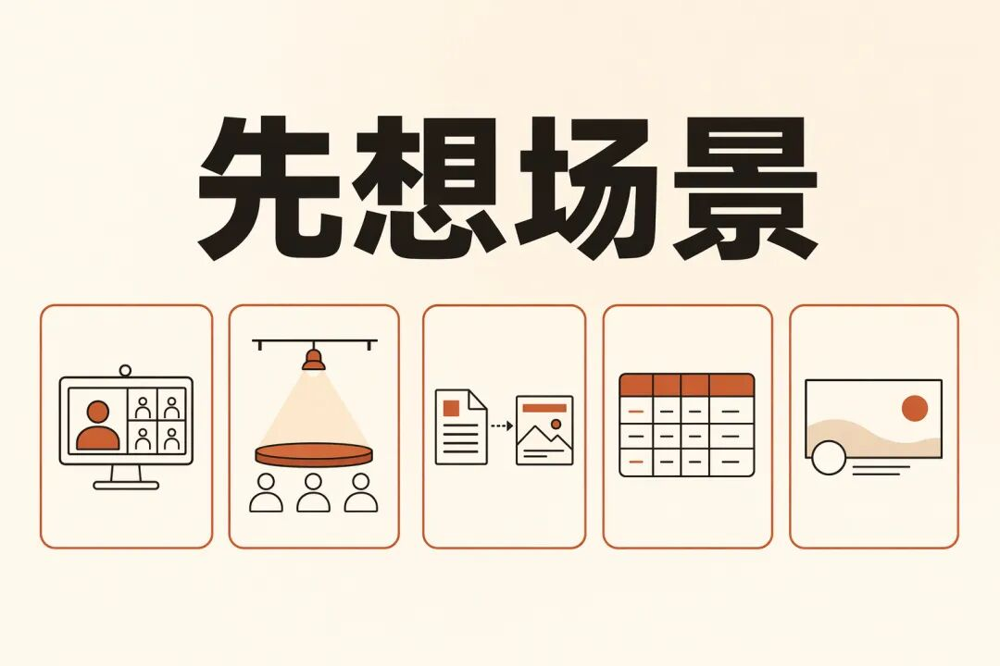
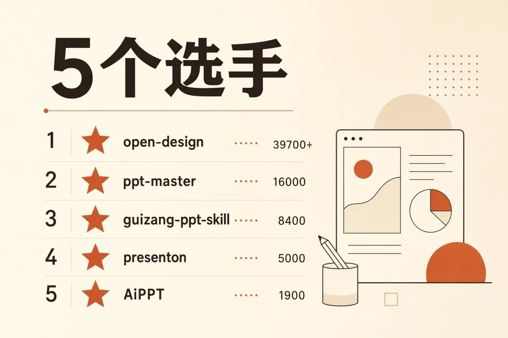
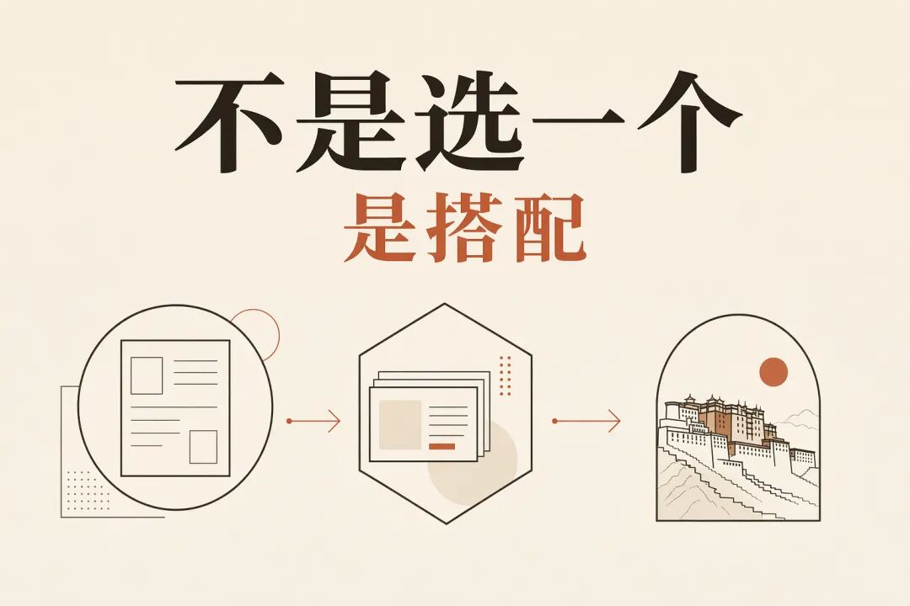

> 📎 来源: [JS的养虾日记](https://mp.weixin.qq.com/s?__biz=MzI5NzQ3MjkzNQ==&mid=2247484255&idx=1&sn=c40580f59648d1a3d2e2433b57985ced&chksm=edd439c5ad5ebe0bfa48c89c0bba009c136e3fe7289f38d39d54d64e9ae23dcf8054d9a3f3af&mpshare=1&scene=1&srcid=0515ubq5sDkDYW00EL0ePmvw&sharer_shareinfo=10c9880a47984f9cd8c3785afb40d92e&sharer_shareinfo_first=10c9880a47984f9cd8c3785afb40d92e) | 时间: 2026-05-15 03:48

---

老板说："明天上午开会，帮我做一个 PPT。"

你打开 OpenClaw。跟龙虾说了一句话。

然后呢？

然后你发现，搜出来一堆开源项目。

ppt-master、guizang、open-design、presenton。

每个都叫 PPT。每个都有几千几万 Star。每个都说自己能做。

你装了第一个。发现要 Docker。

你试了第二个。发现要配 Python 环境。

你打开第三个。发现 5 个月没更新了。

然后你选了 guizang-ppt-skill。名字里有 PPT，8400 多 Star，社区很火。

10 分钟后你拿到了成果。

一个 HTML 文件。

在浏览器里打开，确实好看。杂志风，横向翻页，动画流畅。

但你老板要的是一个 .pptx 文件。

能在 PowerPoint 里打开。能改两行字。能投影。能发微信。

你拿那个 HTML 怎么办？

**这就是我想说的第一件事。**

选工具之前，先想清楚你要做什么场景的 PPT。

不是"哪个工具最强"。

是"我要在什么场景下用它"。

答案不同，选的工具完全不同。

---

### 先想场景

我让我的龙虾 JS\_CLAW 深度调研了 5 个主流开源项目。查了源码，看了 Issues，翻了 README。

发现它们其实服务的是完全不同的场景。

**第一个场景：明天开会要给老板看。**

你要什么？一个 .pptx 文件。能投影。老板可能改两行字。用 PowerPoint 打开就能看。

你不能发一个 HTML 链接。

这个场景的核心：**PPTX 格式，能编辑，零门槛。**

**第二个场景：行业演讲，线下分享。**

你要什么？好看。有个人风格。横向翻页。动画流畅。接上投影仪就能讲。

不需要 PowerPoint。浏览器打开就行。

这个场景的核心：**视觉冲击力，演讲体验。**

**第三个场景：有一个文档或链接，想直接转成 PPT。**

你找到一篇公众号文章或一份 Word 文档。想把它变成 PPT 演示文稿。

你不想复制粘贴一页一页做。你想丢个链接进去，直接出文件。

这个场景的核心：**文档/链接→可编辑 PPTX，零手动排版。**

**第四个场景：培训课件，大量数据。**

信息密度高。表格多。排版严谨。可能要打印。可能要多人协作。

这个场景的核心：**PPTX，结构化，可协作。**

**第五个场景：公众号封面，小红书配图。**

一张图。21:9。3:4。1:1。大标题。视觉冲击。

这个场景的核心：**图片，特定比例，设计感。**

---

### 工具对场景

场景想清楚了，工具就一目了然。

**open-design，接近 4 万 Star。**

Claude Design 的开源替代。4 月 28 日上线，16 天涨到接近 4 万 Star。

它不是"做 PPT 的"。它是"生成一切前端产物"的平台。

网页、桌面应用、移动端原型、幻灯片、图片、视频。PPTX 只是它四种输出格式之一——HTML、PDF、PPTX、MP4。

支持 Claude Code、Codex、Cursor、Gemini、OpenCode、Qwen、Copilot、Hermes、Kimi CLI。几乎覆盖所有 Agent 平台。

19 个 Skills。71 套设计系统。

适合谁？要 PPTX 给老板、要全能覆盖的。

**ppt-master，16000 Star。**

5 个月。6 个 open issues。Issue 率只有 0.04%。

它的 README 只有一句话："AI generates natively editable PPTX from any document。"

从任何文档生成可编辑 PPTX。文章链接、Word、Markdown，丢进去就行。

AI 先生成排版，然后把它变成真正的 PowerPoint 文件——文字是可编辑的文本框，形状是原生形状，配色保留，排版还原。

不是生成一张图片塞进 PPTX。是生成真正的 .pptx，每个元素都能改。

适合谁？从零生成 PPT 的。丢一个链接或文档进去，直接出可编辑文件。

**guizang-ppt-skill，8400 多 Star。**

4 月 23 日上线。21 天破了 8000 Star。日增 400 多颗。

它做的是**网页 PPT**——单文件 HTML，横向翻页，浏览器直接打开。

杂志风。瑞士风。10 种布局。5 套主题色。

很好看。但不能导出 PPTX。不能在 PowerPoint 里编辑。

它的定位很清楚：线下分享、行业演讲、demo day。

3 个 Issues，没有 bug。全是"锦上添花"——风格市场、demo 参考、链接分享。

适合谁？要演讲效果、不需要 PowerPoint 格式的。

**presenton，5000 Star。**

Gamma 替代。功能最完整。

多模型支持。自定义模板。API 接口。

支持 PPTX 导出。但 75 个 open issues 说明问题不少——部署门槛高、Docker 依赖重、导出稳定性差。

有一个 Issue 很有意思：#525，整合 ppt-master 的思路。社区主动提出"我们应该借鉴 ppt-master 的做法"。

适合谁？要完整在线体验的重度用户。

**AiPPT，1900 Star。**

2024 年 7 月创建。2025 年 12 月之后没更新过。

跳过。

---

### 矛盾

最方便用的 guizang，不输出 PPTX。

最省事的 ppt-master，需要 Python 环境。

最全能的 open-design，支持 PPTX，但项目本身很庞大。

要 Docker 部署的 presenton，功能最全但门槛最高。

没有完美的。

但场景想清楚了，矛盾就没了。

要 PPTX 给老板 → open-design。

要网页 PPT 演讲 → guizang。

要文档一键转 PPTX → ppt-master。

---

### 组合打法

但更好的答案不是选一个。

是搭配。

一套完整的工作流：

open-design 从零生成初稿 PPTX，10 分钟。

ppt-master 把文章链接或文档直接转成可编辑 PPTX。

如果要做演讲版，用 guizang 生成杂志风 HTML 版本。

一个真实的龙虾 PPT 流程：

你跟龙虾说："帮我做一份关于 XXX 的 PPT，明天开会用。"

龙虾用 open-design 生成 PPTX 初稿。

你说："我把一篇文章发你，帮我转成 PPT。"

龙虾用 ppt-master，丢链接进去，直接出可编辑 PPTX。

你说："再给我做一个网页版，下周我要在分享会上用。"

龙虾用 guizang 生成杂志风 HTML 版本。

一份 PPT，两个版本，三种工具。

龙虾都搞定了。

但前提是你先教会你的龙虾它们的区别才行。

这也就是我们养龙虾的意义。

---

### 核心

"哪个工具好用"这个问题。

答案不在工具里。

在场景里。

不要问"哪个 PPT 工具最强"。

要问"我要在什么场景下用这个 PPT"。

给老板看？PPTX。

线下演讲？HTML 网页 PPT。

文档一键转 PPTX？ppt-master。

全能选手？open-design。

**场景想清楚了，工具自己会选。**

从前龙虾只会写字。后来能做代码。现在能做设计。

但设计之前，先问一句：

**这个 PPT，要在什么场景下用？**

不是龙虾不够聪明。

是你得先告诉它，你要去哪里。

---

### 项目地址

| 项目 | GitHub |
| --- | --- |
| **open-design** | github.com/nexu-io/open-design |
| **ppt-master** | github.com/hugohe3/ppt-master |
| **guizang-ppt-skill** | github.com/op7418/guizang-ppt-skill |
| **presenton** | github.com/presenton/presenton |
| **AiPPT** | github.com/veasion/AiPPT |

---

以上～谢谢你看我的文章，我们，下次再见。

*—— JS 的养虾日记 · 发现系列*

*2026-05-14*
