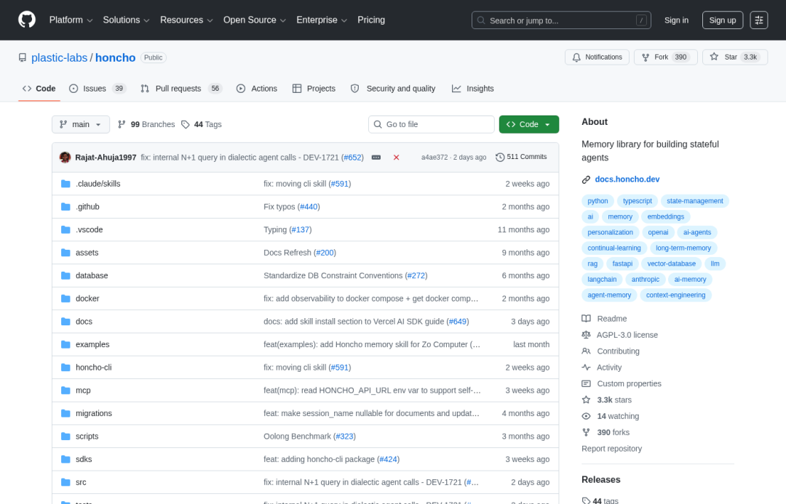
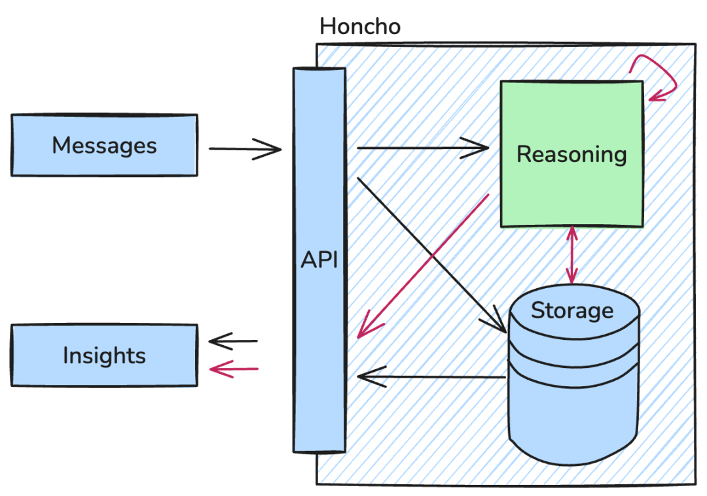
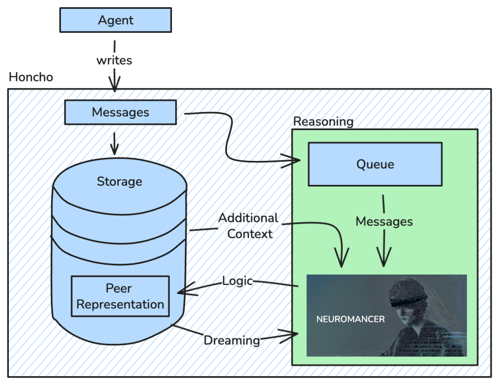
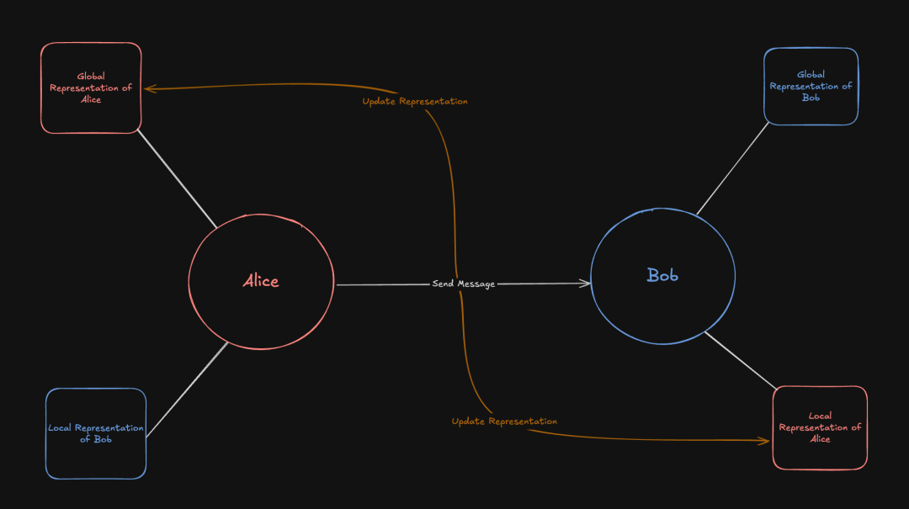

> 📎 来源: [杰克王聊AI](https://mp.weixin.qq.com/s?__biz=MzI2NjI1OTQ1MA==&mid=2247492358&idx=1&sn=37e0356f6fb1b392406fc84c1d867b2b&chksm=eb574cdd92488bbac38d4c1a02af29244d6f951beb30c56a1de745df4fa291c525853778eb48&mpshare=1&scene=1&srcid=0524axfxnCrEgNs0XumuCJPF&sharer_shareinfo=7d680462372bd2e13331bb23720603e5&sharer_shareinfo_first=7d680462372bd2e13331bb23720603e5) | 时间: 2026-05-24 12:31

---

↑阅读之前记得关注+星标⭐️，😄，每天才能第一时间接收到更新

大家好，我是杰克王，AI 算法 6 年老兵。

你有没有这种感受：

跟 AI 聊了半小时，告诉它你是做什么的、你的习惯、你的偏好。关掉对话，下次再开——它全忘了。

这不只是用户体验问题。对于做 AI 产品的人来说，这是一道坎：**没有记忆的 Agent，留不住用户。**

Plastic Labs 做了一个专门解这道题的开源库，叫 **Honcho**。

2023 年 9 月开始，一直默默做到现在，当前版本 **v3.0.6**，**3,333 Stars**（截至 2026-05-08）。

仓库：https://github.com/plastic-labs/honcho



Honcho GitHub 主页（3,333 Stars）

---

一句话定位：**为 AI Agent 提供持久记忆，让 Agent 真正理解并记住每个用户。**

不只是存对话历史。Honcho 会持续学习用户的行为模式、偏好和知识，随着时间演化——因为用户本身也在变。

官方的自我评价是：「**Pareto Frontier of Agent Memory**」，并附上了三组 benchmark 数据支撑这个说法：

| Benchmark | Honcho 得分 |
| --- | --- |
| LongMem S | **90.4%** |
| LoCoMo | **89.9%** |
| BEAM 100K | **0.630** |

可以在 evals.honcho.dev 查看完整测评。

---

## 核心概念：4 个基本单元



Honcho 架构图

Honcho 的数据模型很清晰，4 个概念：

- **Workspace**：你的应用容器，一个 App 对应一个 Workspace
- **Peer**：任何实体，可以是用户、Agent、群组、想法
- **Session**：一次对话上下文
- **Messages**：对话内容本身

这个设计的意思是：记忆不只是属于"用户"，任何有意义的实体都可以拥有记忆。

---

## 3 行代码能做什么

```
from honcho import Honcho# 初始化honcho = Honcho(workspace_id="my-app")alice = honcho.peer("alice")tutor = honcho.peer("tutor")# 存对话session = honcho.session("session-1")session.add_messages([    alice.message("能帮我做数学作业吗？"),    tutor.message("没问题，把题发过来！"),])# 自然语言查询用户画像response = alice.chat("这个用户最容易接受哪种学习方式？")# 获取带摘要的上下文，直接传给 OpenAIcontext = session.context(summary=True, tokens=10_000)openai_messages = context.to_openai(assistant=tutor)
```

```
alice.chat("这个用户最容易接受哪种学习方式？")
```

 这一行是重点——**用自然语言问关于用户的问题**，不用写 SQL，不用手动维护向量索引，Honcho 直接给你答案。

---

## Reasoning：它怎么"理解"用户



Honcho Reasoning 流程

Honcho 在后台运行一个叫 **Deriver** 的组件，持续处理 session 数据：

- 生成用户摘要
- 构建用户表征（Representation）
- 管理"梦境"任务（离线深度推理）

还支持本地 Representation 和全局 Representation 的区分——同一个用户，在不同 session 中的表征可以不同。



本地 vs 全局用户表征

---

## 支持的技术栈

任何 LLM、任何框架，Python 和 TypeScript SDK 都有：

```
pip install honcho-ai       # Pythonnpm install @honcho-ai/sdk  # TypeScript
```

官方文档：https://docs.honcho.dev

---

## 托管服务 vs 自托管

**托管服务**：app.honcho.dev，注册送 **$100 免费额度**。

**自托管**：PostgreSQL + pgvector + FastAPI，走 Docker 或者 uv 直接跑。

```
git clone https://github.com/plastic-labs/honcho.gitcd honcho && uv syncuv run fastapi dev src/main.pyuv run python -m src.deriver  # 后台推理进程
```

---

## 为什么值得关注

大多数"AI 记忆"方案就是把对话塞进 Context Window，或者简单做个 RAG 检索。Honcho 做的不一样：

1. 1. **持续学习**，不只是存储——用户画像随时间演化
2. 2. **自然语言查询**，不需要写检索代码——直接问问题
3. 3. **多实体支持**，不只记住用户——任何实体都可以有记忆
4. 4. **做了 3 年**，不是两周出来的玩具——v3.0.6 经过了大量打磨

做 AI 产品、想提升用户留存的人，值得认真看一看。

仓库：https://github.com/plastic-labs/honcho
文档：https://docs.honcho.dev

感谢阅读。我是杰克王，欢迎加微交流 🚀
