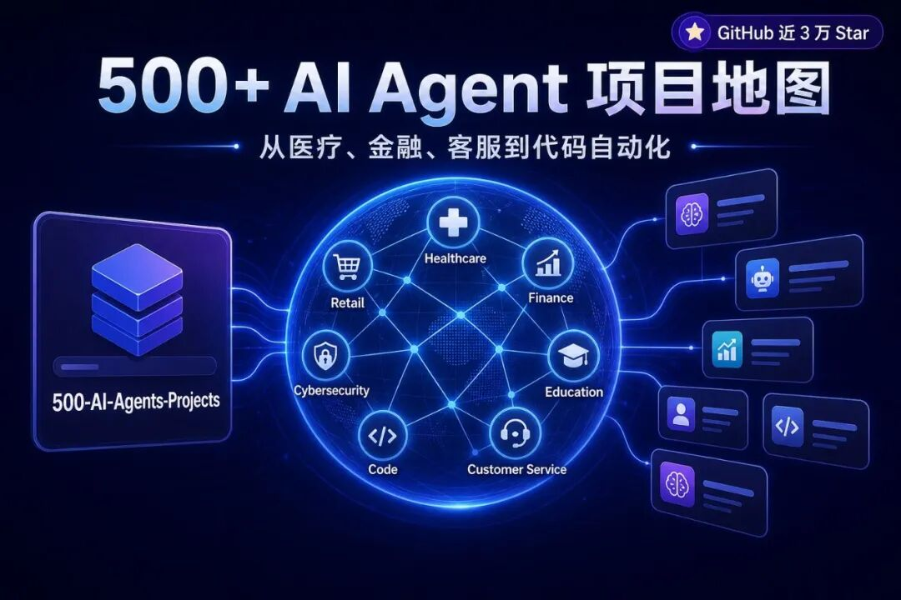
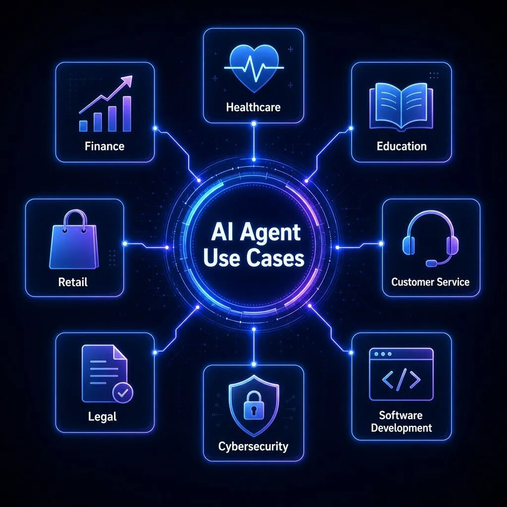
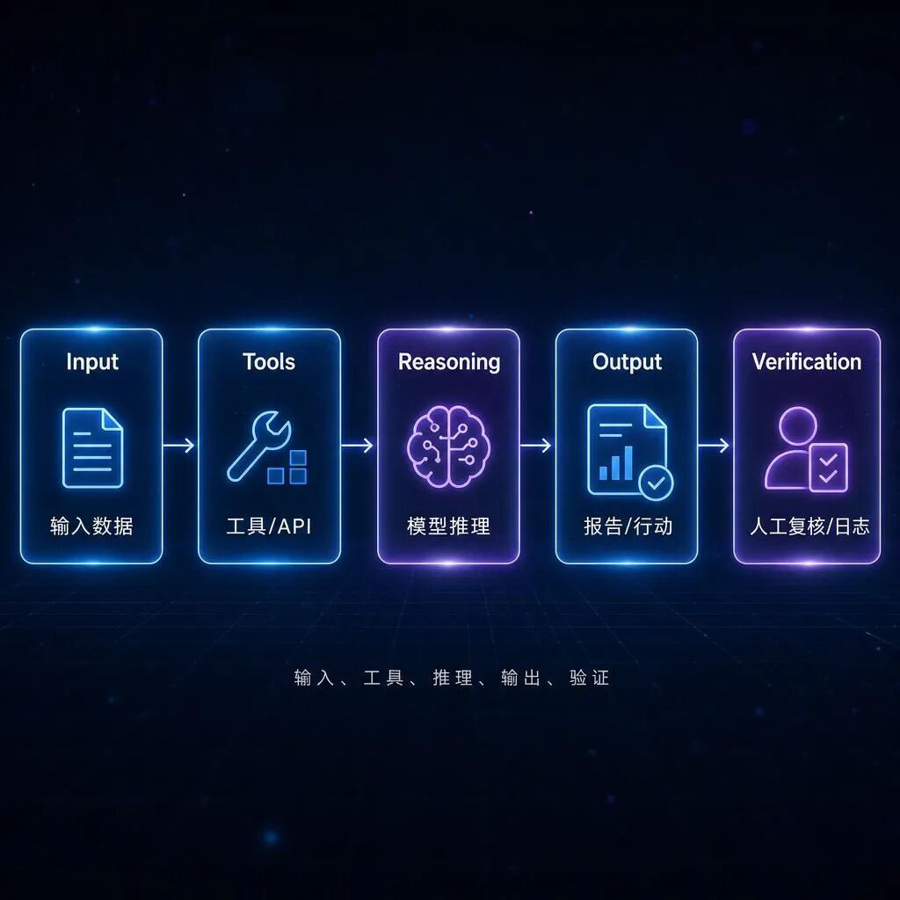
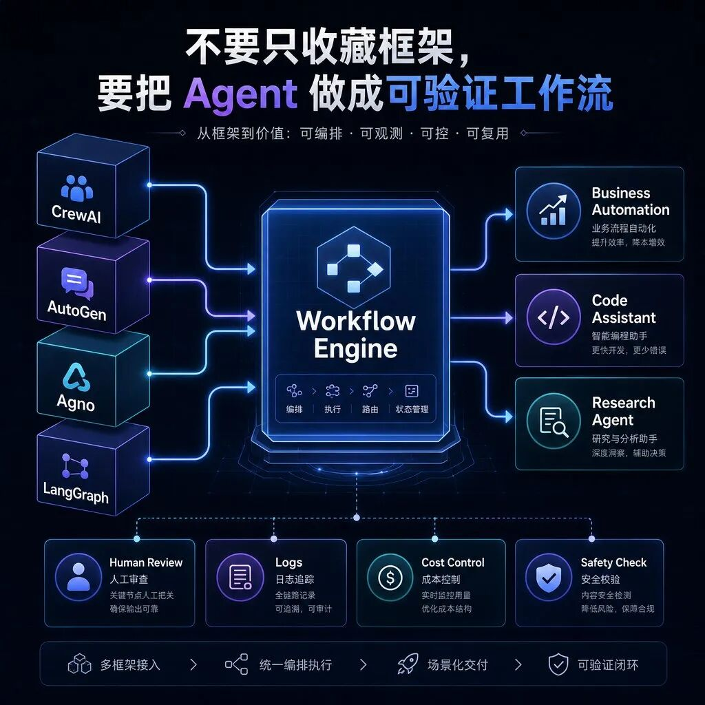

> 📎 来源: [AI 趋势方向](https://mp.weixin.qq.com/s?__biz=MzU5MTkyMzY4NQ==&mid=2247483765&idx=1&sn=035e4cf2ca526fc4c4d99c080e39057f&chksm=ff48b179c126abf5d1a2d31e6ff7bf131fb862b1b128e1730376bfbbfb7fb5e721fa9740f02c&mpshare=1&scene=1&srcid=05108iUD17hlnxaSi7SrwSGg&sharer_shareinfo=f2147fc7746467468ef9ff82a83f0483&sharer_shareinfo_first=f2147fc7746467468ef9ff82a83f0483) | 时间: 2026-05-10 15:08

---

别再只收藏 Prompt 了，这个 GitHub 仓库把 500+ 个 AI Agent 项目整理好了

如果你最近也在研究 AI Agent，大概率会遇到一个问题：

网上每天都有人说 Agent 很强，但真正轮到自己做项目时，还是不知道从哪里开始。

是先学 LangGraph？还是 CrewAI？

是做客服 Agent？还是做投研 Agent？

是先看论文？还是直接找开源项目抄一遍？

今天这个 GitHub 仓库，解决的就是这个问题。

它叫 500-AI-Agents-Projects。

项目地址：

https://github.com/ashishpatel26/500-AI-Agents-Projects

它不是一个单独的 Agent 框架，也不是一个完整产品。

更准确地说，它是一份 AI Agent 项目地图：把不同行业、不同框架、不同应用场景下的 Agent 案例集中整理出来，并给出对应的开源项目或教程链接。

截至我读取仓库时，这个项目已经接近 3 万 Star，MIT License，主线内容围绕：

500+ AI Agent 项目 / 用例

医疗、金融、教育、零售、客服、游戏、网络安全等行业场景

CrewAI、AutoGen、Agno、LangGraph 等框架案例

每个用例配行业、说明和对应代码 / Notebook 链接

一句话总结：

如果你不知道 AI Agent 到底能做什么，这个仓库可以当成选题库、项目库、学习路线库。

---

# 一、为什么这个仓库值得看？

现在很多人学 AI Agent，其实卡在第一步：

不是不会写代码，而是不知道该做什么。

你打开各种 Agent 框架文档，看到的通常是：

怎么定义角色

怎么配置工具

怎么接模型

怎么串工作流

怎么做多 Agent 协作

这些当然重要。

但问题是，文档通常不会告诉你：

这些能力落到真实业务里，到底可以变成什么项目。

这就是 500-AI-Agents-Projects 的价值。

它把 Agent 用例按行业和框架整理出来，让你先看到“场景”，再反推技术。

比如：

医疗：健康报告分析、医疗诊断助手

金融：自动交易 Bot、股票分析工具

教育：个性化 AI 导师

客服：7×24 小时自动客服

零售：商品推荐 Agent

法律：法律文档审查助手

招聘：候选人匹配和岗位推荐

旅行：行程规划助手

网络安全：威胁检测和红队测试 Agent

软件开发：代码生成、执行、调试 Agent

这比单纯收藏 Prompt 更有价值。

Prompt 只能解决一句话怎么问。

项目案例解决的是：

一个 Agent 到底应该服务谁、完成什么任务、接哪些工具、怎么交付结果。

---

# 二、它不是教程合集，而是 Agent 应用场景地图

这个仓库的 README 里，最核心的是一张用例表。

表格大概包含四类信息：

- Use Case：Agent 项目名称

- Industry：所属行业

- Description：这个 Agent 解决什么问题

- Code / Notebook：对应的开源代码或教程链接

这套结构很适合初学者。

因为你不用一上来就陷进技术细节，而是先问三个问题：

1. 这个 Agent 帮谁干活？

2. 它替人完成了哪一段流程？

3. 如果我要复刻，需要哪些能力？

比如“Automated Trading Bot”，它不是告诉你“Agent 能交易”这么简单。

你真正应该拆的是：

- 数据来源是什么？

- 是否有实时市场分析？

- 是否涉及下单？

- 风控怎么做？

- 回测和实盘怎么隔离？

- 人类是否需要最终确认？

再比如“Legal Document Review Assistant”，它背后不是“AI 看合同”这么泛。

它对应的是：

- 文档解析

- 条款抽取

- 风险识别

- 重点摘要

- 人工复核

- 权限和隐私保护

你会发现，Agent 真正有价值的地方，不是“会聊天”。

而是它能不能进入一个具体流程，把重复判断、资料整理、初步分析这类工作做掉。

---

# 三、我建议重点看这 4 类案例

这个仓库内容很多，不建议从头到尾硬啃。

更好的方式是先按目标筛选。

1. 想做业务自动化：看客服、销售、招聘、会议类 Agent

这类项目适合大多数普通团队。

因为它们不一定需要特别复杂的算法，更多是把已有流程自动化。

比如：

24/7 AI Chatbot：自动客服

Email Auto Responder Flow：邮件自动回复

Meeting Assistant Flow：会议助手

Lead Score Flow：销售线索评分

Recruitment Workflow：招聘流程自动化

Match Profile to Positions：候选人与岗位匹配

这类 Agent 的共同点是：

输入清楚，流程明确，结果容易验证。

比如客服 Agent，可以先限定知识库范围，只回答产品说明、退款规则、常见问题。

招聘 Agent，可以先做简历筛选建议，而不是直接决定录不录用。

会议助手，可以先生成纪要和待办，而不是替老板做决策。

这种边界清楚的项目，更容易落地。

---

2. 想学多 Agent 协作：看 AutoGen 和 LangGraph 案例

仓库里专门整理了框架维度的用例，包括：

- CrewAI

- AutoGen

- Agno

- LangGraph

其中 AutoGen 和 LangGraph 的案例，很适合理解多 Agent 协作。

比如 AutoGen 相关案例里有：

代码生成、执行和调试

多 Agent Group Chat

嵌套对话 Nested Chats

多任务顺序执行

数据可视化协作

带规划 Agent 和编码 Agent 的任务解决

这类案例的重点不是“几个 Agent 一起聊天”。

而是让你理解：

- 谁负责规划？

- 谁负责执行？

- 谁负责检查？

- 失败后怎么重试？

- 中间结果怎么传递？

- 人类在哪一步介入？

很多人做 Agent 项目失败，是因为只做了“角色扮演”，没有做“流程控制”。

真正能跑起来的 Agent 系统，通常都需要这几层：

- 任务拆解

- 工具调用

- 状态管理

- 结果验证

- 异常处理

- 成本控制

所以如果你想进阶，不要只看角色 Prompt。

要重点看这些多 Agent 工作流案例。

---

3. 想做垂直行业产品：看医疗、金融、法律、供应链

这类场景更接近真实商业价值。

仓库里包含不少垂直行业案例：

Health Insights Agent：健康报告分析

AI Health Assistant：医疗诊断和监测

Automated Trading Bot：自动交易 Bot

Stock Analysis Tool：股票分析工具

Legal Document Review Assistant：法律文档审查

Logistics Optimization Agent：物流优化

Energy Demand Forecasting Agent：能源需求预测

Factory Process Monitoring Agent：工厂流程监控

但这里要提醒一句：

行业越垂直，越不能只看 Demo。

医疗、金融、法律这类方向，真实落地时会涉及：

- 数据隐私

- 合规要求

- 错误成本

- 人工复核

- 责任边界

- 安全审计

所以这类项目更适合拿来做研究、原型和内部辅助。

不要看完一个 GitHub Demo，就觉得可以直接上线替人做专业决策。

尤其是金融交易类 Agent，更要把“分析”和“执行”拆开。

分析可以自动化。

下单必须有风控、回测、限额、暂停机制，最好还要有人类确认。

---

4. 想找灵感做产品：看推荐、内容、旅行、游戏类 Agent

如果你做的是 C 端产品、内容工具或者小应用，可以重点看这些方向：

Product Recommendation Agent：商品推荐

Content Personalization Agent：内容个性化推荐

E-commerce Personal Shopper Agent：电商导购

Virtual Travel Assistant：旅行助手

Surprise Trip Planner：惊喜旅行规划

AI Game Companion Agent：游戏陪伴 Agent

Instagram Post Generator：社媒内容生成

Landing Page Generator：落地页生成

这些项目更适合做 MVP。

因为用户需求直观，演示效果也明显。

比如旅行助手，不一定一开始就要接全套机票酒店 API。

第一版可以先做：

根据预算生成路线

根据天数安排景点

根据用户偏好推荐城市

输出可复制的行程表

生成旅行清单

这就是一个可展示、可迭代的小产品。

很多 Agent 产品不是死在模型能力上，而是死在一开始想做太大。

先做一个窄场景，把输入、工具、输出跑通，反而更容易成功。

---

# 四、怎么用这个仓库？我建议分三步

这个仓库最怕的用法是：

收藏，然后再也不打开。

更有效的方式是把它当成一个项目筛选器。

第一步：先选行业，不要先选框架

不要一上来问：

“我应该学 CrewAI 还是 LangGraph？”

更好的问题是：

“我想自动化哪一类工作？”

比如你是运营，就看内容、客服、社媒、销售线索。

你是程序员，就看代码生成、调试、文档、API 管理。

你做投研，就看金融分析、数据抓取、报告生成。

你做企业服务，就看会议、招聘、知识库、流程自动化。

先确定场景，再选技术栈。

否则很容易变成框架收藏家。

---

第二步：把案例拆成 5 个模块

看到一个 Agent 项目，不要只看名字。

建议你按这 5 个问题拆：

1. 输入是什么？

- 文档、网页、数据库、用户问题、行情数据、邮件、工单？

2. 工具是什么？

- 搜索、数据库、浏览器、代码执行、API、向量库、日历、邮件？

3. 推理任务是什么？

- 分类、总结、规划、问答、推荐、审查、决策辅助？

4. 输出是什么？

- 报告、表格、代码、通知、工单、交易建议、行动清单？

5. 验证怎么做？

- 人工复核、单元测试、规则校验、回测、日志、审批流？

这 5 个问题回答清楚，一个 Agent 项目就不再玄乎。

它会变成一个普通工程问题：

输入 → 工具 → 推理 → 输出 → 验证。

---

第三步：先复刻一个小项目，再改成自己的业务

初学者不要一开始就原创。

更好的路径是：

1. 找一个和你业务接近的案例

2. 跑通原项目

3. 替换数据源

4. 替换提示词和角色定义

5. 加上自己的工具 API

6. 增加日志和验证

7. 再考虑部署和自动化

比如你看到一个“会议助手”案例。

你可以先跑通它，再改成：

- 自媒体选题会助手

- 投研会议纪要助手

- 客户访谈总结助手

- 产品需求评审助手

底层结构差不多，但业务价值完全不同。

这就是开源案例最适合的用法。

不是照抄成品，而是拿它当骨架。

---

# 五、我自己的使用方式：配一个稳定的模型通道

我现在用这类 Agent 项目时，不会只看 Agent 角色库本身，还会配一个稳定、成本合适的模型通道。

比如我自己最近常用的是 PPToken。

它可以理解成一个面向 Codex / OpenAI 系列模型 的中转站，主要解决几个现实问题：

- 国内使用更方便，不用自己折腾复杂接入

- 支持 Codex 相关模型和图片生成能力

- 直充价格相对更便宜

- 套餐比单次零散使用更划算

- 跑代码、跑 Agent、生成公众号封面和插图都比较顺手

- 我自己也在用，稳定性目前体验还不错

- 有用户交流群，遇到接入、模型选择、报错、图片生成这些问题，可以互相交流，也有人解答疑难

链接放这里，感兴趣可以自己看：

https://www.pptoken.org/?promo=AFF76

我的建议是：

代码类任务，优先选稳定、上下文够长、响应别太飘的模型通道。

图片类任务，可以用 gpt-image-2 这类图像模型来做公众号封面、插图、社媒素材。

Agent 类任务，不要只看模型名字，还要看角色定义、工具权限、验证流程和成本控制。

工具只是入口。

真正拉开差距的，是你能不能把模型、Agent、图片生成、自动化流程组合成一套稳定工作流。

---

# 六、这个仓库适合谁？

我觉得它特别适合四类人。

1. 想学 AI Agent，但不知道做什么项目的人

如果你只看教程，很容易陷入“学了很多概念，但没有作品”。

这个仓库可以帮你快速找到练手方向。

你可以挑一个行业案例，先跑一个最小版本。

---

2. 做自媒体、课程、社群选题的人

这里面很多案例，本身就是选题库。

比如：

AI Agent 怎么改造招聘？

AI Agent 怎么做投研？

AI Agent 怎么服务中小企业？

AI Agent 怎么进入教育、医疗、客服、法律？

每个方向都能展开成文章、视频、直播课。

---

3. 创业者和产品经理

如果你想找 Agent 产品机会，这个仓库可以帮你做横向扫描。

不要只盯着“聊天助手”。

真正有机会的地方，往往是垂直流程里的低效率环节。

比如合同审查、客服分流、销售跟进、库存预测、报告生成、数据整理。

---

4. 开发者和自动化玩家

如果你已经会写代码，这个仓库更像一个靶场。

你可以从里面选一个项目，练：

RAG

Function Calling

工具调用

多 Agent 协作

状态机

任务调度

日志和回放

人工审批

部署和成本控制

这些能力，比背一堆框架名更有用。

---

# 七、也要注意它的局限

这个仓库很好，但不要神化。

我看下来，它更像“索引库”和“灵感库”，不是质量统一的课程。

所以使用时要注意几件事：

1. 链接质量不一定完全一致

它收录的是大量项目和教程链接，不代表每个项目都维护良好。

有些可能是 Notebook，有些是示例代码，有些可能已经很久没更新。

所以真正采用前，要看：

- 最近更新时间

- Issues 情况

- 依赖是否还能安装

- README 是否清楚

- License 是否允许使用

---

2. 行业案例不能直接等于可商用产品

尤其是医疗、金融、法律、安全这些方向。

开源 Demo 能说明思路，不代表能直接上线。

真实使用必须考虑：

- 合规

- 隐私

- 审计

- 责任边界

- 错误兜底

- 人工确认

Agent 越接近真实决策，越要谨慎。

---

3. 不要只学框架，要学验证流程

很多 Agent 项目 Demo 看起来很炫，但一到生产环境就崩。

原因通常不是模型不够强，而是缺少验证。

比如：

生成内容有没有事实校验？

调 API 失败怎么重试？

工具返回空结果怎么办？

多 Agent 互相扯皮怎么停止？

成本失控怎么限额？

输出结果谁来审批？

这些才是 Agent 项目真正的工程难点。

---

# 八、如果我是新手，会怎么开始？

我建议别贪多，按这个路线走：

第 1 天：浏览仓库，选 3 个最感兴趣的案例

不要超过 3 个。

每个案例只回答一句话：

“它帮谁解决什么问题？”

---

第 2 天：选一个最小项目跑起来

优先选这类项目：

- 客服问答

- 会议纪要

- 邮件自动回复

- 文档总结

- 简单代码助手

- 社媒内容生成

不要一开始就碰医疗诊断、自动交易、法律裁决这种高风险场景。

---

第 3 天：改成自己的数据

比如：

- 把客服知识库换成你自己的产品 FAQ

- 把会议助手换成你自己的会议纪要模板

- 把内容生成器换成你的账号风格

- 把代码助手换成你的项目仓库

这一步开始，项目才真正属于你。

---

第 4 天：加验证

至少加三件事：

- 日志：每次输入、工具调用、输出都能追踪

- 限制：危险动作必须人工确认

- 检查：输出结果要有规则或人工复核

没有验证的 Agent，本质上只是高级玩具。

---

第 5 天：做成一个可重复工作流

最后，把它变成你每天能用的东西。

比如：

- 每天自动整理行业资讯

- 每天生成 10 个选题

- 自动把会议录音转成纪要

- 自动生成客户跟进摘要

- 自动扫描代码仓库里的 TODO

- 自动整理交易复盘初稿

做到这一步，Agent 才开始产生复利。

---

# 九、我的判断

500-AI-Agents-Projects 这种仓库，最适合做三件事：

第一，帮你建立 Agent 应用地图。

你会看到 Agent 不只是聊天机器人，而是可以进入医疗、金融、教育、客服、招聘、软件开发、网络安全、供应链等具体流程。

第二，帮你找到练手项目。

新手最怕没有项目感。这个仓库给了大量案例，你可以从中选一个最小可复刻版本。

第三，帮你从“框架思维”切换到“场景思维”。

不要问“哪个 Agent 框架最强”。

先问：

我要自动化哪一段流程？这个流程输入是什么，工具是什么，输出是什么，怎么验证？

如果这个问题答不上来，换再多框架也没用。

如果这个问题答清楚了，CrewAI、AutoGen、Agno、LangGraph 都只是工具选择。

最后给一句很直接的建议：

别再只收藏 Prompt 了。

真正值得收藏的，是这些可以拆、可以跑、可以改、可以验证的 Agent 项目案例。

项目地址再放一次：

https://github.com/ashishpatel26/500-AI-Agents-Projects

如果你正在学 AI Agent，可以先把这个仓库收藏起来。

不要只看 Star。

选一个小场景，跑起来，改成自己的工作流。

这才是 Agent 真正开始有价值的地方。

