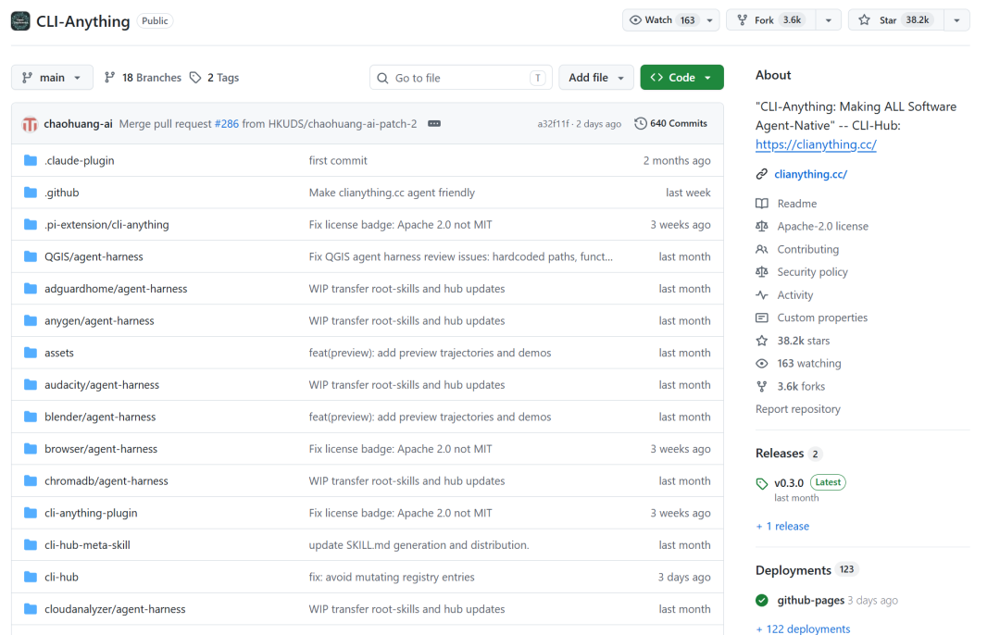
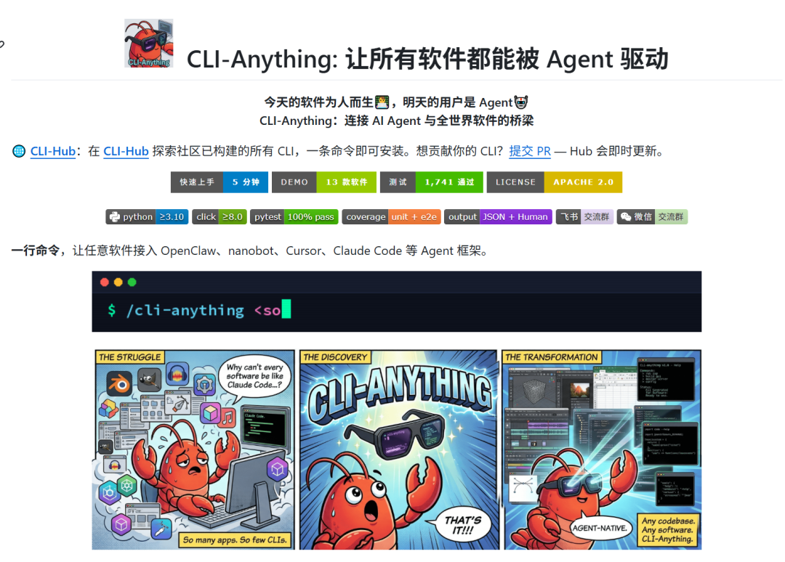
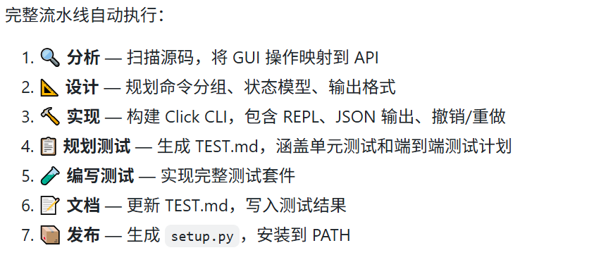
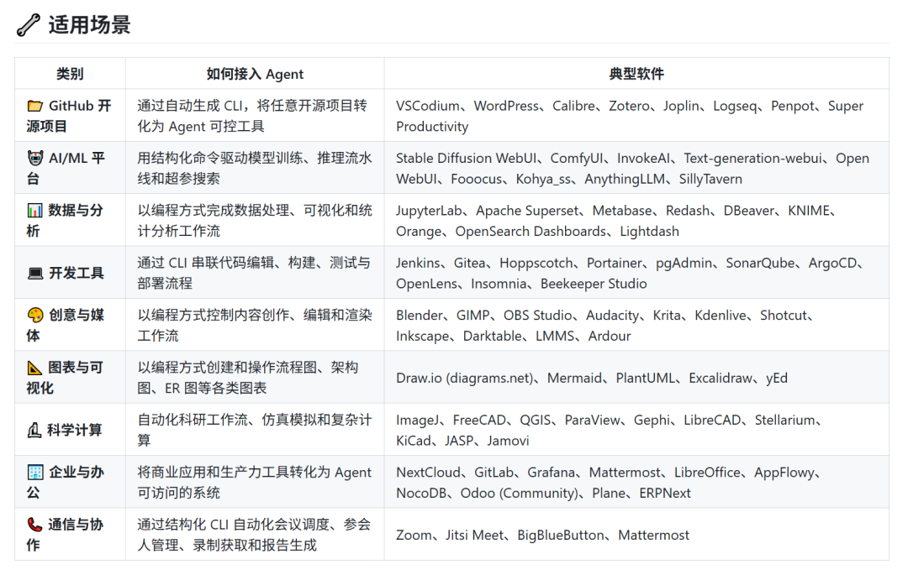
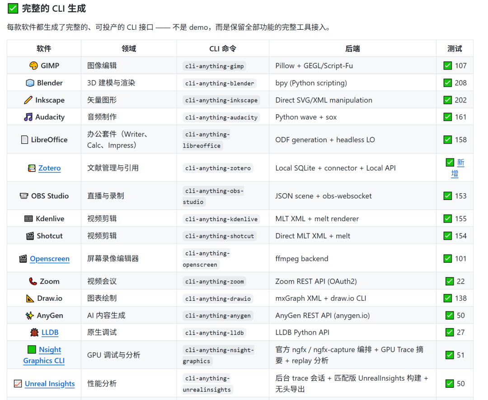

> 📎 来源: [时之AI测评](https://mp.weixin.qq.com/s?__biz=MzIyMjg2MTM0OQ==&mid=2247485444&idx=1&sn=0f7644b89650e2b55af392b95a52b122&chksm=e94e512cdcdb7c1b01bcc44c6e3c55aaec3b225e6291f6bf99c27c617f5fb053261df51db3e0&mpshare=1&scene=1&srcid=0522lnFIUs2z2gc7iCmOuZNC&sharer_shareinfo=3f1f7930301184b0ddb9be3bf0730a1f&sharer_shareinfo_first=3f1f7930301184b0ddb9be3bf0730a1f) | 时间: 2026-05-22 02:07

---

一个开源项目，一行命令把任意软件变成AI Agent可操作的CLI工具。

你的 AI Agent 不再只会聊天，它能直接打开 Blender 建 3D 火星车、用 GIMP 专业修图、FreeCAD 设计机械、Kdenlive 剪视频、Draw.io 画复杂流程图……

全部通过真实可靠的 CLI 命令完成！

核心亮点：

- 一条命令就把任意 GUI/API 软件变成 Agent 原生 CLI（完美支持 Claude Code、Pi、OpenClaw 等）

- 自动生成完整 CLI + 测试 + 文档，超 2280 个测试 100% 通过

- 真实软件驱动 + 结构化 JSON 输出



#AI#CLI#开源#自动化#Python

你有没有想过，为什么AI Agent（智能体）能干很多事情，却没法直接操作你电脑上的专业软件？比如让Claude Code帮你自动调一下Blender的渲染参数，或者让Pi Agent打开GIMP修个图？这听起来像科幻，但HKUDS团队开源的 CLI-Anything 正在把它变成现实。



## 当AI的“手”伸不进图形界面

现在的AI Agent像是一个聪明但手残的助手。它能写代码、查资料、调用API，但一遇到图形用户界面（GUI）就抓瞎。因为Agent只能通过命令行（CLI）与外界交互，而绝大多数专业软件——从CAD、3D建模到视频编辑、笔记管理——都长着一张“给人类看”的图形脸。没有CLI接口，Agent就无能为力。

CLI-Anything 的解决思路非常直接：自动为任何软件生成一个CLI封装。它不改造软件本身，而是在外面包一层命令行壳，让Agent可以像操作普通命令行工具一样，发送“打开文件”、“导出PNG”、“应用滤镜”这类指令。项目口号说得明白：今天的软件为人服务，明天的用户将是Agent，CLI-Anything 就是两者之间的桥梁。



## 它到底怎么工作？

CLI-Anything 的核心是“一键生成CLI”。你只需要选择一个AI编程代理（比如 Claude Code、Pi Coding Agent、OpenClaw 等），然后运行一条命令，它就会自动帮你完成全部工作。

以 Claude Code 为例：安装官方插件后，在对话里输入 

```
/cli-anything ./gimp
```

（假设你要为GIMP生成CLI），它会经历一套完整的管道：

1. 分析

   — 扫描软件的源代码或API，把GUI操作映射成可调用的功能
2. 设计

   — 规划命令组、状态模型和输出格式
3. 实现

   — 用Python Click库生成CLI代码，自带REPL交互、JSON输出、撤销/重做
4. 计划测试

   — 创建单元测试和端到端测试方案
5. 写测试

   — 自动实现完整的测试套件
6. 文档

   — 更新测试结果
7. 发布

   — 生成 

   ```
   setup.py
   ```

   ，安装到PATH

这意味着你甚至不需要手动写一行CLI代码，Agent自己就把活干了。之后还可以用 

```
/cli-anything:refine
```

 命令反复迭代，补充更多功能，每次都是增量更新，不会破坏已有内容。



## CLI-Hub：一个正在成长的生态

CLI-Anything 不止是一个生成工具，它还配套了一个集中式仓库叫 CLI-Hub。用 

```
pip install cli-anything-hub
```

 就能安装，然后用一条命令浏览、安装、管理社区贡献的所有CLI封装。



目前CLI-Hub上已经有几十个现成的CLI，覆盖了从专业软件到小工具的各种类别。随便举几个例子：

- Blender CLI

  — 3D建模与渲染自动化
- GIMP CLI

  — 图像处理
- FreeCAD CLI

  — 工业设计，含258条命令、17个命令组
- Zotero CLI

  — 文献管理
- Obsidian CLI

  — 知识库操作
- Kdenlive CLI

  — 视频编辑
- Safari CLI

  — 浏览器自动化（基于MCP）
- Godot CLI

  — 游戏引擎控制
- MuseScore CLI

  — 乐谱编辑

每个CLI都经过CI测试，并且附带 

```
SKILL.md
```

 文件——它是AI可发现的技能定义，让Agent能直接“读懂”这个CLI能干什么。甚至还有一个“元技能”，Agent可以自主发现并安装新的CLI。

## 为什么非要用CLI？

项目在README里阐述得非常清楚：CLI是人和Agent都能理解的通用界面。它是结构化的，方便LLM处理；轻量级，没有任何图形依赖；自描述的，

```
--help
```

 就是天然文档；而且执行结果确定——输出JSON，Agent不需要猜。Claude Code每天通过CLI运行成千上万的真实工作流，证明这条路行得通。

你可能担心：覆盖这么多软件，会不会不稳定？从更新日志看，社区非常活跃。几乎每天都有新的CLI合并进来，bug修复和小版本迭代很频繁。而且CLI-Hub已经支持从 

```
pip
```

、

```
npm
```

、

```
brew
```

 等多种来源安装公共CLI，覆盖面越来越广。

## 谁应该试试？

如果你是AI Agent重度用户，想让Agent替你完成重复的软件操作——比如批量渲染、自动排版、定时数据导出——CLI-Anything 会让你省下大量时间。如果你是软件插件的开发者，也可以为你的应用贡献一个CLI封装，提交PR后就能出现在CLI-Hub上，让整个社区的Agent都能用。

当然，如果你只是好奇“AI到底能不能打开Photoshop”，下载一个现成的CLI玩一玩也毫无门槛。唯一前提是你的电脑上已经安装了目标软件，并且有一个支持CLI-Anything的AI代理（Claude Code、Pi、OpenClaw等）。

## 写在最后

AI Agent 正在从“只会聊天”进化成“能干实事”。CLI-Anything 的野心是把所有专业软件都变成Agent的原生工具。虽然目前主要还是围绕开源或提供API的软件，但这个思路本身已经在改变我们和软件的交互方式。说不定过不了多久，你只需要对手机说一句：“帮我用Blender做一个凳子模型，导出STL”，后台的Agent就调用CLI-Anything帮你完成了。

感兴趣的话，可以直接去项目主页看看演示视频和详细文档。项目名字叫 CLI-Anything。

持续分享优质 AI 开源项目与源码实战，一个人摸索很容易踩坑。

对 Agent、智能体感兴趣的朋友，无论新手还是大佬，都欢迎一起交流。私信「时之」拉你进群。

想拿到仓库地址，直接动手试试？

GITHUB: https://github.com/HKUDS/CLI-Anything
