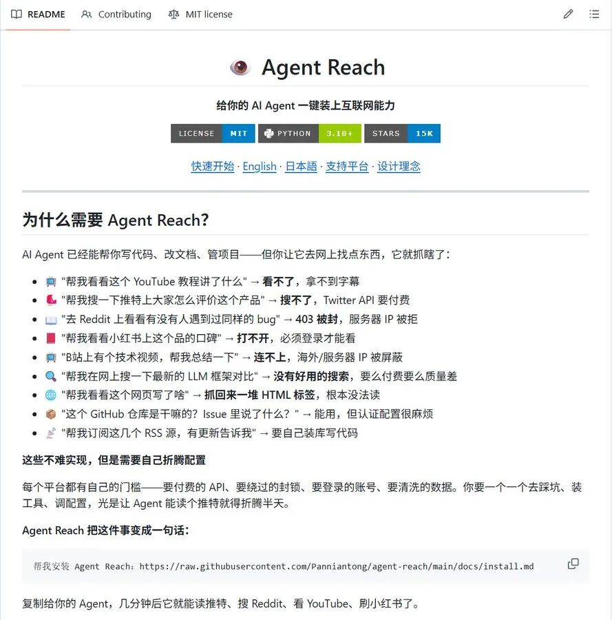
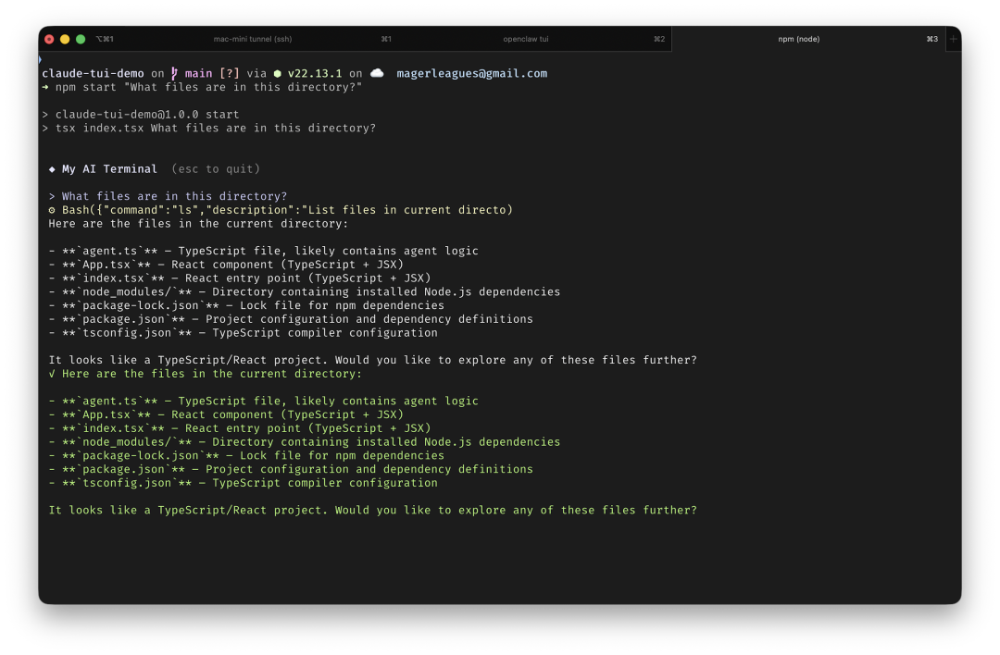

> 📎 来源: [不掉发的小呆呆](https://mp.weixin.qq.com/s?__biz=Mzk0MzU5NzYwMg==&mid=2247484597&idx=1&sn=90e60fbeb6e493c05900afc8d0430ae4&chksm=c2d3f1832d2b50fd30a4982678a20f7342361ac4790f8439e19470c36dc768fcd94283a955cf&mpshare=1&scene=1&srcid=0408AvnlKmXiJOe19OvImXSz&sharer_shareinfo=8912ad8ac4ff0fcf33e3a5cb2781a2dc&sharer_shareinfo_first=8912ad8ac4ff0fcf33e3a5cb2781a2dc) | 时间: 2026-04-13 16:15

---

你有没有过这样的经历：让 AI Agent 帮你调研一个热门话题，它却因为缺少 API Key 而卡壳；想让它抓取 YouTube 字幕或 B 站视频，却被付费墙挡住；搜索小红书笔记或 X（Twitter）讨论时，直接吃到 403 错误，彻底抓瞎？在 AI Agent 时代，“互联网感知能力” 已经成为最大瓶颈。官方 API 动辄几百美元/月，中文平台几乎没有公开接口，反爬机制越来越严。无数开发者、研究员和 Web3 玩家都在为“让 Agent 真正上网”头疼。好消息是，现在有一个开源工具，用一条命令就能解决这一切。它叫 Agent Reach，GitHub 上已收获超 1.6 万 Star，被誉为“给 AI Agent 装上全网眼睛”的神器。今天，我就把这个工具从头到尾拆解给你看：它到底是什么、怎么用、支持哪些平台、真实场景有多强，以及使用时的注意事项。读完这篇，你就能立刻让自己的 AI Agent 实现“零成本、全平台、无限制”上网。



一、Agent Reach 到底解决了什么痛点？传统方案的痛点非常明显：

1. API Key 贵且有限制：Twitter API 基础版就要 100 美元/月，高级功能更贵；YouTube Data API 有配额限制；国内平台几乎无官方 API。
2. 付费墙与反爬：Reddit、X、小红书、抖音等平台频繁弹出 403、429 错误，普通爬虫很快被封。
3. 配置复杂：不同平台需要不同工具、代理、Cookie，手动折腾半天，Agent 还是不会用。
4. 隐私与费用双重负担：第三方爬虫服务不仅贵，还可能泄露数据。

Agent Reach 的核心思路是\*\*“脚手架 + 上游开源 CLI”：它不自己造轮子，而是把目前最成熟的开源命令行工具（yt-dlp、twitter-cli、rdt-cli、gh CLI 等）一键安装、自动配置好。Agent 安装完后，直接调用这些原生 CLI，就能读取、搜索、提取内容，完全零 API 费用、本地运行。一句话总结：它把“让 Agent 上网”从一个工程难题，变成了复制粘贴一条指令。



二、Agent Reach 的五大核心优势

1. 支持 15+ 主流平台，一键打通中英文互联网
   它覆盖了全球开发者最常用的信息源，包括：  真正实现了“中文 + 英文 + 视频 + 社区 + 代码”全覆盖。

- Twitter/X：读单条推文、搜索、时间线、发帖（Cookie 解锁完整功能）
- Reddit：搜索帖子、读取全文及评论
- YouTube：提取字幕、视频信息、搜索
- GitHub：查看公开仓库、搜索代码、Issue/PR（私有需 gh auth login）
- Bilibili（B 站）：本地提取字幕、视频解析（服务器端建议加代理）
- 小红书：阅读笔记、搜索、发帖、评论、点赞
- 抖音：视频解析、无水印下载
- 微信公众号：搜索 + 全文 Markdown 输出
- 微博：热搜、搜索、用户动态
- LinkedIn、V2EX、雪球、小宇宙播客 等
- 任意网页：通过 Jina Reader 转干净 Markdown
- RSS/Atom：解析任意订阅源
- 全网语义搜索：免费 Exa 接入

2. 零 API 费用，彻底本地化
   全部基于开源 CLI + 本地 Cookie/抓取，不走任何官方付费接口。数据只留在你电脑上，隐私安全。
3. 一键安装，Agent 自己搞定
   最丝滑的操作是：直接复制下面这句话给你的 Agent（Claude Code、Cursor、OpenClaw、Windsurf 等都支持）：

```
帮我安装 Agent Reach：https://raw.githubusercontent.com/Panniantong/agent-reach/main/docs/install.md
```

Agent 会自动检测环境、安装所有依赖、配置好渠道。几分钟后，它就能“看懂”全网。想更新？再发一句：

```
帮我更新 Agent Reach：https://raw.githubusercontent.com/Panniantong/agent-reach/main/docs/update.md
```

- 可插拔架构，持续进化
  每个平台都是独立“通道”（channel），对应一个上游工具。想换工具？改一个文件就行。社区维护，上游工具更新后 Agent Reach 也能自动跟进。
- 安全可靠 + 诊断工具

- Cookie 存储在 ~/.agent-reach/config.yaml，权限严格（600）。
- 内置 agent-reach doctor 命令，一键检查所有渠道状态。
- 支持 --safe、--dry-run 预览模式，避免误操作。

三、真实使用场景：AI Agent 从此“开眼”想象一下：

- 市场调研：让 Agent 搜索“某 Meme 币在 X 和 Reddit 的最新讨论”，它直接拉取最新推文、帖子和评论，给你结构化总结。
- 视频学习：扔一个 B 站或 YouTube 长视频链接，Agent 提取字幕，帮你提炼干货要点。
- GitHub 代码分析：直接让它读仓库 README、最新 PR，甚至搜索类似项目。
- 小红书/抖音趋势：抓取真实用户笔记和视频解析，快速了解国内消费趋势。
- 微信公众号聚合：搜索关键词，输出多篇文章的 Markdown 全文，方便二次创作。
- Web3 投研：同时监控 Twitter、GitHub、雪球上的项目动态，一站式信息流。

我自己测试过，让 Agent 分析一条 X 推文 + 对应 Reddit 讨论 + B 站同主题视频，它不到 2 分钟就给我输出了一份带引用来源的深度报告。效率直接起飞。四、安装与配置实战指南（超详细步骤）

1. 前提：你的 Agent 支持执行 shell 命令（Claude Code、Cursor 等主流都支持）。OpenClaw 用户需先设置 openclaw config set tools.profile "coding"。
2. 一键安装：直接把上面那条指令发给 Agent。
3. 配置 Cookie（关键平台）：

- 告诉 Agent：“帮我配置 Twitter / 小红书 Cookie”。
- 推荐用 Chrome 插件 Cookie-Editor 导出登录态，Agent 会引导你一步步导入。
- 重要提醒：Cookie 登录存在被平台检测封号的风险！强烈建议使用小号/备用账号，不要用主号。

4. 可选代理：B 站等平台服务器端访问可能需要住宅代理（每月 1 美元左右），本地运行基本不需要。
5. 验证：运行 agent-reach doctor，看到“Ready to use”就大功告成。

整个过程不超过 5 分钟，零代码基础也能搞定。注意事项与风险提醒

- 封号风险：使用 Cookie 的平台（Twitter、小红书、抖音等）仍可能被检测。安全第一，用小号操作。
- 法律合规：仅用于个人学习、研究，勿用于商业爬取或违反平台服务条款。
- 本地运行：工具本身不上传数据，但 Cookie 存储在本地，请保护好电脑安全。
- 持续维护：上游工具更新快，建议定期用 update 命令保持最新。
