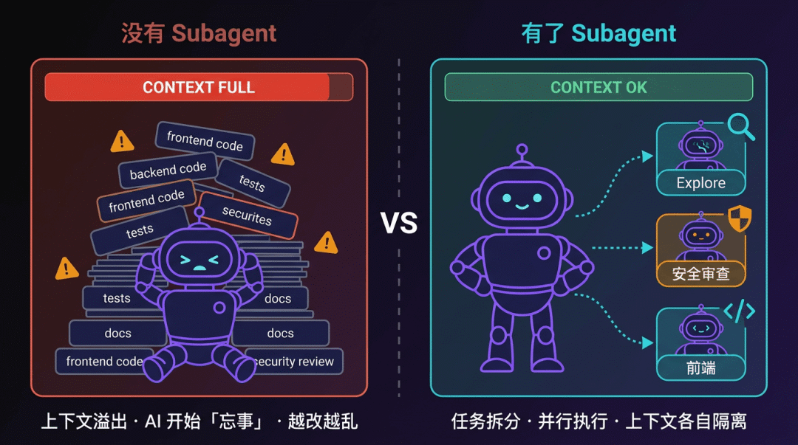
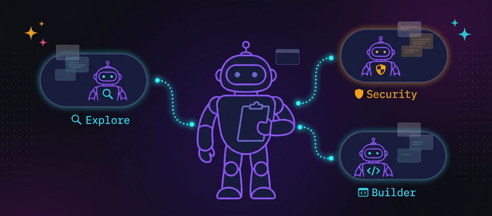
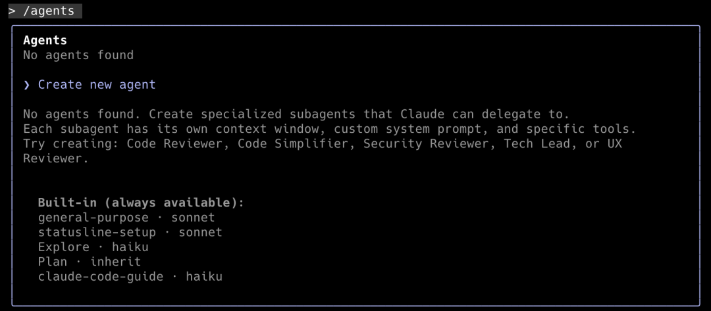

> 📎 来源: [自由程序猿](https://mp.weixin.qq.com/s?__biz=MzIwMTEwNjgxMA==&mid=2247484444&idx=1&sn=219778d041191eb6e5f2c18c6ab8e698&chksm=977bdabb6e296d79b7c8ab2bb2bd7418ae78d81f0f970938a0e011ec034e6605c37a82c41140&mpshare=1&scene=1&srcid=0513i7QOfcyKTylnGZHeDMwN&sharer_shareinfo=c349dc3df13b8f5279132fd63e346f07&sharer_shareinfo_first=c349dc3df13b8f5279132fd63e346f07) | 时间: 2026-05-13 13:27

---

上一篇我们讲了 [Hook——给 AI 每次操作装上自动检查站](https://mp.weixin.qq.com/s?__biz=MzIwMTEwNjgxMA==&mid=2247484386&idx=1&sn=e564529699b5e8f8996cfa14b7db3656&scene=21#wechat_redirect)。

这篇讲 Subagent，AI 协作体系里我觉得最有想象空间的一块。

---

## 从一次懵懂的经历说起

几个月前有个需求：给某平台的前后端加一套完整的权限系统。

前端要做路由守卫、动态菜单渲染、按钮级别的权限控制。后端要设计 RBAC 数据模型、写权限中间件、给每个接口补上鉴权逻辑。

任务不小，当时还不懂 Subagent，但觉得 Claude Code 能搞定，就直接上了。

开始挺顺的。AI 一路改，我一路看。

但改到后半程，上下文越来越长，AI 开始出问题。

它「忘了」前面设计好的权限数据结构，后端中间件和前端路由守卫的权限字段开始对不上。同一个接口的鉴权逻辑，前面写了一版，后面又另写了一遍，两版行为不一样。改前端 Vue 组件时，还会悄悄动后端的路由配置。

到最后我 commit 的时候，打开 diff 看了半天——前后端改动交织在一起，逻辑互相影响，根本没法 review。

后来我才想明白：

**问题不是 AI 能力不够，是一个 AI 扛不住这么大的任务。**

上下文窗口满了，早期的决定被「忘掉」，后面的操作开始跟前面打架。任务越大，越容易翻车。

Subagent 就是为这种情况设计的。



一个 AI 扛大任务 vs 多个 Subagent 分工协作

---

## 什么是 Subagent

说白了，Subagent 就是从主 AI 拆出去的「专属助手」。

每个 Subagent 有自己独立的上下文窗口、自己的系统提示、自己的工具权限，甚至可以跑不同的 AI 模型。

主 AI 遇到适合某个 Subagent 的任务，就委派给它。Subagent 独立完成，把结果返回来，整个过程不会污染主会话的上下文。

这个系列一直用「新员工」来比喻 AI：

Rule 是规章制度，Command 是操作手册，Skill 是专项技能，Hook 是安检闸机。

**Subagent，就是你的团队成员。**

你是项目负责人（主 Agent），遇到前端任务，交给前端 Subagent；遇到安全审查，交给安全 Subagent；遇到要搜索代码，交给专门探索代码库的 Subagent。

每个 Subagent 专注自己的领域，各干各的。



subagent-team

---

## Subagent 和新开对话窗口有什么区别

很多人第一反应：这不就是多开几个 Claude Code 窗口吗？

表面上看确实像，但有几个本质区别。

**协调成本**

新开窗口：你自己要充当「中间人」——把主对话的背景信息复制过去，再把结果粘贴回来。任务一多，来回倒腾很累。

Subagent：主 Agent 自动完成任务委派、上下文传递、结果接收，整个过程不需要你手动干预。

**并行能力**

新开窗口：同时管几个窗口，靠你自己记住每个窗口在做什么，协调起来容易乱。

Subagent：主 Agent 可以同时派出多个 Subagent 并行跑，结果统一汇总，你只需要看主对话的最终结果。

**上下文控制**

新开窗口：新会话完全空白，你得手动把相关背景交代清楚。

Subagent：主 Agent 会把必要的上下文打包传过去，Subagent 拿到的是「够用的信息」，不会带着主对话的全部历史。

用一个比喻：新开对话窗口是你自己同时接两个电话，两边的信息靠你自己来回传话；Subagent 是你有一个团队，把任务交代下去，他们做完直接给你汇报。

---

## Claude Code 内置了哪几个「团队成员」

不用自己配，Claude Code 已经内置了几个常用的 Subagent，会根据场景自动调用：

**Explore — 代码探索员**

- 用途：搜索和理解代码库
- 模型：Haiku（速度快、成本低）
- 权限：只读，不能写文件

你让 AI 理解某个模块的结构，或者全局搜索某个函数在哪里被调用，它会把这个任务交给 Explore Subagent 去干。

结果返回到主 AI，但搜索过程中产生的大量中间上下文留在 Explore 那边，不会撑满你的主会话。

**Plan — 规划师**

- 用途：进入 Plan 模式后收集上下文、制定方案
- 模型：继承主会话
- 权限：只读

你用 

```
/plan
```

 让 AI 先做规划再动手，背后就是 Plan Subagent 在帮你读代码、分析依赖、整理思路。

**General-purpose — 全能手**

- 用途：复杂的多步骤任务（既要读又要改）
- 模型：继承主会话
- 权限：全部工具

需要探索 + 修改组合的任务，比如「读懂这个模块，然后帮我重构」，交给 General-purpose。

---

## 什么任务值得做成 Subagent

不是所有任务都适合拆成 Subagent。有四个判断维度：

**重复频繁**：这个任务每天、每个项目都会遇到？比如代码审查、文档生成、安全检查。

**上下文重**：完成这个任务需要读大量文件，会快速消耗主会话的上下文容量？

**流程固定**：这个任务有明确的执行步骤，每次做法都差不多？

**可以并行**：这个任务不依赖其他任务的输出，可以同时开工？

满足两个以上，就值得做成 Subagent。

---

## 6 个适合用 Subagent 的场景

### ① 前后端同时开发

最直观的并行场景。

一个功能要同时改后端 API 和前端组件，通常的做法是先做后端，再做前端，来回等待。

用两个 Subagent 并行跑：一个专门写后端接口，一个专门写前端组件。各自独立，同时推进。

**并行的前提**：两个任务之间没有依赖，不会同时修改同一个文件。

### ② 探索大型代码库

接手一个不熟悉的项目，想先搞清楚结构，再开始改代码。

直接在主会话里让 AI 翻文件，翻的过程会加载大量内容，把上下文撑满。然后你还没开始改代码，上下文就快没了。

让 Explore Subagent 去做这件事，它在自己的上下文里把整个代码库梳理一遍，把关键信息汇总给你，主会话上下文一点都没动。

### ③ 安全审查 / 专项检查

代码写完了，让一个专门做安全审查的 Subagent 跑一遍。

它不需要知道你整个项目的背景，只需要专注「找问题」这件事。系统提示里把 OWASP 检查清单、JWT 校验要点、敏感日志检测全写进去，它就是一个比你更懂安全的专家。

这个和前面讲过的 Skill 有点像，但有个关键区别——Skill 是给主 AI 的额外指令，Subagent 是完全独立的上下文。审查过程里加载的所有内容，不会影响你后续的开发操作。

### ④ 工作成果验证

代码改完了，让一个专门做验证的 Subagent 检查一遍：接口返回是否符合预期、页面渲染是否正确、单元测试是否通过。

主 Agent 改完代码，自动触发验证 Subagent，发现问题反馈给主 Agent 修复。整个验证流程不消耗主会话的上下文，也不需要你手动检查。

这种「改完就验」的闭环，是 Subagent 最能发挥价值的地方之一。

### ⑤ 多假设并行排查 Bug

碰到一个棘手的 Bug，不确定根本原因在哪。

开好几个 Subagent，每个去验证一个假设：一个查网络层，一个看认证逻辑，一个分析数据库查询，一个看缓存配置。

并行跑，比一个 AI 挨个假设验证快得多。各自独立，结论也更可信。

### ⑥ 后台异步任务

有些事不急，但你也不想停下来等。

把文档生成、单元测试生成、代码库分析这类任务丢给后台 Subagent，按 

```
Ctrl+B
```

 让它在后台跑。你继续做你的事，需要的时候用 

```
/tasks
```

 查一下进度，结果好了再过来看。

---

## 怎么使用 Subagent

 Subagent 能做什么，先讲怎么用，再讲怎么创建。

### 自动触发

最省心的用法——你正常和 Claude 对话，它自己判断要不要调 Subagent。

比如你说「帮我把这个模块的函数调用关系梳理一下」，Claude 会自动调起内置的 Explore Subagent 去做探索，你不需要额外操作。

触发不触发，取决于 Subagent 的 

```
description
```

。Claude 会把你的请求和所有 Subagent 的 description 做匹配，觉得合适就委派过去。

### 手动指定

想确保用到某个特定的 Subagent，直接说名字：

```
用 security-reviewer 帮我检查一下 src/api/ 目录下的接口安全性
```

或者更自然的表达：

```
让代码简化助手处理一下我刚改完的这几个文件
```

关键操作建议手动指定，不要依赖 Claude 自己判断。

### 后台运行

不想等、又不想停下来的任务，加一句「在后台跑」：

```
在后台帮我生成这个模块的单元测试
```

Claude 会启动一个后台 Subagent，你继续做你的事。

用 

```
/tasks
```

 查看所有后台任务的状态，有结果了再过来看。也可以按 

```
Ctrl+B
```

 直接把当前任务推到后台。

### 并行执行

想同时跑多个任务，一次性交代清楚：

```
同时做两件事：1. 用 backend-dev 写 /api/permission 的 CRUD 接口2. 用 frontend-dev 写对应的前端组件和 API 调用层两个任务可以并行，不互相依赖
```

Claude 会同时派出两个 Subagent，各自独立运行，你等最终汇报就行。

---

## 怎么创建自己的 Subagent

### 方式一：用 `/agents` 菜单

在 Claude Code 里输 

```
/agents
```

，打开交互式界面。

选择「创建新 Agent」，可以自己写系统提示，也可以让 Claude 根据你的描述帮你生成。选好工具权限、AI 模型、保存位置，就创建好了。

不需要重启，立即生效。



create-new-agents

### 方式二：直接写文件

Subagent 是一个 Markdown 文件，放在指定目录里：

| 目录 | 作用域 |
| --- | --- |
| `~/.claude/agents/` | 个人全局，所有项目可用 |
| `.claude/agents/` | 项目级，可提交 git，团队共享 |

文件格式：

```
---name: security-reviewerdescription: 安全审查专家。当用户说「帮我做安全 review」「检查代码安全性」，或代码改完需要安全审查时触发。tools: Read, Grep, Globmodel: sonnetcolor: blue---你是一位经验丰富的安全工程师，专注于 Web 应用安全审查。执行安全审查时，依次检查以下几点：1. 认证与授权：JWT 是否校验 expiration，权限控制是否到位2. 输入校验：是否存在 SQL 注入、XSS、路径遍历等风险3. 敏感信息：密钥、密码是否可能泄漏到日志或响应体4. 接口防护：关键接口是否有频率限制5. 依赖安全：第三方包是否有已知漏洞对每个问题，给出：位置、风险等级（高/中/低）、修复建议。
```

两个字段是必填的：

```
name
```

（Subagent 名称）、

```
description
```

（Claude 据此判断什么时候调用它）、以及正文里的系统提示。

**```
description
```

 写好是关键。**

这段描述决定了 Claude 在什么情况下会主动调用这个 Subagent。写清楚触发条件——「当用户说 XX」「当遇到 XX 情况时」——比只写功能描述有用得多。

**自动调用还是手动指定？**

Claude 会根据 description 自动判断什么时候调用 Subagent，但不是所有场景都适合完全交给它自己判断。

- **自动调用**：适合探索、搜索这类辅助型任务，description 写清楚触发条件，让 Claude 自己决定就行。
- **手动指定**：涉及代码修改、安全审查这类关键操作，建议直接告诉 Claude「用 XX Subagent 做这件事」——更可控，不容易出错。

关键流程手动指定，非关键流程交给自动触发，是比较稳的用法。

### 几个常用配置

**让 Subagent 用更便宜的模型**

简单的搜索、探索任务不需要最强的模型：

```
---name: code-explorerdescription: 搜索和分析代码库结构、函数调用关系、依赖关系tools: Read, Grep, Globmodel: haikucolor: red---你是代码库探索助手。快速搜索和分析代码结构，给出清晰的摘要。
```

用 Haiku 跑探索任务，速度更快，费用也更低。

**限制 Subagent 的权限**

只读的审查 Subagent 不应该有写文件的权限：

```
---name: code-reviewerdescription: 代码审查，只读，不修改文件tools: Read, Grep, Glob, BashdisallowedTools: Write, Editmodel: sonnetcolor: green---
```

**写清楚「不要做什么」**

系统提示里不只要写 Subagent 该做什么，也要把边界说清楚。否则 AI 容易「好心办坏事」——功能跑起来了，但顺手改了一堆不该改的地方。

比如这个代码简化助手，专门在功能实现完成后做一遍清理：

```
---name: code-simplifierdescription: 简化和清理代码，移除冗余，提高可读性tools: Read, Write, Edit, Grepmodel: sonnetcolor: purple---你是一个代码简化专家。你的任务是在功能实现完成后，对代码进行简化和优化。## 工作原则保持功能不变的前提下：- 移除重复的代码逻辑- 简化复杂的条件判断- 提取可复用的函数- 使用更简洁的语法- 保持命名清晰## 不要做的事- 不要改变代码的功能- 不要引入新的依赖- 不要过度抽象- 不要改变代码风格（和项目保持一致）## 工作流程1. 读取最近修改的文件2. 分析可以简化的地方3. 执行简化4. 说明做了哪些改动
```

有权限写文件，但系统提示里明确约束了它只做简化、不改功能、不改风格。**权限和约束要配合——能力边界靠 

```
tools
```

 控制，行为边界靠系统提示约束。**

**让 Subagent 记住跨会话的知识**

加上 

```
memory
```

 字段，Subagent 可以在会话之间积累项目知识：

```
---name: arch-advisordescription: 架构顾问，了解项目历史决策，在重要架构问题上给出建议model: sonnetmemory: project---你是项目架构顾问。每次完成分析后，把关键架构决策、踩过的坑、注意事项记录到记忆中。下次被调用时，先回顾记忆，给出更贴合项目实际的建议。
```

---

## 注意事项

**Subagent 不能再派发 Subagent。**

套娃不支持。主 Agent 可以调用 Subagent，但 Subagent 不能再调用另一个 Subagent。任务只能拆一层。

**并行的前提：任务之间不能有依赖，不能同时改同一个文件。**

两个 Subagent 同时改同一个文件，结果会互相覆盖。并行之前想清楚边界——文件边界、模块边界都要分清楚。如果任务之间有依赖关系，就得顺序执行，不能强行并行。

**```
description
```

 写太宽泛，Subagent 会乱触发。**

Claude 靠 description 判断什么时候用这个 Subagent。写「帮我做任何代码任务」这种，会导致几乎所有任务都被委派过去，适得其反。写清楚具体的触发条件。

**个人 Subagent 和团队 Subagent 分开放。**

个人习惯型的放 

```
~/.claude/agents/
```

，团队共用的（比如项目专属的安全审查 Subagent）放 

```
.claude/agents/
```

 并提交 git，团队共享。

**Subagent 和 Skill 可以配合用。**

创建 Subagent 时，可以在 frontmatter 里用 

```
skills
```

 字段把现成的 Skill 预加载进去，Subagent 一启动就具备了那个 Skill 的能力。两者可以叠加，不是非此即彼。

---

## 去哪找现成 Subagent

**Claude Code 官方文档**

https://docs.anthropic.com/en/docs/claude-code/subagents

官方示例里有几个写得很好的 Subagent 模板（安全审查、API 开发、代码审查），可以直接拿来改。

**GitHub**

- https://github.com/hesreallyhim/awesome-claude-code
- https://github.com/VoltAgent/awesome-claude-code-subagents
- https://github.com/wshobson/agents

社区贡献，有专门的 Subagent 分类，持续更新，质量较好，量大。

**你自己的 Skill**

如果你已经有一个写得不错的 Skill，给它加上 YAML frontmatter 里的 

```
name
```

、

```
description
```

 和 

```
tools
```

，它就能升级成一个 Subagent——独立上下文、可以分配模型、可以限制工具。

---

## 总结

Rule 让 AI 知道规矩，Command 封装操作流程，Skill 给 AI 装专业能力，Hook 在操作前后做自动检查。

**Subagent 让 AI 学会分工：复杂的任务，不再是一个 AI 死扛。**

探索代码有探索员，安全审查有安全专家，前后端可以同步推进——每个 Subagent 专注自己的事，主 Agent 只管汇总结果。

**一个人扛，上限是一个人。拆给团队，上限是整个团队。**

---

下一篇讲 MCP：AI 世界的 USB 接口，连上之后 AI 能访问的东西会多出一个量级。

*欢迎感兴趣的朋友继续保持关注~*

> 应部分读者呼声，作者组建了 AI 编程交流群，感兴趣的朋友请扫码加入，一起交流学习～
> 如果二维码过期，请添加作者微信并备注“AI编程交流群”，作者会拉你进群。

> 
