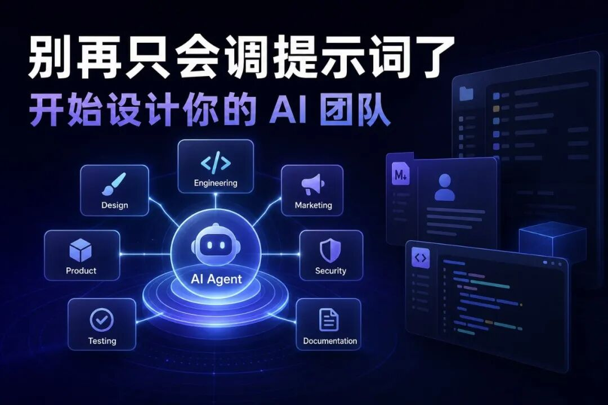
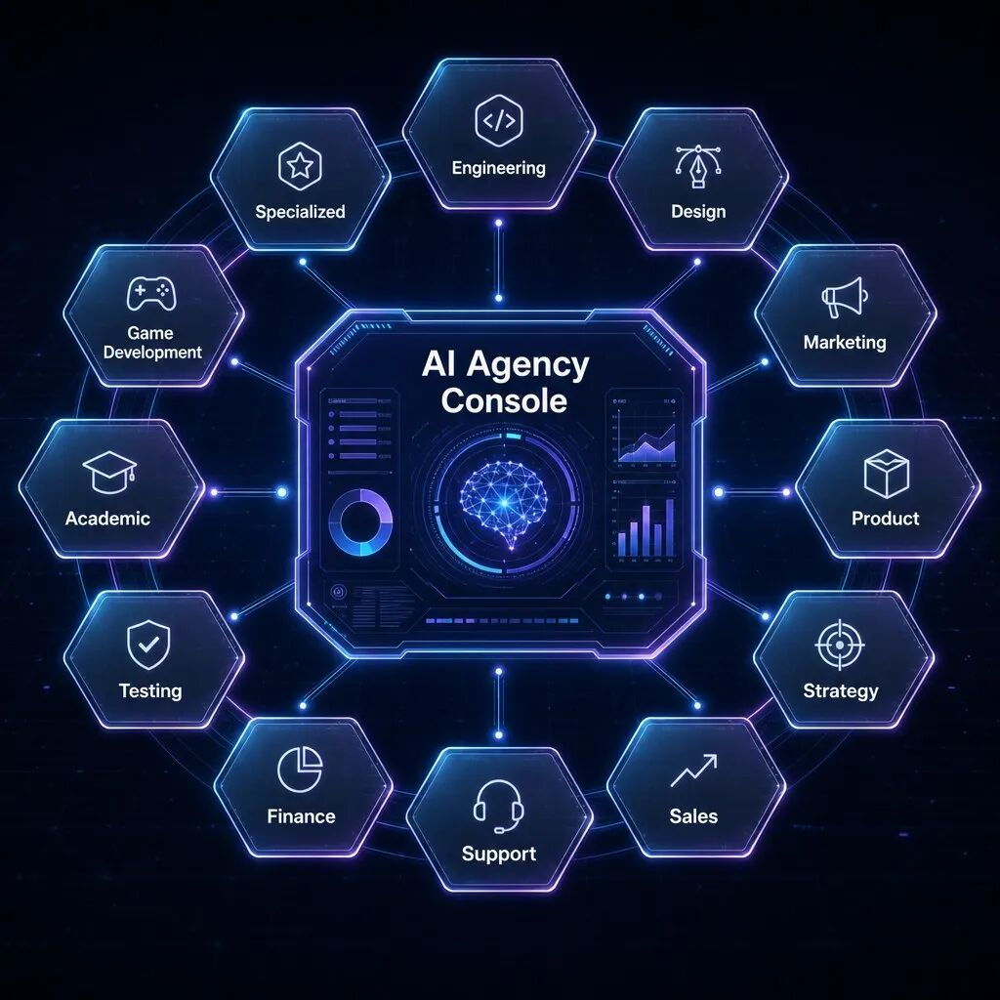
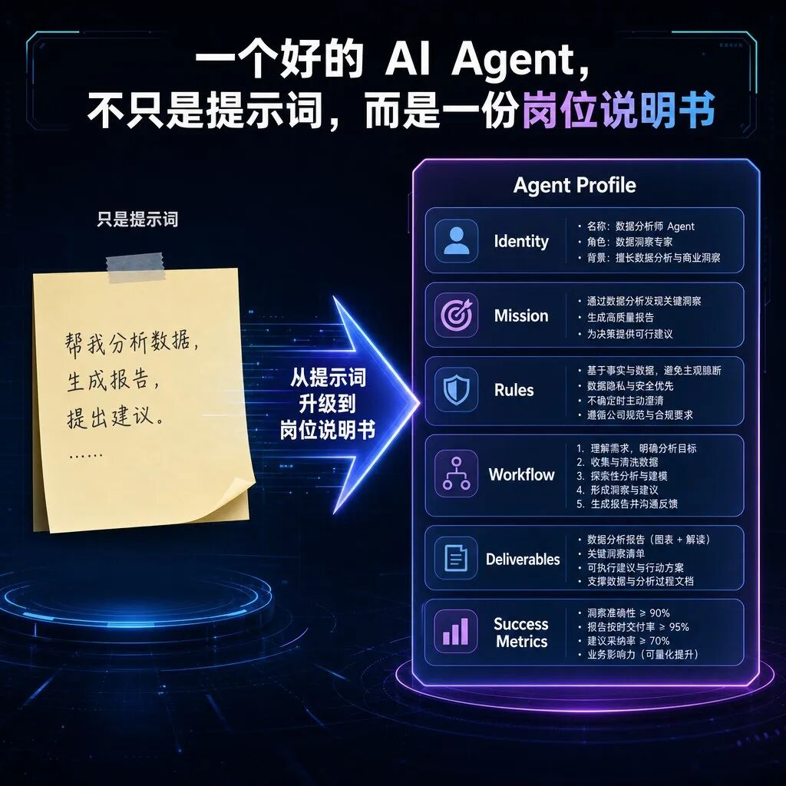
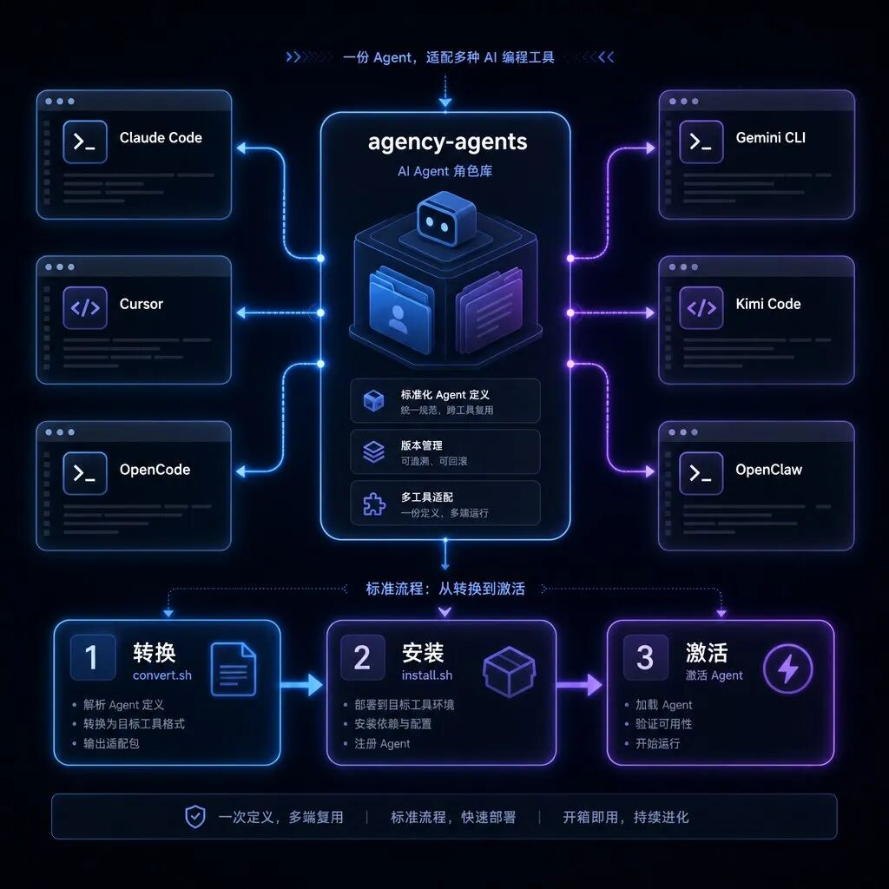

> 📎 来源: [AI 趋势方向](https://mp.weixin.qq.com/s?__biz=MzU5MTkyMzY4NQ==&mid=2247483782&idx=1&sn=e9e907d32664dce4ddc5086d6ebbdedd&chksm=ff204f1ded846d61522df445d279cac512a3510d730e3085f2fc872bd17a78e1d8a2d68b00dc&mpshare=1&scene=1&srcid=0510dFxVcOXkgIf3SiVB56ya&sharer_shareinfo=1c697273da8a587e424a067ba886e344&sharer_shareinfo_first=1c697273da8a587e424a067ba886e344) | 时间: 2026-05-10 15:58

---

# 

如果你最近也在折腾 AI Agent，大概率会遇到一个问题：模型越来越强，但真正干活时，还是经常要你反复解释角色、背景、边界、交付标准。

今天这个 GitHub 项目，解决的不是“再发明一个 Agent 框架”，而是更接地气的一件事：

直接给你一整套可复制、可安装、可改造的 AI 专家团队。

项目叫 agency-agents。

GitHub：

https://github.com/msitarzewski/agency-agents

它的官方描述很直白：

A complete AI agency at your fingertips

翻成人话就是：

把一个 AI agency 放到你手边。

不是一个万能助手，而是一堆有明确岗位、有工作流程、有交付标准的专职 Agent。

---

# 一、它不是 Agent 框架，更像“AI 员工说明书仓库”

很多人一听 Agent，就会想到复杂框架：

多智能体通信

工具调用

工作流编排

向量记忆

任务调度

agency-agents 不是这类东西。

它更像一个“AI 员工库”。

每个 Agent 都是一个 Markdown 文件，里面写清楚：

这个 Agent 是谁

负责什么

说话风格是什么

工作边界是什么

交付物应该长什么样

成功标准是什么

遇到任务应该按什么流程推进

这点很重要。

因为很多人用 AI 失败，不是模型不行，而是岗位没定义清楚。

你让一个通用聊天机器人“帮我做个产品”，它很容易泛泛而谈。

但如果你让一个 “Rapid Prototyper” 去做 MVP，让一个 “Backend Architect” 去设计 API，让一个 “Code Reviewer” 去审 PR，结果就会稳定很多。

原因很简单：

AI 不是只需要提示词，它更需要岗位说明书。

---

# 二、这个项目里面有什么？

截至我读取仓库时，README 里写的是：

144 个 Specialized Agents

覆盖 12 个 division

超过 10,000 行 personality、process、code examples

MIT License

支持 Claude Code、GitHub Copilot、Gemini CLI、OpenCode、Cursor、Aider、Windsurf、Kimi Code、OpenClaw 等工具集成

仓库本身很轻，主要语言就是 Shell 和 PowerShell。

这说明它不是一个重框架，而是一个“可安装的 Agent 角色库”。

目录也很直观：

agency-agents

├── engineering

├── design

├── marketing

├── product

├── strategy

├── sales

├── support

├── finance

├── testing

├── academic

├── game-development

├── specialized

├── integrations

└── scripts

对普通用户来说，不需要理解所有目录。

你只要记住一句话：

它把一个公司里常见的岗位，拆成了可以给 AI 使用的角色文件。

---

# 三、最值得看的，是它的“岗位颗粒度”

很多 Agent 项目容易犯一个错：角色太大。

比如：

编程专家

营销专家

设计专家

产品专家

听起来厉害，但实际一用还是泛。

agency-agents 的思路更细。

比如 engineering 下面，不只是“程序员”，而是拆成：

Frontend Developer

Backend Architect

Mobile App Builder

AI Engineer

DevOps Automator

Security Engineer

Code Reviewer

Database Optimizer

Software Architect

SRE

Technical Writer

WeChat Mini Program Developer

这就有点像真实团队了。

一个前端、一个后端、一个架构师、一个安全工程师、一个代码审查员，处理问题的关注点本来就不一样。

同一个需求：

帮我做一个用户登录系统。

不同 Agent 看到的重点会完全不同：

Frontend Developer 看交互、表单、状态、错误提示

Backend Architect 看接口、认证、数据库、扩展性

Security Engineer 看密码存储、token、权限、攻击面

Code Reviewer 看可维护性、边界条件、测试覆盖

Technical Writer 看文档、接入说明、API 示例

这才是多 Agent 真正有价值的地方。

不是让一堆 AI 同时聊天，而是让不同“岗位视角”参与同一个问题。

---

# 四、它怎么用？

最简单的用法有三种。

方式 1：直接安装到 Claude Code

官方推荐 Claude Code。

./scripts/install.sh --tool claude-code

也可以只复制某一类 Agent：

cp engineering/\*.md ~/.claude/agents/

然后你在 Claude Code 里就可以这样说：

激活 Frontend Developer mode，帮我做一个 React 组件。

方式 2：当作参考模板

如果你不用 Claude Code，也可以直接打开某个 Agent 文件，把里面的角色说明复制到你自己的 AI 工具里。

这种方式最适合小白。

不用装环境，不用理解脚本，直接拿来改。

方式 3：转换到其他工具

仓库支持多工具集成。

./scripts/convert.sh

./scripts/install.sh

也可以指定工具：

./scripts/install.sh --tool cursor

./scripts/install.sh --tool opencode

./scripts/install.sh --tool openclaw

./scripts/install.sh --tool gemini-cli

./scripts/install.sh --tool kimi

这点对国内用户很实用。

因为大家手里用的工具不一样，有人用 Cursor，有人用 Claude Code，有人用 Kimi Code，有人用 OpenClaw。

agency-agents 的价值在于：

它尽量让同一套 Agent 角色，可以迁移到不同 AI 编程工具里。

---

# 五、真正值得收藏的是这套思路

我觉得这个项目最值得学的，不是“有 144 个 Agent”。

数量不是关键。

关键是它把 Agent 写成了接近真实岗位的结构。

一个好的 Agent 文件，至少应该包括：

身份定位

核心任务

工作边界

交付标准

执行流程

成功指标

沟通风格

典型案例

这比一句“你是一个资深专家”稳定得多。

很多人写 Agent，只写一句：

你是一个资深 Python 工程师。

这太薄了。

真正可复用的 Agent，应该像一份岗位说明书：

你负责什么

你不负责什么

什么算完成

遇到风险怎么处理

输出应该是什么格式

什么情况下必须先验证

这也是我建议你收藏这个项目的原因。

你不一定要全量安装。

但你可以学习它的 Agent 写法，然后改造成自己的工作流。

---

# 六、它适合谁？

我觉得适合这几类人。

1）正在用 Claude Code / Cursor / OpenCode 的开发者

如果你已经在用 AI 写代码，这个项目可以帮你把“随口聊天”升级成“按岗位协作”。

以前是：

帮我看看这个项目。

以后可以变成：

让 Codebase Onboarding Engineer 先读仓库结构，

再让 Software Architect 看架构风险，

最后让 Code Reviewer 做 PR 检查。

这就是效率差距。

2）小团队创始人 / 独立开发者

独立开发最缺的不是想法，而是不同职能的补位。

你可能会写代码，但不一定擅长：

UI

增长

安全

文档

测试

发布

用户支持

agency-agents 可以当成一个“低配虚拟团队”。

它不能替你承担责任，但能补齐很多视角。

3）做 AI Agent 产品的人

如果你正在设计自己的 Agent 系统，这个仓库很适合当参考。

它展示了一个很朴素但有效的原则：

Agent 不是越抽象越好，而是越接近真实任务越好。

---

# 七、也别把它想得太神

这个项目值得看，但不要神化。

它本质上还是一套 Agent 角色文件。

所以它的上限取决于：

你用的模型能力

你的工具链是否支持 Agent

你的上下文是否给够

你有没有验证输出

你是否知道什么时候该让人介入

尤其是代码、安全、财务、生产部署相关任务，不要让 Agent 直接无脑改。

正确姿势是：

先让 Agent 给方案

再让 Agent 改小范围代码

然后看 diff

再跑测试

最后人工确认

AI 能提效，但不能替你背锅。

---

# 八、顺手说下我自己在用的模型通道

我现在用这类 Agent 项目时，不会只看 Agent 角色库本身，还会配一个稳定、成本合适的模型通道。

比如我自己最近常用的是 PPToken。

它可以理解成一个面向 Codex / OpenAI 系列模型的中转站，主要解决几个现实问题：

- 国内使用更方便，不用自己折腾复杂接入

- 支持 Codex 相关模型和图片生成能力

- 直充价格相对更便宜

- 套餐比单次零散使用更划算

- 跑代码、跑 Agent、生成公众号封面和插图都比较顺手

- 我自己也在用，稳定性目前体验还不错

- 有用户交流群，遇到接入、模型选择、报错、图片生成这些问题，可以互相交流，也有人解答疑难

链接放这里，感兴趣可以自己看：

https://www.pptoken.org/?promo=AFF76

我的建议是：

代码类任务，优先选稳定、上下文够长、响应别太飘的模型通道。

图片类任务，可以用 gpt-image-2 这类图像模型来做公众号封面、插图、社媒素材。

Agent 类任务，不要只看模型名字，还要看角色定义、工具权限、验证流程和成本控制。

工具只是入口。

真正拉开差距的，是你能不能把模型、Agent、图片生成、自动化流程组合成一套稳定工作流。

---

# 九、我的判断

agency-agents 这个项目有一个很明显的趋势信号：

AI 工具正在从“一个聊天窗口”，走向“一组可调用的专业岗位”。

以前我们问 AI：

你能不能帮我做这个？

以后更像是：

这个任务应该交给哪个岗位？

需要哪些岗位协作？

每个岗位的交付标准是什么？

这就是 Agent 真正开始变实用的地方。

不是喊概念，不是堆框架，而是把复杂工作拆成一个个可执行、可验证、可复用的角色。

如果你正在用 AI 编程，或者想搭自己的 AI 工作流，这个仓库值得收藏。

不一定照搬。

但它会提醒你一件事：

别再只会调提示词了，开始设计你的 AI 团队。

---

参考链接

GitHub 项目：

https://github.com/msitarzewski/agency-agents

PPToken：

https://www.pptoken.org/?promo=AFF76

---

你现在用 AI 写代码，最缺的是哪类“AI 同事”？

架构师

代码审查员

安全工程师

产品经理

文档助手

增长/运营助手
