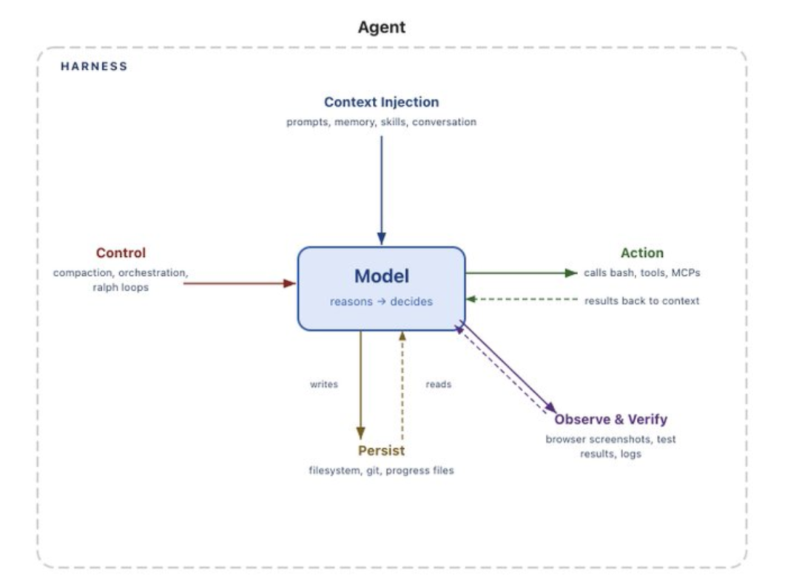
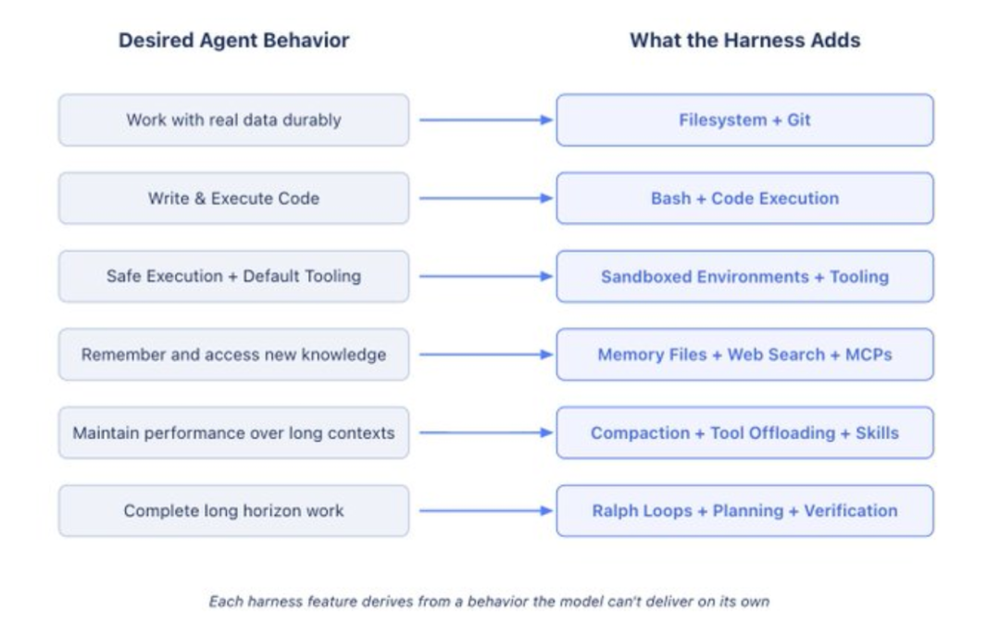
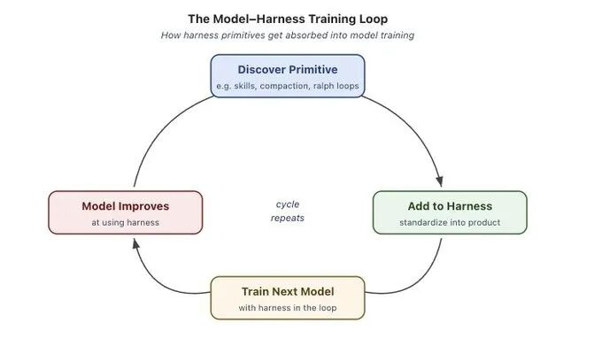

> 📎 来源: [图灵编辑部](https://mp.weixin.qq.com/s?__biz=MjM5Njc0MjIwMA==&mid=2649841560&idx=1&sn=7d8801a8c62297e6d0f74179d47b84e1&chksm=bf5f7aa188d215b93ace9de6f5db23ec46c2d8250acd250cd468f85793d6107194d052c260fd&mpshare=1&scene=1&srcid=04306nTRTsnTlwGfJc9qlX4a&sharer_shareinfo=58dd3c5896d87cd5fa35a922d63c4dbe&sharer_shareinfo_first=58dd3c5896d87cd5fa35a922d63c4dbe) | 时间: 2026-04-30 19:50

---

Harness 工程就是围绕模型构建系统，把它变成可以实际工作的引擎。模型本身提供智能，而 Harness 让这种智能变得可用。本文会先定义什么是 Harness，再从模型这一基本出发点，推导出现阶段以及未来 Agent 所需要的核心组成。

***01***

### 有没有人能把 Harness 说清楚？

Agent = Model + Harness。如果你不是在训练模型，那么你做的大多属于 Harness 的范畴。

所谓 Harness，是指：“即所有不属于模型本身的代码、配置以及执行逻辑。”

一个裸模型并不能算作 Agent；只有当 Harness 为其提供状态管理、工具调用能力、反馈循环以及可执行约束时，它才真正成为一个 Agent。

更具体地说，Harness 通常包括：系统提示词、工具与技能（以及 MCP）及其说明、封装好的基础设施（如文件系统、沙箱、浏览器）、编排逻辑（例如子 Agent 的生成与交接、模型路由），以及用于保证执行稳定性的 Hook（钩子机制）或中间件（如上下文压缩、续写机制、Lint 检查等）。

在实际系统中，模型与 Harness 的边界可以有多种划分方式，而且往往并不清晰。但从工程视角来看，这样的定义最具区分性，因为它迫使我们从“如何围绕模型智能设计系统”的角度来思考问题。

接下来，我们将从模型这一最基础的抽象出发，逐步推导这些 Harness 组件为什么存在。

***02***

### 为什么需要 Harness？

我们希望 Agent 能做到的许多事情，模型本身其实并不具备，这正是 Harness 存在的意义。

在大多数情况下，模型接收文本、图像、音频、视频等输入，然后输出文本（或结构化调用结果），仅此而已。默认情况下，它无法：

- 在多次交互之间维持持久状态
- 执行代码
- 获取实时信息
- 搭建运行环境并安装依赖

这些能力全部属于 Harness 层。LLM 的结构决定了，必须有一层外部机制包裹它，才能让它真正参与实际工作。

举个简单的例子，为了实现聊天这种产品体验，我们通常会使用一个 while 循环来维护历史消息，并不断追加新的用户输入。几乎所有人都已经用过这种形式的 Harness。本质上，我们所做的，就是将期望的 Agent 行为转化为 Harness 中的具体实现。

***03***

### 从目标行为反推 Harness 设计

Harness 工程的作用，是帮助人类注入有效的先验，从而引导 Agent 的行为。随着模型能力的提升，Harness 也逐渐被用来以更精细的方式扩展或修正模型，使其能够完成过去难以完成的任务。

我们不尝试穷举所有可能的 Harness 功能。这里的目标是，从“让模型能够完成实际工作”这一出发点，推导出一组关键能力。基本思路是：

我们想要（或需要修正）的行为 → 对应的 Harness 设计。

***04***

### 用文件系统实现持久存储与上下文管理

我们希望 Agent 拥有持久化存储能力，用来处理真实数据、转移无法容纳在上下文中的信息，并在不同会话之间延续工作。

但模型只能直接处理其上下文窗口中的信息。在引入文件系统之前，用户只能通过复制粘贴的方式将内容提供给模型，这既低效，也不适用于自动化 Agent。

现实世界本身就是通过文件系统来组织工作的，而模型在训练中也学习了这种模式。因此，一个自然的解决方案是：由 Harness 提供文件系统抽象及相关操作工具。

文件系统可以说是最基础的 Harness 原语之一，它带来了多项关键能力：

- Agent 拥有一个工作空间，可以读取数据、代码和文档
- 信息可以逐步写入或转移，而不必全部堆积在上下文中
- 中间结果可以被保存，从而维持跨会话状态

文件系统同时也是一个天然的协作界面，多 Agent 或人与 Agent 可以通过共享文件进行协同，例如 Agent Teams 这样的架构就依赖这一点。

再结合 Git，文件系统获得了版本控制能力，Agent 可以跟踪进度、回滚错误并进行分支实验。后文还会再次提到文件系统，因为它实际上是许多其他能力的基础。

***05***

### 用 Bash 和代码执行作为通用工具

我们希望 Agent 能够自主解决问题，而不是在每一步都依赖预先定义好的工具。

目前主流的 Agent 执行模式是 ReAct 循环：模型先进行推理（reasoning），然后通过工具调用执行动作，观察结果，再进入下一轮循环。

问题在于，Harness 只能执行事先定义好的工具。与其为每一种可能的操作编写专用工具，不如提供一个通用工具，例如 Bash。

因此，Harness 通常会提供 Bash 能力，让模型通过编写和执行代码来解决问题。

Bash 加上代码执行，相当于为模型提供了一台“通用计算机”。模型可以通过编写代码临时构建工具，而不再受限于固定的一组预配置工具。

当然，Harness 仍然会提供其他专用工具，但代码执行正在逐渐成为自主问题求解的默认策略。

***06***

### 用沙箱和工具完成执行与验证

Agent 需要一个合适的环境，才能安全地执行操作、观察结果并持续推进任务。

我们已经为模型提供了存储能力和代码执行能力，但这些都必须在具体环境中发生。直接在本地运行模型生成的代码存在较高风险，同时单一环境也难以支持大规模任务。

沙箱提供了一种隔离且安全的执行环境。Harness 可以将执行过程放入沙箱中，让 Agent 在其中运行代码、访问文件、安装依赖并完成任务。

为了进一步提高安全性，可以引入命令白名单机制，并限制网络访问。与此同时，沙箱也带来了良好的可扩展性：环境可以按需创建、并行运行多个任务，并在完成后销毁。

一个完善的环境通常还需要预配置常用工具，例如语言运行时、依赖包、Git、测试工具，以及用于网页交互的浏览器。

浏览器、日志、截图、测试运行器等能力，使 Agent 能够观察并分析自身行为，从而形成自验证循环：编写代码 → 运行测试 → 分析结果 → 修复问题。

需要注意的是，模型本身并不会配置这些环境。Agent 在何处运行、拥有哪些工具、可以访问哪些资源、如何验证结果，全部属于 Harness 层的设计决策。

***07***

### 用记忆与搜索实现持续学习

我们希望 Agent 能记住其经历，并获取训练之后才出现的信息。

模型本身只有权重和当前上下文，并不具备额外记忆。在不修改权重的前提下，增加知识的主要方式是通过上下文注入。

在记忆方面，文件系统再次成为核心。Harness 可以支持类似 AGENTS.md 的记忆文件，并在 Agent 启动时加载到上下文中。随着 Agent 持续更新这些文件，系统会不断注入最新内容，从而形成一种“持续学习”机制。

另一方面，模型存在知识截止问题，无法直接获取训练之后的数据，例如更新的库版本。因此，需要借助 Web 搜索以及 MCP 工具（如 Context7），让 Agent 获取超出训练范围的信息。

因此，Web 搜索以及动态获取最新上下文的能力，也是 Harness 中非常关键的一类基础能力。

***08***

### 对抗 Context Rot（上下文退化）

我们不希望 Agent 在执行过程中性能逐渐下降。

所谓 Context Rot（上下文退化），是指随着上下文窗口不断被填满，模型在推理和任务完成上的表现逐渐变差。上下文是一种有限且宝贵的资源，因此 Harness 必须对其进行有效管理。

从某种意义上说，当前大量 Harness 工作，本质上是在进行“上下文工程”。

当上下文接近上限时，需要进行压缩（compaction）。如果不处理，一旦超过上下文限制，API 可能直接报错，这在工程上是不可接受的。因此 Harness 通常会通过总结与转移机制，让 Agent 能够持续运行。

对于工具调用产生的大量输出，如果全部放入上下文，会引入大量噪声。常见做法是仅保留开头和结尾的一部分内容，其余写入文件系统，必要时再读取。

此外，如果在启动阶段加载过多工具或 MCP 服务，也会在一开始拖慢模型表现。Skills（按需加载的能力模块）通过渐进式加载来缓解这一问题。模型本身不会主动选择加载哪些能力，但 Harness 可以通过这种方式保护上下文，避免过早退化。

***09***

### 长时间尺度上的自主执行

我们希望 Agent 能够在较长时间内，自动且稳定地完成复杂任务。

自动化软件开发可以视为编码类 Agent 的重要目标。但当前模型仍存在一些限制，例如容易提前停止、难以拆解复杂任务，以及在跨多个上下文窗口时表现不稳定。

因此，一个良好的 Harness 必须围绕这些问题进行设计。

在这里，前面提到的能力开始协同发挥作用。长时任务需要持久状态、规划能力以及观察与验证机制，才能跨多个上下文持续推进。

文件系统和 Git 用于跨会话跟踪工作。长期任务可能产生数百万 token，文件系统可以稳定记录这些过程，而 Git 则让新的 Agent 能快速理解当前状态与历史。

对于多 Agent 协作而言，文件系统也是一个共享“账本”。

Ralph Loop 用于让任务持续执行。这是一种 Harness 模式：通过 Hook 拦截模型的“结束”行为，并在新的上下文窗口中重新注入原始目标，从而强制任务继续推进。文件系统在其中起到关键作用，因为每一轮都可以在新的上下文中读取之前的状态。

规划与自验证用于保持方向。规划是指将目标拆解为多个步骤，Harness 可以通过提示词与文件机制支持这一过程。每完成一步后，通过测试或自评进行验证；如果失败，则通过 Hook 将错误反馈给模型，进入下一轮迭代。

验证不仅提升结果可靠性，也为模型提供持续改进的信号。

***10***

### Harness 的未来

模型训练与 Harness 设计正在逐渐耦合

一些 Agent 产品（如 Claude Code、Codex）已经在训练阶段将 Harness 纳入闭环，使模型在文件系统操作、Bash 执行、规划以及多 Agent 协作方面表现更优。

这形成了一个反馈循环：先在 Harness 中发现有效模式，再将其纳入训练，从而进一步增强模型能力。

但这种共同演化也带来问题，例如泛化能力下降。当工具逻辑发生变化时，模型性能可能显著下降，这表明模型在一定程度上“过拟合”了训练时的 Harness。

不过，这并不意味着某个模型对应的 Harness 就是最佳选择。实际上，在不同 Harness 下，同一模型的表现可能差异很大。例如在 Terminal Bench 2.0 上，我们观察到显著性能波动；甚至仅通过调整 Harness，就可以将一个编码 Agent 从 Top 30 提升到 Top 5。

这说明 Harness 仍然具有巨大的优化空间。

### Harness 工程会走向哪里？

随着模型能力不断增强，一些当前属于 Harness 的能力，可能会逐渐被模型吸收，例如规划、自验证以及长程一致性，从而减少对上下文注入的依赖。

这看起来似乎意味着 Harness 会变得不那么重要。但正如 Prompt 工程至今仍然重要一样，Harness 工程很可能也会长期存在。

因为它不仅是在弥补模型的不足，更是在围绕模型智能构建完整系统。良好的环境配置、合适的工具、持久状态以及验证机制，都能让模型在任何智能水平下更加高效。

目前，Harness 工程仍然是一个非常活跃的研究方向。例如在 LangChain 的 deepagents 项目中，人们正在探索：

- 如何让上百个 Agent 在同一代码库上并行协作
- 如何让 Agent 分析自身执行轨迹，从而发现并修复 Harness 层问题
- 如何根据具体任务动态组装工具与上下文，而不是预先配置一切

本文本质上是在回答两个问题：什么是 Harness，以及它如何被我们对模型能力的期待所塑造。

模型提供智能，而 Harness 让这种智能真正发挥作用。

愿我们构建出更好的 Harness、更完善的系统，以及更强大的 Agent。

如果你已经看到这里，其实你已经在门槛内了。剩下的，就是把这些“理解”，变成“能做出来”。推荐这个好评如潮的 Agent 实战营，带你一点点上手智能体。

原文链接：https://blog.langchain.com/the-anatomy-of-an-agent-harness/
