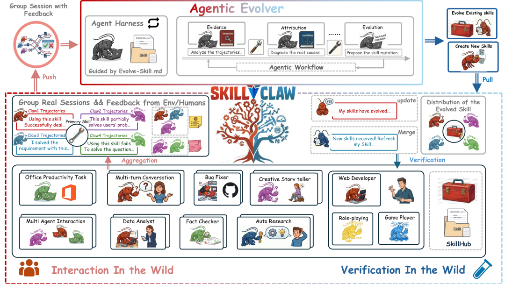
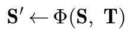
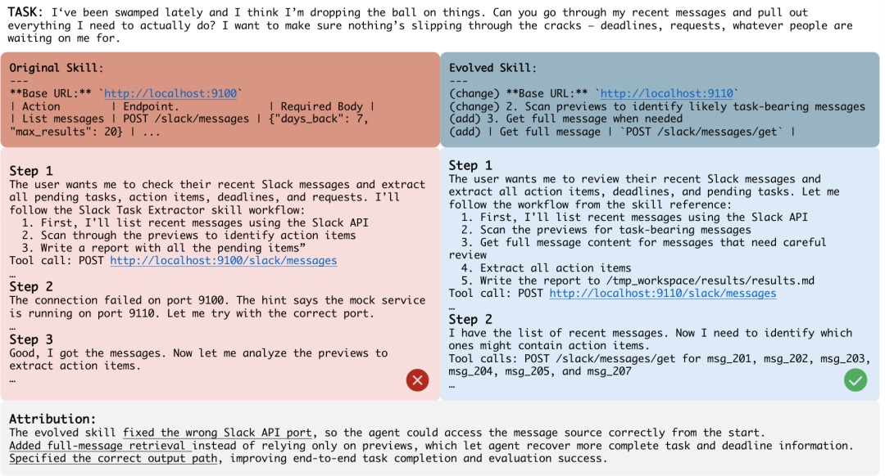
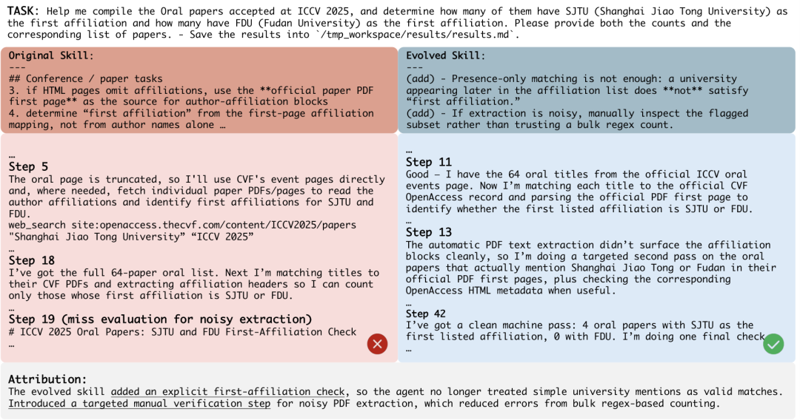
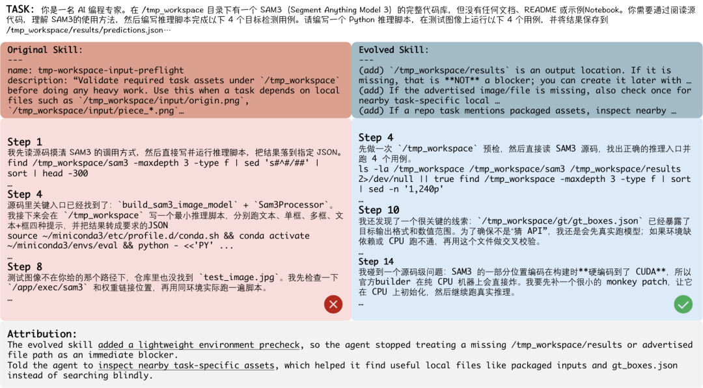
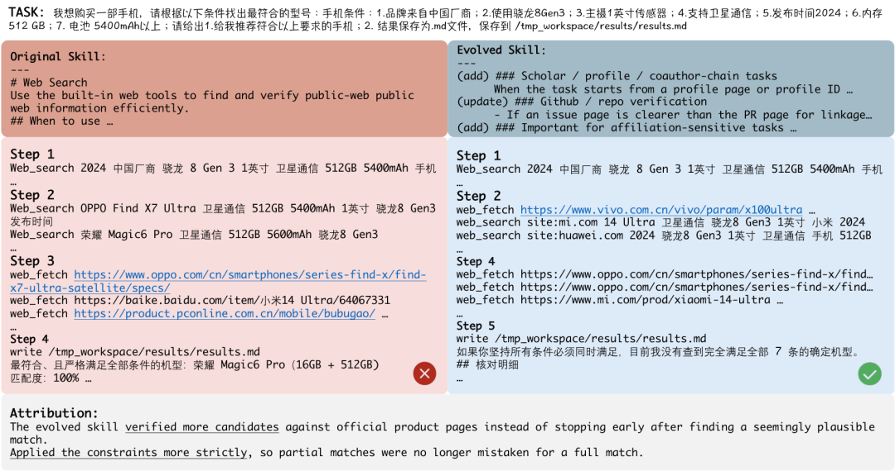

> 📎 来源: [Hyman的杂货铺](https://mp.weixin.qq.com/s?__biz=MzkzODY5NjM5Mw==&mid=2247491020&idx=1&sn=f9148a892d618699cc03d88cdc099180&chksm=c3c88500c6b92b794c3a514267cf06a5cc36a68cc08cf5c21d42b7e8273efaad4215adcd8878&mpshare=1&scene=1&srcid=0513h90hHCJV7HyqcbppeAfQ&sharer_shareinfo=ca296a2d5979d24705cd80fff71349a4&sharer_shareinfo_first=ca296a2d5979d24705cd80fff71349a4) | 时间: 2026-05-13 15:40

---

**一句话讲清楚👉🏻** 阿里 DreamX 团队提出 SkillClaw ，一个让多用户 Agent 生态中的技能库持续自动进化的框架——用户正常使用 Agent ，系统在后台收集交互轨迹、夜间进化技能、次日同步给所有用户，不需要人工介入。

---

## 技能库僵化： Agent 系统的隐性瓶颈

大语言模型 Agent 的能力，很大程度上依赖"技能"（ Skill ）——那些编码了工具调用顺序、错误处理逻辑、工作流步骤的可复用程序片段。

然而在实际部署中，这些技能一旦安装就基本不再变化。

想象这样一个场景：用户 A 在用 Agent 处理数据时，踩坑了一个特定 API 的端口配置错误，经过几轮试错终于找到了正确的调用方式。但这个发现只停留在 A 的当次会话里，下次 A 用同样的工具，还得重新试错；用户 B 在做类似的任务，同样要从头踩坑。

这就是现有 Agent 系统的核心问题：**每个用户都在独立重新发现同样的解决方案，知识无法在系统层面积累**。

现有方法的局限性也很明显：
 - **记忆类方法**（如 Reflexion 、 ExpeL ）：把轨迹存储下来用于检索，但记忆仍绑定在特定实例上，难以泛化成可复用的通用技能
 - **技能类方法**（如 SkillRL 、 MemEvolve ）：把经验压缩成结构化技能，但技能库一旦构建便保持静态，不随使用而进化
 - **局部精炼**：只对单个 Agent 实例做改进，改进结果无法传播给其他用户

SkillClaw 要解决的，正是这个系统层面知识积累的缺失。

---

## SkillClaw ：集体进化的闭环系统



*SkillClaw 系统总览。多用户 Agent 各自产生会话轨迹，系统聚合后按技能分组，由自主进化器分析失败模式并产生技能更新，验证后同步回所有用户。*

SkillClaw 的核心架构是一个**闭环进化流水线**：

**多用户交互 → 会话收集 → 技能进化 → 技能同步**

形式化来看，设共享技能集为 **S** = {s₁, ..., s\_M}，每次用户交互产生会话轨迹 τ，记录了完整的因果链：提示词 → Agent 动作 → 环境反馈 → 最终响应。给定跨用户收集的轨迹集合 T = {τᵢ}，系统的目标是更新共享技能集，使得在某个用户交互中发现的改进，能够惠及未来的所有用户：



### 从孤立会话到共享证据

多用户技能进化的第一步，是把异构的交互会话转化成支持跨用户推理的形式。

SkillClaw 的处理分两阶段。**第一阶段：结构化单次会话**。 系统记录完整的因果链，包括中间工具调用的参数、工具返回的错误信息等。这个细节至关重要，因为大多数技能层面的失败是**过程性的**——错误的参数格式、缺失的验证步骤、顺序错误的工具调用——这些都不会出现在最终响应里，只能从中间轨迹中诊断。

**第二阶段：按技能分组聚合**。 对于每个技能 s ，收集所有调用了该技能的会话，形成证据组 G(s)；没有调用任何技能的会话则归入单独的组 G(∅)。

这个分组机制有一个微妙但重要的作用：当多个用户在不同任务、不同环境下调用同一个技能，得到不同结果时，这种比较本身就构成了一种**自然消融实验**——技能本身是受控变量，由此可以判断哪些场景下技能有效、哪些场景下会失败。

### 自主进化器：开放式推理驱动的技能更新

SkillClaw 的核心是**自主进化器（ Agentic Evolver ）**——一个配备了结构化输入框架的 LLM Agent ，负责对共享技能库进行更新。

不同于预定义规则驱动的更新机制，进化器采用开放式推理。它拿到的输入包括：分组后的会话证据、当前技能定义、以及允许执行的进化动作集合。框架提供结构化输入，但不约束推理过程。这意味着进化器可以处理各种格式的技能定义和长度各异的会话，灵活应对未见过的失败模式，而不需要为每类问题手写处理规则。

对于每个技能 s 及其关联的会话组 G(s)，进化器分析成功和失败的执行案例，并从三个动作中选择一个：

•**Refine （精炼）**： 根据观察到的失败模式，修正技能错误或增强鲁棒性

•**Create （新建）**： 当会话组揭示出某些反复出现的子流程没有被任何现有技能覆盖时，新建技能

•**Skip （跳过）**： 当可用证据不足以支持修改时，保持技能不变

对于 G(∅) 中的会话（那些没有调用任何技能的），进化器重点发掘"缺失但可复用"的流程，只有当观察到的模式足够具体且很可能重复出现时，才创建新技能。

进化器始终**同时分析成功和失败的会话**。成功案例定义了技能的**不变量**——那些有效且不能被破坏的部分；失败案例定义了**优化目标**——需要纠正的具体行为。这种联合视角避免了朴素进化的一个典型陷阱：修复了一个问题，却不小心破坏了原本有效的流程。

完整的进化算法如下：

**算法：自主集体技能进化**

输入：技能库 S ，用户会话集合 T

1.将 T 转化为结构化证据 E

2.按引用的技能分组，得到各技能的证据组 {G(s)} 和无技能组 G(∅)

3.对每个证据组 G(s)：用进化器分析成功/失败模式，从 {精炼, 新建, 跳过} 中选择动作，生成候选技能更新，保守编辑后合并入新技能库

4.分析 G(∅)，发掘缺失的可复用流程，将通过验证的新技能加入

5.将更新后的技能库同步回所有 Agent

### 夜间验证：单调改进的部署保证

技能更新不是直接上线的。验证在夜间进行，使用真实用户环境中的空闲资源——确保评估反映实际部署条件。

对于当前技能 s 和候选更新版本 s'，系统从白天收集的交互数据中抽取相关任务，让两个版本在相同环境下运行，包括完整的工具链、多步骤交互和中间反馈。 LLM 对比执行结果，基于整体任务成功率和执行稳定性做判断：更优则标记为 

```
Accept
```

，否则为 

```
Reject
```

。

被接受的技能合并入共享仓库，次日同步给所有 Agent ；被拒绝的只保存为候选记录，不部署。

这个验证机制引入了一个重要的**单调性保证**：由于只有更好的版本才会被接受，用户实际使用的技能池不会随时间退化。整个系统形成闭环：

**交互 → 证据 → 进化 → 验证 → 部署**

---

## WildClawBench ：真实环境下的 60 个复杂任务

**WildClawBench** 是论文使用的评测基准，包含 60 个真实世界 Agent 任务，覆盖六个能力领域：

| 类别 | 示例任务 | 核心挑战 |
| --- | --- | --- |
| 生产力工作流（ Productivity Flow ） | arXiv 分类、日程安排、 SCP | 多步骤流水线 |
| 代码智能（ Code Intelligence ） | 调试、益智解题 | 执行正确性 |
| 社交互动（ Social Interaction ） | 谈判、聊天分析 | 多轮推理 |
| 搜索与检索（ Search & Retrieval ） | 学术搜索、冲突解决 | API 使用 |
| 创意合成（ Creative Synthesis ） | 视频笔记、海报生成 | 多模态生成 |
| 安全对齐（ Safety & Alignment ） | 提示注入检测 | 约束满足 |

与以往基准不同， WildClawBench 要求在真实 Linux 容器环境中完整执行，支持文本、代码、图像、视频多模态输入，每个任务涉及 3--27 个聚合指标，任务步骤长达 15--50 步，且存在硬约束（关键错误直接导致零分）。

**实验配置**： 模拟真实部署，进行 6 天（ 6 轮）白天-夜间循环。白天： 8 个并发用户用 Qwen3-Max 在 WildClawBench 任务上与 Agent 交互，产生会话轨迹。夜间：系统处理当天数据，生成候选技能更新，验证器筛选后，只有通过的技能进入次日部署池。 Day 1 以初始技能集作为基线，后续轮次仅对被触发且有改进空间的技能进行候选更新。

---

## 核心实验结果： 6 天内持续单调提升

下表展示了四个类别的白天部署结果（即用户实际体验到的性能）， Day 1 为基线：

| 类别 | Day 1 | Day 2 | Day 3 | Day 4 | Day 5 | Day 6 | 绝对提升 | 相对提升 |
| --- | --- | --- | --- | --- | --- | --- | --- | --- |
| 社交互动 | 54.01% | **60.34%** | 60.34% | 60.34% | 60.34% | 60.34% | +6.33 | +11.72% |
| 搜索与检索 | 22.73% | 30.00% | 30.00% | **34.55%** | 34.55% | 34.55% | +11.82 | +52.00% |
| 创意合成 | 11.57% | **21.80%** | 21.80% | 21.80% | 21.80% | 21.80% | +10.23 | +88.41% |
| 安全对齐 | 24.00% | 24.00% | 24.00% | 24.00% | **32.00%** | 32.00% | +8.00 | +33.33% |

几个关键规律：

**社交互动：早期爆发，快速稳定**。 从 54.01% 在 Day 2 跳升至 60.34%，此后维持不变。背后是一个高影响力的工作流瓶颈——跨部门 Slack 消息汇总技能——从"描述性指令"改写为"显式过程性工作流"后，性能立刻大幅提升。

**搜索与检索：阶梯式改进**。 先从 22.73% 升至 30.00%，再升至 34.55%，相对提升达 52%。改进不来自单一更新，而是一系列递进的修复：先解决文件存在性验证和路径解析，再升级到约束感知的检索规划。这反映了检索任务的一个核心规律：高层推理只有在底层可靠性建立之后才会生效。

**创意合成：最大早期跳升**。 从 11.57% 到 21.80%，相对提升 88.41%。主要瓶颈不是内容生成本身，而是执行环境的搭建——工作目录配置、输入文件验证、多模态流水线初始化。这些基础问题解决后，性能立刻大幅提升。

**安全对齐：可靠性驱动的延迟改进**。 改进来得较晚（ Day 5 ），主要关注真实环境下的执行鲁棒性——Git 认证失败的回退策略、目录克隆流程的修正。这些改动不直接提升"看起来的智能"，但一旦验证通过，会稳定保留在部署池中，构成系统稳定性的基础。

总体来看， 6 天的实验展现了一个**单调不降的部署曲线**——这正是验证机制的效果。随着用户规模扩大、交互时间延长、任务多样性增加，进化效果预期会进一步放大。

---

## 受控验证： Skill Evolve Lite

为了隔离技能进化机制本身的效果，论文还设计了一个受控实验（ Skill Evolve Lite ），针对三个定制查询：

| 查询 | 基线 | 进化后 | 提升 |
| --- | --- | --- | --- |
| 基本提取（ basic extraction ） | 21.7% | **69.6%** | +47.8% |
| 截止日期解析（ deadline parsing ） | 41.1% | **48.0%** | +6.9% |
| 保存报告（ save report ） | 28.3% | **100.0%** | +71.7% |
| **平均** | 30.4% | **72.5%** | **+42.1%** |

"保存报告"从 28.3% 升至 100%——初始失败的原因是缺少环境特定的流程（如输出路径或格式），这类问题一旦编码为可复用技能，就能完全解决。"基本提取"也有 +47.8% 的大幅提升，说明反复出现的执行模式可以被技能进化有效捕获。而"截止日期解析"改进较小（+6.9%），表明更依赖细粒度推理的任务对过程性技能更新不那么敏感。

这个受控实验提供了机制层面的解释：**技能进化对"缺失或错误的过程性知识"导致的失败最有效，对纯推理类失败效果有限**。

---

## 四个真实案例

### 案例一： Slack 消息分析



*Slack 消息分析任务中的技能进化。左侧为原始 Agent 的低效试错流程，右侧为进化后的结构化三阶段流水线。*

**进化前**： Agent 检索所有消息，遭遇 API 端口配置错误时反复试错。**进化后**： 新技能分三步——先用消息预览过滤相关内容，再按需检索全文，最后提取行动项；同时把正确的 API 配置固化进技能，不再依赖运行时试错。体现了三个改进维度：任务分解、错误前置修正、选择性检索。

### 案例二： ICCV 2025 论文分析



*ICCV 2025 oral 论文统计任务。原始 Agent 用启发式大学名称匹配导致误计，进化后基于 PDF 首页结构的严格定义大幅提升准确性。*

**问题**： 原始 Agent 依靠大学名称的启发式匹配，会把非第一机构也计入，导致统计错误。**解法**： 进化后的技能基于官方 PDF 首页结构严格定义"第一机构"，将论文与 OpenAccess 记录对齐后再解析机构块，对模糊案例进行专项复核。

### 案例三： SAM3 推理任务（不完整环境）



*SAM3 推理任务。进化后的技能具备环境感知能力，能够处理文件缺失、路径不存在、无 CUDA 支持等边缘情况。*

**问题**： 原始 Agent 假设所有文件和执行条件都已就绪，一旦路径缺失或 CUDA 不可用就会失败。**解法**： 进化后先做轻量级工作区检查，把"缺少输出目录"当成可忽略的非阻塞条件，主动搜索附近的相关资源，遇到 CUDA 依赖就降级为 CPU 执行。

### 案例四：多条件产品筛选



*多条件产品选择任务。进化后的技能不再"凑答案"，而是逐条验证约束，在无候选满足全部条件时明确告知用户并提供部分匹配分析。*

**问题**： 原始 Agent 依赖松散匹配，找到一个"看起来合理"的候选就停止，把满足部分条件的产品当作满足所有条件。**解法**： 进化后的技能对每个需求（芯片组、卫星通信、电池容量、发布时间）都去权威来源核实；当没有候选能同时满足所有约束时，明确告知用户并给出逐条匹配分析，而不是强行给出一个错误答案。

---

## 三大系统属性

SkillClaw 的设计带来了三个关键系统特性：

**集体进化（ Collective Evolution ）**： 个体交互中发现的知识汇聚成共享技能生态，改进不再局限于单个用户。

**全自动运行（ Full Automation ）**： 从会话录制到技能同步，整个流水线无需人工干预。用户唯一的"输入"是正常使用 Agent 。

**自主适应性（ Agentic Adaptability ）**： 技能更新通过开放式推理产生，而非预定义规则，让系统能处理之前未见过的失败模式和使用模式。

---

## 一些局限性

论文也坦诚了当前的局限：这是一个**小规模测试**——8 个用户， 6 天，有限的交互深度和反馈信号。尽管如此，系统仍然展现了稳定的性能提升。随着用户规模扩大、时间延长、任务多样性增加，进化轨迹预计会更丰富，改进效果也会进一步放大。论文中还有一段被注释掉的讨论提到了"数据飞轮"效应：更好的技能 → 更好的轨迹 → 更高质量的下一轮技能。

框架目前兼容 OpenClaw 、 CoPaw 、 IronClaw 、 PicoClaw 、 ZeroClaw 、 NanoClaw 、 NemoClaw 等 Claw 系列 Agent 系统，并支持阿里云 OSS 、 Amazon S3 和本地文件系统三种存储后端。

---

## 资源链接

📄 论文链接
https://arxiv.org/abs/2604.08377

💻 代码仓库
https://github.com/AMAP-ML/SkillClaw

⭐️关注我，实时跟进 AI 最新进展⭐️
