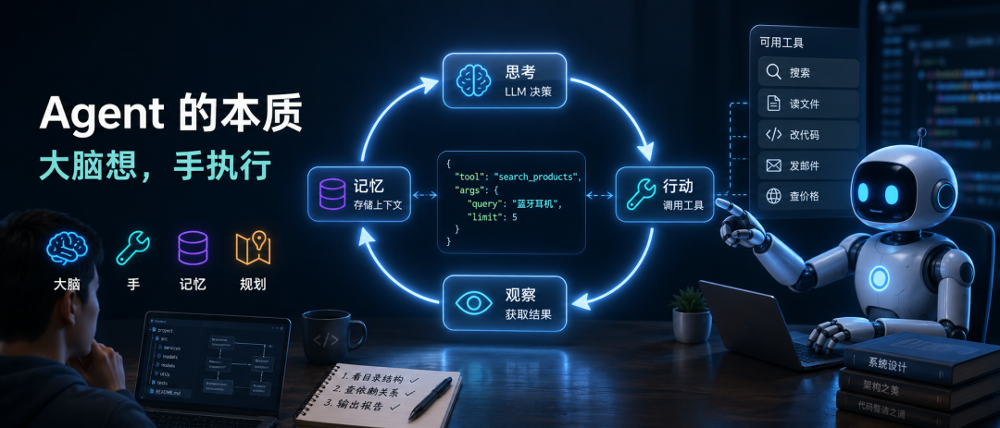
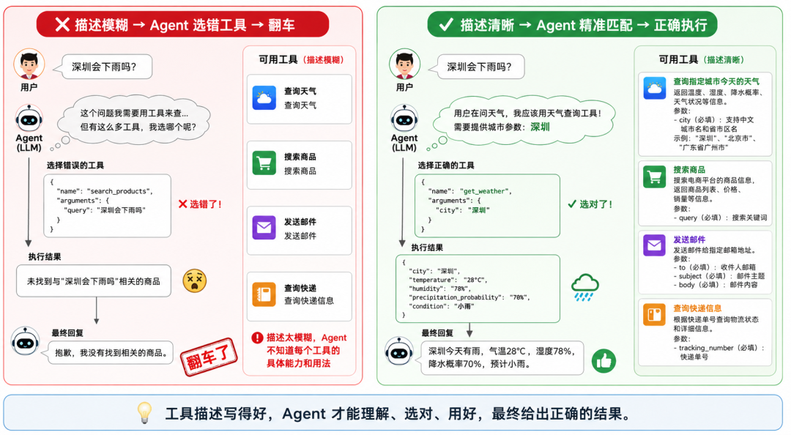

> 📎 来源: [程序员红哥](https://mp.weixin.qq.com/s?__biz=MzkwMDcyMDI5Mg==&mid=2247483937&idx=1&sn=cf1f8fce6613ab32c3e0b954f941ba56&chksm=c1960825ba945c1f7615b252f695214a9f4c9a0585d49f01909129e9bae49476e9fdbc95f78a&mpshare=1&scene=1&srcid=0515YCyggqimpn20hDyjUv3x&sharer_shareinfo=ba8534a71af75809c49f329125dd87cd&sharer_shareinfo_first=ba8534a71af75809c49f329125dd87cd) | 时间: 2026-05-15 14:06

---

## 1. AI 替你写代码、查资料、改文件——但它一行代码都没跑过

你用 Claude Code 写项目，它自动读文件、改代码、跑测试，看起来像个真正的程序员在干活。你用 Manus 做调研，它自己搜索、整理、出报告，全程没问你一句。

你会觉得——这 AI 真厉害，什么都会干。

**真相是：大模型连一行代码都没执行过。**

它既不会上网，也不会写文件，更不会调 API。[它只会一件事：根据你给它的信息，预测下一个 token，然后输出一段文字。](https://mp.weixin.qq.com/s?__biz=MzkwMDcyMDI5Mg==&mid=2247483902&idx=1&sn=c4ff07feac954fc24cd2e58b530b70ac&scene=21#wechat_redirect)

那它怎么做到的"自己动手"？

答案比你想的简单得多——每次它想干点什么，它就输出一段 JSON，说"我想调这个工具，参数是这些"。真正去执行的是你的代码。执行完了，把结果还给模型，它看看结果，决定下一步输出什么。

**Agent 的"自主"，是在一个简单循环里完成的。大脑是 LLM，手脚是你的代码。**

> 💡 **小词典——Agent（智能体）**：能自己拆目标、调工具、看结果、决定下一步的 AI 应用。跟普通聊天机器人的本质区别是——它会"动手"，不只是"动嘴"。

---

## 2. 跟普通 LLM 差异在哪？一个场景说清楚

你问一个普通的聊天 AI："帮我找一款性价比最高的蓝牙耳机"。它凭训练数据里的记忆给你推荐几款——这些信息可能是一年前的了。

你让一个 Agent 干同样的事：

它先判断"我不知道现在市面上有什么"→ 调用搜索工具 → 拿到一堆评测文章，判断"信息不够，不知道价格"→ 调用价格查询工具 → 横向对比 → 输出结论"XX 型号综合评分最高，目前活动价 299 元"。

**普通 LLM 被动回答，Agent 主动探索。**



秘密就是一个循环：**感知 → 思考 → 行动 → 观察 → 再思考**。每一步结果决定下一步方向，直到任务完成。

---

## 3. 其实你已经在用了

你可能觉得 Agent 是什么前沿概念。其实前面提到的 Claude Code、Cursor 写代码就是 Agent。你用 Dify、Coze 拖拽搭工作流、中间让 AI 做判断，也是 Agent。**你大概率已经用过它了，只是没意识到。**

---

## 4. Agent 的四个零件，四句话就够了

把 Agent 拆开，就四个东西。

### 大脑：选模型就是选智商

模型决定了 Agent 的能力上限。市面上三个主力选手：

- Claude Opus 4.7，Anthropic 的旗舰模型，编程和复杂推理能力最强
- GPT-5.5，OpenAI 出品，最大特点是耐力好——能连续自主运行 31 小时不崩
- Gemini 3.1 Pro，Google 的杀手锏是 200 万 token 的上下文窗口，一批能塞进几十本书

**同一个任务换不同模型，表现可能天差地别。** 选型别光看跑分，结合具体场景测。

### 手：工具描述写不好，Agent 就是智障

LLM 不能上网、不能读文件、不能发邮件。Agent 通过"工具调用"获得这些能力。

工具接入的核心只有一件事：**写清楚描述。**

一个天气查询工具，两种写法，两种结果：

❌ 糟糕的描述："查询天气"

模型根本不知道这个工具能查到什么、需要什么参数

✅ 好的描述："查询指定城市今天的天气，返回温度、湿度、降水概率。city 参数支持中文城市名和省市区名"

模型看到用户问"深圳会下雨吗"，立刻知道该用这个工具、传什么参数

**工具描述的质量，直接决定 Agent 是智能助手还是智障助手。** 描述里必须写清楚三件事：工具能做什么、返回什么、参数怎么填。



工具调用本身也不神秘。整个流程就四步：你告诉 LLM 有哪些工具可用 → LLM 判断该用哪个，返回一段 JSON（

```
"调 search_products，参数'蓝牙耳机'"
```

）→ 你的代码真的去执行 → 结果还给 LLM，它判断继续调还是直接回答。**就这么简单，循环直到 LLM 不再要调工具。**

不同厂商叫法不同（OpenAI 叫 Function Calling，Anthropic 叫 Tool Use，Google 也叫 Function Calling），但底层完全一样。

另一个现实问题——你接了 10 个工具，跟 3 个不同的 AI 应用配，每个都得重写一遍描述和集成代码？**[MCP 就是解决这事的——一套标准的工具描述格式，写一次，所有支持 MCP 的 AI 应用都能用。](https://mp.weixin.qq.com/s?__biz=MzkwMDcyMDI5Mg==&mid=2247483931&idx=1&sn=efa903431e4a215fc41839580a8c6162&scene=21#wechat_redirect)** 相当于 USB-C 之于充电口：换设备不用换线。

### 记忆：Agent 能记住你，全靠两层设计

LLM 的天生缺陷是"金鱼记忆"——每次对话对它来说都是全新的。[Agent 用两层设计补上。](https://mp.weixin.qq.com/s?__biz=MzkwMDcyMDI5Mg==&mid=2247483926&idx=1&sn=6ee48092b7c301f30953f12974e953e5&scene=21#wechat_redirect)

**短期记忆**：当前对话里的所有内容。每调一次工具，结果就拼进记录，Agent 看到的不是孤立的一步，而是来龙去脉。但窗口有大小限制，记得太多会溢出。

> 💡 **小词典——上下文窗口**：模型一次能"看到"的最大文本量，以 token 计算。超出窗口的内容会被截断。

**长期记忆**：[跨会话的信息。比如你上周说"我讨厌啰嗦的回答"，存进数据库。这周你再问，Agent 启动时检索到这条，自动调整回复风格。](https://mp.weixin.qq.com/s?__biz=MzkwMDcyMDI5Mg==&mid=2247483926&idx=2&sn=923ab0ec2ba5b9592029798f30978b34&scene=21#wechat_redirect)

**短期保证推理不跑偏，长期保证跨时间的个性。**

### 规划：走迷宫还是看导航？

把模糊的大目标拆成可执行的动作，两种做法：

**边走边看（ReAct）**：做一步、看结果、决定下一步。像走迷宫，灵活但可能绕路。适合"分析这个代码库的架构问题"。

**先画地图（Plan-and-Execute）**：列完整计划再执行。像开导航，高效但中途封路就傻眼。适合"部署服务到 K8s"。

实际工程里混合用——**大方向计划驱动，遇意外切 ReAct**。跟开车一样：有导航走主干道，临时封路自己判断绕行。

### 拼起来看，就这么简单

四个零件怎么一起转？拿"帮我分析这个代码库的架构问题"举例——

1. **大脑**

   读到用户目标，判断"这需要分步骤"→ 定下计划：先看目录结构、再查核心模块依赖、最后出报告
2. **手**

   开始执行：调文件读取工具看目录 → 结果进**记忆** → 调依赖分析工具查模块 → 结果再进记忆
3. **规划**

   在后台一直盯着：如果依赖分析发现了一个没预料到的循环引用，立即切回 ReAct——"先搞清楚这个循环引用再继续"
4. 最后一步也没工具可调了，直接把报告推给用户

**每个零件就干自己那点事。循环把它们串起来，就这么简单。**

---

## 5. 玩法：别让一个 Agent 干所有活

单个 Agent 处理复杂任务，prompt 越来越长，错误容易扩散。

更好的做法是分工——跟微服务一个道理：**单一职责，各管一摊。**

一个分析 GitHub 仓库安全漏洞的任务：

- 调度 Agent 接到任务，拆成三份
- 代码分析 Agent 扫描代码里的安全模式
- 依赖分析 Agent 检查第三方库的已知漏洞
- 报告 Agent 汇总结果，生成最终报告

每个 Agent 只干一件事，prompt 精准，出了 bug 也好定位。

---

## 6. 最大的坑：Agent 非常不可靠

Agent 在生产环境里最头疼的问题就是不可靠。三个原因：

1. **LLM 是概率性的**

   ——同样的输入，今天输出可能跟昨天不同
2. **错误会滚雪球**

   ——一步跑偏，后面全歪
3. **它通常不知道自己做错了**

   ——继续兴高采烈往错误方向狂奔

应对也很简单，四层防御，从便宜到贵：

**第一层：[Prompt 里教它自纠错。](https://mp.weixin.qq.com/s?__biz=MzkwMDcyMDI5Mg==&mid=2247483926&idx=3&sn=4fc4347e4042399ba66f6662576b3976&scene=21#wechat_redirect)** 写清楚"如果一次没成功，换个方法再试"。

**第二层：把 temperature 调低。** 减少随机波动，牺牲一点"创意"换稳定性。

**第三层：装护栏。** 执行删除、发布、付款之前，让规则引擎验证一下"真的该做吗"。

**第四层：人类审批。** 不可逆操作时，Agent 停住，弹确认框等人点"同意"。不是不信任 AI，是工程冗余。

---

## 7. 动手：用框架还是自己写？

这个问题跟"学前端用 React 还是原生 JS"一样。

LangGraph、CrewAI、AutoGPT 等框架开箱即用，但抽象层多，出了问题难查。

**Agent 核心循环就十几行 Python——理解原理之后，自己写比用框架更可控。**

def agent\_loop(user\_goal):
    messages = [{"role": "system", "content": AGENT\_PROMPT},
                {"role": "user", "content": user\_goal}]

    while steps < MAX\_STEPS:
        response = llm.chat(messages, tools=tools)
        if response.has\_tool\_calls():
            for call in response.tool\_calls:
                result = execute\_tool(call.name, call.arguments)
                messages.append(tool\_result\_to\_message(result))
        else:
            break
    return response.content

**先手写一个最简单的跑通，理解了原理再上框架。** 框架的价值等你踩过坑才能体会——别在理解问题之前引入解决方案。

---

## 8. Agent 烧钱很快，但可以控制

一次任务可能调十几次 LLM，成本不能不管。几个策略：

- 规划用强模型（贵但值），执行用轻量模型。比如 Claude Opus 4.7 做规划、Haiku 4.5 做信息提取，后者成本不到前者的十分之一
- 相同或相似的查询走缓存，别反复调 LLM
- 发现明显跑偏，果断终止，别让无意义的循环一直烧钱

---

## 9. 什么时候该用，什么时候不该用

很多人纠结该不该上 Agent。一句话判断——

步骤明确、逻辑固定的任务（批量处理文件、定时同步数据），用传统脚本更稳更便宜。步骤不确定、需要推理判断的任务（"分析架构问题""排查报错原因"），Agent 才值得上。

**Agent 的价值在于处理不确定性，成本也在于不确定性。** 没什么玄学，就是值不值得的问题。

---

## 10. 回到开头那句话

记得开头说的吗——Agent 替你写代码、查资料、改文件，但它一行代码都没跑过。

现在你知道它怎么做到的了。大脑想、手执行、记忆存、规划盯——四个零件串在一个循环里，LLM 输出 JSON，你的代码执行，结果塞回去。

**它从头到尾没跑过一行你的代码。它只是告诉你的代码该跑什么。**

Agent 不是什么黑魔法。拆开了就是十几行的 while 循环。

如果你还没自己写过，拿一个你工作里真正重复在做的判断型任务试试——让 Agent 先读你的代码库结构、再跑依赖检查、最后出一份改动风险评估。这种活平时你可能要手工翻半天，Agent 能一口气跑完，你验收结果就行。跑起来那一刻你就知道，这件事真的比想象中简单。
