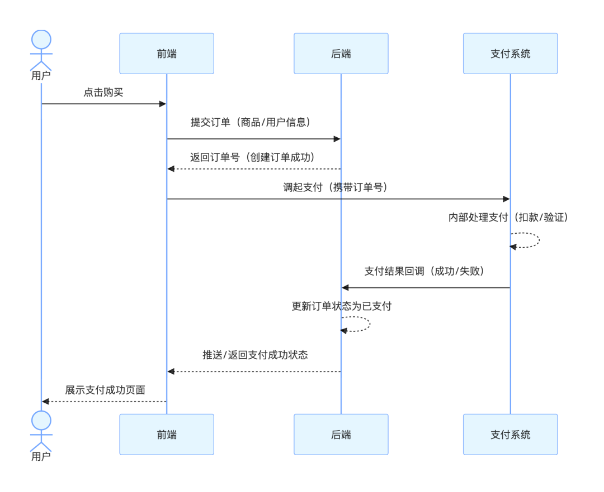
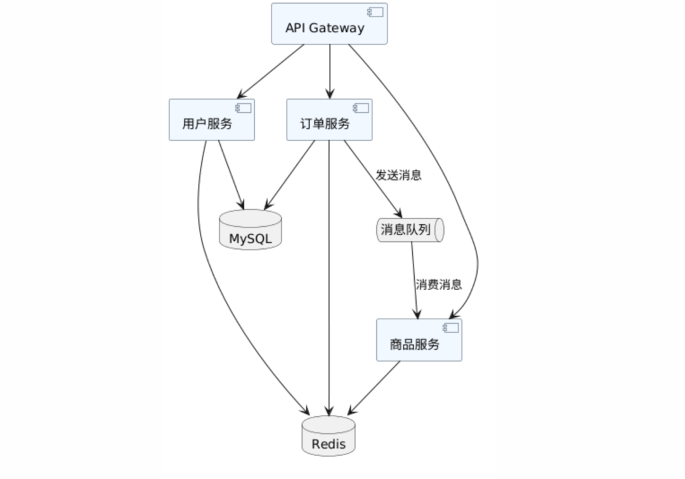
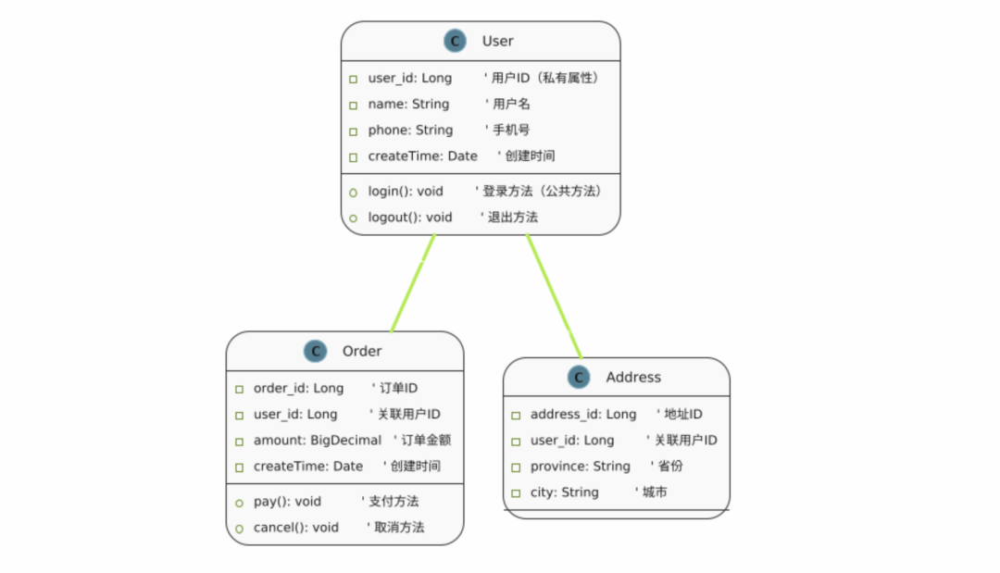

> 📎 来源: [林是梦](https://mp.weixin.qq.com/s?__biz=MzIxMzQ2Njc3MA==&mid=2247484506&idx=1&sn=d8dbe710e497ba33db6cbe444da22da7&chksm=962fe55df7e0b0a86cde844f5f7e515be4aae51cea4ecac2f3af2601f4cb4cbde24569c51876&mpshare=1&scene=1&srcid=0429zFUvcWasdFrKuTGWK5v1&sharer_shareinfo=04dfd7c7e8fc6b4704ad1f4c118c87c1&sharer_shareinfo_first=04dfd7c7e8fc6b4704ad1f4c118c87c1) | 时间: 2026-04-29 11:56

---

不定期发布 软件开发、互联网资讯 干货文章，点击上方名片关注获取更多文章

---


现在自定义 Agent Skill ( 技能 ) 已经成为使用 AI Agent 的标配，我先讲下什么是 Skill，AI 本身只会思考、生成文字、写代码，**没有本地执行能力**，不能跑脚本、不能查数据库、不能处理视频、不能画图、不能转文档、不能操作服务器，真正让 AI 拥有这些能力的是**工具集**。那么把这些工具封装成一段指令脚本，就是 Skill。所有 AI 编写的 Skill 基本都是 AI 负责写逻辑和调用代码，然后在本地或者服务器装好这些工具，直接执行生效。

工具本身早已成熟存在，Python、Shell、FFmpeg、SQL、图片与文档处理工具皆是如此，它们才是真正落地干活、解决实际问题的核心底座，但在过去，**用好这些工具的门槛极高、成本巨大**，而现阶段代码本身已经没壁垒了，增删改查、接口、常用功能，谁写都差不多，**唯一还有价值的，就是解决某一领域问题的经验，能把工具组合起来解决复杂问题**（或许再过几年所有的经验都会化为 Skill 吧）。

工欲善其事，必先利其器。本文我将结合职场运营、研发实战场景，分享一套高频使用的 Agent Skill 工具集合，希望大家多产出少加班。

### Python

自动化办公的第一生产力必须是 Python，我经常用它快速搭建 HTTP 服务验证某个接口、批处理 Excel 表格、发送网络请求等，对 Java 开发来说，使用 EasyExcel 写个数据迁移或文件批处理脚本， 比用 Python 写啰嗦三倍，代码量爆炸。Java 监听 Web 服还需要 Tomcat 打包才能发布，Python 终端运行 

```
python 脚本名.py
```

 就能发布了。

> **场景：运营每月要汇总 12 个部门发来的 Excel 销售表，格式不统一，手动合并要花半天。**

> 告诉 AI：「我有一个文件夹，里面是 12 个 Excel 文件，每个文件的 Sheet1 里有销售数据，第一行是表头，帮我写一个 Python 脚本，把它们合并成一个文件，去掉重复表头，保存为 merged.xlsx。」

> AI 生成脚本，复制到本地运行。原本半天的工作，变成 10 秒钟。下个月同样的任务，脚本还在还是 10 秒钟。

### Shell（Bash）

Shell 脚本可以说是系统级自动化，MacOS 和 Linux 的隐藏超能力。Shell 脚本是运维、后端开发的日常工具，但对大多数人来说，看到满屏的 

```
$
```

、

```
|
```

、

```
grep
```

、

```
awk
```

，说实话我写这么些年代码了，我根本记不住这些复杂命令组合，Java 开发每天用 IDE，Shell 最多用来执行 

```
git
```

 命令，真要写个批处理脚本，要么百度找半天，或者找运维老哥看看。

> **场景：研发每天要把测试环境的日志文件归档，文件名带日期，超过 30 天的要压缩打包移走，手动做既繁琐又容易漏。**

> 告诉 AI：「帮我写一个 Shell 脚本，找到 /var/log/app/ 目录下所有超过 30 天没有修改的 .log 文件，把它们打包成一个 tar.gz 文件命名为 log\_archive\_当天日期.tar.gz，然后删除原始文件，最后把这个脚本加入 cron，每天凌晨 2 点自动执行。」

> AI 给的脚本和 cron 配置命令。只需要测试一次，加入定时任务，之后这件事就自动化了。

### SQL

复杂的函数 SQL 真的利索地飞起了，再也不用翻看 SQL 操作手册了。

> **场景：运营要分析过去 90 天，哪些渠道带来的新用户 7 日留存率最高，数据在 MySQL 数据库的 users 表和 events 表里。**

> 告诉 AI：「我有两张表：users 表有 user\_id、register\_time、channel 字段；events 表有 user\_id、event\_time、event\_type 字段。帮我写一个 SQL，查过去 90 天每个渠道注册的用户数，以及其中在注册后 7 天内有过登录事件（event\_type='login'）的用户数，计算出各渠道的 7 日留存率，按留存率从高到低排列。」

> AI 给出完整的 SQL，包含 JOIN、日期计算、聚合、排序。复制到 Navicat 执行，结果直接出来。

### Mermaid

Mermaid 是一种用文字描述图表的语言，类似于 Markdown，标记语言可以渲染出来图。它原生支持 GitHub、Notion、飞书文档、GitLab，也可以在 VS Code 里实时预览，专门用来画流程图、时序图、架构图，我之前写文章想配图，或者写架构方案需要配图，都是去 draw.io 手工拖拽手工画图，半天才能画出一个架构图，现在生成 Mermaid 语法，在 Markdown 编辑器实时渲染秒出。

> **场景：产品经理要给开发画一个用户下单流程时序图，包含用户、前端、后端、支付系统四个角色的交互。**

> 告诉 AI：「帮我用 Mermaid 画一个时序图，角色是：用户、前端、后端、支付系统。流程是：用户点击购买 → 前端提交订单 → 后端创建订单并返回订单号 → 前端调起支付 → 支付系统处理并回调后端 → 后端更新订单状态 → 前端展示支付成功。」

> AI 给 mermaid 代码，粘到 Typora 的代码块里，选 mermaid，时序图立刻出来。下次流程有变动，改几行文字就好，不用重新画图。（下图为纯 mermaid 代码渲染）



### Pandoc

这个是我最常用的工具之一，每个月绩效汇报文件全靠它。Pandoc 是一个命令行工具，支持几十种文档格式的互转：Markdown、Word、PDF、HTML、EPUB、LaTeX……理论上格式 A 转格式 B全部支持。它的命令格式非常固定：

```
pandoc 输入文件 -o 输出文件
```

，加上各种参数控制细节。

> **场景：我们 Java 开发团队用 Markdown 写了一份接口文档（README.md），PM 要求转成带封面、目录、公司样式的 Word 文档，发给甲方。**

> 告诉 AI：「我有一个 README.md，要用 Pandoc 转成 Word 格式，需要自动生成目录，页面设置为 A4，字体用宋体，标题层级保持，如果能用一个参考样式文档 reference.docx 来套格式更好，帮我写完整的 Pandoc 命令。」

> AI 给我命令，包括如何先生成 reference.docx 模板，然后套用。按步骤执行，出来一份格式专业的 Word，不需要手动调整任何样式。

### curl / API 调用

我以前要测试一个 API、要定时拉取某个平台的数据、要触发一个 Webhook，得用 Postman，就算我是 Javaer，遇到参数复杂的接口调用，要拼 Header、处理认证 Token、构造 JSON Body，手写也挺烦的，现在直接构造 curl ,直接在终端粘贴执行，拿到返回数据。AI 给两段 curl 命令，再让 AI 把它们组合成 Shell 脚本，加入 cron 定时任务。从此每天 8 点数据自动到群里，不需要任何人工操作。

> **场景：运营要每天早上 8 点从企业微信机器人推送昨日数据报告，数据来自内部系统 API，推送到企业微信群 Webhook。**

> 分两步告诉 AI：

> 第一步：「帮我写 curl 命令，调用这个内部接口获取昨日数据：GET https://api.internal.com/report/daily?date={昨日日期}，Header 需要带 Authorization: Bearer {我的token}，返回 JSON 里有 total\_revenue 字段。」

> 第二步：「帮我把第一步拿到的数据，用 curl 发送到企业微信群 Webhook，格式是 markdown 消息，内容是『昨日数据播报：订单数 xxx，营收 xxx』」

### ImageMagick

这个就是图片批量处理命令行的 Photoshop，做运营的人对批量改图这件事一定不陌生，100 张产品图要统一加水印、改成同一个尺寸、转成 WebP 格式节省存储，打开 PS 手动处理，或者用在线工具一个个上传，效率极低，还有文件大小限制。

ImageMagick 能做的恰恰是这些，而且一条命令处理几百张图。但它的命令参数令人绝望根本记不住还容易错。如何安装 ImageMagick，Mac：

```
brew install imagemagick
```

，Linux：

```
sudo apt install imagemagick
```

，Windows：下载官方安装包。

> **场景：电商运营收到供应商发来的 300 张产品图，背景白色，但大小不一，需要统一裁成 800×800，右下角加上品牌 LOGO 水印，再转成 WebP 格式节省 CDN 流量。**

> 分三次告诉 AI：

> 1. 「帮我写 ImageMagick 命令，把当前目录所有 JPG 图片统一裁剪/缩放到 800x800（不足的部分用白色填充，保持比例），输出到 resized 文件夹」
> 2. 「帮我写命令，在 resized 文件夹里所有图片的右下角，叠加 logo.png 水印，距边缘 20px，输出到 watermarked 文件夹」
> 3. 「帮我把 watermarked 里所有 JPG 批量转成 WebP 格式，质量 85，输出到 final 文件夹」

> 三条命令，300 张图，一次性搞定，之后每次有新素材直接复用。

### PlantUML

PlantUML 用纯文本描述图表，文件是 

```
.puml
```

，可以直接放进 Git 仓库。改系统，改文本，图自动更新。它支持类图、时序图、组件图、部署图、C4 架构图等所有常见的 UML 类型, PlantUML 在线编辑器(https://www.plantuml.com/)渲染出图。这个工具和 Mermaid可以一起用，都是用来画图的。

> **场景：我要在技术方案里画一个微服务架构的组件图，包含 API Gateway、用户服务、订单服务、商品服务、消息队列、MySQL、Redis。**

> 告诉 AI：「帮我用 PlantUML 画一个组件图，包含：API Gateway（接收所有外部请求），用户服务、订单服务、商品服务（三个微服务，都从 API Gateway 接收请求），消息队列（订单服务发消息到队列，商品服务消费队列），MySQL（用户服务和订单服务都连接），Redis（三个服务共用作缓存）。」

> AI 给我 PlantUML 代码，然后放进 

> ```
> .puml
> ```

>  文件，用插件渲染，专业架构图出来。代码和图一起提交 Git，下次系统有变动，改几行代码，图同步更新。（下图由纯 PlantUML 渲染）





这样的工具还有很多， 这几个常用的就能 覆盖了工作里 80% 的问题了。我在整理这些工具并给出场景的时候，其实就是在做一个工作，**将固定场景的问题搭建通用 skill 用 Agent 跑通流程，在未来我们团队里肯定会有一大部分的时候去做这个并验证**，AI 时代的最正确的做法就是，我知道 SQL 能查数据库，遇到需要查数据的场景，我知道该知道怎么要命令，**知其然并知其所以然**。

好了，本文分享到这里结束了。

**如果这篇文章对你有帮助，欢迎转发给身边的运营、产品、开发同学。每一个人都值得拥有 AI 时代的工具意识**

 用代码解构世界，下期再会。

---

本文对你有帮助的话，欢迎 **点赞 + 分享 +****推荐 ～**

我是林是梦，互联网行业资深从业者，开源项目作者。文章专注于分享软件开发、互联网资讯，点击下面名片关注我，和我一起成长吧

精选历史文章：

 [OpenClaw 爆火之后，企业 AI 平台该如何真正落地？](https://mp.weixin.qq.com/s?__biz=MzIxMzQ2Njc3MA==&mid=2247484388&idx=1&sn=fbd9ef316912db791eaba39caf89c11a&scene=21#wechat_redirect)

[如何设计一个多租户动态路由模型？（SaaS经典问题）](https://mp.weixin.qq.com/s?__biz=MzIxMzQ2Njc3MA==&mid=2247484372&idx=1&sn=ce96436311a65535f5c5daa591ea856a&scene=21#wechat_redirect)

[如何设计一个支撑亿级的优惠券号系统？](https://mp.weixin.qq.com/s?__biz=MzIxMzQ2Njc3MA==&mid=2247484367&idx=1&sn=1691ec06c6f07e25f46e7efdd2a9f759&scene=21#wechat_redirect)

[二进制位运算符速查表（附计算机发展极简史）](https://mp.weixin.qq.com/s?__biz=MzIxMzQ2Njc3MA==&mid=2247484362&idx=1&sn=f21a78c31a2857be35bbd71d01a744ed&scene=21#wechat_redirect)

[一条短链接背后的秘密：7 位字符如何撑起亿级访问？](https://mp.weixin.qq.com/s?__biz=MzIxMzQ2Njc3MA==&mid=2247484357&idx=1&sn=e679ca1cfe195088ccc1934c48c4ef99&scene=21#wechat_redirect)

[从零手写迷你 Netty 系列（七）：系列终章完结撒花](https://mp.weixin.qq.com/s?__biz=MzIxMzQ2Njc3MA==&mid=2247484342&idx=1&sn=ef35c2e577b49f2180f71ab31d37df95&scene=21#wechat_redirect)

[5 年工程师最推荐的一份 Nginx 配置清单，反向代理、限流、SSL、负载均衡全都有](https://mp.weixin.qq.com/s?__biz=MzIxMzQ2Njc3MA==&mid=2247484246&idx=1&sn=d89e930ef6b610053c2c3098368e7435&scene=21#wechat_redirect)

[一线大厂中是如何优雅使用 RocketMQ ？整理了一套通用消息封装思路（附完整代码）](https://mp.weixin.qq.com/s?__biz=MzIxMzQ2Njc3MA==&mid=2247484148&idx=1&sn=4b4364771f625c373a3abe0919cef4e9&scene=21#wechat_redirect)
