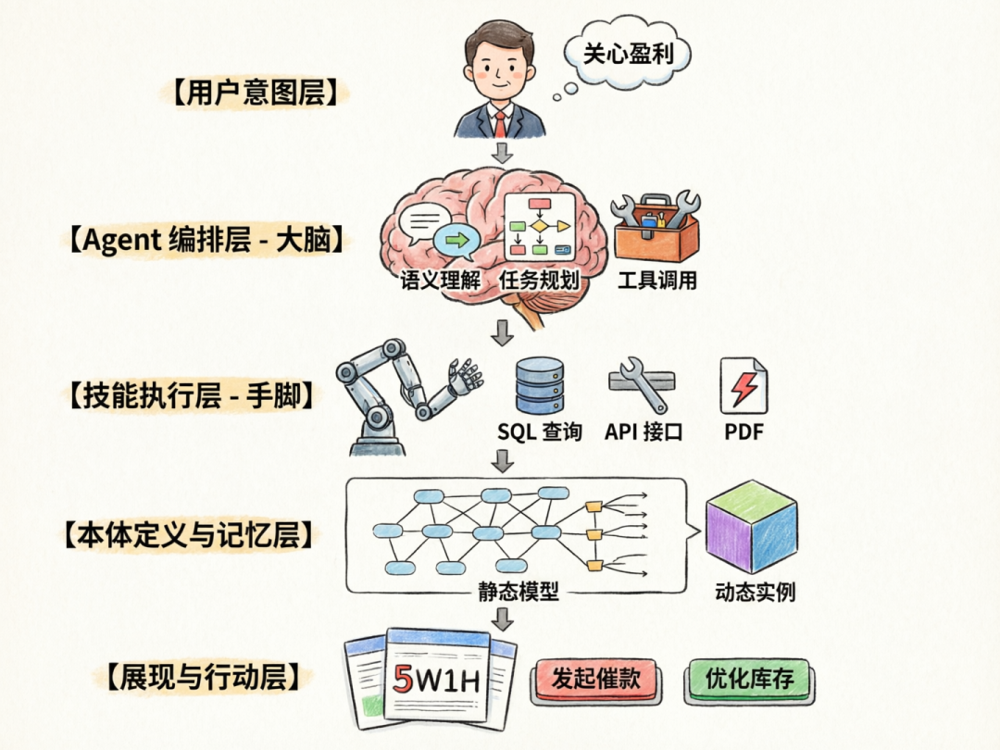

> 📎 来源: [坚强粑粑](https://mp.weixin.qq.com/s?__biz=MzI5MTExNjE0OQ==&mid=2648442723&idx=1&sn=6d7c9f51c4e2b1788ed350e13359aab4&chksm=f54f93ed34114e0d10f92419daf0f3a4b55bc10844403080a10e2d7dc292f8b5ef26abb05ac0&mpshare=1&scene=1&srcid=0422RNqv2VdHxndhDfBCiwcJ&sharer_shareinfo=7f87163ccadd435aea4e49f135e1478e&sharer_shareinfo_first=7f87163ccadd435aea4e49f135e1478e) | 时间: 2026-04-22 17:34

---

在AI时代下，传统的业务开发范式可能满足不了AI时代人们更加快速变化的需求。

Openclaw火爆的背景下，我们不妨大胆考虑一下由智能体驱动的业务开发范式是什么样子的，是不是可以脱离硬编码的思路了。

需求已经从**静态的数据建模**升级到了**动态的、Agent驱动的智能业务映射与执行系统**。客户需求已经已经不是简单的ETL工具映射完成建模了，是可以通过“基于现实的业务世界”和“Agent驱动的技能调用”。

这意味着我们要构建的不是一个传统的**数据中台**，而是一个**认知型业务孪生平台**。

现在以一个客户全新系统构建的思路分析一个类似数据中台的建设方式。

以下是结合新旧需求的汇总分析与重构后的建设方案的一个思路：

### 一、核心认知转变：从“静态模型映射”到“Agent认知执行”

| 旧方案侧重点 | 新需求侧重点 |
| --- | --- |
| **关系数据库表 -> 图数据库节点** | **业务事实/事件 -> 动态本体实例** |
| 人工设计映射规则 | **Agent理解语义后自主规划技能（Skills）** |
| 程序硬编码API聚合 | **Agent根据本体定义动态路由获取数据** |
| 统一宽表/视图展现 | **Agent根据盈利目标重组并解释数据** |

### 二、针对新需求的五大关键设计调整

#### 1. 业务如何建模？（引入业务事件溯源与约束条件）

不仅要画ER图，还要建立**业务事件流驱动的本体生命周期模型**。

- **约束条件建模**：不能只是外键，要定义**业务规则约束**。

- *例*：

  ```
  [订单本体]
  ```

  的 

  ```
  [已发货]
  ```

  状态，**必须包含**

  ```
  [物流单号]
  ```

  且 

  ```
  [物流单号]
  ```

  来自 

  ```
  [WMS系统]
  ```

  。

- **现实世界本体识别方法**：

- 利用**大模型（LLM）**读取各业务系统的**菜单名称、操作日志、审批流描述**。
- 如果多个系统都在操作同一个对象（如“付款”），Agent识别语义后自动建议合并为**核心本体：资金流水**。
- 可能更复杂的事情需要人与人之间的沟通，才能获得原有业务的完整描述

#### 2. Agent如何驱动？（Skills as Tools 模式）

客户强调“不是特定程序实现，而是Agent驱动Skills”。这意味着系统架构变为 **Agent OS + Skills Kit**。

| 传统程序实现 | Agent + Skills 实现 |
| --- | --- |
| 写死调用 CRM 的 `getCustomer`API。 | Agent规划：需要获取“客户等级”属性。 |
| 数据源变更需修改代码、重新发布。 | Agent查找技能库：发现 **Skill-CRM-Query**和 **Skill-ERP-Query**都能返回该属性，根据**响应速度/成本**择优调用。 |

**具体机制设计：**

- **本体配置**：

  ```
  客户本体
  ```

  -
  ```
  属性：信用等级
  ```

  -> **Skill描述**：“调用ERP系统查询客户财务主数据接口”。
- **Agent运行时**：

1. 接收指令：“分析A客户的盈利贡献”。
2. **规划**：识别需要 

   ```
   客户基础信息
   ```

   、

   ```
   历史订单
   ```

   、

   ```
   服务成本
   ```

   。
3. **调用Skills**：并行执行 

   ```
   Skill-CRM-GetInfo
   ```

   、

   ```
   Skill-OMS-OrderHistory
   ```

   、

   ```
   Skill-WMS-CostCalc
   ```

   。
4. **聚合**：将三个异构系统的JSON/MXL结果在内存中**物化**为一个临时的“A客户业务全景图”。

#### 3. 如何聚合数据？（逻辑物化与语义链接）

客户强调：“关系数据库到图数据库只解决部分问题”。确实，单纯的 

```
SQL -> Cypher
```

转换毫无业务价值。

**新方案：基于Agent语义理解的动态链接**

- **不建物理大宽表**：避免数据冗余和不一致。
- **Agent实时编织**：

- 当Agent拿到CRM的 

  ```
  CustomerID=123
  ```

  和 OMS的 

  ```
  BuyerID=U_456
  ```

  时，它调用 **Skill-ID-Mapping**（身份识别技能）。
- 识别出是**同一实体**后，Agent在**内存图**（或临时Neo4j子图）中建立 

  ```
  (c:Customer {id:123})-[r:PLACED]->(o:Order {id:456})
  ```

  。
- **聚合结果**：返回给用户的是一个**临时的、针对当前查询上下文计算出的唯一真相版本**。

#### 4. 如何精准呈现业务数据？（多模态反馈）

Agent不仅要返回数据，还要返回**推理过程和置信度**。

- **展现层设计**：

- **本体溯源视图**：鼠标悬停在“客户等级：A”上，显示 

  ```
  数据源：ERP | 更新时间：2分钟前 | 获取方式：Skill-ERP-实时查库
  ```

  。
- **关系可视导航**：展示Agent构建的**实时关系图谱**，点击边可查看关联条件（例如：通过身份证号后6位+手机号尾号匹配）。

#### 5. 如何达到经营效果（关心盈利）？（引入价值评估回路）

这是最高层次的要求。系统不能只展示数据，要辅助决策**提升盈利**。

- **Agent增加“盈利分析”技能集**：

- **Skill-PnL-Analyzer**：调用本体数据计算单品/单客毛利。
- **Skill-Churn-Predictor**：基于事件本体（客户投诉事件、延迟发货事件）预警收入流失风险。

- **反馈闭环**：

- Agent发现 

  ```
  [产品A]
  ```

  的售后工单率上升 -> 自动关联 

  ```
  [WMS-发货事件]
  ```

  -> 提示可能是某批次包装问题 -> **建议暂停发货并通知品控**-> **减少潜在亏损**。

### 三、汇总：新一代“Agent驱动本体建模系统”架构蓝图



```
[ 用户意图层 ] (关心盈利)       |       v[ Agent 编排层 ] (大脑)   - 语义理解：将“查一下张老板欠多少钱”转化为：查询[客户本体]的[应收账龄]属性。   - 任务规划：拆解为 Skill-身份识别 -> Skill-ERP-查账 -> Skill-规则-算利息。   - 工具调用：动态加载 Skill 配置。       |       v[ 技能执行层 (Skills) ] (手脚)   - 数据库技能：执行 SQL 查询（解决关系数据到图的读取）。   - API 技能：调用 REST/gRPC 获取实时数据。   - 文档技能：从 PDF 合同中提取关键条款补充本体属性。       |       v[ 本体定义 & 记忆层 ]   - 静态模型：有哪些业务本体、属性来源、关系、事件触发（存储在知识图谱中）。   - 动态实例：Agent 执行 Skill 后产生的临时数据快照（存储在向量库/图缓存中）。       |       v[ 展现与行动层 ]   - 精准数据卡片：回答“5W1H”。   - 经营建议指令：如“发起催款流程”、“优化库存结构”。
```

### 四、总结建议的落地里程碑

基于新反馈，不建议先买一堆数据库工具。建议的**最小可行产品（MVP）**顺序如下：

1. **Week 1-2：业务实体提取**

- 收集汇总各个业务系统的反馈结果
- 让LLM Agent读取3个核心业务系统的**API文档**和**数据库注释**。
- 输出第一版**Agent可读的本体定义文件**（JSON格式，包含属性对应的**Skill函数签名**）。

2. **Week 3-4：Skill 执行验证**

- 实现3个原子Skills：

  ```
  Skill-Query-CRM
  ```

  ， 

  ```
  Skill-Query-ERP
  ```

  。
- 验证Agent能否根据“查客户A全貌”指令，自动并行调用这俩Skill并拼出正确结果。

3. **Week 5-6：经营视角注入**

- 编写一个简单的 **Skill-盈利计算**。
- 验证Agent能否回答：“对比客户A和客户B，谁的毛利率更高？为什么？”

**系统不是在搬运数据，而是在理解业务语言后，指挥手（Skills）去各系统取数、算账、出报告。**
