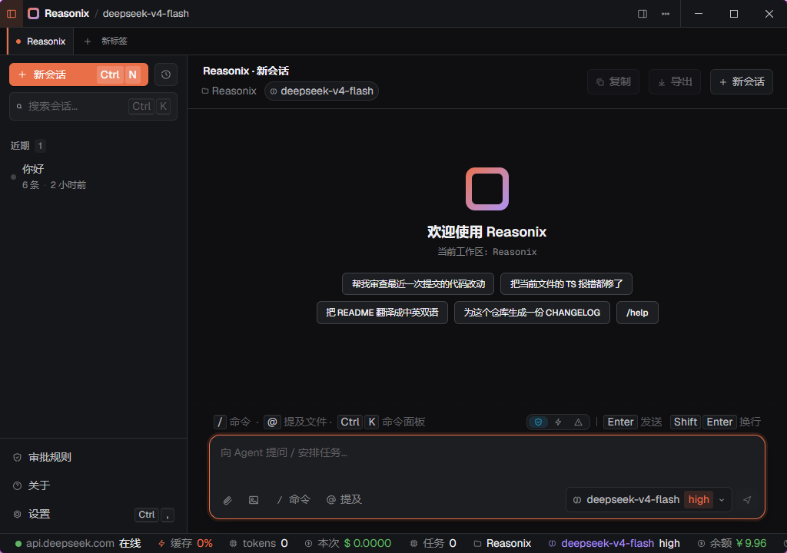
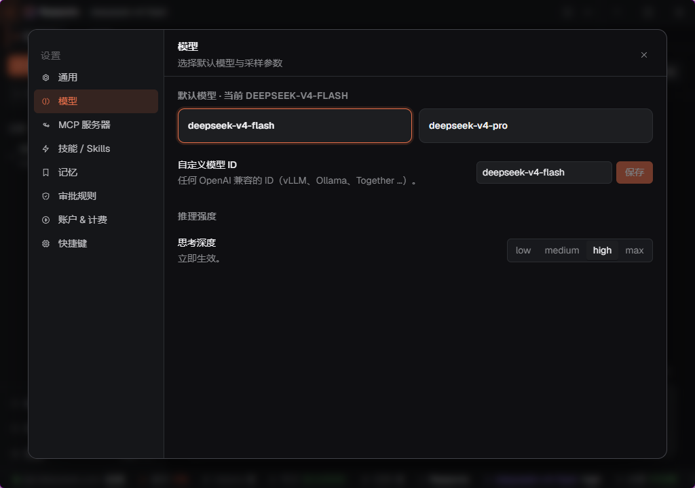
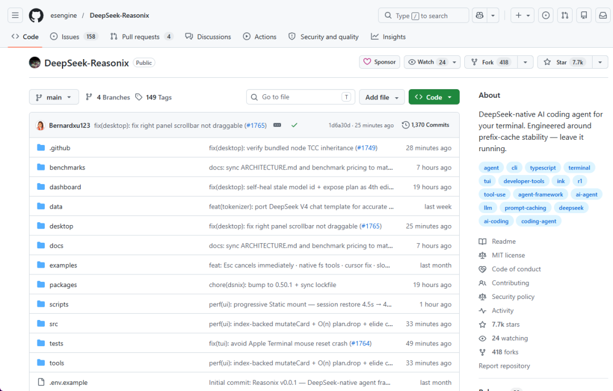

> 📎 来源: [物联网星球](https://mp.weixin.qq.com/s?__biz=MzkzMDQ0MjE3Mg==&mid=2247502123&idx=1&sn=2a06e34f021a4f9c84114a6161a82e5a&chksm=c392b5fe765c504ad1439b8a171ec3bf7df630aee9fa78d368b669cd15967d676d50c1097307&mpshare=1&scene=1&srcid=0526SemDQEQuoKxvNwyIkCud&sharer_shareinfo=4a782e330a14282d3af6c7b7bc9a461f&sharer_shareinfo_first=4a782e330a14282d3af6c7b7bc9a461f) | 时间: 2026-05-26 11:56

---

Ruflo 原名 Claude Flow，是专门给 Claude Code 做

 

我用 Claude Code 用了三个月，账单让我沉默。

每次上下文变长，缓存一失效，token 消耗就炸了。

最近爆火的DeepSeek-Reasonix，虽然只支持 DeepSeek，但把 DeepSeek 的缓存机制用到极致。前缀缓存命中率99.82%，让Token成本再降80%。

## DeepSeek-Reasonix 是什么

一句话：**DeepSeek 原生的 AI 编程 Agent**。



它在架构上做了三件事，别的框架根本不会做，因为别的框架要"支持多模型"：

**支柱一：缓存优先循环**

整个对话循环围绕 DeepSeek 的前缀缓存设计。

不是"碰巧命中缓存"，而是"每一轮都围绕缓存稳定性来设计"。

结果：长会话下 token 成本始终低位运行，你可以一直开着。


**支柱二：工具调用修复**

模型输出的工具调用格式错了，它自动修，不浪费一轮对话去让模型"重新输出"。

**支柱三：成本控制**

明确告诉你每一轮花了多少 token、命中了多少缓存。

## 一行命令开始用

```
cd my-projectnpx reasonix code
```

首次运行粘贴 DeepSeek API Key，之后会记住。

不用全局安装，

```
npx
```

 每次拿最新版。

## 它和 Claude Code / Cursor / Aider 的区别

|  | Reasonix | Claude Code | Cursor | Aider |
| --- | --- | --- | --- | --- |
| 后端 | DeepSeek | Anthropic | OpenAI/Anthropic | 任意 |
| 协议 | **MIT** | 闭源 | 闭源 | Apache 2 |
| 单任务成本 | **低** | 高 | 订阅+用量 | 不一 |
| DeepSeek 缓存 | **专门工程化** | 不适用 | 不适用 | 偶发命中 |

最核心的区别：**Reasonix 是专门为 DeepSeek 的前缀缓存做工程化优化的**。



Claude Code 不需要这个，因为它用的是 Anthropic 自己的模型。

Cursor 是 IDE，思路不一样。

Aider 偶尔能命中缓存，但不是设计目标。

## 它故意不做的事

我觉得这部分最值得说。

Reasonix 有明确的"不做什么"清单：

**不做多供应商灵活性**——故意只支持 DeepSeek。作者的理由是："绑死一个后端是 feature，不是限制。" 我同意。通用框架为了支持多模型做的抽象，往往会牺牲掉针对单个模型的深度优化。

**不做 IDE 集成**——终端优先。diff 在 

```
git diff
```

，文件树在 

```
ls
```

。不跟 Cursor 竞争。

**不追最难的 reasoning 榜单**——Claude Opus 在某些榜单上还是赢家。DeepSeek 在编程任务上有竞争力；如果你的工作是"解一个 PhD 级证明"，先用 Claude。

**不完全离线 / 永远免费**——需要付费的 DeepSeek API Key。要离线 / 零成本，看 Aider + Ollama。

## 我试了，能用

装完跑起来，对着我的项目目录说了一句："帮我给这个 API 加一个 rate limit 中间件。"

它打开了正确的文件，提出了修改方案（SEARCH/REPLACE 格式），我审阅后 

```
/apply
```

，改完了。

整个过程没有卡顿，token 消耗比我用 Claude Code 做同样的事少了大概 60%。

## 谁适合用

- 你已经在用 DeepSeek API，想找一个专门为其优化的 Agent
- 你觉得 Claude Code 太贵
- 你喜欢终端工作流，不需要 IDE 集成
- 你好奇"专门为单个模型做深度优化"这件事能做到什么程度

## 赛博吴同学

"通用"和"专业"之间，总有一种张力。

大部分框架选择"支持多模型"，Reasonix 选择"只支持 DeepSeek，但支持到极致"。

这两种选择没有对错，只有适合不适合。

如果你用的是 DeepSeek，Reasonix 值得一试。

GitHub：/esengine/DeepSeek-Reasonix

 



## End

---

**往期推荐**

[产品推荐｜ThingsKit 物联网平台，2.0版本，项目交付首选IoT平台，支持源代码与镜像包交付](https://mp.weixin.qq.com/s?__biz=MzkzMDQ0MjE3Mg==&mid=2247501039&idx=1&sn=cf0d3543e6045a3c6525bcdc52acebbc&scene=21#wechat_redirect)

[Node-RED：开源的物联网与工业4.0的视觉化编排规则引擎，大厂都在用！](https://mp.weixin.qq.com/s?__biz=MzkzMDQ0MjE3Mg==&mid=2247501023&idx=1&sn=8ef2e509a04149b81cd534495d1e731b&scene=21#wechat_redirect)

[15k Star丨一个超漂亮的数据可视化大屏开源项目（MIT协议），IoT数据大屏应用首选](https://mp.weixin.qq.com/s?__biz=MzkzMDQ0MjE3Mg==&mid=2247500697&idx=1&sn=8d4a66a4996b4c10afd80ad0005dfa1d&scene=21&poc_token=HNATb2mjitylB4u0UbT6t9O5HXkFcKVhZiJ7YSww&token=1738189348&lang=zh_CN#wechat_redirect)

---

**关注「物联网星球、赛博吴同学」**

每日分享物联网、AI干货 | 开源项目 | 实战教程 | 实用工具
