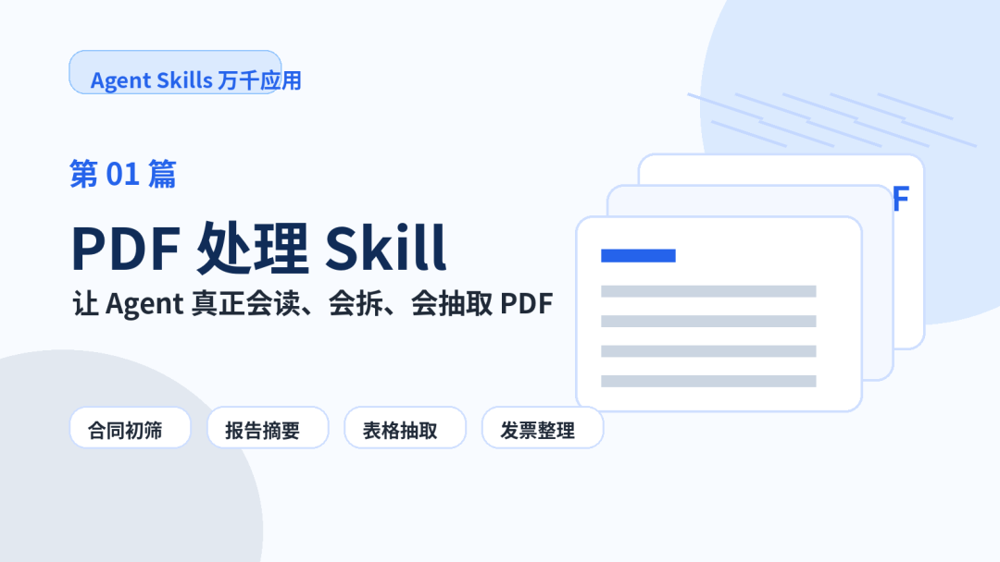
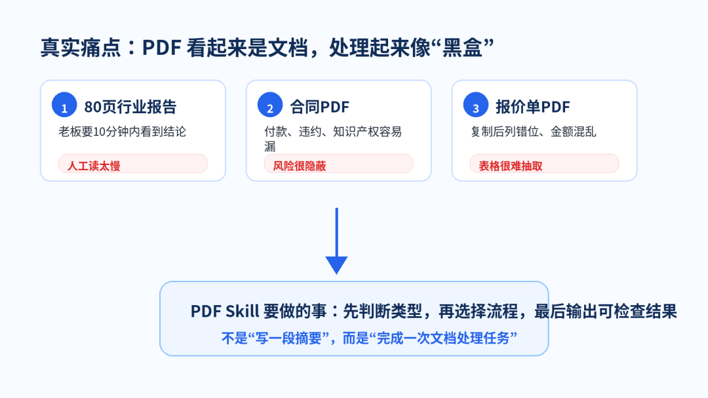
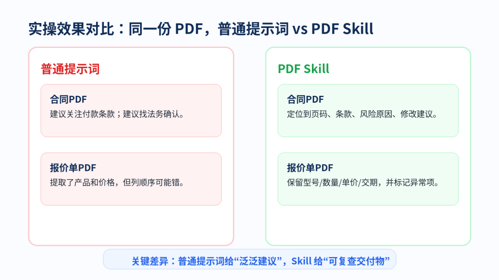
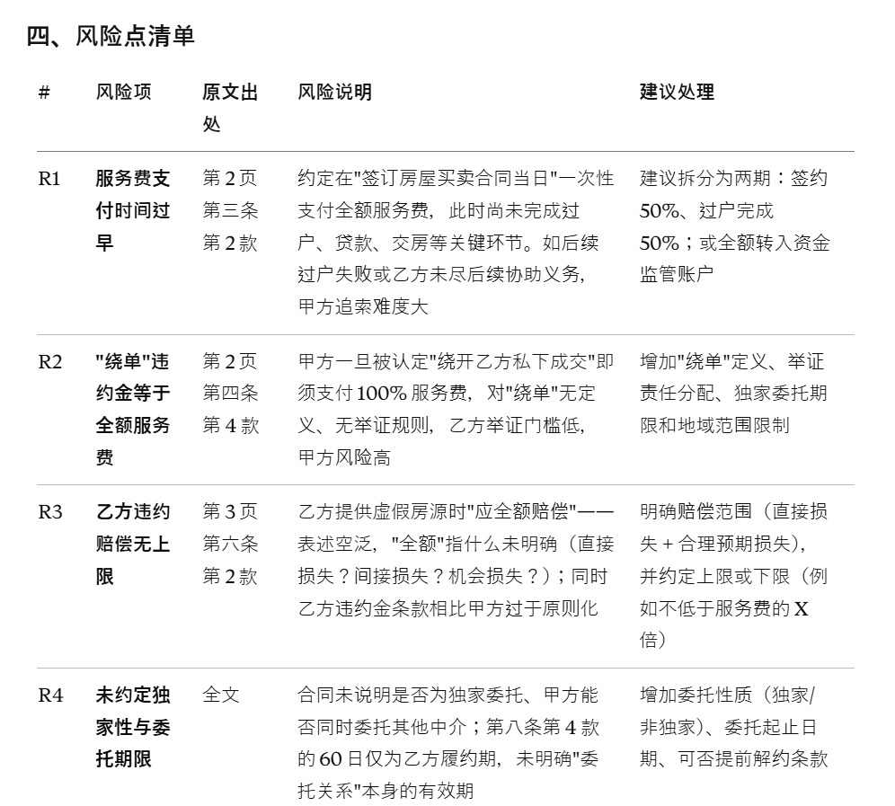
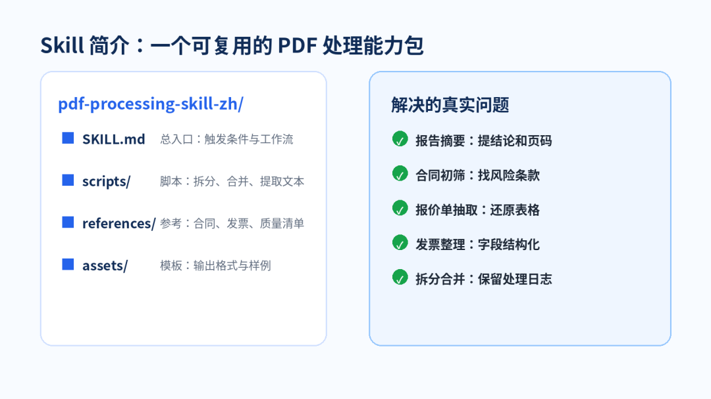
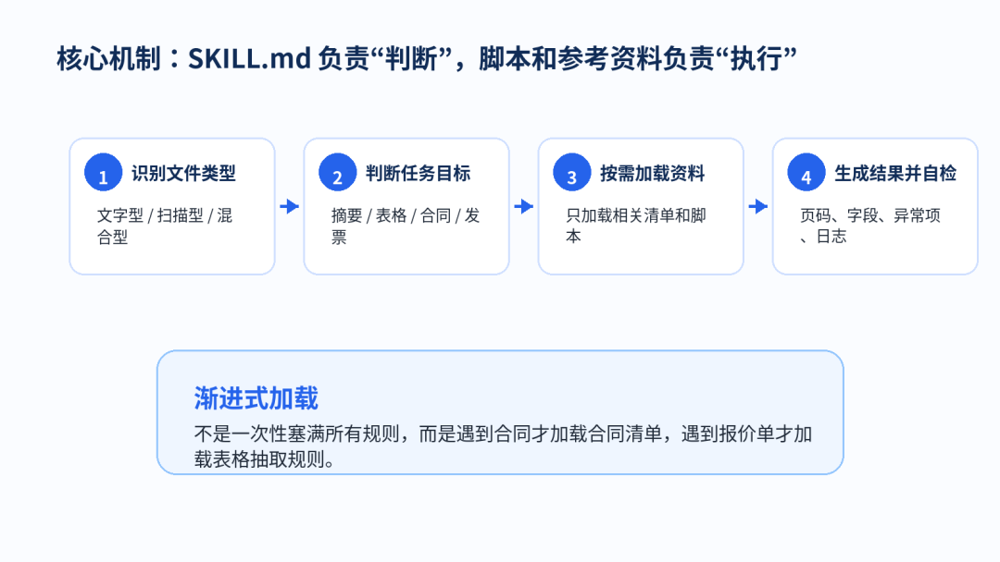
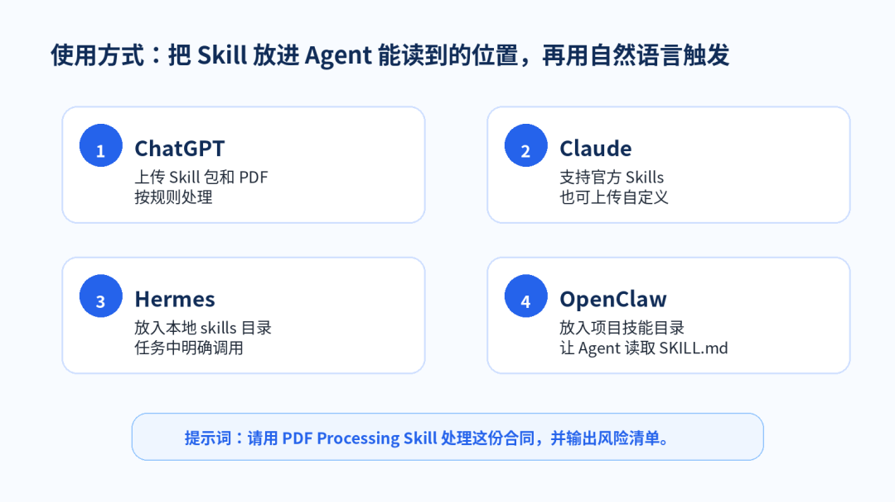

> 📎 来源: [厚国兄](https://mp.weixin.qq.com/s?__biz=Mzk1NzM1MTI1Ng==&mid=2247490316&idx=1&sn=6fdf50e37d56ebdf05130769d3ad370a&chksm=c2b22f1847153238bda4726a7b2176b2c7c16335ac32a3d5ded82488a0815da46a297387d916&mpshare=1&scene=1&srcid=0525RVZR5yXi0Lc50CFZb0CZ&sharer_shareinfo=255826cb7ea59cdf26023d9c6181ce75&sharer_shareinfo_first=255826cb7ea59cdf26023d9c6181ce75) | 时间: 2026-05-25 15:15

---

Agent Skills 万千应用 · 第01篇

▌ 01｜场景痛点开场：PDF 是办公室里最像“黑盒”的文件

你一定遇到过这种场景：老板丢来一份 80 页行业报告，让你 10 分钟内说清楚“重点、机会、风险”；客户发来合同 PDF，让你先帮忙看付款、违约、知识产权有没有坑；供应商发来报价单 PDF，你复制到 Excel 后发现型号、数量、单价全部错位。

这时你问 AI：“帮我总结这个 PDF。”它确实会写几段话，但往往很空：没有页码、没有字段、没有风险等级，也无法继续交付给别人。

真正的问题不是 AI 不会读，而是 PDF 处理本身需要一套稳定流程：先判断类型，再选择方法，最后输出可复查结果。

▌ 02｜Skill 实操效果：两个真实案例对比

◆ 案例 A：合同 PDF 初筛

普通提示词输出：合同整体比较完整，建议关注付款条款、违约责任和知识产权归属，最好请法务进一步确认。

这句话没错，但几乎不能直接用。使用 PDF Skill 后，输出会变成可复查的风险清单：

|  |  |  |  |
| --- | --- | --- | --- |
| 风险项 | 位置 | 风险说明 | 建议 |
| 付款节点不明确 | 第3页第4条 | 只写“验收后付款”，未说明付款期限 | 改为“验收通过后15个工作日内付款” |
| 违约责任偏重 | 第6页第9条 | 乙方赔偿责任未设置上限 | 增加“不超过合同总金额”的上限 |
| 知识产权归属不清 | 第7页第11条 | 未明确交付成果归属 | 补充成果归属和使用范围 |

这才像一个能给业务同事看的“初筛结果”。

示例：

◆ 案例 B：供应商报价单抽取

普通提示词输出：已提取报价信息，包括产品名称、数量和价格。问题是，真实报价单最怕列错位：型号和数量错一列，后面全错。

|  |  |  |  |  |
| --- | --- | --- | --- | --- |
| 型号 | 数量 | 单价 | 交期 | 异常提示 |
| A100 控制板 | 20 | 185.00 | 7天 | 正常 |
| B210 传感器 | 50 | 42.50 | 10天 | 正常 |
| C300 线束 | 未识别 | 9.80 | 5天 | 数量列疑似缺失，需人工确认 |

PDF Skill 不会假装全都识别成功，而是把“不确定项”标出来，这对真实工作非常重要。

▌ 03｜Skill 简介：它是什么，能解决什么

PDF 处理 Skill 是一个专门处理 PDF 的 Agent 能力包。官方资料里，OpenAI Codex 将 Skill 描述为包含 SKILL.md 和可选 scripts/、references/、assets/ 的目录；Claude 也提供了文档类预置 Skills，并支持按需加载。

📄 报告摘要：提炼结论、关键数据、页码来源

🧾 发票整理：抽取金额、税额、开票日期

📑 合同初筛：定位风险条款并给修改建议

📊 表格抽取：尽量保留行列结构和异常标记

🧩 拆分合并：按页码或规则生成新 PDF

网上已有基础版 PDF Skill，例如 Anthropic 官方开源的 PDF Skill。为了更适合中文办公场景，我也生成了一份增强版：pdf-processing-skill-zh-v4.zip，随本文交付包提供下载。

▌ 04｜核心机制：SKILL.md 不是说明书，而是调度入口

PDF Skill 的关键，不是写一堆提示词，而是设计一套“判断—加载—执行—检查”的流程。

第一层：触发条件。用户说“总结 PDF、看合同、提取报价单、合并文件”时，Agent 知道该启用它。

第二层：渐进式加载。不要一次性加载所有规则。合同任务只加载合同清单；发票任务只加载发票字段；拆分合并任务才调用脚本。

第三层：输出自检。关键结论尽量带页码；表格抽取要标记异常项；无法识别的内容写“未识别”，不能编造。

这就是 Skill 和普通提示词的区别：普通提示词靠临场发挥，Skill 靠固定流程交付。

▌ 05｜使用方式：先让 Agent 读到 Skill，再自然语言调用

整体方法很简单：把 Skill 包放到 Agent 能读取的位置，然后在任务里明确调用。

- ChatGPT：可把 Skill 包和 PDF 一起上传，然后说“按这个 Skill 规则处理”。

- Claude：支持官方 Skills，也可以上传自定义 Skill。

- Hermes：如果支持本地 skills 目录，可把文件夹放入对应目录。

- OpenClaw：可放入项目或用户级 skills 目录，在任务中指定使用。

示例提示词：请用 PDF Processing Skill 处理这份合同 PDF，输出风险清单、页码位置、修改建议和需人工确认项。

▌ 06｜避坑指南：别让 PDF Skill 变成“看起来很准”

✅ 扫描件不等于文字 PDF：如果 PDF 是图片扫描件，需要 OCR 或视觉识别，不要直接提取文字。

✅ 表格跨页最容易错：报价单、BOM、检测报告必须保留列名，并标记不确定单元格。

✅ 合同初筛不是法律意见：它适合做风险提示，不能替代专业律师判断。

✅ 关键结论要带来源：报告、合同、论文类 PDF，最好输出页码或章节位置。

✅ 不要覆盖原文件：拆分、合并、填写 PDF 时，应生成新文件，并保留处理日志。

▌ 07｜下期预告

下一篇继续讲办公场景里的高频能力：Word 排版 Skill：如何让 Agent 把内容变成真正可交付的公众号文档。

AI 会写内容只是第一步。真正能交付，还要解决标题层级、目录、表格、页码、图文排版和 Word 渲染稳定性。

资料参考：OpenAI Codex Skills 文档、Claude Agent Skills 文档。
