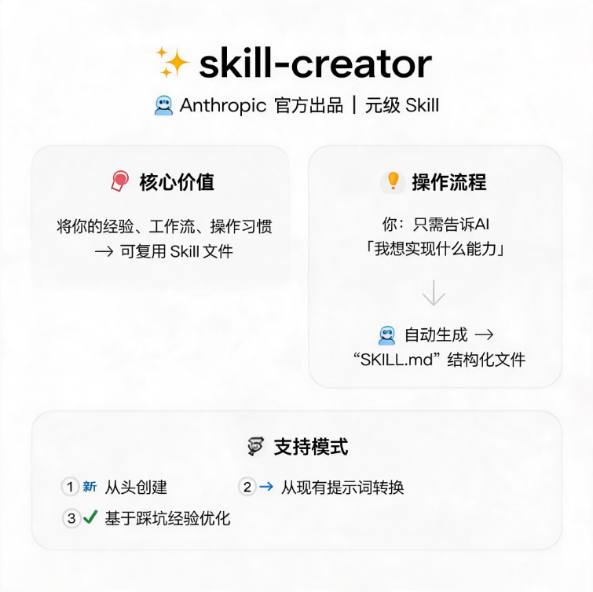
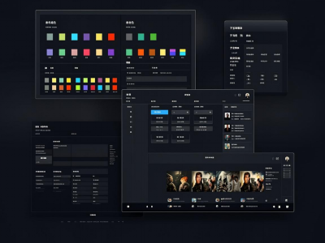
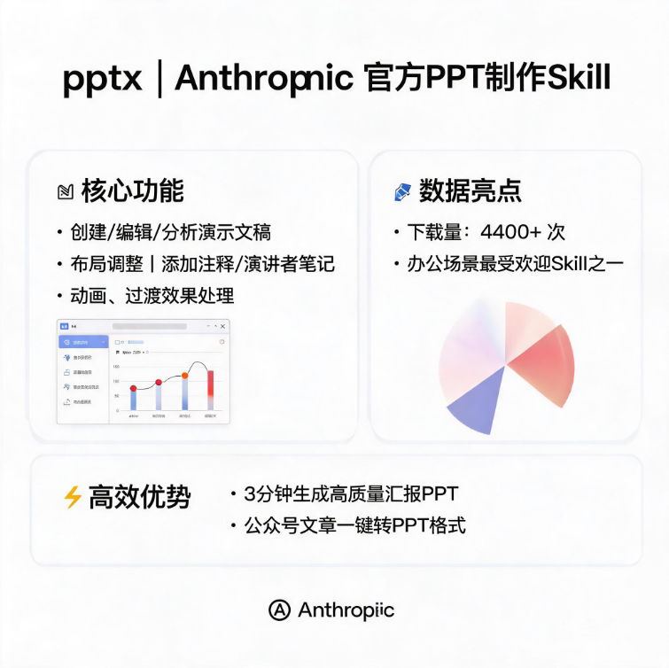

> 📎 来源: [早起看星河](https://mp.weixin.qq.com/s?__biz=MzIwODkzMDU4Ng==&mid=2247483799&idx=1&sn=6d747c1f85ed05eea0b3b2788b166b3c&chksm=9694d59bf0127638879ecbdbd715cce75ab8c3ca695e2175a1c734703b3f0dfbfaaae992d7d4&mpshare=1&scene=1&srcid=0529wjGXkWH31UsEhr7GaM5U&sharer_shareinfo=502a8c0d89eccf6888601282e294bd6c&sharer_shareinfo_first=502a8c0d89eccf6888601282e294bd6c) | 时间: 2026-05-29 12:41

---

TOP 10 最受欢迎的 Agent Skill

数据来源：skill-cn.com |  整理日期：2026年5月29日

https://www.skill-cn.com

Skill Hub 中国（skill-cn.com）是国内最大的 Agent Skill 生态平台，聚合了真实的 Skill 实战案例与可复用方案。以下是截至 2026 年 5 月，平台上热度最高的 10 个优质 Skill，涵盖了编程、设计、生产力、研究、数据分析等多个方向。每个 Skill 均附有源地址和配图，方便你快速了解和使用。

**#1****Skill Creator — 从0到1创建Agent技能**

「编程」  ·  Anthropic  ·  142.8K Stars  ·  热度 59,426

skill-creator 是 Anthropic 官方出品的元级 Skill，它的核心价值在于：教你怎么把自己的经验、工作流、操作习惯变成一个可复用的 Skill 文件。你不需要从零开始写提示词，只需要告诉 AI 你想实现什么能力，skill-creator 就会自动帮你生成结构化的 SKILL.md 文件。它支持从头创建、从现有提示词转换、基于踩坑经验优化等多种模式。在 Skill Hub 中国上已有 38 篇实践文章、超过 1 万次下载，是整个生态中最受欢迎的基础设施型 Skill。

源地址：https://github.com/anthropics/skills/tree/main/skills/skill-creator

Skill Hub：https://www.skill-cn.com/skill/8

下载量 10,300 ·  实践文章 38 篇

**#2****Superpowers — 让AI拥有完整开发工作流**

「编程」  ·  Jesse Vincent  ·  211K Stars  ·  热度 48,662

Superpowers 是一个包含多个可组合子技能的套件，它为 AI 编程助手提供了一套完整的软件开发工作流。它包括 brainstorming（创意探索）、planning（任务规划）、task-management（任务管理）等子技能，确保 AI 代理能够按照成熟的工程化流程工作。很多开发者反馈，装上 Superpowers 之后，AI 写出的代码质量明显提升，不再是“一股脑写完就跑”的风格，而是真正遵循了规划→设计→实现→审查的工程节奏。仓库已收获超过 21 万 Star，是 GitHub 上最火的 Skill 之一。

源地址：https://github.com/obra/superpowers

Skill Hub：https://www.skill-cn.com/skill/47

下载量 0 ·  实践文章 17 篇

**#3****Frontend Design — 生成专业级前端界面**

「设计」  ·  Anthropic  ·  142.8K Stars  ·  热度 43,423

frontend-design 是 Anthropic 官方提供的前端设计 Skill，它的核心能力是让 AI 生成具有高品质设计、可用于生产环境的独特前端界面。当你要求构建网页组件、着陆页、仪表盘、React 组件或对任何网页 UI 进行样式美化时，它都能派上用场。最大的卖点是“避免通用型 AI 美学”——它不会让你的页面看起来像模板套的产物，而是真正有设计感的作品。已有 22 篇实践文章详细记录了各种场景下的使用效果。

源地址：https://github.com/anthropics/skills/tree/main/skills/frontend-design

Skill Hub：https://www.skill-cn.com/skill/10

下载量 1,625 ·  实践文章 22 篇

**#4****Brainstorming — 创意工作前的必备探索**

「研究」  ·  Jesse Vincent  ·  210.7K Stars  ·  热度 37,605

brainstorming 是 Superpowers 套件中的核心子技能之一，也可以单独使用。它的理念很简单：在开始任何创意工作之前，必须先探索用户意图、需求和设计方案。无论是创建功能、构建组件、添加功能还是修改行为，都应该先经过“思维发散”再进入实施。这个 Skill 强制 AI 在动手写代码前先进行充分的思考和讨论，避免了“拿到需求就开干”导致的返工。对于复杂项目来说，这个“慢下来想一想”的环节能省下大量时间。

源地址：https://github.com/obra/superpowers/blob/main/skills/brainstorming

Skill Hub：https://www.skill-cn.com/skill/15

下载量 466 ·  实践文章 6 篇

**#5****Remotion Best Practices — 用React创作视频**

「设计」  ·  Remotion  ·  3.3K Stars  ·  热度 35,502

Remotion 是一个用 React 写视频的开源框架，而 remotion-best-practices 就是教 AI 怎么用好它的 Skill。它涵盖了组件设计、动画序列、音频同步、渲染配置等全流程最佳实践。在 Skill Hub 中国上这是实践文章最多的 Skill 之一，35 篇实践记录了各种场景：短视频制作、宣传片生成、直播特效、抠绿幕、甚至用口喷需求就能生成 30 秒宣传视频。对于内容创作者和自媒体人来说，这个 Skill 几乎是必装的。

源地址：https://github.com/remotion-dev/skills/blob/main/skills/remotion

Skill Hub：https://www.skill-cn.com/skill/16

下载量 224 ·  实践文章 35 篇

**#6****UI/UX Pro Max — AI前端设计专家**

「设计」  ·  Next Level Builder  ·  84.3K Stars  ·  热度 32,641

UI/UX Pro Max 是一个内容极其丰富的 UI/UX 设计智库。它包含 50+ 种设计风格、161 套配色方案、57 组字体搭配、99 条 UX 准则、25 种图表类型，覆盖 React、Next.js、Vue、Svelte、SwiftUI、React Native、Flutter、Tailwind、shadcn/ui 等 10 大技术栈。它的强大之处在于，不是简单地告诉 AI “要好看”，而是给出具体的设计决策树：从产品类型→风格选择→配色方案→字体搭配→组件规范，每一步都有明确的推荐逻辑。网友评价它是“给AI装上了设计师之眼”。

源地址：https://github.com/nextlevelbuilder/ui-ux-pro-max-skill/blob/main/.claude/skills/ui-ux-pro-max

Skill Hub：https://www.skill-cn.com/skill/1

下载量 1,113 ·  实践文章 20 篇

**#7****PPTX — AI制作专业级PPT**

「生产力」  ·  Anthropic  ·  142.8K Stars  ·  热度 32,423

pptx 是 Anthropic 官方的 PPT 制作 Skill，支持创建、编辑、分析演示文稿的全流程操作。它能处理布局调整、添加注释和演讲者笔记、处理动画和过渡效果等各种 PPT 任务。下载量超过 4400 次，是办公场景下最受欢迎的 Skill 之一。很多用户反馈，用这个 Skill 可以在 3 分钟内生成一份质量不错的汇报 PPT，而且可以把公众号文章直接转成 PPT 格式，非常方便。

源地址：https://github.com/anthropics/skills/tree/main/skills/pptx

Skill Hub：https://www.skill-cn.com/skill/9

下载量 4,494 ·  实践文章 11 篇

**#8****Browser Use — AI操控浏览器的利器**

「生产力」  ·  Browser Use  ·  96K Stars  ·  热度 27,410

browser-use 是一个用于网页测试、表单填写、截图和数据提取的浏览器交互自动化工具。当你需要浏览网站、与网页交互、填写表单或从网页中提取信息时，它能显著降低 Token 消耗，提高自动化成功率。网友实测其成功率可达 95%，而且成本只有传统爬虫方案的十分之一。对于需要定期抓取数据、自动化测试、批量操作网页的开发者来说，这个 Skill 是绝佳选择。

源地址：https://github.com/browser-use/browser-use/blob/main/skills/browser-use

Skill Hub：https://www.skill-cn.com/skill/51

下载量 627 ·  实践文章 13 篇

**#9****PDF — 全面的PDF操作工具包**

「生产力」  ·  Anthropic  ·  142.6K Stars  ·  热度 25,383

pdf 是 Anthropic 官方提供的 PDF 操作工具包，支持提取文本和表格、创建新的 PDF 文件、合并/拆分文档以及处理表单。它覆盖了办公场景下绝大多数 PDF 相关需求：从合并多份报告、拆分大文件、提取表格数据到自动填写表单，都能一次搞定。对于经常和 PDF 打交道的职场人来说，10 分钟就能搞定全类 PDF 自动化。

源地址：https://github.com/anthropics/skills/blob/main/skills/pdf/

Skill Hub：https://www.skill-cn.com/skill/38

下载量 540 ·  实践文章 4 篇

**#10****XLSX — 智能电子表格处理专家**

「数据分析」  ·  Anthropic  ·  142.8K Stars  ·  热度 23,421

xlsx 是 Anthropic 官方的电子表格处理 Skill，全面支持公式、格式设置、数据分析和可视化。它能处理 .xlsx、.xlsm、.csv、.tsv 等多种格式，支持创建带公式和格式的电子表格、读取或分析数据、修改现有电子表格并保留公式、进行数据分析和可视化、重新计算公式等。对于需要处理大量表格数据的人来说，这个 Skill 能显著提升效率——以前需要半小时搞定的多表合并与数据清洗，现在几分钟就能完成。

源地址：https://github.com/anthropics/skills/tree/main/skills/xlsx

Skill Hub：https://www.skill-cn.com/skill/39

下载量 617 ·  实践文章 2 篇
