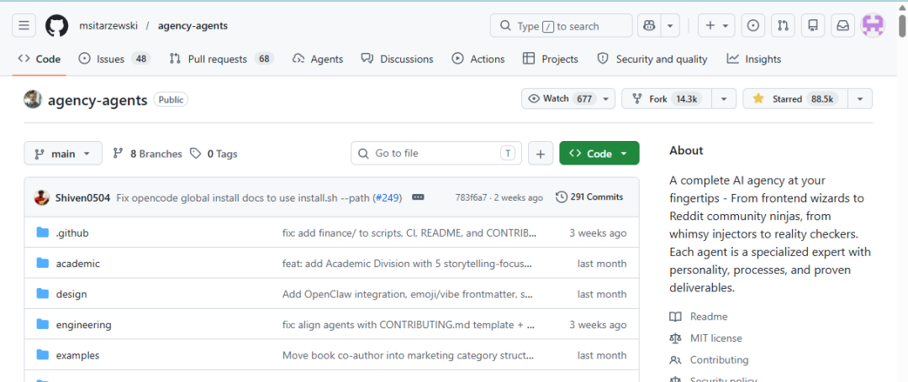

> 📎 来源: [未来技术流](https://mp.weixin.qq.com/s?__biz=MzI3NDA2MzYxOQ==&mid=2464846532&idx=1&sn=3ab737e1987b38f50fd4aeb2b921f26b&chksm=fdf25c70c6dc0211418b0683fa936c4f644eec91c7e9043b3bffdb402db0cdcf6575f0053c11&mpshare=1&scene=1&srcid=0430eA0SGb6mahcO0y45ZQKG&sharer_shareinfo=828fe1f84fb446f54a9f9d5ee9e716a5&sharer_shareinfo_first=828fe1f84fb446f54a9f9d5ee9e716a5) | 时间: 2026-04-30 18:21

---

# agency-agents/agency-agents-zh：你的AI员工快失控了？这两个开源项目，手把手帮你建一支专家团队（链接在末尾）



最近跟一个做电商（不仅是电商，还有开发，日常工作的可以看看）的朋友聊天，他说他们公司用大模型搞了个自动客服Agent，效果还不错，能回答大部分问题了。但遇到退货退款这种需要查订单、改库存、发优惠券的复杂流程，单个Agent就疯了——它开始胡乱调用工具，甚至把同一个优惠券发了三遍。

我笑着说：你这问题，已经不是“一个聪明大脑”能解决的，你需要的是“一个团队”。

是的，这就是今年AI圈被讨论最多的概念之一：**多智能体协作（Multi-Agent）**。而今天我想给你安利的，是GitHub上一对相互映照的开源项目——**agency-agents** 和它的中文版 **agency-agents-zh**。它们不是跑在服务器上的黑盒框架，而是一套你可以直接拿来用的AI专家角色库，像一个专业的“AI猎头”，手把手帮你组建一支各司其职的AI团队。

在深入介绍之前，得先把这个容易被搞混的关系讲清楚。**这是两个独立的库，后者是前者的汉化与增强版：**

- **agency-agents**

  ：由国外开发者 msitarzewski 创建的原版项目，GitHub上揽获了超过6万Star，内含 **165个** 英文AI专家角色，覆盖工程、设计、营销等9大部门。
- **agency-agents-zh**

  ：由 jnMetaCode 维护的中文社区版，不仅完整翻译了上游的全部165个角色，还新增了 **46个** 中国市场原创智能体（覆盖小红书、抖音、微信、B站、飞书、钉钉等本土平台），总共 **211个** 角色，支持16种主流AI编程工具。

---

## 01 为什么你需要关注“多Agent”？

咱们先对齐一个认知：现在的AI，不是不聪明，而是太“独”了。

你给它一个任务，它自己在那儿埋头推理、调用工具、返回结果。这就好比一个超级学霸，你让他一个人包揽市场、销售、财务，他也能干，但一定会出错、效率低，而且一旦某个环节卡住，整个流程就崩了。

多Agent协作的逻辑是什么？是角色扮演+分工协作。

- 有一个Agent专门负责理解用户意图（意图识别专员）
- 有一个Agent专门查数据库（数据搬运工）
- 有一个Agent专门做决策（决策分析师）
- 还有一个Agent负责最终回复，并且能“监督”其他Agent别乱说话（质量控制员）

这样一套下来，就像组建了一个小公司，每个人只干自己最擅长的事，通过一种机制把结果拼起来。准确率、可靠性、可维护性，都上了一个台阶。

---

## 02 这两个项目到底是什么宝贝？

简单说，**agency-agents** 是一个由社区维护的AI角色库，它不是一个需要你部署的服务端程序，而是一套可以直接安装到 Claude Code、Cursor、GitHub Copilot 等AI编程工具里的专家人格定义文件。原版项目精心打造的165个专业智能体，每个都有独特的个性、工作流程和技术交付物。

而 **agency-agents-zh** 不止是翻译。它在完整汉化上游165个角色的基础上，还针对中国市场环境，原创了46个新智能体——比如小红书运营专家、抖音策略师、微信小程序开发者、跨境电商运营专家、政务ToG专员等，总计211个角色，支持 Claude Code、Cursor、Copilot、Gemini CLI、OpenClaw 等16种工具。

我第一次打开的时候，发现它不像有些项目那样一上来就甩一堆论文链接或者抽象架构图，而是直接把所有角色像一张团队花名册一样列出来：

- **工程部**

  ：前端开发者、后端架构师、安全工程师、DevOps自动化师、微信小程序开发者……
- **设计部**

  ：UI设计师、UX研究员、品牌守护者、趣味注入师……
- **营销部**

  ：小红书运营专家、抖音策略师、TikTok策略师、增长黑客……
- **金融部**

  ：财务预测分析师、发票管理专家、金融风控分析师……
- **法务部**

  ：合同审查专家、制度文件撰写专家……

每个角色都是一个 `.md` 文件，里面有详细的**身份设定、核心使命、技术交付物、成功指标**。你复制到对应工具的 agents 目录下，用自然语言就能激活它。

---

## 03 我体验后最想分享的三点

### 1. 一键安装，10秒拥有AI专家团队

中文版的安装体验做得非常友好。以 OpenClaw 为例，只需要两行命令：

```
./scripts/convert.sh --tool openclaw     # 转换为SOUL.md格式./scripts/install.sh --tool openclaw     # 安装到~/.openclaw/
```

安装后重启网关，211个角色就全部就绪了。Claude Code 和 GitHub Copilot 用户甚至不需要转换，直接安装就能用。零门槛，真的有手就行。

### 2. 不只是“Prompt模板”，每个角色都是“活”的专家

很多人会问：这不就是收藏了一堆 Prompt 吗？其实完全不是。普通提示词最多告诉AI“你是一个专家”，而这里的智能体定义了专家**怎么思考、怎么做事、交付什么**。

比如安全工程师会按 OWASP Top 10 逐项审查代码，小红书运营专家会输出完整的种草笔记策略和达人合作方案。每个角色都有一套专属的工作流程和交付标准，这让AI产出的质量有了明确的约束。

### 3. “控制台”让211个角色真正协作起来（进阶玩法）

光有角色库还不够，能让他们协作才是关键。中文版项目配套了一个叫 **Agency Orchestrator** 的工具（通过 npm 安装），让你用一句话就能让多个AI专家自动组队、分工协作。

比如输入“帮我写一篇关于AI Agent的深度分析文章”，它会自动选择叙事学家+心理学家+内容创作者+叙事设计师，然后生成 DAG 工作流，自动检测依赖关系并并行执行。失败步骤支持断点续跑，不用从头来过。这个编排层是整个项目中让我印象最深的部分。

不过需要提醒，Orchestrator 是多Agent编排的进阶玩法，刚上手的话可以先从手动激活单个角色开始，先熟悉每个Agent的能力范围，再尝试让他们配合干活。

---

## 04 两个仓库怎么选？

根据你的场景，我给的务实建议是：

- **如果你主做海外业务**

  ，或者用英文版AI工具较多，直接看上游的 **agency-agents**，GitHub地址：https://github.com/msitarzewski/agency-agents
- **如果你做国内市场**

  ，需要对接小红书、抖音、微信生态，或者团队成员的英文阅读有门槛，直接上 **agency-agents-zh**，GitHub地址：https://github.com/jnMetaCode/agency-agents-zh

两个仓库都是 MIT 协议开源，可以自由使用和修改，包括商用。中文版完整追溯了上游，不存在版权问题。

---

## 05 写在最后

AI领域有个特别有趣的现象：概念跑得比工程快，工程又跑得比普及快。

多Agent协作不是什么新鲜论文，但要真正变成工程实践，走进普通开发者的工具箱，就需要像 **agency-agents** 和 **agency-agents-zh** 这样接地气的项目。它们没有发明什么新轮子，但它们把AI专家团队这件事从一个模糊的概念变成了一个你可以立刻上手的工具。

我一直觉得，未来三年最有价值的AI工程师，不是能训模型的人，而是能把一群“不太靠谱的模型”组织成一个靠谱团队的人。这套角色库，或许就是你从“单兵作战”转向“团队指挥”的第一课。

最后多说一句，开源不易，尤其是用爱发电的中文资料项目。觉得有用，记得去GitHub点个 star，这可能是对作者最好的鼓励。

---

*如果这篇文章对你有启发，欢迎转发给身边还在让AI“单打独斗”的朋友。一起告别Agent的野蛮时代，走进协作文明。关注我，更多分享*
