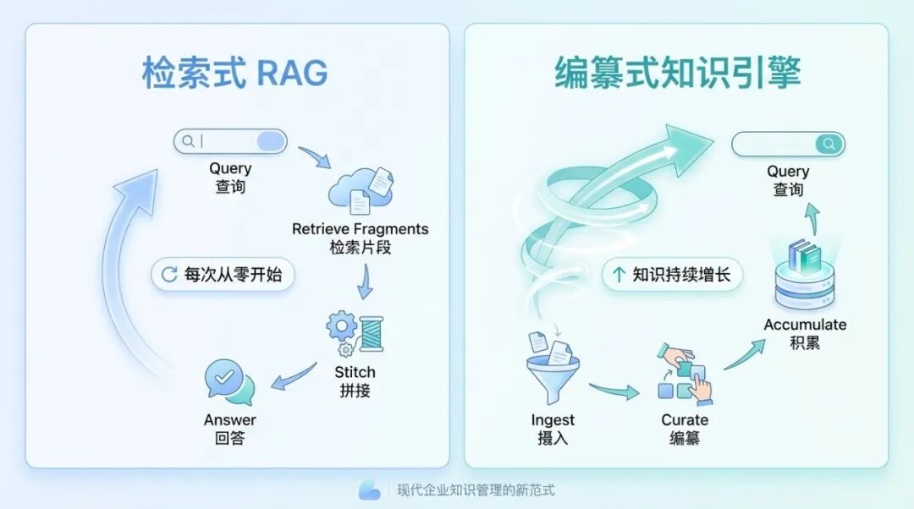
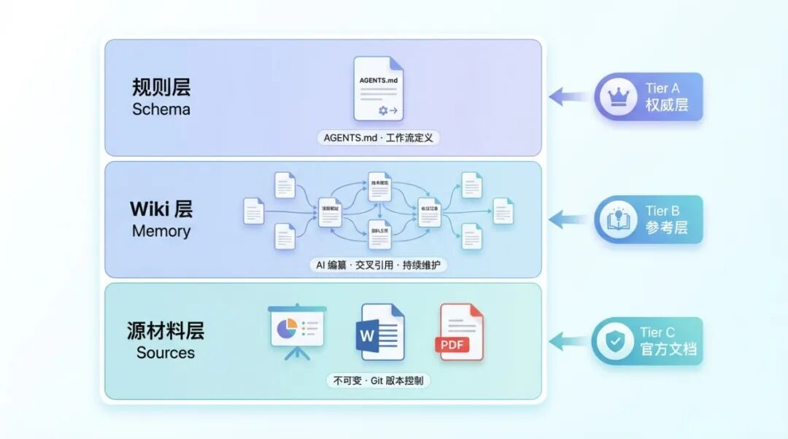
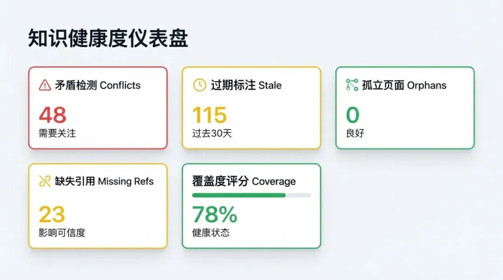
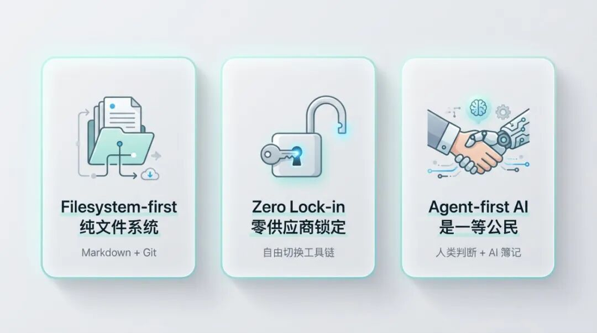

> 📎 来源: [豪哥搞懂了](https://mp.weixin.qq.com/s?__biz=MzAwNDU0MTkxMw==&mid=2247484258&idx=1&sn=f203f48d0977bbf15be8c8baa12a7722&chksm=9a179c224d27230fd5f18815460b93a9e9032ab4ca95fbeffebe9f141b9ab4c2dd6368d62372&mpshare=1&scene=1&srcid=0420uXtsKs3VLA7kcWgg9ew6&sharer_shareinfo=100c49865fa16e0731a1b61dff8e86a7&sharer_shareinfo_first=100c49865fa16e0731a1b61dff8e86a7) | 时间: 2026-04-20 15:41

---

## 相信长期使用大模型的小伙伴都有一个反复出现的情况：

产品文档散落在 SharePoint、本地硬盘、各种即时通讯频道里。方案很标准——RAG。上传文件，切片，向量化，检索拼接，LLM 生成回答。

跑了一段时间后，你就会发现：

> "每次问 AI，它都像个新来的实习生——什么都要从头翻。"

这不是个段子，而是 RAG 在知识管理场景中的结构性问题。

---

## 01｜RAG 为什么不够用

先说清楚：**RAG 在特定场景下非常有效**——知识问答、单文档检索、FAQ 响应，这些都是 RAG 的舒适区。

但在知识管理这个场景下，会反复撞到四面墙：

**跨文档综合做不到**
产品定价在 PPT 里，技术参数在 PDF 里，案例描述在 Word 里。RAG 检索到的是片段，不是经过整合的知识。

**矛盾检测是盲区**
三个月前的报价单和上周的价格表同时存在，RAG 不知道哪个该信——它甚至不知道它们矛盾。

**答案不可溯源**
出了问题回头查，根本说不清 AI 的回答基于哪份文件的哪个版本。

**维护成本随规模飙升**
源文件一变就要重建索引，向量数据库是个黑盒，没人敢碰。

这不是某个产品的问题，是"查询时临时拼接"这条路线在复杂知识场景下的局限。

---

## 02｜转折点：让 AI 编纂，而不只是检索

我后来在 Compounding Wiki 方向的前沿研究中读到一段话：

> "维护知识库最枯燥的部分不是阅读或思考——是簿记。更新交叉引用、保持摘要最新、标注新旧数据的矛盾。人类会放弃 Wiki，因为维护负担的增长快于价值。而 LLM 不会无聊，不会忘记更新引用，一次操作可以触及多个文件。"

这句话让我的思路转了过来：

**不仅是让 AI 帮你搜索，还要让 AI 帮你编纂。** 搜索是一次性的，编纂才能让知识持续积累。

之后在LLM\_wiki和gbrain的启发下，我开始做 **OPC Knowledge-Base Harness Agent**——一个 AI 驱动的知识编纂引擎。

---

## 03｜三层架构：让知识有骨架

我设计了一个三层结构：

### 📁 源材料层（Sources）

PPT、Word、PDF、网页剪藏丢进来，Agent 自动转为 Markdown。**不可变，Git 版本控制。** 这是事实的原始凭据。

### 📘 Wiki 层（Memory）

Agent 自动将源材料编纂为结构化 Wiki 页面——提取实体、修订摘要、标注矛盾、建立交叉引用。

在我们的典型样本中，**一份新资料的摄入可能同时更新 10–20 个 Wiki 页面**。这里是被加工过的、可查询的知识。

### 📜 规则层（Schema）

AGENTS.md + 工作流定义，约束 AI 行为的"宪法"。人机共同演进。

三层之间有明确的**证据分级**：

| 级别 | 来源 | 用途 |
| --- | --- | --- |
| Tier A | Wiki 页面（已编纂） | 首选引用 |
| Tier B | 源材料（原始文件） | 补充细节 |
| Tier C | 外部官方文档（MCP） | 复核参照 |

查询时按优先级分层综合，不是瞎拼。

---

## 04｜不止 Demo 级：工程化细节

很多知识管理工具止步于"能跑通"。我在工程化上花了大量时间，实现了多种结构化页面类型和 5 种智能查询模式：

不同的问法需要不同的检索策略：

- **标准模式** — 通用问答，分层综合多个来源
- **权威模式** — 优先引用已审阅的最新 Wiki 页面，适合对外输出
- **覆盖度模式** — 主动暴露知识空白和未解问题，适合知识盘点
- **变更追踪模式** — 聚焦时间线、生效/落日日期，适合合规和版本管理
- **实体聚焦模式** — 围绕一个概念展开所有关联页面，适合深潜研究

再加上 **图谱遍历**和**别名解析**，查询能力远超关键词匹配。

---

## 05｜可控性：双输出审计 + 知识 Lint

知识治理绕不开两个字：**可控。** 这是投入最多精力的部分。

### 零幻觉设计——双输出审计

我设了一条硬规则：**每一次操作都必须同时产出两样东西——交付物和审计日志。**

举个例子：当 Agent 摄入一份新的产品手册时，它不只是更新 Wiki 页面，还会同时生成一份审计记录，包含：

- 本次修改了哪些 Wiki 页面、修改前后的 diff
- 修改依据的源材料引用
- 触发时间和触发方式（自动摄入 / 手动指令）
- 是否检测到与现有内容的矛盾

这意味着任何一次知识变更都可以溯源、可以回滚、可以复查。

### 知识巡检

借鉴代码世界的 Lint 概念，我给知识库做了自动化健康检查：

- **过期检测** — 标注超过设定时间未更新的声明
- **矛盾标记** — 发现同一实体在不同页面的冲突描述
- **孤立页面** — 没有任何 Wikilink 指向的"信息孤岛"
- **缺失引用** — Wiki 页面的声明缺少源材料支撑
- **覆盖度评分** — 哪些领域知识丰富，哪些还是空白

Lint 机制帮助知识库扩展到数百页时依然保持结构清晰。知识库越大，这个机制的价值越明显——否则规模上去之后就是一座废墟。

---

## 06｜五个我最看好的使用方向

这套系统的价值不只是"更好的文档管理"，而是**重塑知识工作流的方式**。以下是我正在探索的方向：

### 🧠 个人知识系统

Agent 每天自动扫描新增笔记和对话，提取实体，更新图谱。三个月后你拥有的不是一堆收藏夹，而是一个可查询、有结构的私人知识库。

### 🤝 团队情报协同

团队成员把原始材料丢进 inbox，Agent 自动去重、标注矛盾、更新实体页面。新人上手时，Wiki 就是最好的 onboarding 文档。

### 📞 会议自动沉淀

录音转写后，Agent 自动识别实体、更新客户画像和需求清单、记录未解问题。同事接手客户不需要"交接"——Wiki 本身就是活的交接文档。

### 🌍 跨部门知识联动

产品团队更新了 API 落日日期，Agent 自动在相关页面标注"依赖项即将失效"、"需更新对标分析"。信息孤岛变成有生命的知识网络。

### 🔮 深度研究辅助

连续几周阅读一个新领域，Agent 持续编纂概念页、标注不同来源的矛盾观点、演进综合分析。最终你拥有的不是一堆链接，而是一个可查询的私人百科。

---

## 07｜三个设计原则

最后说说架构上的三个坚持：

### 📂 Filesystem-first：纯文件系统

无向量数据库，无外部搜索服务。纯 Markdown + Git，任何编辑器可打开。**你的知识永远属于你，不锁在任何服务里。**

### 🔓 Zero Lock-in：零运行时锁定

不绑定任何特定Runtime。今天用 OpenClaw，明天切别的 Agent 框架，知识库纹丝不动。

**对你意味着什么：**

- 用 **Obsidian** 的用户可以直接打开知识库、使用图谱视图，无需导出
- 用 **Claude Code / Codex / Copilot** 等主流 Agent 的团队可以无缝接入，不改知识库结构
- 用 **OpenClaw/ Hermes Agent** 等开源框架的开发者同样完整支持

你选择什么工具链，知识库都跟着你走。

### 🤖 Agent-first：AI 是一等公民

知识库的结构、元数据、工作流都为 Agent 操作而设计。**人类负责方向和判断，Agent 负责所有繁重的簿记工作。**

---

## 💬 FAQ

**Q：这和 Notion AI / Confluence AI 有什么区别？**

核心区别在于知识的所有权和编纂深度。Notion AI 和 Confluence AI 本质上仍是"在已有文档上叠加检索"，知识锁在平台内。我的方案是纯文件系统 + Git 版本控制，知识结构完全开放，编纂过程有审计日志，且不绑定任何平台。

**Q：知识库规模大了以后，性能和质量怎么保证？**

两个机制：一是知识图谱让查询可以精准遍历关联页面，而非暴力全文搜索；二是 Lint 机制持续检测过期、矛盾、孤立等健康问题，防止知识库退化。在我们的内部使用中，数百页规模下结构依然清晰可控。

**Q：落地需要多大的技术投入？**

知识库本身是 Markdown 文件 + Git 仓库，不需要部署数据库或搜索服务。团队需要的是一个支持 Agent 协议的运行环境（如 OpenClaw），以及花时间定义好适合自身业务的页面模板和规则层。上手门槛不高，但深度使用需要持续打磨规则。

---

## 写在最后

我自己就是这套系统的第一个用户。日常的产品文档、竞品分析、沟通记录，全部跑在 Knowledge-Base Agent 上。

最直观的感受：**知识不再是静态的文件堆，而是一个会随着使用持续生长的系统。**

如果你也在思考知识治理的下一步，欢迎交流。
