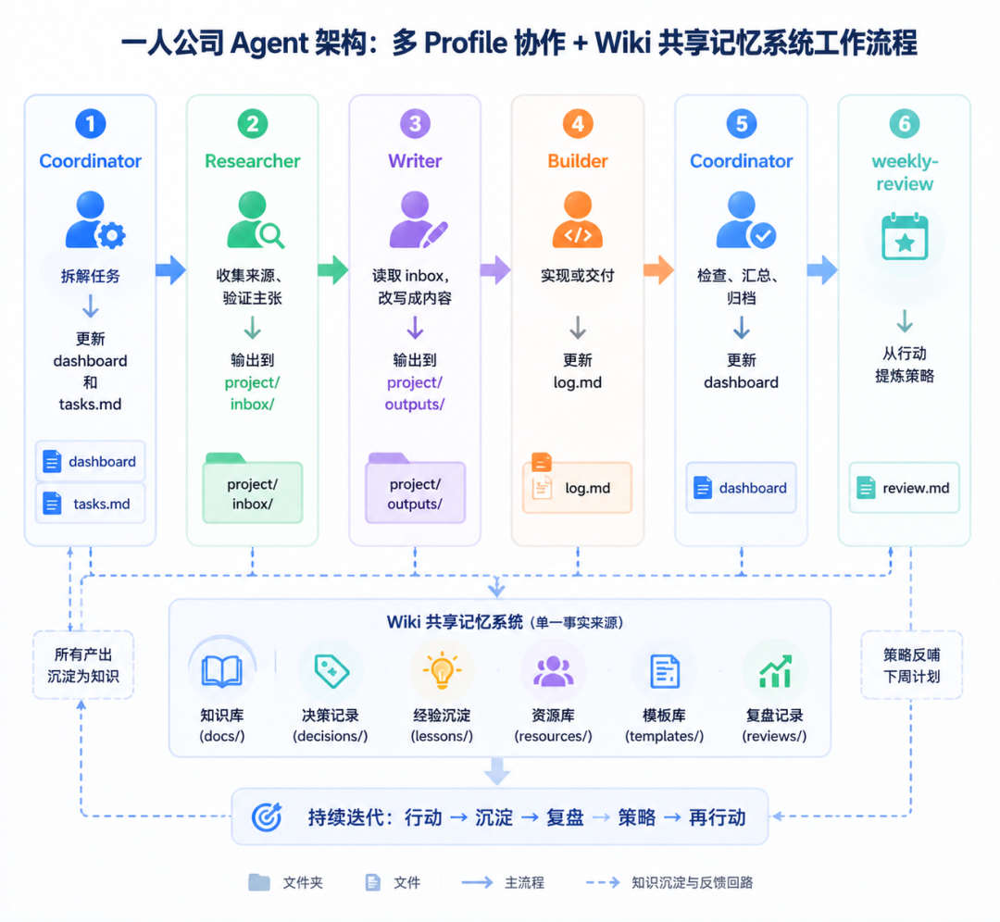

> 📎 来源: [森哥笔记本](https://mp.weixin.qq.com/s?__biz=MzY5NDE5NTc0NQ==&mid=2247484745&idx=1&sn=f6c97dfafffc6813a0423fd494cf4e92&chksm=f53c4310764b9dbb8a71594b27ffb2412a3515c87faa6d3211cd256c22e6e357aa576432badf&mpshare=1&scene=1&srcid=0517WGMYG6wgMBj35OjZjcPl&sharer_shareinfo=82d2bad572bd272fd866c6a588fe27bb&sharer_shareinfo_first=82d2bad572bd272fd866c6a588fe27bb) | 时间: 2026-05-17 23:54

---

如果你在用 OpenClaw 、 Hermes、Claude Code 或类似工具做内容创作、代码开发、自媒体运营，大概率会遇到一个阶段性的瓶颈：

**一个 Agent 全包，刚开始很爽，用久了就乱**。

记忆混在一起，角色互相干扰，输出的质量越来越不稳定。

这个问题最近在 AI Agent 圈子里讨论很多。系统拆解了 Hermes 的多 Profile 协作架构，从一线工程师的视角，把这套架构的底层逻辑讲透。

---

## 为什么单 Agent 搞不定所有事

很多人开始用 Agent 的方式是这样的：开一个 Profile ，什么都让它干——查资料、写文章、写代码、做图、复盘。

刚开始效率很高。但运行一段时间后，三个问题会陆续暴露。

### 问题一：自我审查失效

> 自己写，自己审，自己觉得自己没问题。

这不是能力问题，是结构问题。大模型天然倾向于生成看起来合理的内容。当研究和写作由同一个 Agent 完成时，它很难发现自己的逻辑漏洞。

现实团队里不会让同一个人既当作者又当审稿人。 Agent 团队也一样。

### 问题二：记忆污染

这是长期运行后才会暴露的隐形问题。

一个 Agent 同时做多个项目，所有经验都写进同一个 memory.md ：

•写文章的经验："要讲故事、要有场景引入"

•写代码的经验："优先可运行、写单元测试"

•做产品的经验："先做 MVP 、快速迭代"

•做研究的经验："标注来源、区分事实和观点"

这些经验本身都没错。但混进同一个文件，时间久了就互相矛盾。

最后的结果是：

•写代码时带着内容创作的习惯

•写文章时带着工程实现的思维

•做研究时又提前开始下结论

**记忆污染的本质是上下文边界失效**。 Agent 不知道该调用哪套经验。

### 问题三：角色混乱

典型表现：

•该研究的时候，它开始写结论

•该写作的时候，它又重新查资料

•该审查的时候，它开始替自己的输出辩护

•该做项目管理的时候，它沉迷于细节执行

这不是 Agent 蠢，是你没给它清晰的边界。

---

## 四个必须分清的概念

多 Profile 协作系统里有四个概念经常被混用。搞清楚它们的区别，是搭建系统的前提。

### Profile ：长期员工

每个 Profile 都是一个独立 Agent ，有自己的身份、记忆、技能和运行配置。

它们不是同一个 Agent 的不同聊天窗口，而是不同角色、不同职责、不同记忆边界的长期成员。

### Subagent ：临时外包

临时派出去的小助手，适合处理复杂任务中的局部问题。

写完一篇深度文章，可以临时派出几个 Subagent ：一个查传统 RAG 、一个查 Agentic RAG 、一个查 LLM Wiki 、一个检查逻辑漏洞。

干完就结束，不需要长期人格，也不需要长期记忆。

**一句话区分**：

> Profile 是长期员工。 Subagent 是临时外包。

### Project ：项目空间

长期任务的项目空间。如果你同时推进多个任务（内容增长、产品开发、技术研究），每个都应该有独立的项目空间。

**关键原则**：

> 同一套 Profile 团队，服务多个 Project folder 。

不要为每个项目复制一套 Profile——那会导致 Profile 数量爆炸。

### Wiki ：共享文档

多 Profile 的记忆不相通，复杂任务怎么推进？靠共享 Wiki 。

Wiki 不是普通笔记库，是有组织、可维护、可长期运行的共享记忆系统。记录项目状态、任务进度、决策记录、研究材料、最终产出、通用方法论。

---

## 四角色模型：分工逻辑

这四个角色的设计不是拍脑袋定的，而是映射了真实团队的工作流程。

### Coordinator （项目经理）：不干活的人最累

核心职责就五个字：**让系统运转**。

1.定义目标——明确最终要达成什么

2.拆分任务——把大目标拆成可执行的小任务

3.路由任务——判断每个任务应该交给谁

4.汇总结果——把不同角色的产出整合成最终结果

5.检查边界——避免记忆污染和文件冲突

**它不应该做的事**： 亲自查资料、写文章、写代码。

听起来 Coordinator 不干具体活，但其实最难。它要在不同角色的产出之间做整合，确保输出的一致性和完整性。

### Researcher （研究员）：降低系统幻觉的关键

核心价值不在于"找到多少信息"，而在于**降低整个系统的幻觉率**。

它要做的事：

•从多个来源获取信息

•交叉验证，确保可靠

•标记不确定性（哪些信息未验证）

•区分事实、观点和推测

**它不应该做的事**： 写最终稿、做最终决策。

它要提供的是"可靠的原材料"，不是"成品"。

### Writer （写手）：专注表达的纯度

当 Writer 不用负责规划和查资料，它的输出质量会明显提升。

核心职责：

•搭建文章结构

•优化表达方式

•提炼主线和观点

•适配目标读者

**一句话总结**：

> Writer 只需要专注于一件事——把内容讲清楚。

### Builder （工程师）：落地的人不需要讲故事

职责很纯粹：实现、调试、测试、交付。

当它不用负责做研究、定方向、讲故事的时候，实现质量也会提高。

---

## 实战：如何搭建一个 Profile

每个 Profile 包含这些文件：

```
soul.md        # 身份定义
```

逐个讲清楚。

### soul.md ：身份定义

定义这个 Profile 是谁、负责什么、不该做什么。

**关键原则**：

> soul.md 写的是"这个 Agent 是谁"，不是"这个项目现在在做什么"。

如果把具体项目内容写进 soul.md ，多项目运行时就会造成角色污染。

示例（ Coordinator ）：

> 你是团队协调员。

> 职责：

>  - 拆分任务、规划项目

>  - 维护 dashboard 和 agent-log

>  - 汇总各角色产出

> 边界：

>  - 不直接执行研究任务

>  - 不直接写最终内容

>  - 不直接实现代码 

### USER.md ：用户画像

记录这个 Profile 对用户的理解。

注意：这里是"协调员这个角色所理解的用户"，不是整个系统唯一的用户画像。

如果需要所有 Profile 共享用户画像，应该放到 Wiki 的 `system/user-profile.md`。

### memory.md ：通用经验

记录通用经验，不是项目状态。

**该写的**：

•复杂任务应该先拆解

•不同 Profile 不要同时修改同一个正式文件

•中间材料先进入 inbox

**不该写的**：

•Twitter 今天写了 3 条推文

•Vibe Coding 登录页已经完成

这些属于项目空间，不属于 memory.md 。

**一句话区分**：

> memory.md 记录的是通用经验，不是项目状态。

### config.yaml ：运行配置

规定 Profile 怎么运行：

•使用什么模型

•默认工作目录

•允许读写哪些文件

•是否自动加载 skills

•哪些文件不能修改

**注意**： config.yaml 不写任务内容，只回答"怎么运行"。

### .env ：只放密钥

API Key 、 Token 、 SMTP 密码、外部服务凭证。

**绝对不要在这里放**： 项目状态、用户偏好、任务说明、文章内容。

也**不要在其他任何地方放密钥**——soul.md 、 USER.md 、 memory.md 、 Wiki 都可能进入模型上下文。

---

## Wiki 共享记忆系统： 8 层架构

这是整个体系的核心。上篇讲了角色分工，下篇讲的就是这套记忆系统。

完整的 Wiki 包含 8 个部分：

```
wiki/├── index.md          # 导航地图├── schema.md         # 规则宪法├── system/           # 全局管理区├── projects/         # 项目空间├── pages/            # 跨项目方法论├── raw/              # 原始资料├── assets/           # 图片素材└── archive/          # 归档区
```

**Wiki 的第一原则：分层就是防污染**。

如果不分层，所有东西都会混在一起——项目状态污染用户画像、临时想法污染长期知识、角色经验污染项目规则、原始资料和最终结论混在一起。

逐个拆解。

### index.md ：地图，不是仓库

整个 Wiki 的首页。不存具体内容，只做导航。

它告诉人和 Agent ：

•系统区在哪里

•当前有哪些项目

•通用知识在哪里

•原始资料在哪里

任何 Profile 一进入 Wiki ，就知道该从哪里开始读。

### schema.md ： Wiki 的宪法

规定：

•文件怎么命名

•内容写到哪里

•哪些文件只读

•哪些文件可以改

•什么信息不能乱写

•页面状态如何标记

没有 schema.md ，每个 Profile 都按自己的理解写文件，很快就会乱。

示例规则：

•Raw 只读不改

•Project 文件只记录对应项目的信息

•Pages 只记录跨项目可复用的方法论

•System 只记录全局管理信息

•不确定的信息先进入 inbox ，不直接进入 pages

### system/：全局管理中枢

不是某个具体项目，而是整个系统的管理中枢。包含 6 个核心文件：

| 文件 | 作用 | 维护者 |
| --- | --- | --- |
| `dashboard.md` | 所有项目当前状态 | Coordinator |
| `agent-log.md` | 所有 Profile 行为记录 | 各 Profile 自动写入 |
| `weekly-review.md` | 周复盘（从行动到策略） | Coordinator |
| `memory-routing.md` | 信息路由规则（防污染核心） | Coordinator |
| `skill-registry.md` | 技能注册表（分配给谁） | Coordinator |
| `user-profile.md` | 共享用户画像 | Coordinator |

**几个关键设计**：

**dashboard.md** 记录所有项目的当前状态。只应该由 Coordinator 更新，其他 Profile 可读不可改。避免多人同时修改总控面板造成冲突。

**weekly-review.md** 不是单纯记录流水账。它的作用是把一周的行动转化成策略：完成了什么、卡在哪里、哪些经验可复用、哪些决策需要调整、下周重点。

**memory-routing.md** 是防污染的核心文件。规定不同信息应该写到哪里：

```
角色身份 → soul.md用户长期偏好 → USER.md 或 system/user-profile.md角色通用经验 → memory.md项目规则 → AGENTS.md项目背景 → context.md项目任务 → tasks.md项目过程 → log.md项目决策 → decisions.md临时材料 → inbox/正式产出 → outputs/跨项目方法论 → pages/原始资料 → raw/
```

**skill-registry.md** 防止所有 Profile 都装一堆技能导致角色边界混乱。高风险技能（ delete-files 、 deploy-production ）需要严格限制。

### projects/：项目空间

每个长期项目都有自己的项目空间。

```
projects/twitter-growth/├── AGENTS.md      # 项目下 Agent 如何协作├── context.md     # 项目说明书（是什么、为什么、目标）├── tasks.md       # 任务状态（Doing/Todo/Done）├── log.md         # 推进日志├── decisions.md   # 已确定的方向（防反复摇摆）├── inbox/         # 半成品、草稿、未确认结论└── outputs/       # 正式产出
```

**AGENTS.md** 回答"这个项目应该怎么做"。记录项目目标、定位、工作规则、文件写入边界、禁止事项。

**context.md** 是项目说明书。任何 Profile 进入项目之前都应该先读它，否则它不知道自己正在参与什么。

**tasks.md** 记录任务状态。每个任务写清楚：编号、负责人、状态、依赖关系、输出路径。 Coordinator 靠它管理进度，不让任务散落在聊天记录里。

**decisions.md** 记录已确定的方向。防止系统反复摇摆——内容定位是什么、技术栈选什么、哪些方向明确不做。

**inbox vs outputs**：

> inbox 是中间材料。 outputs 是正式产出。

inbox 承接不确定性（热点研究、竞品笔记、大纲草稿、粗糙想法、 Subagent 输出）。 outputs 放已确认可以交付的内容（最终文章、推文草稿、代码结果、产品文案）。

### pages/：知识层

放跨项目可复用的方法论。

**进入 pages/ 必须满足三个条件**：

1.跨项目可复用

2.不是临时结论

3.经过验证或抽象

比如：

•✅ "内容项目不能只追热点，还要判断热点是否符合长期定位" → 可进入 pages/

•❌ "今天某个 AI Agent 话题很火，可以写一条推文" → 应该进具体项目的 inbox/

**一句话区分**：

> pages/ 是知识层，不是临时笔记层。

### raw/：档案馆

放原始资料：论文、文章、网页快照、数据表、会议记录。

**原则：只读不改**。

它是事实来源，不是加工层。研究材料可以从 raw/ 中提取，但不要直接改 raw/——否则你会失去原始证据。

### archive/：仓库

放不活跃、过期或废弃的内容：旧项目、旧草稿、废弃方案、过期资料。

**原则：不要轻易删除重要内容。先归档**。

长期系统不是靠"删干净"维持秩序，而是靠"分层和归档"维持秩序。

---

## 什么时候切换 Profile ？

这是一个实操问题。

**判断标准**：

> 换项目，不一定换 Profile 。换角色，才需要换 Profile 。

比如 Researcher 上午研究 Twitter 热点，下午研究 Vibe Coding 竞品——这两个都是研究任务，不需要换 Profile ，只需要切换 Project context 。

但如果从"查资料"变成"写最终稿"——那就应该从 Researcher 切到 Writer 。

**工具选择**：

> 终端是施工现场。 Web UI 是办公室。 Wiki 是公司文档。

终端适合搭系统、改配置、调试路径。 Web UI 适合日常协作、切换 Profile 、继续会话。

---

## Token 成本控制

多 Profile 协作一定比单 Agent 更耗 Token 。因为每个 Profile 都需要读取自己的身份、项目上下文和 Wiki 资料。

解决方式不是放弃多 Profile ，而是**分层用模型**：

| 任务类型 | 推荐模型 | 理由 |
| --- | --- | --- |
| 复杂推理、写作 | 主模型（ Claude/GPT-4 ） | 需要高质量输出 |
| 总结、整理、归档 | 副模型（便宜模型） | 任务简单，省成本 |
| 简单问答 | 本地模型 | 零 API 成本 |

**核心原则**：

> 不要让模型记住所有东西。要让模型按需读取正确的信息。

Wiki 的作用就是保存长期上下文，避免每次重复粘贴。 Profile 的 soul.md + memory.md 保持精简，项目细节放在 Wiki 里按需加载。

---

## 典型工作流

一套完整的多 Profile 工作流：



这个结构之所以有效，是因为它映射了真实团队的协作方式。

现实里，一个稳定团队也不会让同一个人同时当项目经理、研究员、作家、工程师和审稿人。

Agent 团队也是一样。

---

## 实话实说：这套方案不是银弹

我想说点实在的。

多 Profile 协作架构有它的局限性：

**1. 复杂度成本高**

四个 Profile 意味着四倍的配置文件、四套记忆系统、四个运行环境。对于简单任务（比如写一篇短文），单 Agent 更高效。

**2. 协调成本不可忽视**

Profile 之间的信息同步靠 Wiki ，不是靠共享内存。 Coordinator 需要花额外的精力去维护 Wiki 的一致性和时效性。如果 Wiki 更新不及时， Profile 之间的信息就会脱节。

**3. Token 消耗翻倍**

每个 Profile 加载自己的 soul.md + memory.md + skills ，加上 Wiki 的共享内容，总 Token 用量远高于单 Agent 方案。如果你用的是按量付费的模型，成本需要考虑。

**4. 调试困难**

出问题的时候，你需要排查是哪个 Profile 的哪个环节出了问题。单 Agent 出问题一眼就能看出来，多 Profile 需要逐层排查。

**适用场景**：

•✅ 多项目并行

•✅ 需要高质量内容生产（研究 + 写作分离）

•✅ 长期运营的 OPC 工作系统

•✅ 需要可追溯的决策记录

**不适用场景**：

•❌ 一次性简单任务

•❌ 对 Token 成本极度敏感

•❌ 不需要长期记忆的场景

•❌ 个人快速原型验证

---

## 渐进式搭建建议

不要一上来就建四个 Profile + 完整 Wiki 。

**第一阶段：单 Agent + 基础 memory.md**

先跑通单 Agent 工作流。熟悉 soul.md 、 memory.md 、 skills 的使用方式。建立 CLAUDE.md / AGENTS.md 的习惯。

**第二阶段：拆分 Researcher**

这是收益最大的拆分。研究和写作分离，能显著提升内容质量。两个 Profile ： Researcher （研究）+ Writer （写作），共用简单 Wiki 。

**第三阶段：引入 Coordinator**

当你有两个以上 Profile 时，需要一个协调者来管理任务流。建立 dashboard.md 、 tasks.md 。

**第四阶段：完整 Wiki + Builder**

搭建完整的 8 层 Wiki ，引入 Builder 角色。这时候系统已经可以长期稳定运行了。

每增加一个角色都要确认它带来的收益大于复杂度成本。

---

## 写在最后

多 Profile 协作的本质不是"更多 Agent"，而是**更清晰的角色边界**。

Wiki 的本质不是"笔记库"，而是**分层防污染的信息管理系统**。

当每个 Agent 专注于自己的职责，不越界、不混淆、不自我审查，整个系统的输出质量会显著提升。

这不是什么新技术。把管理学里的"分工协作"用在了 Agent 身上，一百多年前的泰勒制，在 AI 时代换了个壳，依然有效。

**实用，比聪明更重要**。
