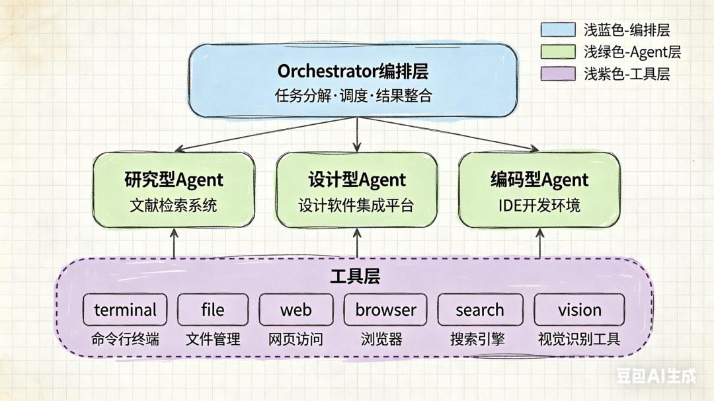
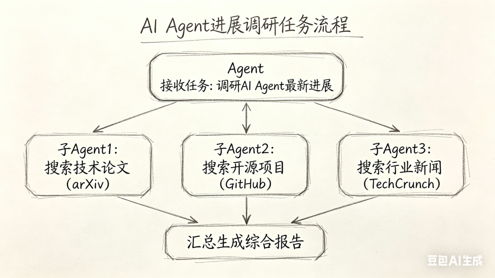
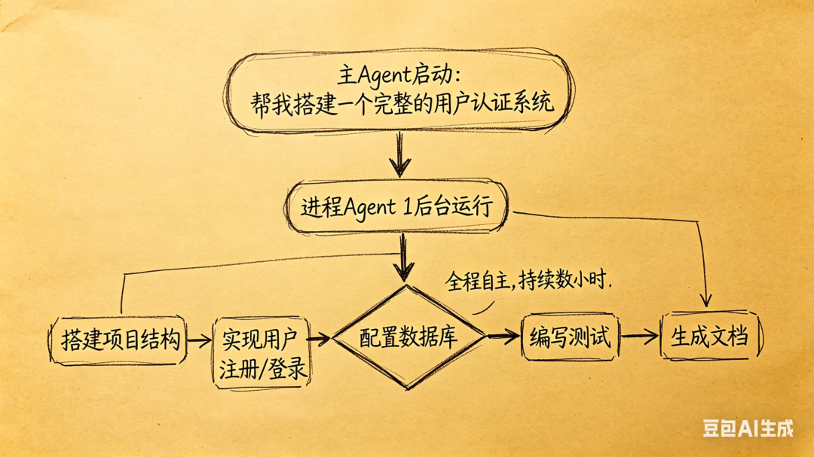
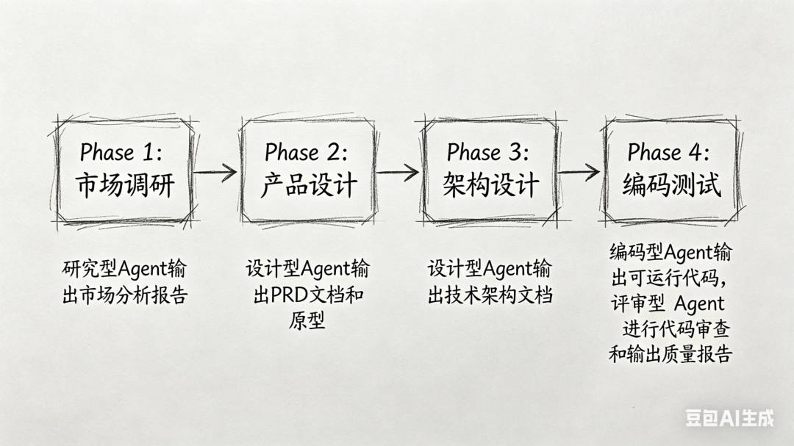
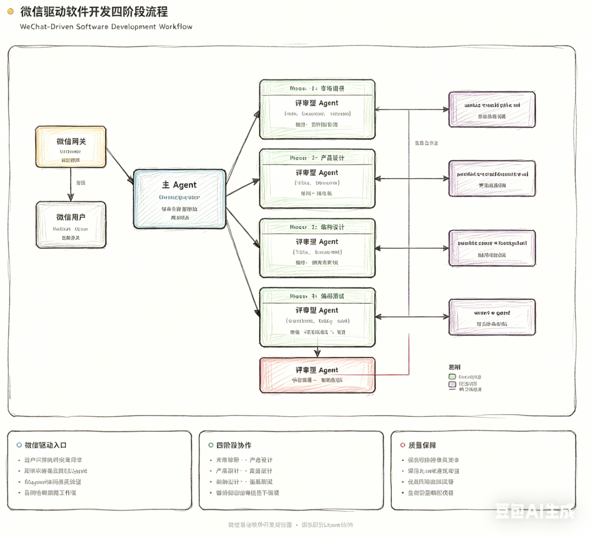

> 📎 来源: [源知AI](https://mp.weixin.qq.com/s?__biz=MzY5NTI4NjI3NQ==&mid=2247483697&idx=1&sn=11d22f91627b2fa2930b243852af55e4&chksm=f52b01dba9d15f4bea4443f872e7a99d1439939a79a3221f65fb77c82bab12439e2740bc616d&mpshare=1&scene=1&srcid=050119QBu2ntAYtCZP9cw2Em&sharer_shareinfo=811230faec120f550cae4d7854e6d475&sharer_shareinfo_first=811230faec120f550cae4d7854e6d475) | 时间: 2026-05-01 21:08

---

> 一个AI Agent能帮你写代码,那多个Agent协作能做什么?答案是:完成一个完整的软件系统。

## 引言:AI Agent的"进化论"

如果你用过ChatGPT或Claude,你可能已经体验过AI Agent的能力——它能回答问题、写代码、分析数据。但你是否想过:当多个AI Agent协同工作时,会发生什么?

就像人类从个体劳动者发展到团队协作,再进化到复杂的企业组织,AI Agent也在经历类似的演进。多Agent系统(Multi-Agent System)正是这场"进化"的核心。

本文将带你深入了解多Agent系统的层级架构、Agent类型分类、应用场景,以及如何通过微信驱动一个完整的软件开发流程。

---

## 一、多Agent的层级架构:从执行者到指挥官

多Agent系统并非简单的"多个Agent堆砌",而是一个有层级、有分工的组织结构。理解这个层级,是掌握多Agent协作的关键。

### 1.1 三层架构模型

一个典型的多Agent系统可以分为三个层级:



**顶层: Orchestrator(编排者)**

- 角色: 团队的"项目经理"或"架构师"
- 职责: 接收用户需求,分解任务,分配给合适的Agent,整合结果
- 能力: 任务规划、流程控制、质量把控、异常处理
- 特点: 具备更高的决策权限,可以创建和调度子Agent

**中层: Specialist Agents(专家型Agent)**

- 角色: 各领域的"专家"或"执行者"
- 类型: 研究员、设计师、编码师、评审员等
- 职责: 在自己的专业领域内完成任务
- 特点: 具备专业工具集,不参与决策调度

**底层: Tools(工具层)**

- 角色: Agent的"手脚"和"传感器"
- 类型: 终端命令、文件操作、网络请求、浏览器等
- 职责: 执行具体的操作
- 特点: 无智能,纯粹的功能执行

### 1.2 层级深度的限制

你可能好奇:能不能让Orchestrator再创建Orchestrator,形成多层嵌套?

答案是:**可以,但有限制**。

这涉及到一个重要概念——**最大生成深度(max\_spawn\_depth)**。在Hermes Agent框架中:

- **默认深度: 2层**

  → 顶层Orchestrator → 中层Specialist Agent → 底层Tools
- **深度限制原因:**

- 防止无限递归和资源耗尽
- 保持任务的可控性和可追溯性
- 避免过度复杂的协作链路

这就像企业架构中的"管理幅度"——一个经理可以管理多个员工,但如果经理上面还有经理,管理链条过长,效率反而下降。

---

## 二、Agent类型:各司其职的"专业团队"

在软件开发场景中,典型的Agent可以分为四类,每类Agent配备不同的"工具箱":

### 2.1 研究型Agent(Researcher)

**核心能力**: 信息搜集、市场分析、技术调研

**工具箱**:

- `web`

  : 网络搜索和内容提取
- `browser`

  : 浏览器自动化
- `search`

  : 关键词检索

**典型任务**:

- 分析竞争对手产品功能
- 查找技术文档和最佳实践
- 评估技术方案可行性

**输出**: 市场分析报告、竞品对比表、技术可行性评估

### 2.2 设计型Agent(Designer)

**核心能力**: 产品设计、架构规划、API定义

**工具箱**:

- `file`

  : 文档编写
- `browser`

  : 参考案例调研
- `terminal`

  : 技术验证

**典型任务**:

- 编写产品需求文档(PRD)
- 设计系统架构图
- 定义API接口规范

**输出**: PRD文档、架构设计文档、API规范、数据库Schema

### 2.3 编码型Agent(Coder)

**核心能力**: 代码实现、测试编写、调试优化

**工具箱**:

- `terminal`

  : 命令执行、环境配置
- `file`

  : 代码文件读写
- `web`

  : 查阅文档

**典型任务**:

- 搭建开发环境
- 编写功能代码
- 编写和运行测试

**输出**: 可运行的代码、测试用例、技术文档

### 2.4 评审型Agent(Reviewer)

**核心能力**: 代码审查、质量把关、安全检测

**工具箱**:

- `terminal`

  : 运行测试、代码扫描
- `file`

  : 查看代码、编写报告

**典型任务**:

- 代码风格检查
- 安全漏洞扫描
- 性能测试验证

**输出**: 审查报告、问题清单、修复建议

---

## 三、多Agent的应用场景:从简单到复杂

多Agent系统并非"大材小用",而是在不同场景下有不同的配置方式:

### 3.1 场景一:快速并行子任务(delegate\_task模式)

**适用情况**: 

- 任务耗时在几分钟内
- 需要并行处理多个独立子任务
- 在同一进程内协作

**示例**: 同时进行三项研究



**特点**:

- 隔离性: 子Agent有独立的会话上下文
- 共享性: 共享父Agent的进程环境
- 工具限制: 只能使用父Agent工具集的子集
- 非交互: 子Agent无法向用户提问

### 3.2 场景二:长期自主任务(Spawning进程模式)

**适用情况**:

- 任务耗时数小时甚至数天
- 需要完全独立的环境和工具
- 长时间自主运行

**示例**: 独立Agent完成复杂项目



**特点**:

- 完全独立: 独立的进程、会话、环境
- 工具完备: 拥有全部工具访问权限
- 可交互: 支持PTY模式,可接受用户输入
- 持久运行: 不受父进程生命周期限制

### 3.3 场景三:完整软件开发流程

**适用情况**: 开发一个完整的软件功能或系统

**四阶段工作流**:



**关键特性**:

- **阶段依赖**

  : 后一阶段依赖前一阶段的输出
- **质量关卡**

  : 每个阶段有明确的验收标准
- **角色切换**

  : 不同阶段调用不同类型的Agent
- **结果传递**

  : 前一阶段结果作为后一阶段的上下文

---

## 四、实战:微信驱动的软件开发全流程

理论讲完了,让我们看一个完整的实战案例:**如何通过微信指挥一个AI Agent团队,完成软件开发任务**。

### 4.1 整体架构



### 4.2 配置步骤

**步骤一:配置Coder Profile**

Profile是Agent的"角色配置文件",定义了Agent使用的模型、工具、技能等。

```
# ~/.hermes/profiles/coder/config.yaml
```

**步骤二:配置微信网关**

Gateway是连接微信和AI Agent的"桥梁":

```
# 启动配置向导
```

**步骤三:加载工作流技能**

Skills是预定义的工作流程,让Agent"学会"如何协调多Agent:

```
# 安装软件开发工作流技能
```

### 4.3 执行流程示例

**用户在微信发送消息**:

```
"帮我开发一个用户认证系统"
```

**网关接收并转发**:

```
微信消息 → Gateway解析 → 主Agent接收
```

**主Agent判断并启动四阶段流程**:

**Phase 1: 市场调研(耗时约10分钟)**

```
主Agent: "这是一个新功能开发,需要先进行市场调研"
```

**Phase 2: 产品设计(耗时约15分钟)**

```
主Agent: "调研完成,现在进入产品设计阶段"
```

**Phase 3: 架构设计(耗时约20分钟)**

```
主Agent: "PRD已定义,开始架构设计"
```

**Phase 4: 编码测试(耗时约60分钟)**

```
主Agent: "架构设计完成,开始编码实现"
```

**主Agent汇总结果并回复**:

```
微信用户收到消息:
```

### 4.4 关键设计原则

**1. 隔离性原则**

- 每个子Agent有独立的会话上下文
- 子Agent之间互不干扰
- 失败的Agent不影响其他Agent

**2. 传递性原则**

- 前一阶段的输出自动传递给后一阶段
- 通过`context`参数实现信息流转
- 避免重复工作,保持上下文连贯

**3. 可控性原则**

- 主Agent保留决策权
- 关键节点需要用户确认
- 异常情况及时中断并报告

**4. 工具约束原则**

- 不同Agent只能访问特定工具集
- 防止越权操作(如编码Agent不应删除文档)
- 降低误操作风险

---

## 五、深入理解:为什么需要多Agent?

你可能还有疑问:一个强大的AI模型,难道不能独自完成所有工作吗?

答案在于:**能力边界**和**专注度**。

### 5.1 能力边界的突破

单个AI模型的能力是有限的:

- **上下文窗口限制**

  : 无法同时处理海量信息
- **注意力分散**

  : 多任务切换导致效率下降
- **专业性不足**

  : 通用模型难以在所有领域都达到专家水平

多Agent协作突破了这些边界:

- **并行处理**

  : 多个Agent同时工作,总耗时≈最长子任务
- **专业分工**

  : 每个Agent专注于自己的领域
- **上下文隔离**

  : 每个子任务有独立的上下文空间

### 5.2 专注度的提升

心理学研究表明:人类在多任务切换时,效率会下降40%以上。AI也有类似问题。

**单Agent模式**:

```
一个Agent试图完成所有工作:
```

**多Agent模式**:

```
多个Agent并行工作:
```

### 5.3 现实世界的类比

多Agent协作就像现代企业的运作方式:

- **CEO(Orchestrator)**

  : 制定战略,分解目标,协调资源
- **市场部(Researcher)**

  : 市场调研,竞品分析
- **产品部(Designer)**

  : 产品设计,需求定义
- **研发部(Coder)**

  : 技术实现,质量保障
- **QA部门(Reviewer)**

  : 质量把关,风险控制

没有人要求CEO既能做市场调研,又能写代码。同样,我们也不应该期望一个AI Agent完成所有工作。

---

## 六、最佳实践与注意事项

### 6.1 何时使用多Agent?

**推荐使用**: ✅ 任务可分解为独立子任务
✅ 子任务需要不同的专业技能
✅ 任务耗时较长(>10分钟)
✅ 需要并行处理提升效率
✅ 子任务有明确的质量标准  

**不推荐使用**: ❌ 简单的一次性查询
❌ 任务无法清晰分解
❌ 子任务间耦合度极高
❌ 引入多Agent反而增加复杂度  

### 6.2 常见陷阱

**陷阱1:过度拆分**

- 错误: 把"写一个函数"拆成多个Agent协作
- 后果: 通信开销 > 收益
- 正确: 简单任务由单个Agent完成

**陷阱2:忽略依赖关系**

- 错误: 让编码Agent在架构设计完成前开始工作
- 后果: 返工,效率低下
- 正确: 明确阶段依赖,按顺序执行

**陷阱3:缺乏结果验证**

- 错误: 盲目信任子Agent的输出
- 后果: 低质量结果累积放大
- 正确: 每个阶段设置质量关卡

### 6.3 性能优化建议

**1. 合理设置超时**

- 研究任务: 5-10分钟
- 设计任务: 10-20分钟
- 编码任务: 30-60分钟
- 长期任务: 使用后台模式(background=true)

**2. 善用工具约束**

- 通过`toolsets`参数限制子Agent的工具范围
- 减少不必要的工具加载,降低Token消耗

**3. 结果压缩与传递**

- 大型文档先压缩摘要再传递
- 避免全量传递导致上下文溢出

---

## 七、展望:多Agent的未来

多Agent系统正在快速演进,未来的方向包括:

### 7.1 自主性增强

- Agent能够自主决定是否需要委托子任务
- 动态调整协作策略
- 自我优化工作流程

### 7.2 协作深度提升

- Agent之间的双向通信
- 实时协调与冲突解决
- 知识共享与经验积累

### 7.3 人机协同进化

- 人类从"指令者"转变为"监督者"
- Agent主动寻求人类反馈
- 形成人机混合团队

---

## 结语

多Agent系统不是简单的"AI叠加",而是从个体智能向群体智能的跃迁。

就像人类社会的进步依赖于分工协作,AI Agent的未来也在于组织化和协作化。理解多Agent的层级架构、角色分工和协作机制,是掌握AI Agent技术的关键。

当你下次对AI说"帮我开发一个系统"时,不妨想象:在屏幕背后,一个由研究员、设计师、编码师、评审员组成的"虚拟团队"正在为你工作。而这,正是多Agent系统的魅力所在。
