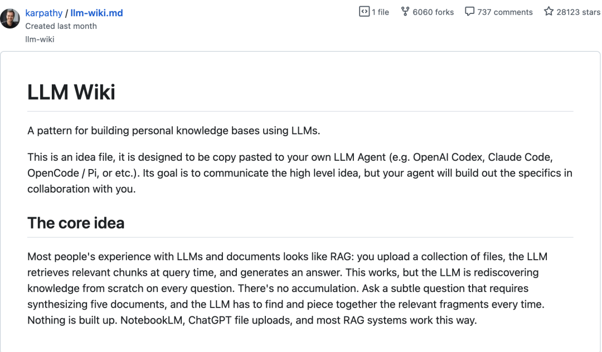
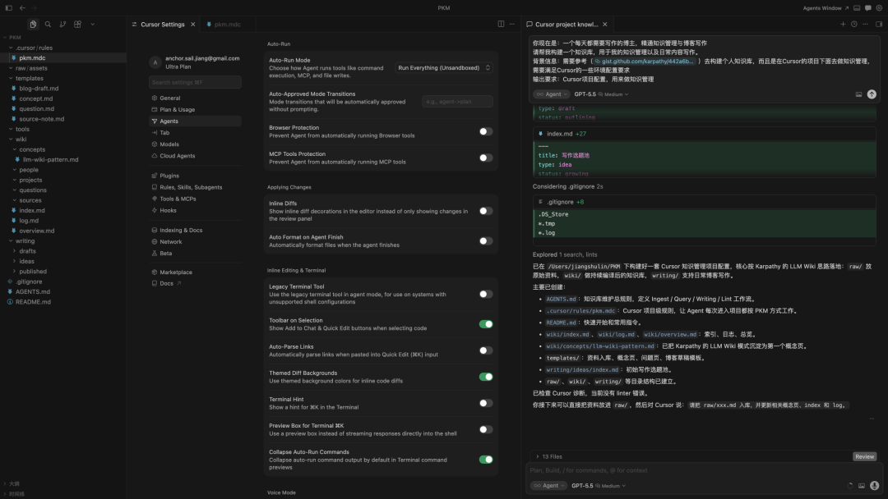

> 📎 来源: [锚与帆](https://mp.weixin.qq.com/s?__biz=MzI4ODM3MTk4Mw==&mid=2247484384&idx=1&sn=5eb446cf285084b08dbe5bb2dd1d2f1b&chksm=edd02806405613449526310f939801cbc3ccf3d1d6e4dc968a87c03fac9d170d6e789890aa11&mpshare=1&scene=1&srcid=0510Oh4mcRXHYi6iZUiO3Zm3&sharer_shareinfo=301e71de9cbd7ce5f09f4d3f7ce12e7a&sharer_shareinfo_first=301e71de9cbd7ce5f09f4d3f7ce12e7a) | 时间: 2026-05-11 00:00

---

Karpathy 的 llm-wiki 短短一个月拿到 28k stars，我觉得它真正戳中的不是“又一个知识库工具”，而是一个更适合 AI 时代的知识管理方式：

不要每次写文章时才临时翻资料、问 AI，而是让 AI Agent 持续帮你把资料整理成一个可检索、可链接、可复用的 Markdown Wiki。

换句话说，你不是在搭一个收藏夹，而是在搭一个会长大的写作系统。

这件事其实不难。你可以把任务交给本地 AI Agent，比如 Cursor、Claude Code、Codex 或 Trae。根据自己的需求选择工具，然后把你的角色、目标和要求写清楚即可

我给 Cursor 的指令大概是这样：`
`

`你现在是一个每天都需要写作的博主，精通知识管理与博客写作。 请参考 Karpathy 的 llm-wiki 思路，帮我在 Cursor 项目里搭建一个个人知识库。 要求能管理资料、沉淀知识，并支持日常文章创作。 `

我这次用的是 Cursor 集成的 GPT-5.5，整个过程消耗了 57.9 万 Token，其中 Input Token 大约 43 万。主要是因为它需要读取 llm-wiki 的相关内容，理解后再结合我的写作需求生成项目结构和 Agent 规则。

最后我采用的是三层结构：

第一层是 `raw/`，放原始资料，比如网页剪藏、书摘、播客笔记、截图和旧文章。这里尽量保持原样，不随便改动。

第二层是 `wiki/`，放 AI 编译后的知识。比如资料摘要、概念页、人物页、长期问题、索引和变更日志。以后真正检索和复用的，主要是这一层。

第三层是 `writing/`，放写作生产资料，包括选题、草稿和已发布文章。这样原始资料、结构化知识和文章生产就不会混在一起。

知识库搭好后，第一步可以先把自己过去的内容搬进去。

比如把以前写过的文章放到 `writing/published/`，让 AI 分析你的标题习惯、段落节奏、常用表达、金句风格和高频观点，再沉淀成一个写作 skill。以后写新文章时，它不只是帮你润色，还能尽量贴近你自己的表达方式，减少“AI 味”。

更实用的是，当你想写一个新选题时，可以先问一句：“我以前有没有写过类似观点？”Agent 会检索旧文章和 wiki，帮你避免重复，也能把过去零散讲过的内容，升级成一篇更系统的新文章。

处理完已有内容后，新的输入也可以持续进入系统。

比如我读到一篇关于 AI 写作的文章，可以先把原文放进 `raw/`，再让 Agent 执行入库：生成资料摘要，抽取“LLM Wiki”“个人写作系统”“风格蒸馏”等概念，更新索引，并记录这次整理。以后再写相关主题时，就不需要重新翻原文，只要从 wiki 里调取已经整理好的观点、例子和来源。

这个系统还很适合和 Obsidian 搭配。

手机上用 Obsidian 随时记录灵感碎片，电脑上用 Cursor 维护 wiki。同步之后，可以让 Agent 把碎片整理成选题、提纲或草稿。写完的文章再反哺到 wiki，知识库就会随着每一次阅读和写作变得更厚。

所以，LLM Wiki 最有价值的地方，不是帮你“存东西”，而是让旧知识不断参与新创作。

人负责选择资料、判断方向和提出问题；AI 负责摘要、链接、更新索引、发现矛盾和辅助成文。长期坚持下来，它会慢慢变成一个只属于你自己的写作大脑。
