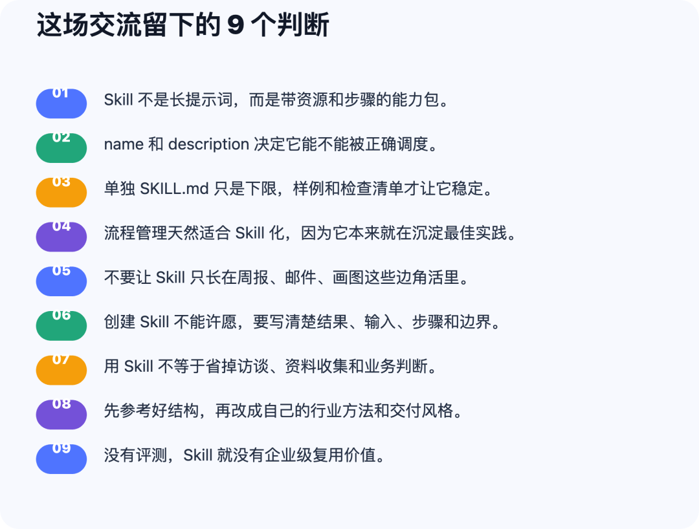
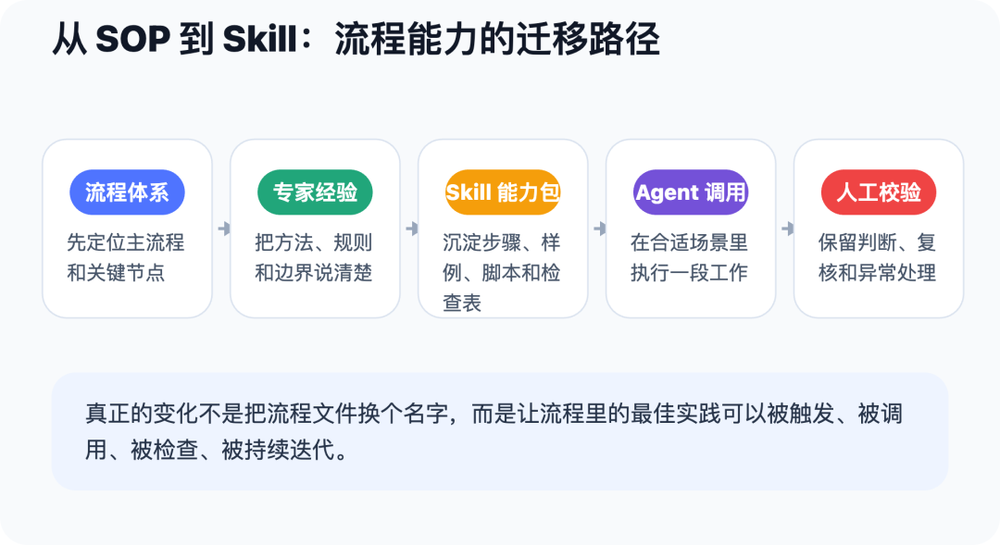
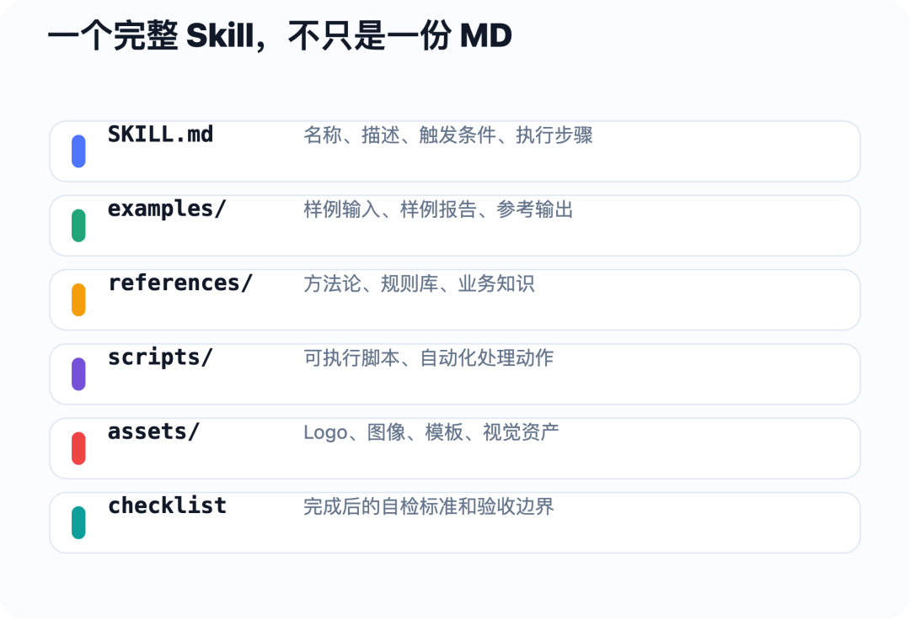
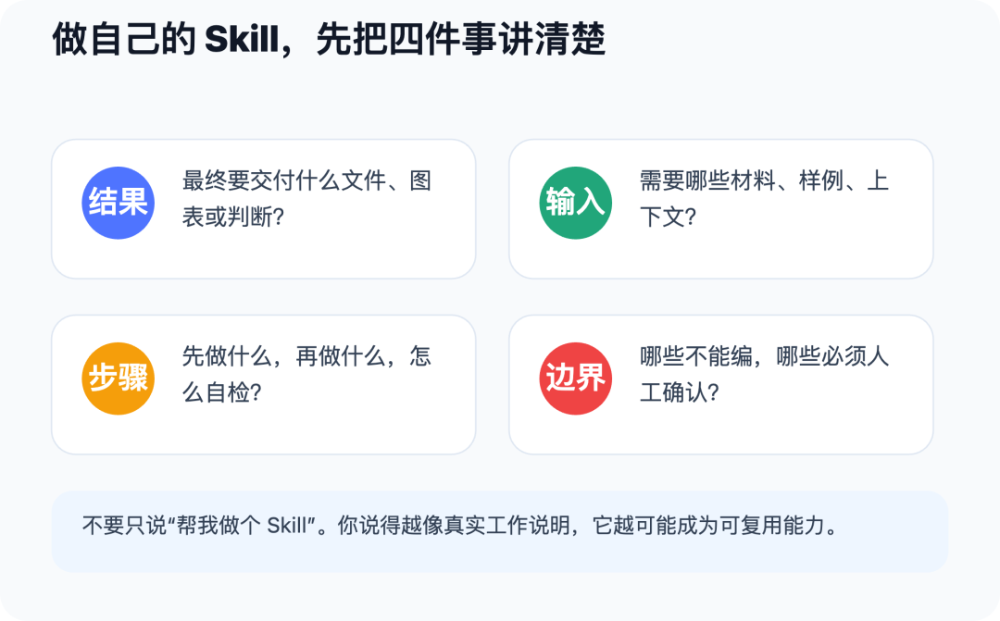
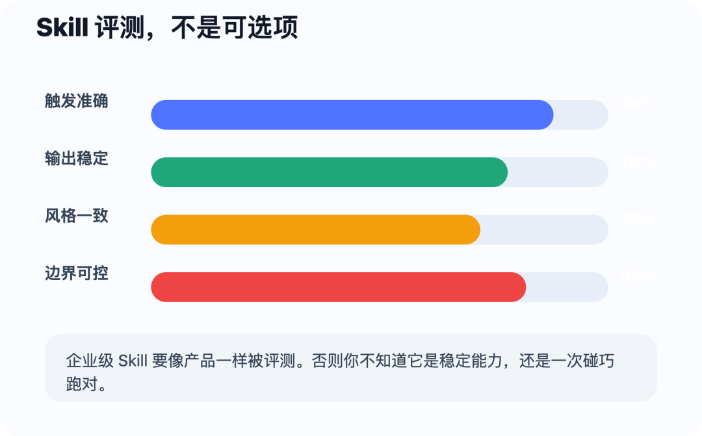
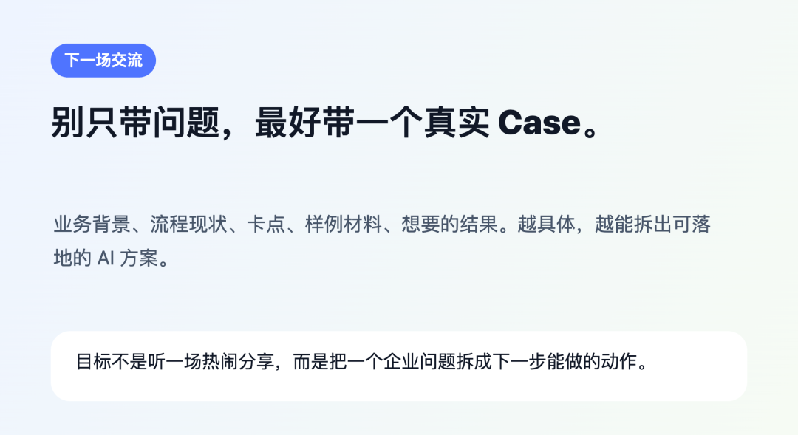

> 📎 来源: [詹生Talk](https://mp.weixin.qq.com/s?__biz=MzkxMTczNzkyMA==&mid=2247486445&idx=1&sn=086d118e104b5ebf0708d6e7d69e460f&chksm=c0178f4083865e6289c153ea05ff0ff4d3bf7596f9ecacd25d025e24ab71d889b5bdae410ee6&mpshare=1&scene=1&srcid=0522Bz2bQAFpCHXY3tRCr6Ng&sharer_shareinfo=ffc75d1b1ed3fc6e09b0ff84142fed3b&sharer_shareinfo_first=ffc75d1b1ed3fc6e09b0ff84142fed3b) | 时间: 2026-05-22 22:28

---

今天这场线上交流，表面上讲的是 Skill。

真正聊到后面，其实是在拆一个更硬的问题：

**企业怎么把专家经验，从“人脑里的手艺”，变成 AI 可以调用、可以检查、可以复用的能力？**

很多企业现在都在建 Agent。

有的叫个人助理，有的叫知识助手，有的叫流程助手，有的叫经营分析助手。

名字不少，页面也越来越漂亮。

但一到真实工作现场，就会出现几个老问题：

同一段提示词反复复制。

同一个报告风格每次都跑偏。

同一个流程诊断方法，每个顾问都要重新讲一遍。

同一个审批材料检查点，换个模型就忘掉一半。

这时候你会发现，企业 AI 的关键不在于“再多建几个 Agent”。

关键在于：**你有没有把主流程里的工作方法，沉淀成可运行的 Skill。**

下面这篇，是这场交流的公开整理版。

我删掉了试麦、串音、群内互动、具体人名、账号信息、工具费用和无关闲聊，也把部分敏感公司信息做了匿名化处理。留下来的，是这场沙龙里真正值得拿去复盘的结构。

## Summary

**1. Skill 不是一段提示词。**官方文档里的 Skill，本质是一个带说明、步骤、资源和可选脚本的文件夹。它让 AI 在合适场景下加载一段专门能力，而不是每次从零听你解释。

**2. name 和 description 是调度入口。**智能体通常先看 Skill 的名称和描述，判断当前任务该不该调用它。描述写得含糊，调用就会漂。

**3. 单独一个 SKILL.md 只是下限。**企业级 Skill 还需要 examples、references、scripts、assets、checklist。否则它很容易变成“更长的提示词”。

**4. 流程管理天然适合 Skill 化。**流程管理本来就在做最佳实践提取、SOP 编写、流程诊断、流程文件审查。Skill 只是把这些经验从“给人读”推进到“给 AI 调用”。

**5. 企业最容易犯的错，是在边角活里堆 Skill。**周报、邮件、画图都能做，但真正值钱的是主流程、关键节点、专家判断和高频交付。

**6. 做 Skill 不能许愿。**你要讲清楚交付物、输入材料、执行步骤、风格样例、禁止事项、验收标准。越像工作说明书，越可能变成可复用能力。

**7. 用 Skill 不等于省掉前置工作。**访谈、资料收集、流程图、现状材料仍然要做。AI 改变的是转化效率，不是替你凭空知道现场。

**8. 从零写 Skill 不是最佳路径。**先找成熟样例，先跑通，再按自己的行业、流程、风格和方法论改。先抄结构，再长出自己的专业。

**9. 没有评测，Skill 就没有企业级价值。**触发是否准确、输出是否稳定、风格是否一致、边界是否可控，都要被持续评测。

## 一、先把 Skill 从“提示词”里拎出来

今天很多企业做 AI，第一反应还是写提示词。

找一个专家，把他说话的口径整理一下。

找一个业务骨干，把他做事的步骤问出来。

再把这些内容塞进某个智能体平台，命名成“流程助手”“周报助手”“制度助手”。

这一步有价值，但它不是 Skill 的终点。

提示词解决的是“这次怎么回答”。

Skill 要解决的是“以后遇到同类工作，能不能按同一套方法稳定执行”。

这两件事差别很大。

官方文档里对 Skills 的设计，核心是一个文件夹：里面有一个 SKILL.md，外加可以被引用的辅助文件。SKILL.md 的前置元数据通常包括 name 和 description，正文则写任务说明、步骤、约束和资源使用方式。

这背后的思想叫渐进加载。

不是把所有东西一股脑塞给模型。

而是先让系统知道“我有哪些能力”，等任务真的匹配上，再把对应 Skill 的详细内容加载进来。

从企业视角看，这个设计非常关键。

因为企业能力不可能只靠一段提示词保存。流程制度、优秀样例、报告模板、检查清单、图表规范、脚本工具，都要被放进同一个能力包里。

所以我更愿意把 Skill 翻译成一句业务话：

**Skill 是一段可复用工作的运行说明书，不是一段更长的聊天话术。**

如果你的 Skill 只有一句“请你扮演资深流程顾问”，那它还是提示词。

如果它能规定输入、执行步骤、参考样例、输出结构、异常边界、质量检查，那它才开始接近企业资产。

## 二、为什么我说 Agent 不是瓶颈，Skill 才是瓶颈

这场交流里，我讲得最重的一句话是：

**企业 AI 的瓶颈，不是智能体不够多，而是核心流程没有 Skill。**

今天你要搭一个 Agent，门槛已经不高。

上面接一个模型，下面接几个工具，中间放一点提示词，再配一个对话入口，基本就能做出一个看起来像样的东西。

但这个东西能不能进入业务流，取决于它背后有没有可执行的方法。

比如流程诊断。

一个真正的流程诊断，不是把访谈纪要总结一下。

它至少要还原现状流程，识别角色边界，判断控制点缺失，找出信息断点，分析根因，再给出改造建议。

如果你只建一个“流程诊断 Agent”，但没有把这些步骤、判断标准、样例报告、行业框架放进去，它能生成的东西大概率就是泛泛而谈。

再看流程文件编写。

流程文件不是把业务人员口述内容润色一下。

它要明确目的、范围、角色、输入、输出、节点、责任、表单、例外处理、审批关系和版本管理。

这些东西都不是模型凭感觉该知道的。

它们要被写进 Skill。

过去流程管理做的是 SOP。

SOP 的对象主要是人。

Skill 的对象是人和 AI 的协作系统。

SOP 告诉员工“你应该怎么做”。

Skill 进一步告诉 AI“你可以先替人完成哪一段，做到什么程度必须停下来让人判断”。

这就是流程管理和 AI 真正接上的地方。

## 三、Skill 的第一层能力，是让 AI 找得到、用得对

很多人做 Skill，第一个容易忽视的地方，是 name 和 description。

这两个字段看起来像“简介”，实际上是调度入口。

你装了十几个 Skill，智能体不可能每次把所有内容完整读一遍。它会先看每个 Skill 的名称和描述，判断当前任务该用哪一个。

所以 description 不能只写“用于流程管理”。

这种描述太宽。

更好的写法应该回答三件事：

**第一，它处理什么输入。**例如访谈纪要、流程文件、制度文本、流程图、审批记录。

**第二，它生成什么结果。**例如流程诊断报告、流程文件、流程图、问题清单、改造建议。

**第三，什么话会触发它。**例如“做流程诊断”“梳理流程”“根据访谈材料生成诊断报告”。

这次演示时就出现了一个典型问题。

当 Skill 装得比较多，用户的问题又说得不够准，智能体可能会调用另一个看起来相近的 Skill。

这不是小问题。

企业里如果有几十个 Skill，调错一次，输出就可能完全跑偏。

所以企业做 Skill，不要只看“能不能生成”。

还要看“能不能被正确触发”。

这里可以建立一张 Skill 目录表。每个 Skill 至少登记六项内容：所属流程、使用场景、输入材料、输出物、触发词、禁止场景。

这张目录表看起来很土，但它能避免后面一堆混乱。

因为企业 AI 的治理，很多时候就从命名和边界开始。

## 四、一个完整 Skill 包，应该包含哪些东西

这次交流里，我拿流程诊断类 Skill 做了拆解。

很多人看完文件夹结构，才意识到：一个好 Skill 不是一个 MD 文件。

单独的 SKILL.md 只是入口。

它至少要写清楚场景、触发、步骤、约束和输出。

但企业要稳定复用，还要继续往里面放东西。

**第一，examples。**

这里放样例输入和样例输出。比如一份真实脱敏访谈纪要，一份优秀流程诊断报告，一份质量较差的反例报告。

模型最怕只听抽象标准。

你说“写得像咨询公司”，它不一定知道你要哪种咨询味。

你给它三份你认可的报告，再指出好在哪里，它才有可模仿对象。

**第二，references。**

这里放方法论、业务规则、行业框架、企业制度。

比如流程诊断 Skill，可以放流程成熟度模型、APQC 流程分类框架、企业流程文件模板、常见问题库。

这部分决定 Skill 有没有专业底座。

**第三，scripts。**

有些工作不能只靠模型写字。

比如读取 Excel、拆分 Word、生成图表、渲染 HTML、批量校验字段，都可以放脚本。

这也是我为什么说 Skill 像代码包。

它不一定全是代码，但它可以包含可执行动作。

**第四，assets。**

如果输出要有固定视觉风格，就要把 Logo、图标、头图、名片、模板、色彩规范放进去。

否则每次生成都会漂。

**第五，checklist。**

这是最容易被忽略的一层。

Skill 跑完以后，要检查什么？

有没有生成流程图？有没有列出角色？有没有指出控制点？有没有把结论和材料对应起来？有没有胡编数据？有没有越过人工确认边界？

这些都应该写成检查清单。

如果没有 checklist，你就只能靠感觉验收。靠感觉验收，就很难进入企业级复用。

## 五、Skill 不能只长在边角活里，要落到流程架构上

我在现场提了一个判断：企业未来不缺 Skill，甚至可能很快 Skill 泛滥。

为什么？

因为边角活太容易做了。

写周报，做一个 Skill。

写会议纪要，做一个 Skill。

画一张图，做一个 Skill。

写一封邮件，做一个 Skill。

这些当然有用，但它们不能代表企业 AI 的主战场。

企业真正值钱的经验，通常藏在主流程里。

比如销售从线索到合同的转化。

比如采购从需求到供应商评审的判断。

比如财务从单据到付款的风险控制。

比如研发从需求到上线的评审机制。

比如流程团队从访谈到诊断报告的专业方法。

这些地方才是核心价值。

但这些地方也最难让员工主动贡献。

因为它们往往就是一个人的专业护城河。

所以企业不能只靠“大家自由建 Skill”。

自由建设会带来两个结果：边角场景很热闹，主流程能力很稀薄。

更稳的做法，是从流程架构里挑场景。

每个候选场景问五个问题：

**第一，它是不是高频？**一年做两次的事，不适合作为第一批。

**第二，它是不是耗时？**如果只是十分钟的小动作，沉淀价值有限。

**第三，它是不是依赖文本、材料、规则和样例？**这类工作最适合 AI 参与。

**第四，它有没有明确输出物？**报告、流程图、清单、审批意见、诊断结论，都比一句“帮我分析一下”更好评测。

**第五，它能不能保留人工复核？**企业第一阶段不要追求全自动，先追求低风险可控化。

能同时满足三到四项，就值得进入 Skill 建设池。

这也是流程管理的优势。

流程管理不是只会画流程图，它能告诉企业：哪些能力应该先被 AI 化，哪些能力只是个人效率工具，哪些能力必须纳入组织治理。

## 六、今天演示的实操，真正要学的是三件事

沙龙后半段，我们做了一个流程诊断 Skill 的现场演示。

从动作上看，它很简单：

先安装 Skill。

再把一份访谈纪要放进去。

最后让智能体调用对应 Skill，生成流程诊断报告。

但这个演示真正要让大家看见的，不是“怎么点导入”。

而是三条工作原则。

**第一，用户级 Skill 和项目级 Skill 要分清。**

项目级 Skill 通常跟当前文件夹走，适合某个项目独有的方法和资产。

用户级 Skill 跟个人走，适合你长期复用的工作能力。

如果是流程诊断、公众号写作、流程文件审查这类长期能力，更适合先放用户级。

**第二，调用错了要马上纠偏。**

演示里曾经出现过智能体调错 Skill 的情况。

这正好说明，提示词里要写清楚“我要的是流程诊断，不是咨询管理诊断”。

如果经常调错，就要回头改 Skill 的 description 和触发词。

不要把所有问题都怪模型。

很多时候是你的能力目录没有写清楚。

**第三，输入质量决定输出质量。**

流程诊断 Skill 再好，也不能替你凭空知道现场。

访谈、流程图、制度文件、业务数据、现状材料，仍然要收集。

AI 改变的是后半段：把材料转化为结构，把结构转化为诊断，把诊断转化为报告。

它不是免掉顾问工作，而是把顾问从大量整理劳动里拉出来。

这句话很重要。

企业落地 AI，千万不要误解成“原来的专业动作都不用做了”。

该访谈还得访谈。

该收集还得收集。

该判断还得判断。

只是过去三天才能整理出来的初稿，现在可以先由 Skill 跑出一个可讨论版本。

## 七、创建自己的 Skill，不要许愿，要写工作说明书

很多人让 AI 帮自己创建 Skill，会犯一个问题：许愿。

比如：“帮我做一个小红书 Skill。”

或者：“帮我做一个周报 Skill。”

这类表达太粗。

AI 会生成东西，但大概率生成的是一个通用模板。

真正有效的说法，应该像给一个新人布置工作。

你要把任务讲完整。

**第一，讲结果。**

你要它最终交付什么？是一篇公众号 HTML、一份 PPT、一份流程诊断报告、一张流程图，还是一个 zip 包？

交付物越明确，Skill 越容易写实。

**第二，讲输入。**

你会给它什么材料？会议纪要、图片、流程文件、聊天记录、历史文章、企业模板、行业报告？

如果输入材料不稳定，也要提前说明缺材料时怎么处理。

**第三，讲步骤。**

先读取材料，还是先做风格分析？

先生成大纲，还是直接出成稿？

先让人确认，还是自动进入下一步？

每一步都要有顺序。

**第四，讲样例。**

你认可的输出是什么样？

你讨厌的输出是什么样？

AI 味重在哪里？咨询味又体现在哪里？这些不能只靠情绪表达，要给样本。

**第五，讲边界。**

哪些观点必须查证？哪些内容不能公开？哪些人名公司名要匿名化？哪些判断不能替人做？

边界越清楚，越像企业能力。

我在现场举了一个小红书 Skill 的例子。

如果只是说“帮我做小红书”，那基本没用。

更好的做法是：先让 AI 去参考成熟样例，理解平台表达方式；再把我的公众号、课件、金句、视觉风格给它；最后让它生成文字、图片、检查清单和发布前自检。

这不是让 AI 自由发挥。

这是让 AI 先学习结构，再按你的工作流沉淀能力。

所以我不建议普通用户一上来从零手写 Skill。

你可以先找优秀结构。

先跑。

再改。

改到符合自己的风格、场景和方法论，再沉淀成真正属于自己的 Skill。

## 八、打磨 Skill，本质是在打磨一个小产品

现场有同学问：报告出来以后 AI 味很重，怎么调？

这个问题问得很实。

很多企业做 AI，第一次生成结果时都会失望。

不是不能用，而是不够像专业交付。

标题太虚。

结论太平。

结构太模板化。

分析不像顾问，像总结软件。

这时候不要只说“你写得更专业一点”。

这句话没有信息量。

你要把问题拆开。

比如报告不像咨询报告，是因为没有假设树？没有问题归因？没有现状证据？没有对标框架？没有改造路径？没有管理动作？

如果是风格问题，就给它你认可的报告样本。

如果是方法问题，就给它固定的方法论。

如果是结构问题，就给它章节模板。

如果是事实问题，就要求它引用材料来源，不能凭空生成。

如果是稳定性问题，就让它在多个样例上反复跑。

跑完以后，把你认可的修改沉淀回 Skill。

这就叫打磨。

一个真正好用的 Skill，不是一次生成出来的。

它更像一个小产品。

要有版本。

要有样例。

要有缺陷记录。

要有评测标准。

要有稳定输出的要求。

今天很多人把 Skill 当提示词写，是因为他们还没有意识到：Skill 的生命周期应该像产品，而不是像一段灵感。

## 九、没有评测，Skill 就没有企业级价值

我最后给大家看评测 Skill，不是为了绕概念。

而是因为企业级 AI 必须走到评测驱动。

没有评测，你永远不知道这个 Skill 是真的稳定，还是这一次刚好跑对。

一个流程诊断 Skill，至少要评五件事。

**第一，触发准确性。**

当用户说“做流程诊断”“根据访谈纪要生成诊断报告”时，它是否能被调用？

当用户只是问“流程管理怎么做”时，它是否会误触发？

**第二，输入识别能力。**

它能不能区分访谈纪要、流程文件、制度文本、流程图说明？

材料不足时，能不能先要求补材料，而不是硬生成？

**第三，输出结构稳定性。**

每次是否都包含现状还原、问题诊断、根因分析、改造建议、风险提示、落地路径？

还是今天五章，明天七章，后天变成一篇散文？

**第四，方法论一致性。**

它有没有真的按企业指定的方法论做？

有没有偷懒，直接套通用管理语言？

**第五，风险边界。**

哪些结论需要人工确认？

哪些数据不能编？

哪些建议不能越过权限、合规和组织责任？

这套评测思路，和 NIST AI 风险管理框架里强调的治理、映射、度量、管理是一致的。企业不能只问模型好不好用，还要问这个 AI 能力在什么流程里工作、风险怎么被发现、结果怎么被度量、出了问题谁接住。

所以我才说，所有 AI 产品，包括 Skill，都应该是评测驱动。

没有评测，Skill 很快会退回玄学。

有了评测，它才可能变成组织能力。

## 十、写在最后：流程管理要从“写给人看”，走向“让 AI 可调用”

这场交流最值得带走的，不是某个工具的安装方法。

工具会变。

模型会变。

平台会变。

但企业对能力复用的需求不会变。

过去，流程管理把经验写成制度、流程图、SOP 和培训材料。

这一步仍然重要。

但 AI 进来以后，流程管理要继续往前走一步：把其中一部分高频、可结构化、可验收的经验，封装成 AI 能调用的 Skill。

这不是让 AI 替代流程专家。

相反，它会让流程专家的价值更清楚。

专家不再只是亲手整理每一份纪要、画每一张图、改每一份流程文件。

专家要设计方法，定义边界，沉淀样例，制定评测，推动组织把经验变成可复用能力。

企业明天可以先做一个很小的动作。

不要先建十个 Agent。

先从主流程里选一个高频痛点。

比如流程诊断、流程文件审查、审批材料预审、培训通讯稿、需求评审纪要、项目周报。

然后把过去三份优秀样例找出来。

把输入材料列出来。

把执行步骤写出来。

把输出结构定下来。

把不能自动判断的边界标出来。

让 AI 先跑一版。

人来审。

审完以后，把修改意见写回 Skill。

再拿下一批材料继续测。

这条路没有“全员智能体”听起来热闹。

但它更接近企业 AI 的真实落地。

因为企业真正需要的，不是更多会聊天的入口。

而是让组织经验可以被触发、被调用、被检查、被迭代。

这才是 Skill 对流程管理最大的意义。

参考公开资料： Claude Code Skills 文档、 Anthropic Skills 说明、 APQC Process Frameworks、 NIST AI Risk Management Framework。

···

